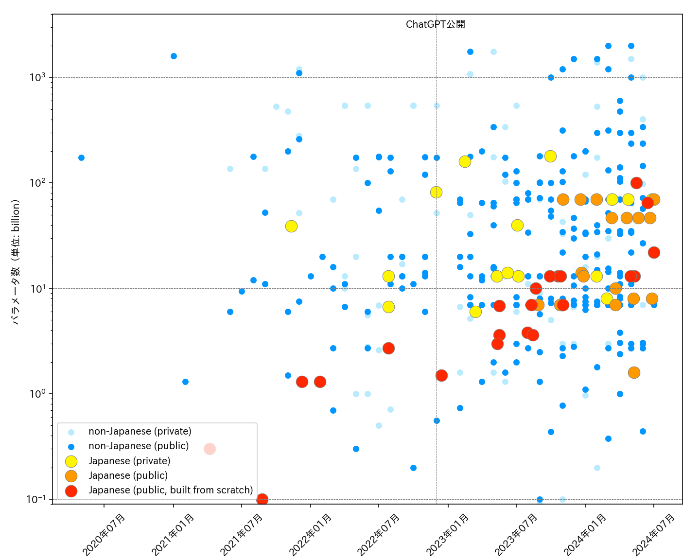

# Aperçu des grands modèles de langage (LLM) en japonais
[ [**English**](./README_en.md) | Français | [**日本語**](./README.md) ]

<p align="center">
  
</p>
<figcaption style="font-style: italic; font-size: 0.9em; color: #6b7280; text-align: center;">Evolution du nombre de paramètres des LLMs en japonais et en anglais. Pour des informations sur le modèle japonais, nous nous référons à cet article, et pour le modèle anglais, nous nous référons au <a href="https://lifearchitect.ai/models-table/">tableau des modèles</a> sur LifeArchitect.ai (notez cependant que certains modèles ont été omis en raison de l'espace limité sur le graphique. De plus, le nombre de paramètres pour le modèle anglais inclut des valeurs estimées). Veuillez nous informer de toute correction ou ajout nécessaire.</figcaption>

---

Voici une liste des LLMs disponibles au grand public, axés sur l'apprentissage du japonais, ainsi que leurs critères d'évaluation. Cette liste est maintenue par des bénévoles qui collectent des informations à partir de diverses sources telles que des articles académiques et d'autres ressources publiques.

⚠ Attention:
1. Nous ne pouvons garantir l’exactitude ou l’exhaustivité des informations présentées ici.
2. Certaines informations sont basées sur des conjectures et peuvent ne pas refléter votre cas d'utilisation spécifique.
3. Bien que de nombreux modèles soient publiés sous des licences permissives telles que MIT ou Apache 2.0, **certains modèles sont soumis à des conditions plus restrictives, notamment des clauses d'utilisation non commerciale  (exemple CC BY-NC-SA 4.0) ou d'autres modalités légales et contractuelles**

N'hésitez pas à signaler les erreurs sur la page [issues](https://github.com/llm-jp/awesome-japanese-llm/issues). N'hésitez pas également à contribuer directement avec une pull request.

## Table des matières
- [Modèles IA génératives](#generative)
  - [Modèles développés à partir de zéro](#full-scratch-models)
    - [D'usage général](#generative-scratch-general)
    - [Spécifique à un domaine](#generative-scratch-domain-specific)
  - [Modèles développés à partir d'LLM en anglais (avec un apprentissage en continue en japonais)](#english-based-models)
    - [D'usage général](#generative-continual-general)
    - [Spécifique à un domaine](#generative-continual-domain-specific)
  - [Modèles développés à partir d'LLM en anglais (avec un affinement par instructions en japonais)](#instruction-only-models)
    - [D'usage général](#generative-instruction-only-general)
    - [Spécifique à un domaine](#generative-instruction-only-domain-specific)
- [Modèles encodeur](#autoencoding)
  - [D'usage général](#autoencoding-general)
  - [Spécifique à un domaine](#autoencoding-domain-specific)
- [Plongement lexical par mots et par documents](#embeddings)
- [Modèles Vision-Language](#multimodal)
  - [Text+Image vers Text](#multimodal-text-generation)
  - [Autres](#multimodal-others)
- [Modèles Speech-Language](#speech)
- [Standard d'évaluation pour les LLM en japonais](#benchmark-suites)
  - [Benchmarks hybrides](#hybrid-benchmark-suites)
  - [Référence traditionnelle basé sur des tâches de Compréhension du langage naturel (NLU)](#basic-benchmark-suites)
  - [Standard des tâches génératives ouvertes](#open-ended-benchmark-suites)
  - [Benchmarks pour mesurer la performance dans des domaines spécifiques](#domain-specific-benchmark-suites)
- [Références pour les modèles et les architectures](#reference)
- [Références pour les méthodes d'entraînement](#reference-training)
- [Nos contributors](#contributors)
- [Citation](#citation)


<a id="generative"></a>
## Modèles IA génératives

*Pour les modèles multimodal, voir [ci-dessous.](#multimodal-text-generation)*

<a id="full-scratch-models"></a>
### Modèles développés à partir de zéro

<a id="generative-scratch-general"></a>
#### D'usage général

|    |  Architecture  | Longueur Maximale du Contexte | Données d'entraînement  |  Développeur  | Licence |
|:---|:---:|:---:|:---:|:---:|:---:|
| [LLM-jp-13B v1.1](https://llm-jp.nii.ac.jp/blog/2024/02/09/v1.1-tuning.html) | GPT<br>([**13b**-instruct-lora-dolly_en-dolly_ja-ichikara_003_001-oasst_en-oasst_ja-v1.1](https://huggingface.co/llm-jp/llm-jp-13b-instruct-lora-dolly_en-dolly_ja-ichikara_003_001-oasst_en-oasst_ja-v1.1), [**13b**-instruct-full-dolly_en-dolly_ja-ichikara_003_001-oasst_en-oasst_ja-v1.1](https://huggingface.co/llm-jp/llm-jp-13b-instruct-full-dolly_en-dolly_ja-ichikara_003_001-oasst_en-oasst_ja-v1.1), [**13b**-dpo-lora-hh_rlhf_ja-v1.1](https://huggingface.co/llm-jp/llm-jp-13b-dpo-lora-hh_rlhf_ja-v1.1)) | 2,048 | Instruction Tuning (LoRA or Full-parameter FT): Dolly Dataset, OASST1, [ichikara-instruction](https://liat-aip.sakura.ne.jp/wp/llm%E3%81%AE%E3%81%9F%E3%82%81%E3%81%AE%E6%97%A5%E6%9C%AC%E8%AA%9E%E3%82%A4%E3%83%B3%E3%82%B9%E3%83%88%E3%83%A9%E3%82%AF%E3%82%B7%E3%83%A7%E3%83%B3%E3%83%87%E3%83%BC%E3%82%BF%E4%BD%9C%E6%88%90/)<br>DPO (LoRA): HH RLHF | LLM-jp | Apache 2.0 |
| [LLM-jp-13B](https://www.nii.ac.jp/en/news/release/2023/1020.html) | GPT<br>([1.3b-v1.0](https://huggingface.co/llm-jp/llm-jp-1.3b-v1.0), [**13b**-v1.0](https://huggingface.co/llm-jp/llm-jp-13b-v1.0), [**13b**-instruct-full-jaster-v1.0](https://huggingface.co/llm-jp/llm-jp-13b-instruct-full-jaster-v1.0), [**13b**-instruct-full-jaster-dolly-oasst-v1.0](https://huggingface.co/llm-jp/llm-jp-13b-instruct-full-jaster-dolly-oasst-v1.0), [**13b**-instruct-full-dolly-oasst-v1.0](https://huggingface.co/llm-jp/llm-jp-13b-instruct-full-dolly-oasst-v1.0), [**13b**-instruct-lora-jaster-v1.0](https://huggingface.co/llm-jp/llm-jp-13b-instruct-lora-jaster-v1.0), [**13b**-instruct-lora-jaster-dolly-oasst-v1.0](https://huggingface.co/llm-jp/llm-jp-13b-instruct-lora-jaster-dolly-oasst-v1.0), [**13b**-instruct-lora-dolly-oasst-v1.0](https://huggingface.co/llm-jp/llm-jp-13b-instruct-lora-dolly-oasst-v1.0)) | 2,048 | Pré-entraînement: [llm-jp-corpus](https://github.com/llm-jp/llm-jp-corpus) (Wikipedia, Japanese mC4, The Pile, Stack) (**300B** tokens)<br>Instruction Tuning (Full-parameter FT or LoRA): jaster, Dolly Dataset, OASST1 | LLM-jp | Apache 2.0 |
| [PLaMo-13B](https://www.preferred.jp/en/news/pr20230928/) | Llama[^1]<br>([**13b**](https://huggingface.co/pfnet/plamo-13b), [**13b**-instruct](https://huggingface.co/pfnet/plamo-13b-instruct), [**13b**-instruct-nc](https://huggingface.co/pfnet/plamo-13b-instruct-nc)) |base: 4,096<br>instruct, instruct-nc: 8,192 | Pré-entraînement: C4, Project Gutenberg, RedPajama, Japanese Wikipedia, Japanese mC4<br>(**1.5T** tokens)<br>Instruction Tuning (Full-parameter FT): Dolly, HH RLHF, OASST1, wikinews (+Alpaca in NC model)  | Preferred Networks | Apache 2.0<br>(CC BY-NC 4.0 as for NC model) |
| [Stockmark-13b](https://stockmark.co.jp/news/20231027) | Llama<br>([**13b**](https://huggingface.co/stockmark/stockmark-13b), [**13b**-instruct](https://huggingface.co/stockmark/stockmark-13b-instruct)) | 2,048 | Wikipedia en japonais, Japanese CC-100, Japanese mC4, Japanese CommonCrawl, Japanese Patent, Stockmark Web Corpus<br>(**220B** tokens)<br>Instruction Tuning (LoRA): [ichikara-instruction](https://liat-aip.sakura.ne.jp/wp/llm%E3%81%AE%E3%81%9F%E3%82%81%E3%81%AE%E6%97%A5%E6%9C%AC%E8%AA%9E%E3%82%A4%E3%83%B3%E3%82%B9%E3%83%88%E3%83%A9%E3%82%AF%E3%82%B7%E3%83%A7%E3%83%B3%E3%83%87%E3%83%BC%E3%82%BF%E4%BD%9C%E6%88%90/) | Stockmark | base: MIT<br>instruct: CC BY-NC-SA 4.0 |
| [Weblab-10B](https://www.t.u-tokyo.ac.jp/press/pr2023-08-18-001) | GPT-NeoX <br> ([**10b**](https://huggingface.co/matsuo-lab/weblab-10b), [**10b**-instruction-sft](https://huggingface.co/matsuo-lab/weblab-10b-instruction-sft)) | 2,048 | Japanese mC4, The Pile <br> (**600B** tokens) <br>Instruction Tuning (Full-parameter FT): Alpaca, FLAN | Université de Tokyo Matsuo Lab | CC BY&#x2011;NC 4.0 |
| [Japanese StableLM Alpha](https://stability.ai/blog/stability-ai-new-jplm-japanese-language-model-stablelm) | GPT-NeoX <br> ([base-alpha-**7b**](https://huggingface.co/stabilityai/japanese-stablelm-base-alpha-7b), [instruct-alpha-**7b**](https://huggingface.co/stabilityai/japanese-stablelm-instruct-alpha-7b), [instruct-alpha-**7b**-v2](https://huggingface.co/stabilityai/japanese-stablelm-instruct-alpha-7b-v2)) | 2,048 | Wikipédia, Japanese CC&#x2011;100, Japanese mC4, Japanese OSCAR, RedPajama, ensembles de données privés[^2]<br>(**750B** tokens)<br>Instruction Tuning (Full-parameter FT): Dolly, HH&#x2011;RLHF, wikinews,  Alpaca (discarded in v2) | Stability AI | base: Apache 2.0<br>instruct (v1): [Research license](https://huggingface.co/stabilityai/japanese-stablelm-instruct-alpha-7b/tree/main)<br>instruct (v2): Apache 2.0 |
| [CALM2](https://www.cyberagent.co.jp/news/detail/id=29479) | Llama<br>([**7b**](https://huggingface.co/cyberagent/calm2-7b), [**7b**-chat](https://huggingface.co/cyberagent/calm2-7b-chat), [**7b**-chat-dpo-experimental](https://huggingface.co/cyberagent/calm2-7b-chat-dpo-experimental)) | base: 4,096<br>chat: **32,768** | Ensembles de données japonais et anglais accessibles au public (détails inconnus)<br>(**1.3T** tokens)<br>DPO: Chatbot Arena Conversations JA (calm2) Dataset  | CyberAgent | Apache 2.0<br>(CC BY 4.0 as for DPO model) |
| [OpenCALM](https://www.cyberagent.co.jp/news/detail/id=28817) | GPT-NeoX <br> ([small](https://huggingface.co/cyberagent/open-calm-small), [medium](https://huggingface.co/cyberagent/open-calm-medium), [large](https://huggingface.co/cyberagent/open-calm-large), [**1b(1.4b)**](https://huggingface.co/cyberagent/open-calm-1b), [**3b(2.7b)**](https://huggingface.co/cyberagent/open-calm-3b), [**7b(6.8b)**](https://huggingface.co/cyberagent/open-calm-7b)) | 2,048 | Wikipedia en japonais, Japanese mC4, Japanese CC&#x2011;100 | CyberAgent | CC BY&#x2011;SA 4.0 |
| [Stormy](https://jxiv.jst.go.jp/index.php/jxiv/preprint/view/422/1350) | GPT-NeoX <br>([**7b(6.8b)**](https://huggingface.co/izumi-lab/stormy-7b-10ep)) | 2,048 | OpenCALM fine-tuned sur <br>llm-japanese-dataset v0 sans âches de traduction | Université de Tokyo Izumi Lab | CC BY&#x2011;SA 4.0 |
| [rinna GPT <br> (En-Ja Bilingual)](https://rinna.co.jp/news/2023/07/20230731.html) | GPT-NeoX <br>([**4b(3.8b)**](https://huggingface.co/rinna/bilingual-gpt-neox-4b), [**4b(3.8b)**-8k](https://huggingface.co/rinna/bilingual-gpt-neox-4b-8k), [**4b(3.8b)**-instruction-sft](https://huggingface.co/rinna/bilingual-gpt-neox-4b-instruction-sft), [**4b(3.8b)**-instruction-ppo](https://huggingface.co/rinna/bilingual-gpt-neox-4b-instruction-ppo)) | 8k model: 8,192<br>others: 2,048 |  Wikipedia, Japanese CC&#x2011;100, Japanese C4, RedPajama, The Pile<br>(**524B** tokens)<br>Instruction Tuning (Full-parameter FT): HH&#x2011;RLHF, FLAN<br>PPO: HH&#x2011;RLHF par apprentissage par renforcement  <br>8k: entrainé sur du long texte | rinna | MIT |
| [japanese-large-lm](https://engineering.linecorp.com/ja/blog/3.6b-japanese-language-model-with-improved-dialog-performance-by-instruction-tuning) | GPT-NeoX <br>([**1.7b**](https://huggingface.co/line-corporation/japanese-large-lm-1.7b), [**3.6b**](https://huggingface.co/line-corporation/japanese-large-lm-3.6b), [**1.7b**-instruction-sft](https://huggingface.co/line-corporation/japanese-large-lm-1.7b-instruction-sft), [**3.6b**-instruction-sft](https://huggingface.co/line-corporation/japanese-large-lm-3.6b-instruction-sft)) | 2,048 | Wikipedia en japonais, Japanese CC&#x2011;100, Japanese C4, Japanese OSCAR et ensembles de données privés<br>(**650GB**)<br>Instruction Tuning (Full-parameter FT): OASST1 | LINE | Apache 2.0 |
| [rinna GPT <br> (Japanese only)](https://rinna.co.jp/news/2023/05/20220531.html) | GPT-NeoX <br>([xsmall](https://huggingface.co/rinna/japanese-gpt2-xsmall), [small](https://huggingface.co/rinna/japanese-gpt2-small), [medium](https://huggingface.co/rinna/japanese-gpt2-medium), [**1b**](https://huggingface.co/rinna/japanese-gpt-1b), [neox-small](https://huggingface.co/rinna/japanese-gpt-neox-small), [neox-**3.6b**](https://huggingface.co/rinna/japanese-gpt-neox-3.6b), [neox-**3.6b**-instruction-sft](https://huggingface.co/rinna/japanese-gpt-neox-3.6b-instruction-sft), [neox-**3.6b**-instruction-sft-v2](https://huggingface.co/rinna/japanese-gpt-neox-3.6b-instruction-sft-v2), [neox-**3.6b**-instruction-ppo](https://huggingface.co/rinna/japanese-gpt-neox-3.6b-instruction-ppo)) | ≤ 2,048 | Wikipédia en japonais, Japanese CC&#x2011;100 <br> (1b et plus modèles à ajouter <br>Japanese mC4)<br>Instruction Tuning (Full-parameter FT): HH&#x2011;RLHF, FLAN, SHP <br>PPO: HH&#x2011;RLHF par apprentissage par renforcement | rinna | MIT |
| [RetrievaT5](https://note.com/retrieva/n/n7b4186dc5ada) | T5 <br>([small (short)](https://huggingface.co/retrieva-jp/t5-small-short), [small (medium)](https://huggingface.co/retrieva-jp/t5-small-medium), [small (long)](https://huggingface.co/retrieva-jp/t5-small-long), [base (short)](https://huggingface.co/retrieva-jp/t5-base-short), [base (medium)](https://huggingface.co/retrieva-jp/t5-base-medium), [base (long)](https://huggingface.co/retrieva-jp/t5-base-long), [large (short)](https://huggingface.co/retrieva-jp/t5-large-short), [large (medium)](https://huggingface.co/retrieva-jp/t5-large-medium), [large (long)](https://huggingface.co/retrieva-jp/t5-large-long), [**xl(3b)**](https://huggingface.co/retrieva-jp/t5-xl)) |  | Wikipédia en japonais, Japanese mC4 | Retrieva | CC BY&#x2011;SA 4.0 |
| [kotomamba-2.8B](https://huggingface.co/kotoba-tech/kotomamba-2.8B-v1.0) | Mamba<br>([**2.8B**-v1.0](https://huggingface.co/kotoba-tech/kotomamba-2.8B-v1.0)) | 2,048 | Wikipedia en japonais, Swallow Corpus, SlimPajama | Kotoba Technologies | Apache 2.0 |
| [ABEJA GPT](https://tech-blog.abeja.asia/entry/abeja-gpt-project-202207) | GPT-NeoX <br>([large](https://huggingface.co/abeja/gpt2-large-japanese), [neox-**2.7b**](https://huggingface.co/abeja/gpt-neox-japanese-2.7b)) |  | Japanese Wikipedia, Japanese CC&#x2011;100, Japanese OSCAR | ABEJA | MIT |
| [WasedaGPT](https://huggingface.co/nlp-waseda/gpt2-xl-japanese) | GPT-NeoX <br> ([small](https://huggingface.co/nlp-waseda/gpt2-small-japanese), [**xl(1.5b)**](https://huggingface.co/nlp-waseda/gpt2-xl-japanese)) |  | Wikipédia en japonais, Japanese CC&#x2011;100 | Université de Waseda Kawahara Lab | CC BY&#x2011;SA 4.0 |
| [StockmarkGPT](https://stockmark.co.jp/news/20230808) | GPT-NeoX <br>([**1.4b**](https://huggingface.co/stockmark/gpt-neox-japanese-1.4b)) |  | Wikipédia en japonais (0.88B tokens), Japanese CC&#x2011;100 (10.5B tokens), ensembles de données privés (8.6B tokens) | Stockmark | MIT |
| [YellowbackGPT](https://tech.yellowback.net/posts/gpt-neo-japanese) | GPT-NeoX <br>([**1.3b**](https://huggingface.co/yellowback/gpt-neo-japanese-1.3B)) |  | Wikipédia en japonais, Japanese CC&#x2011;100, Japanese OSCAR | Yellowback | Apache 2.0 |
| [colorfulscoop GPT](https://huggingface.co/colorfulscoop/gpt2-small-ja) | GPT-NeoX <br>([small](https://huggingface.co/colorfulscoop/gpt2-small-ja)) |  | Wikipédia en japonais | Colorful Scoop | CC BY&#x2011;SA 3.0 |
| [TitechGPT](https://www.anlp.jp/proceedings/annual_meeting/2023/pdf_dir/H9-1.pdf) | GPT-NeoX <br>([medium](https://huggingface.co/okazaki-lab/japanese-gpt2-medium-unidic), [medium-reversed](https://huggingface.co/okazaki-lab/japanese-reversed-gpt2-medium-unidic)) [^3] |  | Wikipédia en japonais, Japanese CC&#x2011;100 | Titech Okazaki Lab | CC BY&#x2011;SA 4.0 |
| [KyotoUniversityGPT](https://huggingface.co/ku-nlp/gpt2-medium-japanese-char) | GPT-NeoX <br>([small](https://huggingface.co/ku-nlp/gpt2-small-japanese-char), [medium](https://huggingface.co/ku-nlp/gpt2-medium-japanese-char), [large](https://huggingface.co/ku-nlp/gpt2-large-japanese-char)) |  | Wikipédia en japonais (3.2GB), Japanese CC&#x2011;100 (85GB), Japanese OSCAR (54GB) | Université de Kyoto Laboratoire de traitement des langues et des médias | CC BY&#x2011;SA 4.0 |
| [JapaneseBART](https://huggingface.co/ku-nlp/bart-base-japanese) | BART <br>([base](https://huggingface.co/ku-nlp/bart-base-japanese), [large](https://huggingface.co/ku-nlp/bart-large-japanese)) |  | Wikipédia en japonais (18M sentences) | Université de Kyoto Laboratoire de traitement des langues et des médias | CC BY&#x2011;SA 4.0 |
| [Megagon Labs T5](https://github.com/megagonlabs/t5-japanese) | T5 <br>([base](https://huggingface.co/megagonlabs/t5-base-japanese-web)) |  | Japanese mC4 (782 GB), Wikipédia en japonais 40b (2 GB) | Megagon Labs <br> (Recruit Holdings) | Apache 2.0 |

<a id="generative-scratch-domain-specific"></a>
#### Spécifique à un domaine

|    | Domaine | Architecture  |  Données d'entraînement  |  Développeur  | Licence |
|:---|:---:|:---:|:---:|:---:|:---:|
| [Japanese Dialog Transformer](https://github.com/nttcslab/japanese-dialog-transformers) | Dialogue | Transformer | Pairs de réponses venant de Twitter | NTT | [License en évaluaiton](https://github.com/nttcslab/japanese-dialog-transformers/blob/main/LICENSE.md) |
| [Japanese News BART](https://tech.stockmark.co.jp/blog/bart-japanese-base-news/) | Affaires |  BART ([base](https://huggingface.co/stockmark/bart-base-japanese-news)) | Articles de l'actualité économique en japonais (21M articles) | Stockmark | MIT |
| [AcademicBART](https://github.com/EhimeNLP/AcademicBART) | Science | BART ([base](https://huggingface.co/EhimeNLP/AcademicBART)) | CiNii Japanese Papers | Université d'Ehime AI Lab | Apache 2.0 |

<a id="english-based-models"></a>
### Modèles développés à partir d'LLM en anglais (avec une apprentissage continue en japonais)

<a id="generative-continual-general"></a>
#### D'usage général

|    | Base du Model  |  Données d'entraînement  |  Développeur  |  Licence  |
|:---|:---:|:---:|:---:|:---:|
| [Swallow 70B](https://tokyotech-llm.github.io/swallow-llama)<br>([70b-hf](https://huggingface.co/tokyotech-llm/Swallow-70b-hf), [70b-instruct-hf](https://huggingface.co/tokyotech-llm/Swallow-70b-instruct-hf), [70b-NVE-hf](https://huggingface.co/tokyotech-llm/Swallow-70b-NVE-hf), [70b-NVE-instruct-hf](https://huggingface.co/tokyotech-llm/Swallow-70b-NVE-instruct-hf)) | Llama 2 (**70b**) | Pre-training: Japanese Wikipedia, RefinedWeb, Swallow Corpus, The Pile<br>Instruction Tuning (Full-parameter FT): Dolly Dataset, HH RLHF, OASST1 | TokyoTech-LLM | Llama 2 Community License |
| [KARAKURI LM](https://medium.com/karakuri/introducing-karakuri-lm-34c79a3bf341)<br>([70b-v0.1](https://huggingface.co/karakuri-ai/karakuri-lm-70b-v0.1), [70b-chat-v0.1](https://huggingface.co/karakuri-ai/karakuri-lm-70b-chat-v0.1)) | Llama 2 (**70b**) | Pre-training: mC4, CC100, OSCAR, RedPajama, undisclosed dataset<br>(**16B** tokens)<br>SteerLM: OASST2, undisclosed dataset | KARAKURI | Llama 2 Community License[^13] |
| [Japanese Stable LM Beta 70B](https://ja.stability.ai/blog/japanese-stable-lm-beta)<br>([base-beta-70b](https://huggingface.co/stabilityai/japanese-stablelm-base-beta-70b), [instruct-beta-70b](https://huggingface.co/stabilityai/japanese-stablelm-instruct-beta-70b)) | Llama 2 (**70b**) | Pre-training: Wikipedia, Japanese mC4, Japanese CC-100, Japanese OSCAR, SlimPajama(excluding Books3)<br>(**100B** tokens)<br>Instruction Tuning (Full-parameter FT): Dolly Dataset, HH RLHF, OASST1 | Stability AI | Llama 2 Community License |
| [Nekomata 14B](https://rinna.co.jp/news/2023/12/20231221.html)<br>([14b](https://huggingface.co/rinna/nekomata-14b), [14b-instruction](https://huggingface.co/rinna/nekomata-14b-instruction), [14b-gguf](https://huggingface.co/rinna/nekomata-14b-gguf), [14b-instruction-gguf](https://huggingface.co/rinna/nekomata-14b-instruction-gguf)) | Qwen (**14b**) | Pre-training: Wikipedia, Japanese C4, Japanese CC-100, Japanese OSCAR, The Pile, undisclosed dataset<br>(**66B** tokens)<br>Instruction Tuning (Full-parameter FT): Dolly Dataset, FLAN, subsets of llm-japanese-dataset | rinna | Tongyi Qianwen LICENSE |
| [Swallow 13B](https://tokyotech-llm.github.io/swallow-llama)<br>([13b-hf](https://huggingface.co/tokyotech-llm/Swallow-13b-hf), [13b-instruct-hf](https://huggingface.co/tokyotech-llm/Swallow-13b-instruct-hf), [13b-NVE-hf](https://huggingface.co/tokyotech-llm/Swallow-13b-NVE-hf)) | Llama 2 (**13b**) | Pre-training: Japanese Wikipedia, RefinedWeb, Swallow Corpus, The Pile<br>Instruction Tuning (Full-parameter FT): Dolly Dataset, HH RLHF, OASST1 | TokyoTech-LLM | Llama 2 Community License |
| [ELYZA-japanese-Llama-2-13b](https://note.com/elyza/n/n5d42686b60b7)<br>([13b](https://huggingface.co/elyza/ELYZA-japanese-Llama-2-13b), [13b-instruct](https://huggingface.co/elyza/ELYZA-japanese-Llama-2-13b-instruct), [13b-fast](https://huggingface.co/elyza/ELYZA-japanese-Llama-2-13b-fast), [13b-fast-instruct](https://huggingface.co/elyza/ELYZA-japanese-Llama-2-13b-fast-instruct)) | Llama 2 (**13b**) | Pre-training: Japanese Wikipedia, Japanese OSCAR, and other crawled data<br>(**18B** tokens)<br>Instruction Tuning: undisclosed dataset |ELYZA | Llama 2 Community License |
| [Swallow 7B](https://tokyotech-llm.github.io/swallow-llama)<br>([7b-hf](https://huggingface.co/tokyotech-llm/Swallow-7b-hf), [7b-instruct-hf](https://huggingface.co/tokyotech-llm/Swallow-7b-instruct-hf), [7b-NVE-hf](https://huggingface.co/tokyotech-llm/Swallow-7b-NVE-hf), [7b-NVE-instruct-hf](https://huggingface.co/tokyotech-llm/Swallow-7b-NVE-instruct-hf)) | Llama 2 (**7b**) | Pre-training: Japanese Wikipedia, RefinedWeb, Swallow Corpus, The Pile<br>Instruction Tuning (Full-parameter FT): Dolly Dataset, HH RLHF, OASST1 | TokyoTech-LLM | Llama 2 Community License |
| [ELYZA-japanese-Llama-2-7b](https://note.com/elyza/n/na405acaca130)<br> ([7b](https://huggingface.co/elyza/ELYZA-japanese-Llama-2-7b), [7b-instruct](https://huggingface.co/elyza/ELYZA-japanese-Llama-2-7b-instruct), [7b-fast](https://huggingface.co/elyza/ELYZA-japanese-Llama-2-7b-fast), [7b-fast-instruct](https://huggingface.co/elyza/ELYZA-japanese-Llama-2-7b-fast-instruct)) | Llama 2 (**7b**) | Pre-training: Japanese Wikipedia, Japanese OSCAR, and other crawled data<br>(**18B** tokens)<br>Instruction Tuning: undisclosed dataset |ELYZA | Llama 2 Community License |
| [Youri 7B](https://rinna.co.jp/news/2023/10/20231031.html)<br>([7b](https://huggingface.co/rinna/youri-7b), [7b-instruction](https://huggingface.co/rinna/youri-7b-instruction), [7b-chat](https://huggingface.co/rinna/youri-7b-chat), [7b-gptq](https://huggingface.co/rinna/youri-7b-gptq), [7b-instruction-gptq](https://huggingface.co/rinna/youri-7b-instruction-gptq), [7b-chat-gptq](https://huggingface.co/rinna/youri-7b-chat-gptq)) | Llama 2 (**7b**) |Pre-training: Wikipedia, Japanese C4, Japanese CC-100, Japanese OSCAR, The Pile, undisclosed dataset<br>(**40B** tokens)<br>Instruction Tuning (Full-parameter FT): Dolly Dataset, FLAN, subsets of llm-japanese-dataset| rinna | Llama 2 Community License |
| [houou-7b](https://corp.moneyforward.com/news/release/corp/20231206-mf-press-1/)<br>([instruction-7b-v1](https://huggingface.co/moneyforward/houou-instruction-7b-v1), [instruction-7b-v2](https://huggingface.co/moneyforward/houou-instruction-7b-v2)) | Llama 2 (**7b**) | Instruction-tuned Youri 7B (base) on [ichikara-instruction](https://liat-aip.sakura.ne.jp/wp/llm%E3%81%AE%E3%81%9F%E3%82%81%E3%81%AE%E6%97%A5%E6%9C%AC%E8%AA%9E%E3%82%A4%E3%83%B3%E3%82%B9%E3%83%88%E3%83%A9%E3%82%AF%E3%82%B7%E3%83%A7%E3%83%B3%E3%83%87%E3%83%BC%E3%82%BF%E4%BD%9C%E6%88%90/) (Full-parameter FT) | MoneyForward | Llama 2 Community License |
| [Japanese Stable LM Beta 7B](https://ja.stability.ai/blog/japanese-stable-lm-beta)<br>([base-beta-7b](https://huggingface.co/stabilityai/japanese-stablelm-base-beta-7b), [base-ja_vocab-beta-7b](https://huggingface.co/stabilityai/japanese-stablelm-base-ja_vocab-beta-7b), [instruct-beta-7b](https://huggingface.co/stabilityai/japanese-stablelm-instruct-beta-7b), [instruct-ja_vocab-beta-7b](https://huggingface.co/stabilityai/japanese-stablelm-instruct-ja_vocab-beta-7b)) |  Llama 2 (**7b**) | Pre-training: Wikipedia, Japanese mC4, Japanese CC-100, Japanese OSCAR, SlimPajama(excluding Books3)<br>(**100B** tokens)<br>Instruction Tuning (Full-parameter FT): Dolly Dataset, HH RLHF, OASST1 | Stability AI | Llama 2 Community License |
| [blue-lizard](https://prtimes.jp/main/html/rd/p/000000010.000125694.html)<br>([blue-lizard](https://huggingface.co/Deepreneur/blue-lizard)) | Llama 2 (**7b**) | undisclosed | Deepreneur | Llama 2 Community License |
| [Japanese Stable LM Gamma 7B](https://ja.stability.ai/blog/japanese-stable-lm-3b-4e1tjapanese-stable-lm-gamma-7b)<br>([base-gamma-7b](https://huggingface.co/stabilityai/japanese-stablelm-base-gamma-7b), [instruct-gamma-7b](https://huggingface.co/stabilityai/japanese-stablelm-instruct-gamma-7b)) | Mistral-7B-v0.1 (**7b**) | Pre-training: Wikipedia, Japanese mC4, Japanese CC-100, Japanese OSCAR, SlimPajama(excluding Books3)<br>(**100B** tokens)<br>Instruction Tuning (Full-parameter FT): Dolly Dataset, HH RLHF, wikinews subset of llm-japanese-dataset | Stability AI |  Apache 2.0  |
| [ChatNTQ JA 7B](https://huggingface.co/NTQAI/chatntq-ja-7b-v1.0)<br>([7b-v1.0](https://huggingface.co/NTQAI/chatntq-ja-7b-v1.0)) | Mistral-7B-v0.1 (**7b**) | Instruction-tuned Japanese Stable LM Gamma 7B (base) on their own datasets | NTQ Solution | Apache 2.0  |
| [Shisa Gamma 7B](https://huggingface.co/augmxnt/shisa-gamma-7b-v1)<br>([7b-v1](https://huggingface.co/augmxnt/shisa-gamma-7b-v1)) | Mistral-7B-v0.1 (**7b**) | Instruction-tuned Japanese Stable LM Gamma 7B (base) on ultra-orca-boros-en-ja | AUGMXNT | Apache 2.0 (?)[^12]  |
| [Shisa 7B](https://github.com/AUGMXNT/shisa/wiki)<br>([base-7b-v1](https://huggingface.co/augmxnt/shisa-base-7b-v1), [7b-v1](https://huggingface.co/augmxnt/shisa-7b-v1)) | Mistral-7B-v0.1 (**7b**) | Pre-training: shisa-pretrain-en-ja-v1 (**8B** tokens)<br>Instruction Tuning(Full-parameter FT) & DPO: ultra-orca-boros-en-ja, shisa-en-ja-dpo-v1  | AUGMXNT |  Apache 2.0  |
| [Karasu](https://note.com/peter_lightblue/n/ne08a7c8cc47a)<br>([7B](https://huggingface.co/lightblue/karasu-7B), [7B-chat](https://huggingface.co/lightblue/karasu-7B-chat), [7B-chat-plus](https://huggingface.co/lightblue/karasu-7B-chat-plus), [7B-chat-plus-unleashed](https://huggingface.co/lightblue/karasu-7B-chat-plus-unleashed)) | Mistral-7B-v0.1 (**7b**) | Additionally trained Shisa 7B (base) on Aozora Bunko, Japanese Law Precedent Dataset, Japanese Wikipedia, Japanese domain webscrapes from the Japanese subset of CulturaX, UltraChat 200k<br>(**7B** tokens)<br>Instruction Tuning: ultra-orca-boros-en-ja-v1, OASST1, ShareGPT, undisclosed dataset | Lightblue |  Apache 2.0 (?)[^12]  |
| [Nekomata 7B](https://rinna.co.jp/news/2023/12/20231221.html)<br>([7b](https://huggingface.co/rinna/nekomata-7b), [7b-instruction](https://huggingface.co/rinna/nekomata-7b-instruction), [7b-gguf](https://huggingface.co/rinna/nekomata-7b-gguf), [7b-instruction-gguf](https://huggingface.co/rinna/nekomata-7b-instruction-gguf)) | Qwen (**7b**) | Pre-training: Wikipedia, Japanese C4, Japanese CC-100, Japanese OSCAR, The Pile, undisclosed dataset<br>(**66B** tokens)<br>Instruction Tuning (Full-parameter FT): Dolly Dataset, FLAN, subsets of llm-japanese-dataset | rinna | Tongyi Qianwen LICENSE |
| [lightblue/japanese-mpt-7b](https://huggingface.co/lightblue/japanese-mpt-7b) | MPT (**7b**) | Japanese mC4 | Lightblue | Apache 2.0 (?)[^12] |
| [Japanese Stable LM 3B-4E1T](https://ja.stability.ai/blog/japanese-stable-lm-3b-4e1tjapanese-stable-lm-gamma-7b)<br>([3b-4e1t-base](https://huggingface.co/stabilityai/japanese-stablelm-3b-4e1t-base), [3b-4e1t-instruct](https://huggingface.co/stabilityai/japanese-stablelm-3b-4e1t-instruct)) | StableLM-3B-4E1T (**3b**) |Pre-training: Wikipedia, Japanese mC4, Japanese CC-100, Japanese OSCAR, SlimPajama(excluding Books3)<br>(**100B** tokens)<br>Instruction Tuning (Full-parameter FT): Dolly Dataset, HH RLHF, wikinews subset of llm-japanese-dataset | Stability AI |  Apache 2.0  |
| [kotomamba-2.8B-CL](https://huggingface.co/kotoba-tech/kotomamba-2.8B-CL-v1.0) | mamba-2.8b-slimpj<br>(**2.8b**) | Japanese Wikipedia, Swallow Corpus, SlimPajama | Kotoba Technologies | Apache 2.0 |
| [karasu-1.1B](https://huggingface.co/lightblue/karasu-1.1B) | TinyLlama (**1.1b**) | Pre-training: Japanese OSCAR, Japanese mC4<br>(**3B** tokens) | Lightblue | Apache 2.0 |

<a id="generative-continual-domain-specific"></a>
#### Spécifique à un domaine

|    | Domaine | Base du Model  |  Développeur  |  Licence  |
|:---|:---:|:---:|:---:|:---:|
| [watashiha/Watashiha-Llama-2-13B-Ogiri-sft](https://huggingface.co/watashiha/Watashiha-Llama-2-13B-Ogiri-sft) | [Oogiri](https://en.wikipedia.org/wiki/Glossary_of_owarai_terms#oogiri) | Llama 2 (**13b**) | Watashiha | Llama 2 Community License |
| [ELYZA-japanese-CodeLlama-7b](https://note.com/elyza/n/n5bce23d7c9c8)<br>([7b](https://huggingface.co/elyza/ELYZA-japanese-CodeLlama-7b), [7b-instruct](https://huggingface.co/elyza/ELYZA-japanese-CodeLlama-7b-instruct)) | Codage | Code Llama<br>(**7b**) | ELYZA | Llama 2 Community License |
| [AIBunCho/japanese-novel-gpt-j-6b](https://huggingface.co/AIBunCho/japanese-novel-gpt-j-6b) | Génération de récits | GPT-J (**6b**) | Individuel ([Hiroyuki Osone](https://scholar.google.co.jp/citations?user=6ID5K3oAAAAJ)) | CreativeML OpenRAIL-M License |
| [NovelAI/genji-jp](https://huggingface.co/NovelAI/genji-jp) | Génération de récits | GPT-J (**6b**) | NovelAI |  ？  |

<a id="instruction-only-models"></a>
### Modèles développés à partir d'LLM en anglais (avec un affinement par instructions en japonais)

<a id="generative-instruction-only-general"></a>
#### D'usage général

|    | Base du Model  |  Données d'entraînement  |  Développeur  |  Licence  |
|:---|:---:|:---:|:---:|:---:|
| [AIgroup-CVM-utokyohospital/Llama-2-70b-chat-4bit-japanese](https://huggingface.co/AIgroup-CVM-utokyohospital/Llama-2-70b-chat-4bit-japanese) | Llama 2 (**70b**) || Université de Tokyo - AI Group du Département hospitalier de médecine cardiovasculaire |  Llama 2 Community License |
| [doshisha-mil/llama-2-70b-chat-4bit-japanese-v1](https://huggingface.co/doshisha-mil/llama-2-70b-chat-4bit-japanese-v1) | Llama 2 (**70b**) || Université de Doshisha Media Informatics Lab | ？ |
| [Qarasu](https://note.com/peter_lightblue/n/ne08a7c8cc47a)<br>([14B-chat-plus-unleashed](https://huggingface.co/lightblue/qarasu-14B-chat-plus-unleashed)) | Qwen (**14b**) | ultra-orca-boros-en-ja-v1, OASST1, ShareGPT, undisclosed dataset | Lightblue | Tongyi Qianwen LICENSE (?)[^12] |
| [Sparticle/llama-2-13b-chat-japanese-lora](https://huggingface.co/Sparticle/llama-2-13b-chat-japanese-lora) | Llama 2 (**13b**) || Sparticle | ？ |
| [izumi-lab/llama-13b-japanese-lora-v0-1ep](https://huggingface.co/izumi-lab/llama-13b-japanese-lora-v0-1ep) | Llama (**13b**) || Université de Tokyo Izumi Lab |  ？ |
| [ganchengguang/Yoko-7B-Japanese-v1](https://huggingface.co/ganchengguang/Yoko-7B-Japanese-v1) | Llama 2 (**7b**) || Université nationale de Yokohama Mori Lab |  ？  |
| [Sparticle/llama-2-7b-chat-japanese-lora](https://huggingface.co/Sparticle/llama-2-7b-chat-japanese-lora) | Llama 2 (**7b**) || Sparticle |  ？  |
| [izumi-lab/llama-7b-japanese-lora-v0-5ep](https://huggingface.co/izumi-lab/llama-7b-japanese-lora-v0-5ep) | Llama (**7b**) || Université de Tokyo Izumi Lab |  ？  |
| [lightblue/jod](https://huggingface.co/lightblue/jod) | Mistral-7B-SlimOrca (**7b**) || Lightblue | Apache 2.0 |
| [NTQAI/chatntq-7b-jpntuned](https://huggingface.co/NTQAI/chatntq-7b-jpntuned) | RWKV-4 World (**7b**)|| NTQ Solution |  ？  |

<a id="generative-instruction-only-domain-specific"></a>
#### Spécifique à un domaine

|    | Domaine | Base du Model  |  Développeur  |  Licence  |
|:---|:---:|:---:|:---:|:---:|
| [JMedLoRA](https://arxiv.org/pdf/2310.10083.pdf)<br>([llama2-jmedlora-6.89ep](https://huggingface.co/AIgroup-CVM-utokyohospital/llama2-jmedlora-6.89ep)) | Médecine | Llama 2 (**70b**) | Université de Tokyo - AI Group du Département hospitalier de médecine cardiovasculaire | CC BY-NC 4.0 |

<a id="autoencoding"></a>
## Modèles encodeur

<a id="autoencoding-general"></a>
### D'usage général

|    |  Architecture  |  Données d'entraînement  |  Développeur  | Licence | HuggingFace? [^4] |
|:---|:---:|:---:|:---:|:---:|:---:|
|  [KyotoUniBERT](https://nlp.ist.i.kyoto-u.ac.jp/?ku_bert_japanese)  |  BERT (base, large)  |  Wikipédia en japonais (18M articles)  |  Université de Kyoto Laboratoire de traitement des langues et des médias | Apache 2.0 | △ |
|  [TohokuUniversityBERT](https://github.com/tohoku-nlp/bert-japanese)  |  BERT (base, large)  |  base (v1):<br>Wikipédia en japonais (17M articles / 2.6GB)<br>base (v2) & large:<br>Wikipédia en japonais 4.0GB<br>base (v3) & large (v2):<br>Wikipédia en japonais (4.9GB), Japanese CC&#x2011;100 (74.3GB)   |  Université de Tohoku - Groupe TAL | base (v1, v2) & large: CC BY&#x2011;SA 3.0<br>base (v3) & large (v2): Apache 2.0 |◯<br>([base (v1)](https://huggingface.co/tohoku-nlp/bert-base-japanese-whole-word-masking), [base (v1, char-level)](https://huggingface.co/tohoku-nlp/bert-base-japanese-char-whole-word-masking), [base (v2)](https://huggingface.co/tohoku-nlp/bert-base-japanese-v2), [base (v2, char-level)](https://huggingface.co/tohoku-nlp/bert-base-japanese-char-v2), [large](https://huggingface.co/tohoku-nlp/bert-large-japanese), [large (char-level)](https://huggingface.co/tohoku-nlp/bert-large-japanese-char), [base (v3)](https://huggingface.co/tohoku-nlp/bert-base-japanese-v3), [base (v3, char-level)](https://huggingface.co/tohoku-nlp/bert-base-japanese-char-v3), [large (v2)](https://huggingface.co/tohoku-nlp/bert-large-japanese-v2), [large (v2, char-level)](https://huggingface.co/tohoku-nlp/bert-large-japanese-char-v2)) |
| [NICT BERT](https://alaginrc.nict.go.jp/nict-bert/index.html)   |  BERT (base)  |  Wikipédia en japonais  |  NICT  | CC BY 4.0 | △ |
| [colorfulscoop BERT](https://huggingface.co/colorfulscoop/bert-base-ja) | BERT (base) | Wikipédia en japonais | Colorful Scoop | CC BY&#x2011;SA 3.0 | [◯](https://huggingface.co/colorfulscoop/bert-base-ja) |
| [UniversityOfTokyoBERT](https://sites.google.com/socsim.org/izumi-lab/tools/language-model) | BERT (small) | Wikipédia en japonais (2.9GB) | Université de Tokyo Izumi Lab | CC BY&#x2011;SA 4.0 | [◯](https://huggingface.co/izumi-lab/bert-small-japanese) |
| [chiTra (Sudachi Transformers)](https://www.worksap.co.jp/news/2022/0225/) | BERT (base) | NINJAL Web Japanese Corpus (148GB) | NINJAL & WAP Tokushima - Laboratoire IA et TAL | Apache 2.0 | △ |
| [ACCMS BERT](https://huggingface.co/ku-accms/bert-base-japanese-ssuw) | BERT (base) | Wikipédia en japonais (3.3GB) | Université de Kyoto ACCMS | CC BY&#x2011;SA 4.0 | [◯](https://huggingface.co/ku-accms/bert-base-japanese-ssuw) |
| [HitachiBERT](https://aclanthology.org/2023.acl-srw.5.pdf) | BERT (base) | Wikipédia en japonais, Japanese CC&#x2011;100 | Hitachi | CC BY&#x2011;NC&#x2011;SA 4.0 | [◯](https://huggingface.co/hitachi-nlp/bert-base-japanese_jumanpp-bpe)[^6] |
| [Bandai Namco DistilBERT](https://github.com/BandaiNamcoResearchInc/DistilBERT-base-jp) | DistilBERT |  (Distillation de BERT (base) de l'Université du Tohoku)  | Bandai Namco Research | MIT | [◯](https://huggingface.co/bandainamco-mirai/distilbert-base-japanese) |
| [LINE DistilBERT](https://engineering.linecorp.com/ja/blog/line-distilbert-high-performance-fast-lightweight-japanese-language-model) | DistilBERT | (Distillation de LINE en interne BERT model)| LINE | Apache 2.0 | [◯](https://huggingface.co/line-corporation/line-distilbert-base-japanese) |
| [rinna RoBERTa](https://rinna.co.jp/news/2021/08/20210825.html) | RoBERTa (base) |  Wikipédia en japonais, Japanese CC&#x2011;100 | rinna | MIT | [◯](https://huggingface.co/rinna/japanese-roberta-base) |
| [WasedaRoBERTa](https://huggingface.co/nlp-waseda/roberta-base-japanese-with-auto-jumanpp) | RoBERTa (base, large) | Wikipédia en japonais, Japanese CC&#x2011;100 | Waseda Kawahara Lab | CC BY&#x2011;SA 4.0 | ◯<br>([base](https://huggingface.co/nlp-waseda/roberta-base-japanese-with-auto-jumanpp), [large](https://huggingface.co/nlp-waseda/roberta-large-japanese-with-auto-jumanpp), [large (seq512)](https://huggingface.co/nlp-waseda/roberta-large-japanese-seq512-with-auto-jumanpp))[^7] |
| [InformatixRoBERTa](https://www.informatix.co.jp/en/pr-roberta/) | RoBERTa (base) | Wikipédia en japonais, Web Articles <br> (25GB) | Informatix | Apache 2.0 | △ |
| [KyotoUniversityRoBERTa](https://huggingface.co/ku-nlp/roberta-base-japanese-char-wwm) | RoBERTa (base, large) | Wikipédia en japonais, Japanese CC&#x2011;100 | Université de Kyoto Laboratoire de traitement des langues et des médias | CC BY&#x2011;SA 4.0 | ◯<br>([base (char-level)](https://huggingface.co/ku-nlp/roberta-base-japanese-char-wwm), [large (char-level)](https://huggingface.co/ku-nlp/roberta-large-japanese-char-wwm)) |
| [YokohamaNationalRoBERTa](https://huggingface.co/ganchengguang/RoBERTa-base-janpanese) | RoBERTa (base) | Wikipédia en japonais (3.45GB) | Université nationale de Yokohama - Mori Lab | Apache 2.0 | [◯](https://huggingface.co/ganchengguang/RoBERTa-base-janpanese) |
| [Megagon Labs RoBERTa](https://huggingface.co/megagonlabs/roberta-long-japanese) | RoBERTa (base)[^8] | Japanese mC4 (200M sentences) | Megagon Labs <br> (Recruit Holdings) | MIT | [◯](https://huggingface.co/megagonlabs/roberta-long-japanese)  |
| [ACCMS RoBERTa](https://huggingface.co/ku-accms/roberta-base-japanese-ssuw) | RoBERTa (base) | Wikipédia en japonais (3.3GB) + Japanese CC&#x2011;100 (70GB) | Université de Kyoto ACCMS | CC BY&#x2011;SA 4.0 | [◯](https://huggingface.co/ku-accms/roberta-base-japanese-ssuw) |
| [CinnamonELECTRA](https://cinnamon.is/ideas/2020/06/22/20200619_research_001/) | ELECTRA (small) | Wikipédia en japonais | Cinnamon | Apache 2.0 | [◯](https://huggingface.co/Cinnamon/electra-small-japanese-discriminator)  |
| [Megagon Labs ELECTRA](https://www.recruit.co.jp/newsroom/pressrelease/2021/0826_9293.html) | ELECTRA (base) | Japanese mC4 (200M sentences) | Megagon Labs <br> (Recruit Holdings) | MIT | [◯](https://huggingface.co/megagonlabs/electra-base-japanese-discriminator)  |
| [UniversityOfTokyoELECTRA](https://sites.google.com/socsim.org/izumi-lab/tools/language-model) | ELECTRA (small, base) | Wikipédia en japonais (2.9GB) | Université de Tokyo Izumi Lab | CC BY&#x2011;SA 4.0 | ◯<br>([small](https://huggingface.co/izumi-lab/electra-small-japanese-discriminator), [base](https://huggingface.co/izumi-lab/electra-base-japanese-discriminator))  |
| [JapaneseRoFormer](https://huggingface.co/ganchengguang/Roformer-base-japanese) | RoFormer (base) | Wikipédia en japonais (3.45GB) | Université nationale de Yokohama - Mori Lab | Apache 2.0 | [◯](https://huggingface.co/ganchengguang/Roformer-base-japanese) |
| [JapaneseLUKE](https://www.ousia.jp/ja/page/ja/2022/11/17/luke-japanese/) | LUKE (base, large) | Wikipédia en japonais | Studio Ousia | Apache 2.0 | ◯<br>([base](https://huggingface.co/studio-ousia/luke-japanese-base-lite), [large](https://huggingface.co/studio-ousia/luke-japanese-large-lite)) |
| [KyotoUniversityDeBERTaV2](https://huggingface.co/ku-nlp/deberta-v2-base-japanese) | DeBERTaV2 (tiny, base, large) | Wikipédia en japonais, Japanese CC&#x2011;100, Japanese OSCAR<br> (171GB)  | Université de Kyoto - Laboratoire du traitement des langues et médias | CC BY&#x2011;SA 4.0 | ◯<br>([tiny](https://huggingface.co/ku-nlp/deberta-v2-tiny-japanese), [tiny (char-level)](https://huggingface.co/ku-nlp/deberta-v2-tiny-japanese-char-wwm), [base](https://huggingface.co/ku-nlp/deberta-v2-base-japanese), [large](https://huggingface.co/ku-nlp/deberta-v2-large-japanese)) | 
| [UniversityOfTokyoDeBERTaV2](https://sites.google.com/socsim.org/izumi-lab/tools/language-model) | DeBERTaV2 (small, base) | Wikipédia en japonais, Japanese Wikinews, Japanese CC-100, Japanese mC4, Japanese OSCAR | University of Tokyo Izumi Lab | CC BY-SA 4.0 | ◯ ([small](https://huggingface.co/izumi-lab/deberta-v2-small-japanese), [base](https://huggingface.co/izumi-lab/deberta-v2-base-japanese)) | 
| [JapaneseBigBird](https://huggingface.co/nlp-waseda/bigbird-base-japanese) | BigBird (base) | Wikipédia en japonais, Japanese CC&#x2011;100, Japanese OSCAR | Waseda Kawahara Lab | CC BY&#x2011;SA 4.0 | [◯](https://huggingface.co/nlp-waseda/bigbird-base-japanese) |
| [JapaneseLayoutLM](https://huggingface.co/jri-advtechlab/layoutlm-wikipedia-ja) | LayoutLM (base) | Pre-trained on Japanese Wikipedia, initialized with TohokuUniversityBERT | The Japan Research Institute, Limited | CC BY-SA 3.0 | [◯](https://huggingface.co/jri-advtechlab/layoutlm-wikipedia-ja) |

<a id="autoencoding-domain-specific"></a>
### Spécifique à un domaine

|    |  Architecture  |  Données d'entraînement  |  Développeur  | Licence | HuggingFace? |
|:---|:---:|:---:|:---:|:---:|:---:|
| [JapaneseNewsBERT](https://qiita.com/mkt3/items/3c1278339ff1bcc0187f) | BERT (base) | Articles sur l'économie en japonais(3M articles) | Stockmark | CC BY 4.0 | △ |
| [JapaneseNewsXLNet](https://qiita.com/mkt3/items/4d0ae36f3f212aee8002) |  XLNet (base) | Articles sur l'économie en japonais (3M articles) | Stockmark | ？ | [◯](https://huggingface.co/hajime9652/xlnet-japanese) <br> ※ Version non officielle |
| [JapaneseNewsALBERT](https://qiita.com/mkt3/items/b41dcf0185e5873f5f75) | ALBERT (base) | Articles sur l'économie en japonais (3M articles) | Stockmark | ？ | △ |
| [Laboro BERT](https://laboro.ai/activity/column/engineer/laboro-bert/) | BERT (base, large) | Corpus web en japonais <br> (Actualités, blogs, etc) (12GB) | Laboro.AI | CC BY&#x2011;NC 4.0 | ✕ |
| [Laboro DistilBERT](https://laboro.ai/activity/column/engineer/laboro-distilbert/) | DistilBERT |  (Distillation of Laboro BERT(base)) | Laboro.AI | CC BY&#x2011;NC 4.0 | [◯](https://huggingface.co/laboro-ai/distilbert-base-japanese) |
| [JapaneseBlogELECTRA](https://www.anlp.jp/proceedings/annual_meeting/2022/pdf_dir/E2-5.pdf) | ELECTRA (small) | Corpus de blogs en japonais (354M sentences)  | Université de technologie de Kitami - Laboratoire de Masui-Ptaszynski | CC BY&#x2011;SA 4.0 | [◯](https://huggingface.co/ptaszynski/yacis-electra-small-japanese)  |
| [JapaneseSpokenLanguageBERT](https://huggingface.co/retrieva-jp/japanese-spoken-language-bert) | BERT (base) | Formation supplémentaire pour TohokuUniversityBERT en utilisant le Corpus of Spontaneous Japanese (CSJ)<br> (Dans le modèle DAPT, le compte rendu de la diète est également utilisé) | Retrieva | Apache 2.0 | [◯](https://huggingface.co/retrieva-jp/japanese-spoken-language-bert) |
| [JapaneseFinancialBERT](https://sites.google.com/socsim.org/izumi-lab/tools/language-model) | BERT (small, base)[^9] | Wikipédia en japonais, Japanese Financial Corpus (27M sentences/5.2GB) | Université de Tokyo Izumi Lab | CC BY&#x2011;SA 4.0 |◯<br>([small](https://huggingface.co/izumi-lab/bert-small-japanese-fin), [base](https://huggingface.co/izumi-lab/bert-base-japanese-fin-additional)) |
| [JapaneseFinancialELECTRA](https://sites.google.com/socsim.org/izumi-lab/tools/language-model) | ELECTRA (small) | Wikipédia en japonais (20M sentences/2.9GB), Japanese Financial Corpus (27M sentences/5.2GB) | Université de Tokyo Izumi Lab | CC BY&#x2011;SA 4.0 |  [◯](https://huggingface.co/izumi-lab/electra-small-japanese-fin-discriminator) |
| [UTH-BERT](https://ai-health.m.u-tokyo.ac.jp/home/research/uth-bert) | BERT (base) | Dossiers médicaux en japonais (120M lignes) | Université de Tokyo Hôpital <br>Cours de développement en IA pour la médecine | CC BY&#x2011;NC&#x2011;SA 4.0 | △ |
| [medBERTjp](https://github.com/ou-medinfo/medbertjp) | BERT (base) | Wikipédia en japonais, Corpus médical en japonais ("今日の診療プレミアム/Today's Care Premium" Web Version) | Université d'Osaka Hôpital <br> Laboratoire d'information médicale | CC BY&#x2011;NC&#x2011;SA 4.0 | △ |
| [JMedRoBERTa](https://www.anlp.jp/proceedings/annual_meeting/2023/pdf_dir/P3-1.pdf) | RoBERTa (base) | Japanese Medical Papers (11M sentences/1.8GB) | Université de Tokyo Aizawa Lab | CC BY&#x2011;NC&#x2011;SA 4.0 | ◯<br>([ManbyoWordPiece](https://huggingface.co/alabnii/jmedroberta-base-manbyo-wordpiece), [SentencePiece](https://huggingface.co/alabnii/jmedroberta-base-sentencepiece))[^10] |
| [AcademicRoBERTa](https://github.com/EhimeNLP/AcademicRoBERTa) | RoBERTa (base) | CiNii Japanese Papers (6.3M sentences) | Université d'Ehime Laboratoire IA | Apache 2.0 | [◯](https://huggingface.co/EhimeNLP/AcademicRoBERTa) |

<a id="embeddings"></a>
## Plongement lexical par mots et par documents

|    | Architecture |  Développeur  |  Licence | 
|:---|:---:|:---:|:---:|
| [JaColBERT](https://arxiv.org/pdf/2312.16144.pdf)<br>([bclavie/JaColBERT](https://huggingface.co/bclavie/JaColBERT)) | ColBERT | Individuel ([Benjamin Clavié](https://scholar.google.com/citations?user=vuMln98AAAAJ)) | MIT |
| [Japanese SimCSE](https://arxiv.org/pdf/2310.19349.pdf)<br>([cl-nagoya/unsup-simcse-ja-base](https://huggingface.co/cl-nagoya/unsup-simcse-ja-base), [cl-nagoya/unsup-simcse-ja-large](https://huggingface.co/cl-nagoya/unsup-simcse-ja-large), [cl-nagoya/sup-simcse-ja-base](https://huggingface.co/cl-nagoya/sup-simcse-ja-base), [cl-nagoya/sup-simcse-ja-large](https://huggingface.co/cl-nagoya/sup-simcse-ja-large)) | SimCSE | Université de Nagoya - Takeda-Sasano Group | CC BY-SA 4.0 |
| [GLuCoSE](https://prtimes.jp/main/html/rd/p/000000123.000022705.html)<br>([pkshatech/GLuCoSE-base-ja](https://huggingface.co/pkshatech/GLuCoSE-base-ja)) | Modèle de plongement lexical basé sur LUKE<br>(GLuCoSE) | PKSHA Technology | Apache 2.0 |
||||
| [colorfulscoop/sbert-base-ja](https://huggingface.co/colorfulscoop/sbert-base-ja) | Sentence-BERT | Colorful Scoop | CC BY&#x2011;SA 4.0 |
| [MU-Kindai/SBERT-JSNLI-base](https://huggingface.co/MU-Kindai/SBERT-JSNLI-base)<br>[MU-Kindai/SBERT-JSNLI-large](https://huggingface.co/MU-Kindai/SBERT-JSNLI-large) | Sentence-BERT | Université de Kindai | ？ |
| [MU-Kindai/Japanese-SimCSE-BERT-base-unsup](https://huggingface.co/MU-Kindai/Japanese-SimCSE-BERT-base-unsup)<br>[MU-Kindai/Japanese-SimCSE-BERT-large-unsup](https://huggingface.co/MU-Kindai/Japanese-SimCSE-BERT-large-unsup)<br>[MU-Kindai/Japanese-SimCSE-RoBERTa-base-unsup](https://huggingface.co/MU-Kindai/Japanese-SimCSE-RoBERTa-base-unsup)<br>[MU-Kindai/Japanese-SimCSE-BERT-base-sup](https://huggingface.co/MU-Kindai/Japanese-SimCSE-BERT-base-sup)<br>[MU-Kindai/Japanese-SimCSE-BERT-large-sup](https://huggingface.co/MU-Kindai/Japanese-SimCSE-BERT-large-sup) | SimCSE | Université de Kindai | MIT |
| [pkshatech/simcse-ja-bert-base-clcmlp](https://huggingface.co/pkshatech/simcse-ja-bert-base-clcmlp) | SimCSE | PKSHA Technology | CC BY&#x2011;SA 4.0 |
| [MU-Kindai/Japanese-MixCSE-BERT-base](https://huggingface.co/MU-Kindai/Japanese-MixCSE-BERT-base)<br>[MU-Kindai/Japanese-MixCSE-BERT-large](https://huggingface.co/MU-Kindai/Japanese-MixCSE-BERT-large) | MixCSE | Université de Kindai | MIT |
| [MU-Kindai/Japanese-DiffCSE-BERT-base](https://huggingface.co/MU-Kindai/Japanese-DiffCSE-BERT-base) | DiffCSE | Université de Kindai | MIT | 

<a id="multimodal"></a>
## Modèles Vision-Language

<a id="multimodal-text-generation"></a>
### Multimodal vers texte

|    |  Architecture  |  Données d'entraînement  |  Développeur  | Licence |
|:---|:---:|:---:|:---:|:---:|
| [Japanese Stable VLM](https://ja.stability.ai/blog/japanese-stable-vlm)<br>([japanese-stable-vlm](https://huggingface.co/stabilityai/japanese-stable-vlm)) | LLaVA-1.5 | Japanese CC12M, STAIR Captions, jeu de données Japanese Visual Genome VQA | Stability AI | STABILITY AI JAPANESE STABLE VLM COMMUNITY LICENSE |
| [Heron](https://github.com/turingmotors/heron/blob/main/docs/README_JP.md)<br>([blip-ja-stablelm-base-7b-v0](https://huggingface.co/turing-motors/heron-chat-blip-ja-stablelm-base-7b-v0), [git-ja-stablelm-base-7b-v0](https://huggingface.co/turing-motors/heron-chat-git-ja-stablelm-base-7b-v0), [git-ELYZA-fast-7b-v0](https://huggingface.co/turing-motors/heron-chat-git-ELYZA-fast-7b-v0)) | BLIP / GIT | LLaVA-Instruct-150K-JA, Japanese STAIR Captions, jeu de données Japanese Visual Genome VQA | Turing | CC BY&#x2011;NC 4.0 |
| [Japanese InstructBLIP Alpha](https://ja.stability.ai/blog/japanese-instructblip-alpha)<br>([japanese-instructblip-alpha](https://huggingface.co/stabilityai/japanese-instructblip-alpha)) | InstructBLIP | Japanese CC12M, STAIR Captions, jeu de données Japanese Visual Genome VQA | Stability AI | JAPANESE STABLELM RESEARCH LICENSE |
| [rinna MiniGPT-4](https://rinna.co.jp/news/2023/07/20230731.html)<br>([bilingual-gpt-neox-4b-minigpt4](https://huggingface.co/rinna/bilingual-gpt-neox-4b-minigpt4)) | MiniGPT-4 | CC12M, COCO 2014, Visual Genome, STAIR Captions, Japanese Visual Genome VQA dataset | rinna | MIT |

<a id="multimodal-others"></a>
### Autres

|    |  Architecture  |  Données d'entraînement  |  Développeur  | Licence |
|:---|:---:|:---:|:---:|:---:|
| [Recruit CLIP](https://blog.recruit.co.jp/data/articles/japanese-clip/)<br>([japanese-clip-vit-b-32-roberta-base](https://huggingface.co/recruit-jp/japanese-clip-vit-b-32-roberta-base)) | CLIP | environ 120 millions de légendes de laion2B-multi | Recruit Holdings | CC BY-4.0 |
| [Japanese Stable CLIP](https://ja.stability.ai/blog/japanese-stable-clip)<br>([japanese-stable-clip-vit-l-16](https://huggingface.co/stabilityai/japanese-stable-clip-vit-l-16)) | SigLIP | CC12M traduit en japonais, STAIR Captions | Stability AI | STABILITY AI JAPANESE STABLE CLIP COMMUNITY LICENSE |
| [rinna CLIP](https://rinna.co.jp/news/2022/05/20220512.html)<br>([japanese-clip-vit-b-16](https://huggingface.co/rinna/japanese-clip-vit-b-16)) | CLIP | CC12M traduit en japonais | rinna | Apache 2.0 |
| [rinna CLOOB](https://rinna.co.jp/news/2022/05/20220512.html)<br>([japanese-cloob-vit-b-16](https://huggingface.co/rinna/japanese-cloob-vit-b-16)) | CLOOB | CC12M traduit en japonais | rinna | Apache 2.0 |
| [Japanese Stable Diffusion XL](https://ja.stability.ai/blog/japanese-stable-diffusion-xl)<br>([japanese-stable-diffusion-xl](https://huggingface.co/stabilityai/japanese-stable-diffusion-xl)) | Stable Diffusion | Inconnu | Stability AI | STABILITY AI JAPANESE STABLE DIFFUSION XL COMMUNITY LICENSE |
| [TohokuUniversity Stable Diffusion](https://huggingface.co/tohoku-nlp/stable-diffusion-xl-jp-base-1.0)<br>([base](https://huggingface.co/tohoku-nlp/stable-diffusion-xl-jp-base-1.0), [refiner](https://huggingface.co/tohoku-nlp/stable-diffusion-xl-jp-refiner-1.0)) | Stable Diffusion | Corpus parallèle anglais-japonais de la tâche partagée WMT2023, environ 13 millions de légendes de laion2B-multi | Université de Tohoku - Groupe TAL | CreativeML OpenRAIL-M License |
| [rinna Stable Diffusion](https://rinna.co.jp/news/2022/09/20220909.html)<br>([japanese-stable-diffusion](https://huggingface.co/rinna/japanese-stable-diffusion)) | Stable Diffusion | LAION-5B Japanese Subset (100M images) | rinna | CreativeML OpenRAIL-M License |

<a id="speech"></a>
## Modèles Speech-Language

|    |  Architecture  |  Données d'entraînement  |  Développeur  | Licence |
|:---|:---:|:---:|:---:|:---:|
| [Nue ASR](https://rinna.co.jp/news/2023/12/20231207.html)<br>([nue-asr](https://huggingface.co/rinna/nue-asr)) | Nue ASR<br>(HuBERT + LLM) | ReazonSpeech | rinna | Apache 2.0 |
| [ReazonSpeech](https://research.reazon.jp/projects/ReazonSpeech/)<br>([espnet-v1](https://huggingface.co/reazon-research/reazonspeech-espnet-v1), [espnet-next](https://huggingface.co/reazon-research/reazonspeech-espnet-next), [espnet-v2](https://huggingface.co/reazon-research/reazonspeech-espnet-v2), [nemo-v2](https://huggingface.co/reazon-research/reazonspeech-nemo-v2)) | ESPnet (Conformer-Transducer) / NeMo (FastConformer-RNNT) | ReazonSpeech | Reazon Holdings | Apache 2.0 |
| [UniversityOfTokyoHuBERT](https://huggingface.co/sarulab-speech/hubert-base-jtube)<br>([base-jtube](https://huggingface.co/sarulab-speech/hubert-base-jtube)) | HuBERT | JTubeSpeech | University of Tokyo<br>Saruwatari & Takamichi Lab | MIT |
| [rinna HuBERT](https://rinna.co.jp/news/2023/04/20230428.html)<br>([base](https://huggingface.co/rinna/japanese-hubert-base)) | HuBERT | ReazonSpeech | rinna | Apache 2.0 |

<a id="benchmark-suites"></a>
## Standard d'évaluation pour les LLM en japonais

<a id="hybrid-benchmark-suites"></a>
### Benchmarks hybrides

#### [Nejumi LLM Leaderboard Neo](http://nejumi.ai/) (Weights & Biases)

This compiles the results of a comprehensive evaluation by [llm-jp-eval](#llm-jp-eval), which evaluates language understanding in a question-and-answer format, and [Japanese MT-bench](#jp-mt-bench), which evaluates generative ability in a context of dialogue prompts.

<a id="basic-benchmark-suites"></a>
### Référence traditionnelle basé sur des tâches de Compréhension du langage naturel (NLU)

<a id="llm-jp-eval"></a>
#### [llm-jp-eval Leaderboard](http://wandb.me/llm-jp-leaderboard) (LLM-jp)

Classement basé sur les résultats du script [llm-jp-eval](https://github.com/llm-jp/llm-jp-eval) qui évalue automatiquement les LLM japonais sur plusieurs ensembles de données. Dès la sortie de LLM-jp-13B, [Jamp](https://github.com/tomo-ut/temporalNLI_dataset), [JaNLI](https://github.com/verypluming/JaNLI), [JCommonsenseQA](https://github.com/yahoojapan/JGLUE), [JEMHopQA](https://github.com/aiishii/JEMHopQA), [JNLI](https://github.com/yahoojapan/JGLUE), [JSeM](https://github.com/DaisukeBekki/JSeM), [JSICK](https://github.com/verypluming/JSICK), [JSQuAD](https://github.com/yahoojapan/JGLUE), [JSTS](https://github.com/yahoojapan/JGLUE), et [NIILC](https://github.com/mynlp/niilc-qa) sont utilisés comme jeu de données d'évaluation.

#### [JP Language Model Evaluation Harness](https://github.com/Stability-AI/lm-evaluation-harness/tree/jp-stable) (Stability AI)

Fork de [EleutherAI/lm-evaluation-harness](https://github.com/EleutherAI/lm-evaluation-harness) cela ajoute des tâches en japonais comme JGLUE et d'autres.  
Un résumé d'évaluation détaillé par rinna est disponible: [[rinna] Benchmark of Stability-AI/lm-evaluation-harness](https://rinnakk.github.io/research/benchmarks/lm/)

#### [Japanese Open LLM Leaderboard](http://wandb.me/llm-jp-openllmleaderboard) (LLM-jp)

Semblable à [Open LLM Leaderboard](https://huggingface.co/spaces/HuggingFaceH4/open_llm_leaderboard) de Huggingface, ce classement fournit une vérification sur les LLM japonais. Vous pouvez vérifier la performance des LLM japonais dans des tâches en anglais.

#### [JGLUE](https://github.com/yahoojapan/JGLUE) (Université de Waseda Laboratoire Kawahara et Yahoo)

Version japonais de [GLUE](https://gluebenchmark.com/) référence suite, avec les tâches MARC-ja, JCoLA, JSTS, JNLI, JSQuAD, et JCommonsenseQA. [JCoLA](https://github.com/osekilab/JCoLA) vient du laboratoire d'Oseki de l'université de Tokyo. Voir [ici](http://www.lrec-conf.org/proceedings/lrec2022/pdf/2022.lrec-1.317.pdf) and [here (ja only)](https://techblog.yahoo.co.jp/entry/2022122030379907/) pour plus d'informations sur chaque tâches.

#### [Nejumi LLM Leaderboard](https://wandb.ai/wandb/LLM_evaluation_Japan/reports/LLM-JGLUE---Vmlldzo0NTUzMDE2?accessToken=u1ttt89al8oo5p5j12eq3nldxh0378os9qjjh14ha1yg88nvs5irmuao044b6eqa) (Weights & Biases)

Classement basé sur la performance de JGLUE en zero-shot.

<a id="open-ended-benchmark-suites"></a>
### Standard des tâches génératives ouvertes

<a id="jp-mt-bench"></a>
#### [Japanese MT-bench](https://github.com/Stability-AI/FastChat/tree/jp-stable/fastchat/llm_judge) (Stability AI)

Version japonaise du [MT-bench](https://github.com/lm-sys/FastChat/tree/main/fastchat/llm_judge) qui interroge sur la capacité à converser en plusieurs tournures. Il inclut 80 questions, 10 de chacune des 8 catégories : écriture, jeu de rôle, raisonnement, maths, codage, extraction, STEM, sciences humaines. Certaines questions ont été modifiées pour s'adapter à la culture japonaise lors de la création de la version japonaise. Il comprend également un script qui réalise une évaluation absolue en 10 niveaux par GPT-4. Les résultats de l'évaluation sont détaillés dans l'article récapitulatif suivant de AUGMXNT: "[Evals : JA MT‐Bench](https://github.com/AUGMXNT/shisa/wiki/Evals-:-JA-MT%E2%80%90Bench)"

#### [Rakuda Benchmark](https://github.com/yuzu-ai/japanese-llm-ranking) (YuzuAI)

Classement basé sur les réponses des modèles avec [40 questions ouvertes](https://huggingface.co/datasets/yuzuai/rakuda-questions) la géographie, l'histoire, la politique, et la société japonaise. Utilise GPT-4 pour évaluer les résultats du modèle par paires, puis classe les modèles en ajustant le maximum de vraisemblance sur le modèle de probabilité d'Elo/Bradley-Terry avec les préférences de GPT-4. Voir [ici](https://github.com/yuzu-ai/japanese-llm-ranking) pour les données et le code utilisé afin de générer le classement [ici](https://yuzuai.jp/blog/rakuda) pour obtenir davantage d'explications.

#### [ELYZA-tasks-100](https://huggingface.co/datasets/elyza/ELYZA-tasks-100) (ELYZA)

Classement basé sur les réponses des modèles avec [100 tâches complexes et diverses](https://huggingface.co/datasets/elyza/ELYZA-tasks-100), y compris les tâches testant la synthèse, la correction, l'abstraction, l'induction et d'autres compétences. Utilise des humains pour noter les réponses du modèle, puis classe les modèles en fonction de leurs scores moyens. Les résultats d'évaluation peuvent être trouvés [ici](https://docs.google.com/spreadsheets/d/1mtoy4QAqDPk2f_B0vDogFoOrbA5G42DBEEHdqM4VmDI/edit#gid=1023787356) et [ici](https://zenn.dev/elyza/articles/5e7d9373c32a98). Pour une évaluation incluant les modèles plus récents, voir [ici](https://note.com/elyza/n/n5d42686b60b7).

#### [Japanese Vicuna QA Benchmark](https://github.com/ku-nlp/ja-vicuna-qa-benchmark) (Université de Kyoto Laboratoire de traitement des langues et des médias)

Il s'agit de la version japonaise de [vicuna-blog-eval](https://github.com/lm-sys/vicuna-blog-eval), qui est le précurseur de MT-Bench. Il comprend 80 questions sur la connaissance générale, le jeu de rôle, le bon sens, l'estimation de Fermi, la pensée contrefactuelle, le codage, les mathématiques, et l'écriture. Il comprend également un script pour une évaluation automatique par GPT-4 (calcul du taux de victoire). Le tableau de classement peut être trouvé [ici](http://wandb.me/llm-jp-vicunaleaderboard).

<a id="domain-specific-benchmark-suites"></a>
### Benchmarks pour mesurer la performance dans des domaines spécifiques

#### [Japanese Language Model Financial Evaluation Harness](https://github.com/pfnet-research/japanese-lm-fin-harness) (Preferred Networks)

Un benchmark pour les LLM japonais dans le secteur financier. Il comprend des tâches telles que l'analyse des sentiments dans la finance (chabsa), des tâches de connaissances de base en analyse de titres (cma_basics), des tâches relatives aux audits dans les examens de comptable public certifié (cpa_audit), des tâches à questions à choix multiple dans les examens de planificateur financier (fp2), et des tâches d'examen blanc pour les examens de vendeurs de titres (security_sales_1). Pour plus de détails, veuillez consulter [ici](https://jxiv.jst.go.jp/index.php/jxiv/preprint/view/564/1785).

#### [Stockmark Business Questions](https://huggingface.co/datasets/stockmark/business-questions) (Stockmark)

La collection comprend 50 questions qui approfondissent les connaissances sur des sujets tels que les tendances du marché, l'actualité, les problèmes sociaux et les tendances commerciales.

<a id="reference"></a>
## Références pour les modèles et les architectures

| Modèle/Architecture | Date | Meeting/Journal | Papier |
|:---|:---|:---|:--|
| Transformer | 2017.06.12 | NIPS(NeurIPS) 2017 | [Attention Is All You Need](https://arxiv.org/abs/1706.03762) |
| GPT | 2018.06.11 | - | [Improving Language Understanding by Generative Pre-Training](https://cdn.openai.com/research-covers/language-unsupervised/language_understanding_paper.pdf) | 
| BERT | 2018.10.11 | NAACL 2019 | [BERT: Pre-training of Deep Bidirectional Transformers for Language Understanding](https://aclanthology.org/N19-1423/) |
| GPT-2 | 2019.02.14 | - | [Language Models are Unsupervised Multitask Learners](https://cdn.openai.com/better-language-models/language_models_are_unsupervised_multitask_learners.pdf) |
| XLNet | 2019.06.19 | NeurIPS 2019 | [XLNet: Generalized Autoregressive Pretraining for Language Understanding](https://arxiv.org/abs/1906.08237) |
| RoBERTa | 2019.07.26 | - | [RoBERTa: A Robustly Optimized BERT Pretraining Approach](https://arxiv.org/abs/1907.11692) |
| Sentence-BERT | 2019.08.27 | EMNLP-IJCNLP 2019 | [Sentence-BERT: Sentence Embeddings using Siamese BERT-Networks](https://aclanthology.org/D19-1410/) |
| ALBERT | 2019.09.26 | ICLR 2020 | [ALBERT: A Lite BERT for Self-supervised Learning of Language Representations](https://arxiv.org/abs/1909.11942) |
| DistilBERT | 2019.10.02 | EMC2 Workshop at NeurIPS 2019 | [DistilBERT, a distilled version of BERT: smaller, faster, cheaper and lighter](https://arxiv.org/abs/1910.01108) |
| T5 | 2019.10.23 | JMLR 2020 | [Exploring the Limits of Transfer Learning with a Unified Text-to-Text Transformer](https://arxiv.org/abs/1910.10683) |
| BART | 2019.10.29 | ACL 2020 | [BART: Denoising Sequence-to-Sequence Pre-training for Natural Language Generation, Translation, and Comprehension](https://aclanthology.org/2020.acl-main.703/) |
| LayoutLM | 2019.12.31 | KDD 2020 | [LayoutLM: Pre-training of Text and Layout for Document Image Understanding](https://arxiv.org/abs/1912.13318) |
| ELECTRA | 2020.03.23 | ICLR 2020 | [ELECTRA: Pre-training Text Encoders as Discriminators Rather Than Generators](https://arxiv.org/abs/2003.10555) |
| ColBERT | 2020.04.27 | SIGIR 2020 | [ColBERT: Efficient and Effective Passage Search via Contextualized Late Interaction over BERT](https://dl.acm.org/doi/10.1145/3397271.3401075) |
| Conformer | 2020.05.16 | INTERSPEECH 2020 | [Conformer: Convolution-augmented Transformer for Speech Recognition](https://arxiv.org/abs/2005.08100) |
| GPT-3 | 2020.05.28 | NeurIPS 2020 | [Language Models are Few-Shot Learners](https://arxiv.org/abs/2005.14165) |
| DeBERTa | 2020.06.05 | ICLR 2021 | [DeBERTa: Decoding-enhanced BERT with Disentangled Attention](https://arxiv.org/abs/2006.03654) |
| BigBird | 2020.07.28 | NeurIPS 2020 | [Big Bird: Transformers for Longer Sequences](https://arxiv.org/abs/2007.14062) |
| LUKE | 2020.10.02 | EMNLP 2020 | [LUKE: Deep Contextualized Entity Representations with Entity-aware Self-attention](https://aclanthology.org/2020.emnlp-main.523/) |
| CLIP | 2021.02.26 | ICML 2021 | [Learning Transferable Visual Models From Natural Language Supervision](https://arxiv.org/abs/2103.00020) |
| SimCSE | 2021.04.18 | EMNLP 2021 | [SimCSE: Simple Contrastive Learning of Sentence Embeddings](https://aclanthology.org/2021.emnlp-main.552/) |
| RoFormer | 2021.04.20 | - | [RoFormer: Enhanced Transformer with Rotary Position Embedding](https://arxiv.org/abs/2104.09864) |
| HuBERT | 2021.06.14 | TASLP 2021 | [HuBERT: Self-Supervised Speech Representation Learning by Masked Prediction of Hidden Units](https://arxiv.org/abs/2106.07447) |
| CLOOB | 2021.10.21 | NeurIPS 2022 | [CLOOB: Modern Hopfield Networks with InfoLOOB Outperform CLIP](https://arxiv.org/abs/2110.11316) |
| Stable Diffusion | 2021.12.20 | CVPR 2022 | [High-Resolution Image Synthesis With Latent Diffusion Models](https://arxiv.org/abs/2112.10752) |
| BLIP | 2022.01.28 | ICML 2022 | [BLIP: Bootstrapping Language-Image Pre-training for Unified Vision-Language Understanding and Generation](https://arxiv.org/abs/2201.12086) |
| MixCSE | 2022.02.22 | AAAI 2022 | [Unsupervised Sentence Representation via Contrastive Learning with Mixing Negatives](https://ojs.aaai.org/index.php/AAAI/article/view/21428) |
| InstructGPT | 2022.03.04 | NeurIPS 2022 | [Training language models to follow instructions with human feedback](https://arxiv.org/abs/2203.02155) |
| GPT-NeoX | 2022.04.14 | BigScience Research Workshop at ACL 2022 | [GPT-NeoX-20B: An Open-Source Autoregressive Language Model](https://aclanthology.org/2022.bigscience-1.9/) |
| DiffCSE | 2022.04.21 | NAACL 2022 | [DiffCSE: Difference-based Contrastive Learning for Sentence Embeddings](https://aclanthology.org/2022.naacl-main.311/) |
| GIT | 2022.05.27 | TMLR 2022 | [GIT: A Generative Image-to-text Transformer for Vision and Language](https://arxiv.org/abs/2205.14100) |
| BLIP-2 | 2023.01.30 | ICML 2023 | [BLIP-2: Bootstrapping Language-Image Pre-training with Frozen Image Encoders and Large Language Models](https://arxiv.org/abs/2301.12597) |
| Llama | 2023.02.27 | - | [LLaMA: Open and Efficient Foundation Language Models](https://arxiv.org/abs/2302.13971) | 
| GPT-4 | 2023.03.15 | - | [GPT-4 Technical Report](https://arxiv.org/abs/2303.08774) |
| SigLIP | 2023.03.27 | ICCV 2023 | [Sigmoid Loss for Language Image Pre-Training](https://arxiv.org/abs/2303.15343) |
| LLaVA | 2023.04.17 | NeurIPS 2023 | [Visual Instruction Tuning](https://arxiv.org/abs/2304.08485) |
| MiniGPT-4 | 2023.04.20 | - | [MiniGPT-4: Enhancing Vision-Language Understanding with Advanced Large Language Models](https://arxiv.org/abs/2304.10592) |
| Fast Conformer | 2023.05.08 | ASRU 2023 | [Fast Conformer with Linearly Scalable Attention for Efficient Speech Recognition](https://arxiv.org/abs/2305.05084) |
| InstructBLIP | 2023.05.11 | - | [InstructBLIP: Towards General-purpose Vision-Language Models with Instruction Tuning](https://arxiv.org/abs/2305.06500) |
| RWKV | 2023.05.22 | - | [RWKV: Reinventing RNNs for the Transformer Era](https://arxiv.org/abs/2305.13048) |
| Llama 2 | 2023.07.18 | - | [Llama 2: Open Foundation and Fine-Tuned Chat Models](https://arxiv.org/abs/2307.09288) |
| Code Llama | 2023.08.24 | - | [Code Llama: Open Foundation Models for Code](https://arxiv.org/abs/2308.12950) |
| Qwen | 2023.09.28 | - | [Qwen Technical Report](https://arxiv.org/abs/2309.16609) |
| LLaVA-1.5 | 2023.10.05 | - | [Improved Baselines with Visual Instruction Tuning](https://arxiv.org/abs/2310.03744) |
| Mistral 7B | 2023.10.10 | - | [Mistral 7B](https://arxiv.org/abs/2310.06825) |
| Mamba | 2023.12.01 | - | [Mamba: Linear-Time Sequence Modeling with Selective State Spaces](https://arxiv.org/abs/2312.00752) |
| Nue ASR | 2023.12.06 | - | [An Integration of Pre-Trained Speech and Language Models for End-to-End Speech Recognition](https://arxiv.org/abs/2312.03668) |
| TinyLlama | 2024.01.04 | - | [TinyLlama: An Open-Source Small Language Model](https://arxiv.org/abs/2401.02385) |

<a id="reference-training"></a>
## Références pour les méthodes d'entraînement

| Model/Architecture | Date | Meeting/Journal | Paper |
|:---|:---|:---|:---|
| PPO (RLHF) | 2017.07.20 | - | [Proximal Policy Optimization Algorithms](https://arxiv.org/abs/1707.06347) |
| Instruction Tuning<br>(Supervised Fine-tuning; SFT) | 2021.09.03 | ICLR 2022 | [Finetuned Language Models Are Zero-Shot Learners](https://arxiv.org/abs/2109.01652) |
| DPO | 2023.05.29 | NeurIPS 2023 | [Direct Preference Optimization: Your Language Model is Secretly a Reward Model](https://arxiv.org/abs/2305.18290) |
| SteerLM | 2023.10.09 | Findings of EMNLP 2023 | [SteerLM: Attribute Conditioned SFT as an (User-Steerable) Alternative to RLHF](https://aclanthology.org/2023.findings-emnlp.754/) |

<a id="contributors"></a>
## Nos contributeurs

Nous aimons les contributeurs ! N'hésitez pas à contribuer à ce projet.

<a href="https://github.com/llm-jp/awesome-japanese-llm/graphs/contributors">
  
</a>

<a id="citation"></a>
## Citation

Si vous trouvez cette ressource utile, envisagez de la citer:

```
@software{LLM-jp_Overview_of_Japanese_2023,
    author = {{LLM-jp}},
    license = {Apache-2.0},
    month = jul,
    title = {{Overview of Japanese LLMs}},
    url = {https://github.com/llm-jp/awesome-japanese-llm},
    year = {2023}
}
```

---

[^1]: Certaines améliorations de performances ont été apportées au modèle Llama original. Voir [ici](https://tech.preferred.jp/ja/blog/llm-plamo/) pour plus détails.

[^2]: Les détails n'ont pas été rendus publics, mais l'ensemble de données privé comprend des jeux de données de l'équipe japonaise du projet EleutherAI Polyglot et des membres de Stable Community Japan.

[^3]: Ce projet a mené des recherches d'évaluation sur l'utilisation de la génération de droite à gauche au lieu de la génération habituelle de gauche à droite, en publiant des modèles de gauche à droite et de droite à gauche.

[^4]: ○: Le modèle se trouve sur le Model Hub d'HuggingFace et peut être chargé avec la commande `AutoModel.from_pretrained()` . △: Le modèle ne se trouve pas sur le Model Hub mais peut être chargé manuellement avec la bibliothèque de transformateurs HuggingFace. ✕: Le modèle ne se charge pas avec HuggingFace.

[^6]: Ce projet a mené des recherches d'évaluation sur l'analyse morphologique avant la tokenisation et a publié son modèle le plus performant, qui utilisait Juman++ et BPE.

[^7]: nlp-waseda/roberta-base-japanese et nlp-waseda/roberta-large-japanese entrainé avec une longueur de context 128 token, mais nlp-waseda/roberta-large-japanese-seq512 étendu la longueur du contexte à 512.

[^8]: Étendu la longueur du contexte de 128 à 512.

[^9]: Le modèle "Small" s'entraîne sur Wikipédia japonais et le Corpus financier japonais simultanément, tandis que le modèle "Base" prend le TohokuUniversityBERT et dispense un apprentissage supplémentaire sur le Corpus financier japonais.

[^10]: ManbyoWordPiece lance une étape de prétokenization en utilisant MeCab (IPA+Manbyo dictionaries), puis utilise WordPiece pour la tokenization sous-mots, pendant que le modèle SentencePiece segmente le texte directement en utilisant un modèle unigram.

[^12]: Dans l'ajustement des instructions, comme il utilise des données générées par les modèles d'OpenAI, tels que GPT-3.5, GPT-4, etc. pour l'entraînement, il se peut qu'il viole les termes d'OpenAI.

[^13]: Cependant, si une utilisation commerciale de KARAKURI LM est souhaitée, un contact direct avec le développeur, KARAKURI Inc., est requis.