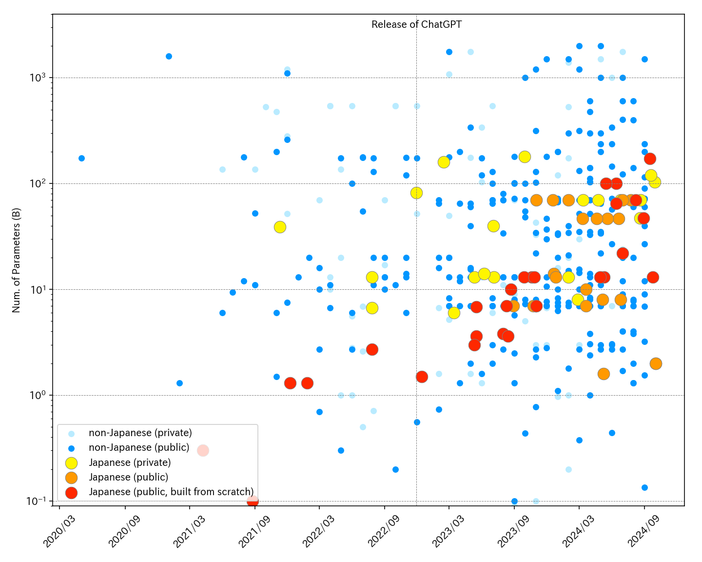

# Overview of Japanese LLMs
[ English | [**Français**](../fr/) | [**日本語**](../) ]

<p align="center">
  
</p>
<figcaption style="font-style: italic; font-size: 0.9em; color: #6b7280; text-align: center;">Evolution of parameter sizes for Japanese LLMs and non-Japanese LLMs. The information on the Japanese models is derived from this article, while the information on the non-Japanese models can be referred from the <a href="https://lifearchitect.ai/models-table/" target="_blank" rel="noreferrer">Models table</a> on LifeArchitect.ai. However, due to space constraints in the figure, some models have been omitted. Additionally, estimates are included in the parameter count for non-Japanese models. Please notify us of any corrections, additions, or updates.</figcaption>

---

A list of publicly available LLMs trained with a focus on Japanese, along with their evaluation benchmarks, maintained by volunteers from various sources like academic papers and other public resources.

::: warning Caution
1. We can't guarantee the accuracy or completeness of any information here.
2. Some information is based on conjecture and might not reflect your specific use case.
3. While many models are released under permissive licenses like MIT or Apache 2.0, **some are subject to more restrictive terms including non-commercial use clauses (e.g CC BY-NC-SA 4.0) or other stipulations.**
:::

Please point out any errors on the [issues page](https://github.com/llm-jp/awesome-japanese-llm/issues). Feel free to contribute directly with a pull request.

::: details Table of Contents
[[toc]]
:::

<a id="generative"></a>
## Text Generation Models

*For multimodal models, see [below.](#multimodal-text-generation)*

<a id="full-scratch-models"></a>
### Models built from scratch

<a id="generative-scratch-general"></a>
#### General purpose

|    |  Architecture  |  Max Context Length  |  Training Data  |  Developer  | License / Terms of Use |
|:---|:---:|:---:|:---:|:---:|:---:|
| [LLM-jp-3 172B beta1](https://www.nii.ac.jp/en/news/release/2024/0917.html) | Llama<br>([**172b**-beta1](https://huggingface.co/llm-jp/llm-jp-3-172b-beta1), [**172b**-beta1-instruct](https://huggingface.co/llm-jp/llm-jp-3-172b-beta1-instruct)) | 4,096 | Pre-training: part of [llm-jp-corpus-v3](https://gitlab.llm-jp.nii.ac.jp/datasets/llm-jp-corpus-v3)<br>(**0.7T** tokens)<br>Instruction Tuning: [ichikara-instruction](https://liat-aip.sakura.ne.jp/wp/llm%E3%81%AE%E3%81%9F%E3%82%81%E3%81%AE%E6%97%A5%E6%9C%AC%E8%AA%9E%E3%82%A4%E3%83%B3%E3%82%B9%E3%83%88%E3%83%A9%E3%82%AF%E3%82%B7%E3%83%A7%E3%83%B3%E3%83%87%E3%83%BC%E3%82%BF%E4%BD%9C%E6%88%90/), [answer-carefully](https://liat-aip.sakura.ne.jp/wp/answercarefully-dataset/), Dolly Dataset, OASST1, OASST2, Aya Dataset, 	ichikara-instruction-format, Daring-Anteater, FLAN | Research and Development Center for Large Language Models (LLMC) | LLM-jp-3 172B beta1 Terms of Use |
| [LLM-jp-3 172B alpha](https://llmc.nii.ac.jp/en/topics/llm-jp-3-172b-alpha1-alpha2/) | Llama<br>([**172b**-alpha1](https://huggingface.co/llm-jp/llm-jp-3-172b-alpha1), [**172b**-alpha1-instruct](https://huggingface.co/llm-jp/llm-jp-3-172b-alpha1-instruct), [**172b**-alpha2](https://huggingface.co/llm-jp/llm-jp-3-172b-alpha2), [**172b**-alpha2-instruct](https://huggingface.co/llm-jp/llm-jp-3-172b-alpha2-instruct)) | 4,096 | Pre-training: part of [llm-jp-corpus-v3](https://gitlab.llm-jp.nii.ac.jp/datasets/llm-jp-corpus-v3)<br>(alpha1: **0.7T** tokens, alpha2: **1.4T** tokens)<br>Instruction Tuning: [ichikara-instruction](https://liat-aip.sakura.ne.jp/wp/llm%E3%81%AE%E3%81%9F%E3%82%81%E3%81%AE%E6%97%A5%E6%9C%AC%E8%AA%9E%E3%82%A4%E3%83%B3%E3%82%B9%E3%83%88%E3%83%A9%E3%82%AF%E3%82%B7%E3%83%A7%E3%83%B3%E3%83%87%E3%83%BC%E3%82%BF%E4%BD%9C%E6%88%90/), [answer-carefully](https://liat-aip.sakura.ne.jp/wp/answercarefully-dataset/), Dolly Dataset, OASST1, OASST2, Aya Dataset, 	ichikara-instruction-format, Daring-Anteater, FLAN | Research and Development Center for Large Language Models (LLMC) | Apache 2.0 |
| [Stockmark-100b](https://huggingface.co/stockmark/stockmark-100b) | Llama<br>([**100b**](https://huggingface.co/stockmark/stockmark-100b), [**100b**-instruct-v0.1](https://huggingface.co/stockmark/stockmark-100b-instruct-v0.1)) | 4,096 | Pre-training: RedPajama, Japanese Wikipedia, Japanese mC4, Japanese CommonCrawl, Japanese Patent, Stockmark Web Corpus<br>(**910B** tokens)<br>Instruction Tuning (LoRA): [ichikara-instruction](https://liat-aip.sakura.ne.jp/wp/llm%E3%81%AE%E3%81%9F%E3%82%81%E3%81%AE%E6%97%A5%E6%9C%AC%E8%AA%9E%E3%82%A4%E3%83%B3%E3%82%B9%E3%83%88%E3%83%A9%E3%82%AF%E3%82%B7%E3%83%A7%E3%83%B3%E3%83%87%E3%83%BC%E3%82%BF%E4%BD%9C%E6%88%90/) | Stockmark | MIT |
| [PLaMo-100B-Pretrained](https://www.preferred.jp/ja/news/pr20241015/) | Llama[^22]<br>([**100b**](https://huggingface.co/pfnet/plamo-100b)) | 4,096 | Pre-training: Japanese CommonCrawl, RefinedWeb, undisclosed<br>(**2.0T** tokens) | Preferred Elements | PLaMo Non-Commercial License |
| [Sarashina2](https://www.sbintuitions.co.jp/news/press/20240614_01/) | Llama<br>([**7b**](https://huggingface.co/sbintuitions/sarashina2-7b), [**13b**](https://huggingface.co/sbintuitions/sarashina2-13b), [**70b**](https://huggingface.co/sbintuitions/sarashina2-70b)) | 7b, 13b: 4,096<br>70b: 8,192 | Pre-training: Japanese Common Crawl, SlimPajama, StarCoder<br>(**2.1T** tokens) | SB Intuitions | MIT |
| [Sarashina1](https://www.sbintuitions.co.jp/news/press/20240614_01/) | GPT-NeoX<br>([**7b**](https://huggingface.co/sbintuitions/sarashina1-7b), [**13b**](https://huggingface.co/sbintuitions/sarashina1-13b), [**65b**](https://huggingface.co/sbintuitions/sarashina1-65b)) | 2,048 | Pre-training: Japanese Common Crawl<br>(**1T** tokens) | SB Intuitions | MIT |
| [Tanuki-8×8B](https://weblab.t.u-tokyo.ac.jp/2024-08-30/) | Tanuki (MoE) (**47b**)<br>([v1.0](https://huggingface.co/weblab-GENIAC/Tanuki-8x8B-dpo-v1.0), [v1.0-AWQ](https://huggingface.co/team-hatakeyama-phase2/Tanuki-8x8B-dpo-v1.0-AWQ), [v1.0-GPTQ-4bit](https://huggingface.co/team-hatakeyama-phase2/Tanuki-8x8B-dpo-v1.0-GPTQ-4bit), [v1.0-GPTQ-8bit](https://huggingface.co/team-hatakeyama-phase2/Tanuki-8x8B-dpo-v1.0-GPTQ-8bit), [v1.0-GGUF](https://huggingface.co/team-hatakeyama-phase2/Tanuki-8x8B-dpo-v1.0-GGUF)) | 4,096 | Pre-training: various Web & synthetic datasets（**1.7T** tokens）<br>SFT, DPO: various synthetic datasets [^19] | Matsuo Lab LLM Development Project | Apache 2.0 |
| [CyberAgentLM3 (CALM3)](https://huggingface.co/cyberagent/calm3-22b-chat) | Llama<br>([**22b**-chat](https://huggingface.co/cyberagent/calm3-22b-chat)) | **16,384** | undisclosed<br>(**2.0T** tokens) | CyberAgent | Apache 2.0 |
| [LLM-jp-3 13B](https://llmc.nii.ac.jp/topics/post-707/) | Llama<br>([**1.8b**](https://huggingface.co/llm-jp/llm-jp-3-1.8b), [**1.8b**-instruct](https://huggingface.co/llm-jp/llm-jp-3-1.8b-instruct), [**3.7b**](https://huggingface.co/llm-jp/llm-jp-3-3.7b), [**3.7b**-instruct](https://huggingface.co/llm-jp/llm-jp-3-3.7b-instruct), [**13b**](https://huggingface.co/llm-jp/llm-jp-3-13b), [**13b**-instruct](https://huggingface.co/llm-jp/llm-jp-3-13b-instruct)) | 4,096 | Pre-training: [llm-jp-corpus-v3](https://gitlab.llm-jp.nii.ac.jp/datasets/llm-jp-corpus-v3)<br>(**2.1T** tokens)<br>Instruction Tuning: [ichikara-instruction](https://liat-aip.sakura.ne.jp/wp/llm%E3%81%AE%E3%81%9F%E3%82%81%E3%81%AE%E6%97%A5%E6%9C%AC%E8%AA%9E%E3%82%A4%E3%83%B3%E3%82%B9%E3%83%88%E3%83%A9%E3%82%AF%E3%82%B7%E3%83%A7%E3%83%B3%E3%83%87%E3%83%BC%E3%82%BF%E4%BD%9C%E6%88%90/), [answer-carefully](https://liat-aip.sakura.ne.jp/wp/answercarefully-dataset/), FLAN, 	ichikara-instruction-format, AutoMultiTurnByCalm3-22B, ramdom-to-fixed-multiturn-Calm3, wizardlm8x22b-logical-math-coding-sft_additional-ja, Synthetic-JP-EN-Coding-Dataset-567k | Research and Development Center for Large Language Models (LLMC) | Apache 2.0 |
| [LLM-jp-13B v2.0](https://huggingface.co/llm-jp/llm-jp-13b-v2.0) | Llama<br>([**13b**-v2.0](https://huggingface.co/llm-jp/llm-jp-13b-v2.0), [**13b**-instruct-full-dolly-ichikara_004_001_single-oasst-oasst2-v2.0](https://huggingface.co/llm-jp/llm-jp-13b-instruct-full-dolly-ichikara_004_001_single-oasst-oasst2-v2.0), [**13b**-instruct-full-ac_001-dolly-ichikara_004_001_single-oasst-oasst2-v2.0](https://huggingface.co/llm-jp/llm-jp-13b-instruct-full-ac_001-dolly-ichikara_004_001_single-oasst-oasst2-v2.0), [**13b**-instruct-full-ac_001_16x-dolly-ichikara_004_001_single-oasst-oasst2-v2.0](https://huggingface.co/llm-jp/llm-jp-13b-instruct-full-ac_001_16x-dolly-ichikara_004_001_single-oasst-oasst2-v2.0)) | 4,096 | Pre-training: [llm-jp-corpus-v2](https://gitlab.llm-jp.nii.ac.jp/datasets/llm-jp-corpus-v2)<br>(**260B** tokens)<br>Instruction Tuning: [ichikara-instruction](https://liat-aip.sakura.ne.jp/wp/llm%E3%81%AE%E3%81%9F%E3%82%81%E3%81%AE%E6%97%A5%E6%9C%AC%E8%AA%9E%E3%82%A4%E3%83%B3%E3%82%B9%E3%83%88%E3%83%A9%E3%82%AF%E3%82%B7%E3%83%A7%E3%83%B3%E3%83%87%E3%83%BC%E3%82%BF%E4%BD%9C%E6%88%90/), [answer-carefully](https://liat-aip.sakura.ne.jp/wp/answercarefully-dataset/), Dolly Dataset, OASST1, OASST2 | LLM-jp | Apache 2.0 |
| [Fugaku-LLM](https://www.fujitsu.com/global/about/resources/news/press-releases/2024/0510-01.html) | GPT<br>([**13B**](https://huggingface.co/Fugaku-LLM/Fugaku-LLM-13B), [**13B**-instruct](https://huggingface.co/Fugaku-LLM/Fugaku-LLM-13B-instruct), [**13B**-instruct-gguf](https://huggingface.co/Fugaku-LLM/Fugaku-LLM-13B-instruct-gguf)) | 2,048 | Pre-training: undisclosed dataset<br>Instruction Tuning: OASST1, Dolly Dataset, GSM8K | Titech, Tohoku Univ., Fujitsu, RIKEN, Nagoya Univ., CyberAgent, Kotoba Technologies | Fugaku-LLM Terms of Use |
| [LLM-jp-13B v1.1](https://llm-jp.nii.ac.jp/blog/2024/02/09/v1.1-tuning.html) | GPT<br>([**13b**-instruct-lora-dolly_en-dolly_ja-ichikara_003_001-oasst_en-oasst_ja-v1.1](https://huggingface.co/llm-jp/llm-jp-13b-instruct-lora-dolly_en-dolly_ja-ichikara_003_001-oasst_en-oasst_ja-v1.1), [**13b**-instruct-full-dolly_en-dolly_ja-ichikara_003_001-oasst_en-oasst_ja-v1.1](https://huggingface.co/llm-jp/llm-jp-13b-instruct-full-dolly_en-dolly_ja-ichikara_003_001-oasst_en-oasst_ja-v1.1), [**13b**-dpo-lora-hh_rlhf_ja-v1.1](https://huggingface.co/llm-jp/llm-jp-13b-dpo-lora-hh_rlhf_ja-v1.1)) | 2,048 | Instruction Tuning (LoRA or Full-parameter FT): Dolly Dataset, OASST1, [ichikara-instruction](https://liat-aip.sakura.ne.jp/wp/llm%E3%81%AE%E3%81%9F%E3%82%81%E3%81%AE%E6%97%A5%E6%9C%AC%E8%AA%9E%E3%82%A4%E3%83%B3%E3%82%B9%E3%83%88%E3%83%A9%E3%82%AF%E3%82%B7%E3%83%A7%E3%83%B3%E3%83%87%E3%83%BC%E3%82%BF%E4%BD%9C%E6%88%90/)<br>DPO (LoRA): HH RLHF | LLM-jp | Apache 2.0 |
| [LLM-jp-13B](https://www.nii.ac.jp/en/news/release/2023/1020.html) | GPT<br>([1.3b-v1.0](https://huggingface.co/llm-jp/llm-jp-1.3b-v1.0), [**13b**-v1.0](https://huggingface.co/llm-jp/llm-jp-13b-v1.0), [**13b**-instruct-full-jaster-v1.0](https://huggingface.co/llm-jp/llm-jp-13b-instruct-full-jaster-v1.0), [**13b**-instruct-full-jaster-dolly-oasst-v1.0](https://huggingface.co/llm-jp/llm-jp-13b-instruct-full-jaster-dolly-oasst-v1.0), [**13b**-instruct-full-dolly-oasst-v1.0](https://huggingface.co/llm-jp/llm-jp-13b-instruct-full-dolly-oasst-v1.0), [**13b**-instruct-lora-jaster-v1.0](https://huggingface.co/llm-jp/llm-jp-13b-instruct-lora-jaster-v1.0), [**13b**-instruct-lora-jaster-dolly-oasst-v1.0](https://huggingface.co/llm-jp/llm-jp-13b-instruct-lora-jaster-dolly-oasst-v1.0), [**13b**-instruct-lora-dolly-oasst-v1.0](https://huggingface.co/llm-jp/llm-jp-13b-instruct-lora-dolly-oasst-v1.0)) | 2,048 | Pre-training: [llm-jp-corpus](https://github.com/llm-jp/llm-jp-corpus) (Wikipedia, Japanese mC4, The Pile, Stack) (**300B** tokens)<br>Instruction Tuning (Full-parameter FT or LoRA): jaster, Dolly Dataset, OASST1 | LLM-jp | Apache 2.0 |
| [PLaMo-13B](https://www.preferred.jp/en/news/pr20230928/) | Llama[^1]<br>([**13b**](https://huggingface.co/pfnet/plamo-13b), [**13b**-instruct](https://huggingface.co/pfnet/plamo-13b-instruct), [**13b**-instruct-nc](https://huggingface.co/pfnet/plamo-13b-instruct-nc)) |base: 4,096<br>instruct, instruct-nc: 8,192 |  Pre-training: C4, Project Gutenberg, RedPajama, Japanese Wikipedia, Japanese mC4<br>(**1.5T** tokens)<br>Instruction Tuning: Dolly, HH RLHF, OASST1, wikinews (+Alpaca in NC model)  | Preferred Networks | Apache 2.0<br>(CC BY-NC 4.0 as for NC model) |
| [Stockmark-13b](https://stockmark.co.jp/news/20231027) | Llama<br>([**13b**](https://huggingface.co/stockmark/stockmark-13b), [**13b**-instruct](https://huggingface.co/stockmark/stockmark-13b-instruct)) | 2,048 | Pre-training: Japanese Wikipedia, Japanese CC-100, Japanese mC4, Japanese CommonCrawl, Japanese Patent, Stockmark Web Corpus<br>(**220B** tokens)<br>Instruction Tuning (LoRA): [ichikara-instruction](https://liat-aip.sakura.ne.jp/wp/llm%E3%81%AE%E3%81%9F%E3%82%81%E3%81%AE%E6%97%A5%E6%9C%AC%E8%AA%9E%E3%82%A4%E3%83%B3%E3%82%B9%E3%83%88%E3%83%A9%E3%82%AF%E3%82%B7%E3%83%A7%E3%83%B3%E3%83%87%E3%83%BC%E3%82%BF%E4%BD%9C%E6%88%90/) | Stockmark | base: MIT<br>instruct: CC BY-NC-SA 4.0 |
| [Weblab-10B](https://www.t.u-tokyo.ac.jp/press/pr2023-08-18-001) | GPT-NeoX <br> ([**10b**](https://huggingface.co/matsuo-lab/weblab-10b), [**10b**-instruction-sft](https://huggingface.co/matsuo-lab/weblab-10b-instruction-sft)) | 2,048 | Japanese mC4, The Pile <br> (**600B** tokens) <br>Instruction Tuning: Alpaca, FLAN | University of Tokyo Matsuo Lab | CC BY&#x2011;NC 4.0 |
| [Tanuki-8B](https://weblab.t.u-tokyo.ac.jp/2024-08-30/) | Tanuki (**8b**)<br>([v1.0](https://huggingface.co/weblab-GENIAC/Tanuki-8B-dpo-v1.0), [v1.0-AWQ](https://huggingface.co/team-hatakeyama-phase2/Tanuki-8B-dpo-v1.0-AWQ), [v1.0-GPTQ-4bit](https://huggingface.co/team-hatakeyama-phase2/Tanuki-8B-dpo-v1.0-GPTQ-4bit), [v1.0-GPTQ-8bit](https://huggingface.co/team-hatakeyama-phase2/Tanuki-8B-dpo-v1.0-GPTQ-8bit), [v1.0-GGUF](https://huggingface.co/team-hatakeyama-phase2/Tanuki-8B-dpo-v1.0-GGUF)) | 4,096 | Pre-training: various Web & synthetic datasets（**1.3T** tokens）<br>SFT, DPO: various synthetic datasets [^19] | Matsuo Lab LLM Development Project | Apache 2.0 |
| [Japanese StableLM Alpha](https://stability.ai/blog/stability-ai-new-jplm-japanese-language-model-stablelm) | GPT-NeoX <br> ([base-alpha-**7b**](https://huggingface.co/stabilityai/japanese-stablelm-base-alpha-7b), [instruct-alpha-**7b**](https://huggingface.co/stabilityai/japanese-stablelm-instruct-alpha-7b), [instruct-alpha-**7b**-v2](https://huggingface.co/stabilityai/japanese-stablelm-instruct-alpha-7b-v2)) | 2,048 | Wikipedia, Japanese CC&#x2011;100, Japanese mC4, Japanese OSCAR, RedPajama, private datasets[^2]<br>(**750B** tokens)<br>Instruction Tuning: Dolly, HH&#x2011;RLHF, wikinews,  Alpaca (discarded in v2) | Stability AI | base: Apache 2.0<br>instruct (v1): [Research license](https://huggingface.co/stabilityai/japanese-stablelm-instruct-alpha-7b/tree/main)<br>instruct (v2): Apache 2.0 |
| [CyberAgentLM2 (CALM2)](https://www.cyberagent.co.jp/news/detail/id=29479) | Llama<br>([**7b**](https://huggingface.co/cyberagent/calm2-7b), [**7b**-chat](https://huggingface.co/cyberagent/calm2-7b-chat), [**7b**-chat-dpo-experimental](https://huggingface.co/cyberagent/calm2-7b-chat-dpo-experimental)) | base: 4,096<br>chat: **32,768** | publicly available Japanese and English datasets (details unknown)<br>(**1.3T** tokens)<br>DPO: Chatbot Arena Conversations JA (calm2) Dataset  | CyberAgent | Apache 2.0<br>(CC BY 4.0 as for DPO model) |
| [OpenCALM](https://www.cyberagent.co.jp/news/detail/id=28817) | GPT-NeoX <br> ([small](https://huggingface.co/cyberagent/open-calm-small), [medium](https://huggingface.co/cyberagent/open-calm-medium), [large](https://huggingface.co/cyberagent/open-calm-large), [**1b(1.4b)**](https://huggingface.co/cyberagent/open-calm-1b), [**3b(2.7b)**](https://huggingface.co/cyberagent/open-calm-3b), [**7b(6.8b)**](https://huggingface.co/cyberagent/open-calm-7b)) | 2,048 | Japanese Wikipedia, Japanese mC4, Japanese CC&#x2011;100 | CyberAgent | CC BY&#x2011;SA 4.0 |
| [Stormy](https://jxiv.jst.go.jp/index.php/jxiv/preprint/view/422/1350) | GPT-NeoX <br>([**7b(6.8b)**](https://huggingface.co/izumi-lab/stormy-7b-10ep)) | 2,048 | OpenCALM fine-tuned on <br>llm-japanese-dataset v0 non-translation tasks | University of Tokyo Izumi Lab | CC BY&#x2011;SA 4.0 |
| [rinna GPT <br> (En-Ja Bilingual)](https://rinna.co.jp/news/2023/07/20230731.html) | GPT-NeoX <br>([**4b(3.8b)**](https://huggingface.co/rinna/bilingual-gpt-neox-4b), [**4b(3.8b)**-8k](https://huggingface.co/rinna/bilingual-gpt-neox-4b-8k), [**4b(3.8b)**-instruction-sft](https://huggingface.co/rinna/bilingual-gpt-neox-4b-instruction-sft), [**4b(3.8b)**-instruction-ppo](https://huggingface.co/rinna/bilingual-gpt-neox-4b-instruction-ppo)) | 8k model: 8,192<br>others: 2,048 | Wikipedia, Japanese CC&#x2011;100, Japanese C4, RedPajama, The Pile<br>(**524B** tokens)<br>Instruction Tuning: HH&#x2011;RLHF, FLAN<br>PPO: HH&#x2011;RLHF for reinforcement learning  <br>8k: trained with long context| rinna | MIT |
| [japanese-large-lm](https://engineering.linecorp.com/ja/blog/3.6b-japanese-language-model-with-improved-dialog-performance-by-instruction-tuning) | GPT-NeoX <br>([**1.7b**](https://huggingface.co/line-corporation/japanese-large-lm-1.7b), [**3.6b**](https://huggingface.co/line-corporation/japanese-large-lm-3.6b), [**1.7b**-instruction-sft](https://huggingface.co/line-corporation/japanese-large-lm-1.7b-instruction-sft), [**3.6b**-instruction-sft](https://huggingface.co/line-corporation/japanese-large-lm-3.6b-instruction-sft)) | 2,048 | Japanese Wikipedia, Japanese CC&#x2011;100, Japanese C4, Japanese OSCAR and private datasets<br>(**650GB**)<br>Instruction Tuning: OASST1 | LINE | Apache 2.0 |
| [rinna GPT <br> (Japanese only)](https://rinna.co.jp/news/2023/05/20220531.html) | GPT / GPT-NeoX <br>([xsmall](https://huggingface.co/rinna/japanese-gpt2-xsmall), [small](https://huggingface.co/rinna/japanese-gpt2-small), [medium](https://huggingface.co/rinna/japanese-gpt2-medium), [**1b**](https://huggingface.co/rinna/japanese-gpt-1b), [neox-small](https://huggingface.co/rinna/japanese-gpt-neox-small), [neox-**3.6b**](https://huggingface.co/rinna/japanese-gpt-neox-3.6b), [neox-**3.6b**-instruction-sft](https://huggingface.co/rinna/japanese-gpt-neox-3.6b-instruction-sft), [neox-**3.6b**-instruction-sft-v2](https://huggingface.co/rinna/japanese-gpt-neox-3.6b-instruction-sft-v2), [neox-**3.6b**-instruction-ppo](https://huggingface.co/rinna/japanese-gpt-neox-3.6b-instruction-ppo)) | ≤ 2,048 | Japanese Wikipedia, Japanese CC&#x2011;100 <br> (1b and up models add <br>Japanese mC4)<br>Instruction Tuning: HH&#x2011;RLHF, FLAN, SHP <br>PPO: HH&#x2011;RLHF for reinforcement learning | rinna | MIT |
| [RetrievaT5](https://note.com/retrieva/n/n7b4186dc5ada) | T5 <br>([small (short)](https://huggingface.co/retrieva-jp/t5-small-short), [small (medium)](https://huggingface.co/retrieva-jp/t5-small-medium), [small (long)](https://huggingface.co/retrieva-jp/t5-small-long), [base (short)](https://huggingface.co/retrieva-jp/t5-base-short), [base (medium)](https://huggingface.co/retrieva-jp/t5-base-medium), [base (long)](https://huggingface.co/retrieva-jp/t5-base-long), [large (short)](https://huggingface.co/retrieva-jp/t5-large-short), [large (medium)](https://huggingface.co/retrieva-jp/t5-large-medium), [large (long)](https://huggingface.co/retrieva-jp/t5-large-long), [**xl(3b)**](https://huggingface.co/retrieva-jp/t5-xl)) | | Japanese Wikipedia, Japanese mC4 | Retrieva | CC BY&#x2011;SA 4.0 |
| [Spiral-RetNet-3b-base](https://prtimes.jp/main/html/rd/p/000000014.000120221.html) | RetNet<br>([**3b**](https://huggingface.co/Spiral-AI/Spiral-RetNet-3b-base)) | 2,048 |  Wikipedia, Japanese CC-100, CulturaX | Spiral.AI | MIT |
| [kotomamba-2.8B](https://huggingface.co/kotoba-tech/kotomamba-2.8B-v1.0) | Mamba<br>([**2.8B**-v1.0](https://huggingface.co/kotoba-tech/kotomamba-2.8B-v1.0)) | 2,048 | Japanese Wikipedia, Swallow Corpus, SlimPajama | Kotoba Technologies | Apache 2.0 |
| [ABEJA GPT](https://tech-blog.abeja.asia/entry/abeja-gpt-project-202207) | GPT / GPT-NeoX <br>([large](https://huggingface.co/abeja/gpt2-large-japanese), [neox-**2.7b**](https://huggingface.co/abeja/gpt-neox-japanese-2.7b)) | | Japanese Wikipedia, Japanese CC&#x2011;100, Japanese OSCAR | ABEJA | MIT |
| [WasedaGPT](https://huggingface.co/nlp-waseda/gpt2-xl-japanese) | GPT <br> ([small](https://huggingface.co/nlp-waseda/gpt2-small-japanese), [**xl(1.5b)**](https://huggingface.co/nlp-waseda/gpt2-xl-japanese)) | | Japanese Wikipedia, Japanese CC&#x2011;100 | Waseda Kawahara Lab | CC BY&#x2011;SA 4.0 |
| [StockmarkGPT](https://stockmark.co.jp/news/20230808) | GPT-NeoX <br>([**1.4b**](https://huggingface.co/stockmark/gpt-neox-japanese-1.4b)) | | Japanese Wikipedia (0.88B tokens), Japanese CC&#x2011;100 (10.5B tokens), private data (8.6B tokens) | Stockmark | MIT |
| [YellowbackGPT](https://tech.yellowback.net/posts/gpt-neo-japanese) | GPT-NeoX <br>([**1.3b**](https://huggingface.co/yellowback/gpt-neo-japanese-1.3B)) | | Japanese Wikipedia, Japanese CC&#x2011;100, Japanese OSCAR | Yellowback | Apache 2.0 |
| [colorfulscoop GPT](https://huggingface.co/colorfulscoop/gpt2-small-ja) | GPT <br>([small](https://huggingface.co/colorfulscoop/gpt2-small-ja)) | | Japanese Wikipedia | Colorful Scoop | CC BY&#x2011;SA 3.0 |
| [TitechGPT](https://www.anlp.jp/proceedings/annual_meeting/2023/pdf_dir/H9-1.pdf) | GPT <br>([medium](https://huggingface.co/okazaki-lab/japanese-gpt2-medium-unidic), [medium-reversed](https://huggingface.co/okazaki-lab/japanese-reversed-gpt2-medium-unidic)) [^3] | | Japanese Wikipedia, Japanese CC&#x2011;100 | Titech Okazaki Lab | CC BY&#x2011;SA 4.0 |
| [KyotoUniversityGPT](https://huggingface.co/ku-nlp/gpt2-medium-japanese-char) | GPT <br>([small](https://huggingface.co/ku-nlp/gpt2-small-japanese-char), [medium](https://huggingface.co/ku-nlp/gpt2-medium-japanese-char), [large](https://huggingface.co/ku-nlp/gpt2-large-japanese-char)) | | Japanese Wikipedia (3.2GB), Japanese CC&#x2011;100 (85GB), Japanese OSCAR (54GB) | Kyoto University Language Media Processing Lab | CC BY&#x2011;SA 4.0 |
| [JapaneseBART](https://huggingface.co/ku-nlp/bart-base-japanese) | BART <br>([base](https://huggingface.co/ku-nlp/bart-base-japanese), [large](https://huggingface.co/ku-nlp/bart-large-japanese)) | | Japanese Wikipedia (18M sentences) | Kyoto University Language Media Processing Lab | CC BY&#x2011;SA 4.0 |
| [Megagon Labs T5](https://github.com/megagonlabs/t5-japanese) | T5 <br>([base](https://huggingface.co/megagonlabs/t5-base-japanese-web)) | | Japanese mC4 (782 GB), Japanese wiki40b (2 GB) | Megagon Labs <br> (Recruit Co.,Ltd.) | Apache 2.0 |

<a id="generative-scratch-domain-specific"></a>
#### Domain Specific

|    |  Domain  |  Architecture  |  Training Data  |  Developer  | License |
|:---|:---:|:---:|:---:|:---:|:---:|
| [Japanese Dialog Transformer](https://github.com/nttcslab/japanese-dialog-transformers) | Dialog | Transformer | Twitter japanese reply pairs | NTT | [Evaluation Licence](https://github.com/nttcslab/japanese-dialog-transformers/blob/main/LICENSE.md) |
| [Japanese News BART](https://tech.stockmark.co.jp/blog/bart-japanese-base-news/) | Business |  BART ([base](https://huggingface.co/stockmark/bart-base-japanese-news)) | Japanese business news articles (21M articles) | Stockmark | MIT |
| [AcademicBART](https://github.com/EhimeNLP/AcademicBART) | Science | BART ([base](https://huggingface.co/EhimeNLP/AcademicBART)) | CiNii Japanese Papers | Ehime University AI Lab | Apache 2.0 |

<a id="english-based-models"></a>
### Models built off non-Japanese LLMs (w/ continual pre-training on Japanese)

<a id="generative-continual-general"></a>
#### General purpose

|    | Base Model  | Training Data  | Developer  |  License / Terms of Use  |
|:---|:---:|:---:|:---:|:---:|
| [Llama 3.1 Swallow 70B](https://swallow-llm.github.io/llama3.1-swallow.en.html)<br>([70B-v0.1](https://huggingface.co/tokyotech-llm/Llama-3.1-Swallow-70B-v0.1), [70B-Instruct-v0.1](https://huggingface.co/tokyotech-llm/Llama-3.1-Swallow-70B-Instruct-v0.1)) | Llama 3.1 (**70b**) | Pre-training: The Stack v2, Wikipedia, DCLM-baseline-1.0, Swallow Corpus Version 2, Cosmopedia, Laboro ParaCorpus<br>Instruction Tuning: lmsys-chat-1m-synth-ja-wo-pii-and-template-instructions, lmsys-chat-1m-synth-en-wo-pii-and-template-instructions, filtered-magpie-ultra-ja, filtered-magpie-ultra-en, gemma-magpie | Swallow Project | Llama 3.1 Community License<br>(Gemma Terms of Use is also applied to the Instruct model) |
| [cyberagent/Llama-3.1-70B-Japanese-Instruct-2407](https://huggingface.co/cyberagent/Llama-3.1-70B-Japanese-Instruct-2407) | Llama 3.1 (**70b**) | undisclosed | CyberAgent | Llama 3.1 Community License |
| [Llama 3 Swallow 70B](https://swallow-llm.github.io/llama3-swallow.en.html)<br>([70B-v0.1](https://huggingface.co/tokyotech-llm/Llama-3-Swallow-70B-v0.1), [70B-Instruct-v0.1](https://huggingface.co/tokyotech-llm/Llama-3-Swallow-70B-Instruct-v0.1)) | Llama 3 (**70b**) | Pre-training: Algebraic Stack, Wikipedia, RefinedWeb, Swallow Corpus, Cosmopedia, Laboro ParaCorpus, OpenWebMath<br>Instruction Tuning: OASST1 [^17] | Swallow Project | Llama 3 Community License |
| [turing-motors/Llama-3-heron-brain-70B-v0.3](https://huggingface.co/turing-motors/Llama-3-heron-brain-70B-v0.3) | Llama 3 (**70b**) | additionally trained on Llama 3 Swallow 70B (details undisclosed) | Turing | Llama 3 Community License |
| [Llama 3 Youko 70B](https://rinna.co.jp/news/2024/07/20240725.html)<br>([70b](https://huggingface.co/rinna/llama-3-youko-70b), [70b-instruct](https://huggingface.co/rinna/llama-3-youko-70b-instruct), [70b-gptq](https://huggingface.co/rinna/llama-3-youko-70b-gptq), [70b-instruct-gptq](https://huggingface.co/rinna/llama-3-youko-70b-instruct-gptq)) | Llama 3 (**70b**) | Pre-training: Wikipedia, Japanese C4, Japanese CC-100, Japanese OSCAR, The Pile, undisclosed dataset<br>(**5B** tokens)<br>Instruction Tuning: undisclosed datasetト[^11] | rinna | Llama 3 Community License |
| [Swallow 70B](https://swallow-llm.github.io/swallow-llama.en.html)<br>([70b-hf](https://huggingface.co/tokyotech-llm/Swallow-70b-hf), [70b-instruct-hf](https://huggingface.co/tokyotech-llm/Swallow-70b-instruct-hf), [70b-instruct-v0.1](https://huggingface.co/tokyotech-llm/Swallow-70b-instruct-v0.1), [70b-NVE-hf](https://huggingface.co/tokyotech-llm/Swallow-70b-NVE-hf), [70b-NVE-instruct-hf](https://huggingface.co/tokyotech-llm/Swallow-70b-NVE-instruct-hf)) | Llama 2 (**70b**) | Pre-training: Japanese Wikipedia, RefinedWeb, Swallow Corpus, The Pile<br>Instruction Tuning: Dolly Dataset, HH RLHF, OASST1<br>*v0.1: OASST1, OASST2 | Swallow Project | Llama 2 Community License |
| [KARAKURI LM](https://medium.com/karakuri/introducing-karakuri-lm-34c79a3bf341)<br>([70b-v0.1](https://huggingface.co/karakuri-ai/karakuri-lm-70b-v0.1), [70b-chat-v0.1](https://huggingface.co/karakuri-ai/karakuri-lm-70b-chat-v0.1)) | Llama 2 (**70b**) | Pre-training: mC4, CC100, OSCAR, RedPajama, undisclosed dataset<br>(**16B** tokens)<br>SteerLM: OASST2, undisclosed dataset | KARAKURI | Llama 2 Community License[^13] |
| [Japanese Stable LM Beta 70B](https://ja.stability.ai/blog/japanese-stable-lm-beta)<br>([base-beta-70b](https://huggingface.co/stabilityai/japanese-stablelm-base-beta-70b), [instruct-beta-70b](https://huggingface.co/stabilityai/japanese-stablelm-instruct-beta-70b)) | Llama 2 (**70b**) | Pre-training: Wikipedia, Japanese mC4, Japanese CC-100, Japanese OSCAR, SlimPajama(excluding Books3)<br>(**100B** tokens)<br>Instruction Tuning: Dolly Dataset, HH RLHF, OASST1 | Stability AI | Llama 2 Community License |
| [Swallow-MX 8x7B](https://swallow-llm.github.io/swallow-mistral.ja.html)<br>([8x7b-NVE-v0.1](https://huggingface.co/tokyotech-llm/Swallow-MX-8x7b-NVE-v0.1)) | Mixtral-8x7B-Instruct-v0.1 (**46.7b**) | Pre-training: Algebraic Stack, Japanese Wikipedia, RefinedWeb, Swallow Corpus, The Pile, The Vault | Swallow Project | Apache 2.0 |
| [KARAKURI LM 8x7B Instruct v0.1](https://huggingface.co/karakuri-ai/karakuri-lm-8x7b-instruct-v0.1)<br>([8x7b-instruct-v0.1](https://huggingface.co/karakuri-ai/karakuri-lm-8x7b-instruct-v0.1)) | Mixtral-8x7B-Instruct-v0.1 (**46.7b**) | trained Swallow-MX 8x7B on the following datasets: Dolly Dataset, OASST2, HelpSteer, glaive-code-assistant-v3, glaive-function-calling-v2, synthetic_text_to_sql, MetaMathQA, orca-math-word-problems-200k, rag-dataset-12000, rag-hallucination-dataset-1000, undisclosed dataset | KARAKURI | Apache 2.0 (?)[^12] |
| [KARAKURI LM 8x7B Chat v0.1](https://huggingface.co/karakuri-ai/karakuri-lm-8x7b-chat-v0.1)<br>([8x7b-chat-v0.1](https://huggingface.co/karakuri-ai/karakuri-lm-8x7b-chat-v0.1)) | Mixtral-8x7B-Instruct-v0.1 (**46.7b**) | trained Swallow-MX 8x7B on OASST2, HelpSteer, and undisclosed datasets using SteerLM | KARAKURI | Apache 2.0 |
| [ABEJA-Mixtral-8x7B-japanese](https://huggingface.co/abeja/Mixtral-8x7B-Instruct-v0.1-japanese)<br>([8x7B-v0.1-japanese](https://huggingface.co/abeja/Mixtral-8x7B-v0.1-japanese), [8x7B-Instruct-v0.1-japanese](https://huggingface.co/abeja/Mixtral-8x7B-Instruct-v0.1-japanese), [8x7B-Instruct-v0.1-japanese-alpha](https://huggingface.co/abeja/Mixtral-8x7B-Instruct-v0.1-japanese-alpha), [8x7B-Instruct-v0.1-japanese-alpha-merged](https://huggingface.co/abeja/Mixtral-8x7B-Instruct-v0.1-japanese-alpha-merged)) | Mixtral-8x7B-Instruct-v0.1 (**46.7b**)<br>\*The model without "Instruct" in its name is based on Mixtral-8x7B-v0.1 | Pre-training: Japanese CC,	Redpajama, undisclosed dataset<br>（**450B** tokens） | ABEJA | Apache 2.0 |
| [Nekomata 14B](https://rinna.co.jp/news/2023/12/20231221.html)<br>([14b](https://huggingface.co/rinna/nekomata-14b), [14b-instruction](https://huggingface.co/rinna/nekomata-14b-instruction), [14b-gguf](https://huggingface.co/rinna/nekomata-14b-gguf), [14b-instruction-gguf](https://huggingface.co/rinna/nekomata-14b-instruction-gguf)) | Qwen (**14b**) | Pre-training: Wikipedia, Japanese C4, Japanese CC-100, Japanese OSCAR, The Pile, undisclosed dataset<br>(**66B** tokens)<br>Instruction Tuning: Dolly Dataset, FLAN, subsets of llm-japanese-dataset | rinna | Tongyi Qianwen LICENSE |
| [Swallow 13B](https://swallow-llm.github.io/swallow-llama.en.html)<br>([13b-hf](https://huggingface.co/tokyotech-llm/Swallow-13b-hf), [13b-instruct-hf](https://huggingface.co/tokyotech-llm/Swallow-13b-instruct-hf), [13b-instruct-v0.1](https://huggingface.co/tokyotech-llm/Swallow-13b-instruct-v0.1), [13b-NVE-hf](https://huggingface.co/tokyotech-llm/Swallow-13b-NVE-hf)) | Llama 2 (**13b**) | Pre-training: Japanese Wikipedia, RefinedWeb, Swallow Corpus, The Pile<br>Instruction Tuning: Dolly Dataset, HH RLHF, OASST1<br>*v0.1: OASST1, OASST2 | Swallow Project | Llama 2 Community License |
| [LEIA-Swallow-13B](https://arxiv.org/pdf/2402.11485)<br>([13b](https://huggingface.co/leia-llm/Leia-Swallow-13b)) | Llama 2 (**13b**) | additionally trained Swallow 13B using LEIA | Individual ([Ikuya Yamada](https://scholar.google.com/citations?user=M7YivToAAAAJ), [Ryokan Ri](https://scholar.google.co.jp/citations?user=z9is5FAAAAAJ)) | Llama 2 Community License |
| [ELYZA-japanese-Llama-2-13b](https://note.com/elyza/n/n5d42686b60b7)<br>([13b](https://huggingface.co/elyza/ELYZA-japanese-Llama-2-13b), [13b-instruct](https://huggingface.co/elyza/ELYZA-japanese-Llama-2-13b-instruct), [13b-fast](https://huggingface.co/elyza/ELYZA-japanese-Llama-2-13b-fast), [13b-fast-instruct](https://huggingface.co/elyza/ELYZA-japanese-Llama-2-13b-fast-instruct)) | Llama 2 (**13b**) | Pre-training: Japanese Wikipedia, Japanese OSCAR, and other crawled data<br>(**18B** tokens)<br>Instruction Tuning: undisclosed dataset | ELYZA | Llama 2 Community License |
| [cyberagent/Mistral-Nemo-Japanese-Instruct-2408](https://huggingface.co/cyberagent/Mistral-Nemo-Japanese-Instruct-2408) | Mistral NeMo (**12b**) |undisclosed | CyberAgent | Apache 2.0 |
| [Llama 3.1 Swallow 8B](https://swallow-llm.github.io/llama3.1-swallow.en.html)<br>([8B-v0.1](https://huggingface.co/tokyotech-llm/Llama-3.1-Swallow-8B-v0.1), [8B-Instruct-v0.1](https://huggingface.co/tokyotech-llm/Llama-3.1-Swallow-8B-Instruct-v0.1)) | Llama 3.1 (**8b**) | Pre-training: The Stack v2, Wikipedia, DCLM-baseline-1.0, Swallow Corpus Version 2, Cosmopedia, Laboro ParaCorpus<br>Instruction Tuning: lmsys-chat-1m-synth-ja-wo-pii-and-template-instructions, lmsys-chat-1m-synth-en-wo-pii-and-template-instructions, filtered-magpie-ultra-ja, filtered-magpie-ultra-en, gemma-magpie | Swallow Project | Llama 3.1 Community License<br>(Gemma Terms of Use is also applied to the Instruct model) |
| [Llama 3 Swallow 8B](https://swallow-llm.github.io/llama3-swallow.en.html)<br>([8B-v0.1](https://huggingface.co/tokyotech-llm/Llama-3-Swallow-8B-v0.1), [8B-Instruct-v0.1](https://huggingface.co/tokyotech-llm/Llama-3-Swallow-8B-Instruct-v0.1)) | Llama 3 (**8b**) | Pre-training: Algebraic Stack, Wikipedia, RefinedWeb, Swallow Corpus, Cosmopedia, Laboro ParaCorpus, OpenWebMath<br>Instruction Tuning: OASST1 [^17] | Swallow Project | Llama 3 Community License |
| [turing-motors/Llama-3-heron-brain-8B-v0.3](https://huggingface.co/turing-motors/Llama-3-heron-brain-8B-v0.3) | Llama 3 (**8b**) | additionally trained on Llama 3 Swallow 8B (details undisclosed) | Turing | Llama 3 Community License |
| [Llama 3 Youko 8B](https://rinna.co.jp/news/2024/07/20240725.html)<br>([8b](https://huggingface.co/rinna/llama-3-youko-8b), [8b-instruct](https://huggingface.co/rinna/llama-3-youko-8b-instruct), [8b-gptq](https://huggingface.co/rinna/llama-3-youko-8b-gptq), [8b-instruct-gptq](https://huggingface.co/rinna/llama-3-youko-8b-instruct-gptq)) | Llama 3 (**8b**) | Pre-training: Wikipedia, Japanese C4, Japanese CC-100, Japanese OSCAR, The Pile, undisclosed dataset<br>(**22B** tokens)<br>Instruction Tuning[^11]: Aya Dataset (Japanese subset), FLAN, Dolly Dataset, HH RLHF, OASST1, OASST2, MetaMathQA, CodeAlpaca Dataset, undisclosed dataset<br>DPO: HelpSteer, HelpSteer2, undisclosed dataset | rinna | Llama 3 Community License |
| [Llama 3 ELYZA JP 8B](https://huggingface.co/elyza/Llama-3-ELYZA-JP-8B)<br>([8B](https://huggingface.co/elyza/Llama-3-ELYZA-JP-8B), [8B-GGUF](https://huggingface.co/elyza/Llama-3-ELYZA-JP-8B-GGUF), [8B-AWQ](https://huggingface.co/elyza/Llama-3-ELYZA-JP-8B-AWQ)) | Llama 3 (**8b**) | undisclosed | ELYZA | Llama 3 Community License |
| [Llama 3 neoAI 8B Chat v0.1](https://prtimes.jp/main/html/rd/p/000000017.000109048.html)<br>([8B-Chat-v0.1](https://huggingface.co/neoai-inc/Llama-3-neoAI-8B-Chat-v0.1)) | Llama 3 (**8b**) | undisclosed | neoAI | Llama 3 Community License |
| [Swallow 7B](https://swallow-llm.github.io/swallow-llama.en.html)<br>([7b-hf](https://huggingface.co/tokyotech-llm/Swallow-7b-hf), [7b-instruct-hf](https://huggingface.co/tokyotech-llm/Swallow-7b-instruct-hf), [7b-instruct-v0.1](https://huggingface.co/tokyotech-llm/Swallow-7b-instruct-v0.1), [7b-NVE-hf](https://huggingface.co/tokyotech-llm/Swallow-7b-NVE-hf), [7b-NVE-instruct-hf](https://huggingface.co/tokyotech-llm/Swallow-7b-NVE-instruct-hf), [7b-plus-hf](https://huggingface.co/tokyotech-llm/Swallow-7b-plus-hf)) | Llama 2 (**7b**) | Pre-training: Japanese Wikipedia, RefinedWeb, Swallow Corpus, The Pile<br>Instruction Tuning: Dolly Dataset, HH RLHF, OASST1<br>*v0.1: OASST1, OASST2 | Swallow Project | Llama 2 Community License |
| [LEIA-Swallow-7B](https://arxiv.org/pdf/2402.11485)<br>([7b](https://huggingface.co/leia-llm/Leia-Swallow-7b)) | Llama 2 (**7b**) | additionally trained Swallow 7B using LEIA | Individual ([Ikuya Yamada](https://scholar.google.com/citations?user=M7YivToAAAAJ), [Ryokan Ri](https://scholar.google.co.jp/citations?user=z9is5FAAAAAJ)) | Llama 2 Community License |
| [ELYZA-japanese-Llama-2-7b](https://note.com/elyza/n/na405acaca130)<br> ([7b](https://huggingface.co/elyza/ELYZA-japanese-Llama-2-7b), [7b-instruct](https://huggingface.co/elyza/ELYZA-japanese-Llama-2-7b-instruct), [7b-fast](https://huggingface.co/elyza/ELYZA-japanese-Llama-2-7b-fast), [7b-fast-instruct](https://huggingface.co/elyza/ELYZA-japanese-Llama-2-7b-fast-instruct)) | Llama 2 (**7b**) | Pre-training: Japanese Wikipedia, Japanese OSCAR, and other crawled data<br>(**18B** tokens)<br>Instruction Tuning: undisclosed dataset | ELYZA | Llama 2 Community License |
| [Youri 7B](https://rinna.co.jp/news/2023/10/20231031.html)<br>([7b](https://huggingface.co/rinna/youri-7b), [7b-instruction](https://huggingface.co/rinna/youri-7b-instruction), [7b-chat](https://huggingface.co/rinna/youri-7b-chat), [7b-gptq](https://huggingface.co/rinna/youri-7b-gptq), [7b-instruction-gptq](https://huggingface.co/rinna/youri-7b-instruction-gptq), [7b-chat-gptq](https://huggingface.co/rinna/youri-7b-chat-gptq)) | Llama 2 (**7b**) | Pre-training: Wikipedia, Japanese C4, Japanese CC-100, Japanese OSCAR, The Pile, undisclosed dataset<br>(**40B** tokens)<br>Instruction Tuning: Dolly Dataset, FLAN, subsets of llm-japanese-dataset|  rinna | Llama 2 Community License |
| [houou-7b](https://corp.moneyforward.com/news/release/corp/20231206-mf-press-1/)<br>([instruction-7b-v1](https://huggingface.co/moneyforward/houou-instruction-7b-v1), [instruction-7b-v2](https://huggingface.co/moneyforward/houou-instruction-7b-v2), [instruction-7b-v3](https://huggingface.co/moneyforward/houou-instruction-7b-v3)) | Llama 2 (**7b**) | Instruction-tuned Youri 7B (base) on [ichikara-instruction](https://liat-aip.sakura.ne.jp/wp/llm%E3%81%AE%E3%81%9F%E3%82%81%E3%81%AE%E6%97%A5%E6%9C%AC%E8%AA%9E%E3%82%A4%E3%83%B3%E3%82%B9%E3%83%88%E3%83%A9%E3%82%AF%E3%82%B7%E3%83%A7%E3%83%B3%E3%83%87%E3%83%BC%E3%82%BF%E4%BD%9C%E6%88%90/) | MoneyForward | Llama 2 Community License |
| [Japanese Stable LM Beta 7B](https://ja.stability.ai/blog/japanese-stable-lm-beta)<br>([base-beta-7b](https://huggingface.co/stabilityai/japanese-stablelm-base-beta-7b), [base-ja_vocab-beta-7b](https://huggingface.co/stabilityai/japanese-stablelm-base-ja_vocab-beta-7b), [instruct-beta-7b](https://huggingface.co/stabilityai/japanese-stablelm-instruct-beta-7b), [instruct-ja_vocab-beta-7b](https://huggingface.co/stabilityai/japanese-stablelm-instruct-ja_vocab-beta-7b)) |  Llama 2 (**7b**) | Pre-training: Wikipedia, Japanese mC4, Japanese CC-100, Japanese OSCAR, SlimPajama(excluding Books3)<br>(**100B** tokens)<br>Instruction Tuning: Dolly Dataset, HH RLHF, OASST1 | Stability AI | Llama 2 Community License |
| [SambaLingo-Japanese](https://sambanova.ai/blog/sambalingo-open-source-language-experts)<br>([Base](https://huggingface.co/sambanovasystems/SambaLingo-Japanese-Base), [Chat](https://huggingface.co/sambanovasystems/SambaLingo-Japanese-Chat)) | Llama 2 (**7b**) | Pre-training: CulturaX<br>Instruction Tuning: ultrachat_200k<br>DPO: ultrafeedback, cai-conversation-harmless | SambaNova Systems | Llama 2 Community License (?)[^12] |
| [blue-lizard](https://prtimes.jp/main/html/rd/p/000000010.000125694.html)<br>([blue-lizard](https://huggingface.co/Deepreneur/blue-lizard)) | Llama 2 (**7b**) | undisclosed | Deepreneur | Llama 2 Community License |
| [Swallow-MS 7B](https://swallow-llm.github.io/swallow-mistral.ja.html)<br>([7b-v0.1](https://huggingface.co/tokyotech-llm/Swallow-MS-7b-v0.1), [7b-instruct-v0.1](https://huggingface.co/tokyotech-llm/Swallow-MS-7b-instruct-v0.1)) | Mistral-7B-v0.1 (**7b**) | Pre-training: Algebraic Stack, Japanese Wikipedia, RefinedWeb, Swallow Corpus, The Pile<br>Instruction Tuning: Dolly Dataset, OASST1 | Swallow Project | Apache 2.0 |
| [RakutenAI-7B](https://global.rakuten.com/corp/news/press/2024/0321_01.html?year=2024&month=3&category=corp)<br>([7B](https://huggingface.co/Rakuten/RakutenAI-7B), [7B-instruct](https://huggingface.co/Rakuten/RakutenAI-7B-instruct), [7B-chat](https://huggingface.co/Rakuten/RakutenAI-7B-chat)) | Mistral-7B-v0.1 (**7b**) | Pre-training: undisclosed<br>Instruction Tuning: Dolly Dataset, OASST1, datasets converted from the train split of NLU datasets (like jaster), undisclosed dataset | Rakuten | Apache 2.0 |
| [Japanese Stable LM Gamma 7B](https://ja.stability.ai/blog/japanese-stable-lm-3b-4e1tjapanese-stable-lm-gamma-7b)<br>([base-gamma-7b](https://huggingface.co/stabilityai/japanese-stablelm-base-gamma-7b), [instruct-gamma-7b](https://huggingface.co/stabilityai/japanese-stablelm-instruct-gamma-7b)) | Mistral-7B-v0.1 (**7b**) | Pre-training: Wikipedia, Japanese mC4, Japanese CC-100, Japanese OSCAR, SlimPajama(excluding Books3)<br>(**100B** tokens)<br>Instruction Tuning: Dolly Dataset, HH RLHF, wikinews subset of llm-japanese-dataset | Stability AI |  Apache 2.0  |
| [ChatNTQ JA 7B](https://huggingface.co/NTQAI/chatntq-ja-7b-v1.0)<br>([7b-v1.0](https://huggingface.co/NTQAI/chatntq-ja-7b-v1.0)) | Mistral-7B-v0.1 (**7b**) | Instruction-tuned Japanese Stable LM Gamma 7B (base) on their own datasets | NTQ Solution | Apache 2.0  |
| [Shisa Gamma 7B](https://huggingface.co/augmxnt/shisa-gamma-7b-v1)<br>([7b-v1](https://huggingface.co/augmxnt/shisa-gamma-7b-v1)) | Mistral-7B-v0.1 (**7b**) | Instruction-tuned Japanese Stable LM Gamma 7B (base) on ultra-orca-boros-en-ja | AUGMXNT | Apache 2.0 (?)[^12]  |
| [Shisa 7B](https://github.com/AUGMXNT/shisa/wiki)<br>([base-7b-v1](https://huggingface.co/augmxnt/shisa-base-7b-v1), [7b-v1](https://huggingface.co/augmxnt/shisa-7b-v1)) | Mistral-7B-v0.1 (**7b**) | Pre-training: shisa-pretrain-en-ja-v1 (**8B** tokens)<br>Instruction Tuning & DPO: ultra-orca-boros-en-ja, shisa-en-ja-dpo-v1  | AUGMXNT |  Apache 2.0 (?)[^12]  |
| [Karasu](https://note.com/peter_lightblue/n/ne08a7c8cc47a)<br>([7B](https://huggingface.co/lightblue/karasu-7B), [7B-chat](https://huggingface.co/lightblue/karasu-7B-chat), [7B-chat-plus](https://huggingface.co/lightblue/karasu-7B-chat-plus), [7B-chat-plus-unleashed](https://huggingface.co/lightblue/karasu-7B-chat-plus-unleashed)) | Mistral-7B-v0.1 (**7b**) | Additionally trained Shisa 7B (base) on Aozora Bunko, Japanese Law Precedent Dataset, Japanese Wikipedia, Japanese domain webscrapes from the Japanese subset of CulturaX, UltraChat 200k<br>(**7B** tokens)<br>Instruction Tuning: ultra-orca-boros-en-ja-v1, OASST1, ShareGPT, undisclosed dataset | Lightblue |  Apache 2.0 (?)[^12]  |
| [Nekomata 7B](https://rinna.co.jp/news/2023/12/20231221.html)<br>([7b](https://huggingface.co/rinna/nekomata-7b), [7b-instruction](https://huggingface.co/rinna/nekomata-7b-instruction), [7b-gguf](https://huggingface.co/rinna/nekomata-7b-gguf), [7b-instruction-gguf](https://huggingface.co/rinna/nekomata-7b-instruction-gguf)) | Qwen (**7b**) | Pre-training: Wikipedia, Japanese C4, Japanese CC-100, Japanese OSCAR, The Pile, undisclosed dataset<br>(**66B** tokens)<br>Instruction Tuning: Dolly Dataset, FLAN, subsets of llm-japanese-dataset | rinna | Tongyi Qianwen LICENSE |
| [lightblue/japanese-mpt-7b](https://huggingface.co/lightblue/japanese-mpt-7b) | MPT (**7b**) | Japanese mC4 | Lightblue | Apache 2.0 |
| [Japanese Stable LM 3B-4E1T](https://ja.stability.ai/blog/japanese-stable-lm-3b-4e1tjapanese-stable-lm-gamma-7b)<br>([3b-4e1t-base](https://huggingface.co/stabilityai/japanese-stablelm-3b-4e1t-base), [3b-4e1t-instruct](https://huggingface.co/stabilityai/japanese-stablelm-3b-4e1t-instruct)) | StableLM-3B-4E1T (**3b**) | Pre-training: Wikipedia, Japanese mC4, Japanese CC-100, Japanese OSCAR, SlimPajama(excluding Books3)<br>(**100B** tokens)<br>Instruction Tuning: Dolly Dataset, HH RLHF, wikinews subset of llm-japanese-dataset | Stability AI |  Apache 2.0  |
| [kotomamba-2.8B-CL](https://huggingface.co/kotoba-tech/kotomamba-2.8B-CL-v1.0) | mamba-2.8b-slimpj<br>(**2.8b**) | Japanese Wikipedia, Swallow Corpus, SlimPajama | Kotoba Technologies | Apache 2.0 |
| [Gemma 2 Baku 2B](https://rinna.co.jp/news/2024/10/20241003.html)<br>([2b](https://huggingface.co/rinna/gemma-2-baku-2b), [2b-it](https://huggingface.co/rinna/gemma-2-baku-2b-it)) | Gemma 2 (**2b**) | Pre-training: Wikipedia, Japanese C4, Japanese CC-100, Japanese OSCAR, The Pile, undisclosed dataset<br>(**80B** tokens)<br>OPRO: undisclosed dataset [^20] | rinna | Gemma Terms of Use |
| [Japanese Stable LM 2 1.6B](https://ja.stability.ai/blog/japanese-stable-lm-2-16b)<br>([base](https://huggingface.co/stabilityai/japanese-stablelm-2-base-1_6b), [instruct](https://huggingface.co/stabilityai/japanese-stablelm-2-instruct-1_6b)) | Stable LM 2 1.6B (**1.6b**) | Pre-training: Wikipedia, CulturaX<br>Instruction Tuning: jaster, [ichikara-instruction](https://liat-aip.sakura.ne.jp/wp/llm%E3%81%AE%E3%81%9F%E3%82%81%E3%81%AE%E6%97%A5%E6%9C%AC%E8%AA%9E%E3%82%A4%E3%83%B3%E3%82%B9%E3%83%88%E3%83%A9%E3%82%AF%E3%82%B7%E3%83%A7%E3%83%B3%E3%83%87%E3%83%BC%E3%82%BF%E4%BD%9C%E6%88%90/), alpaca-gpt4-japanese, ultra-orca-boros-en-ja-v1 | Stability AI | STABILITY AI NON-COMMERCIAL RESEARCH COMMUNITY LICENSE |
| [karasu-1.1B](https://huggingface.co/lightblue/karasu-1.1B) | TinyLlama (**1.1b**) | Pre-training: Japanese OSCAR, Japanese mC4<br>(**3B** tokens) | Lightblue | Apache 2.0 |

<a id="generative-continual-domain-specific"></a>
#### Domain specific

|    | Domain | Base Model  |  Developer  |  License  |
|:---|:---:|:---:|:---:|:---:|
| [Llama3-Preferred-MedSwallow-70B](https://tech.preferred.jp/ja/blog/llama3-preferred-medswallow-70b/)<br>([70B](https://huggingface.co/pfnet/Llama3-Preferred-MedSwallow-70B)) | Medicine | Llama 3 (**70b**) | Preferred Networks | Llama 3 Community License |
| [AIgroup-CVM-utokyohospital/MedSwallow-70b](https://huggingface.co/AIgroup-CVM-utokyohospital/MedSwallow-70b) | Medicine | Llama 2 (**70b**) | University of Tokyo Hospital Department of Cardiovascular Medicine AI Group | CC BY-NC-SA 4.0 |
| [nekomata-14b-pfn-qfin](https://arxiv.org/pdf/2404.10555)<br>([qfin](https://huggingface.co/pfnet/nekomata-14b-pfn-qfin), [qfin-inst-merge](https://huggingface.co/pfnet/nekomata-14b-pfn-qfin-inst-merge)) | Finance | Qwen (**14b**) | Preferred Networks | Tongyi Qianwen LICENSE |
| [Watashiha-Llama-2-13B-Ogiri-sft](https://huggingface.co/watashiha/Watashiha-Llama-2-13B-Ogiri-sft/blob/main/README_en.md)<br>([sft](https://huggingface.co/watashiha/Watashiha-Llama-2-13B-Ogiri-sft), [sft-neuron](https://huggingface.co/watashiha/Watashiha-Llama-2-13B-Ogiri-sft-neuron)) | [Oogiri](https://en.wikipedia.org/wiki/Glossary_of_owarai_terms#oogiri) | Llama 2 (**13b**) | Watashiha | Llama 2 Community License |
| [ELYZA-japanese-CodeLlama-7b](https://note.com/elyza/n/n5bce23d7c9c8)<br>([7b](https://huggingface.co/elyza/ELYZA-japanese-CodeLlama-7b), [7b-instruct](https://huggingface.co/elyza/ELYZA-japanese-CodeLlama-7b-instruct)) | Coding | Code Llama<br>(**7b**) | ELYZA | Llama 2 Community License |
| [AIBunCho/japanese-novel-gpt-j-6b](https://huggingface.co/AIBunCho/japanese-novel-gpt-j-6b) | Storytelling | GPT-J (**6b**) | Individual ([Hiroyuki Osone](https://scholar.google.co.jp/citations?user=6ID5K3oAAAAJ)) | CreativeML OpenRAIL-M License |
| [NovelAI/genji-jp](https://huggingface.co/NovelAI/genji-jp) | Storytelling | GPT-J (**6b**) | NovelAI |  ？  |

<a id="instruction-only-models"></a>
### Models built off non-Japanese LLMs (w/ post-training on Japanese)

<a id="generative-instruction-only-general"></a>
#### General purpose

|    | Base Model  | Training Data  | Developer  |  License / Terms of Use |
|:---|:---:|:---:|:---:|:---:|
| [ao-Karasu](https://note.com/peter_lightblue/n/n483d194d3614)<br>([72B](https://huggingface.co/lightblue/ao-karasu-72B)) | Qwen1.5 (**72b**) | ultra-orca-boros-en-ja-v1, OASST1, ShareGPT, Japanese technical blogs, News stories, QA site answers, undisclosed dataset | Lightblue |  Tongyi Qianwen LICENSE (?)[^12] |
| [AXCXEPT/Llama-3.1-70B-EZO-1.1-it](https://huggingface.co/AXCXEPT/Llama-3.1-70B-EZO-1.1-it) | Llama 3.1 (**70b**) || Axcxept | Llama 3.1 Community License |
| [Llama 3 shisa-v1-llama3-70b](https://huggingface.co/shisa-ai/shisa-v1-llama3-70b)<br>([70b](https://huggingface.co/shisa-ai/shisa-v1-llama3-70b)) | Llama 3 (**70b**) | ultra-orca-boros-en-ja-v1 | Shisa.AI | Llama 3 Community License (?)[^12] |
| [AIgroup-CVM-utokyohospital/Llama-2-70b-chat-4bit-japanese](https://huggingface.co/AIgroup-CVM-utokyohospital/Llama-2-70b-chat-4bit-japanese) | Llama 2 (**70b**) || University of Tokyo Hospital Department of Cardiovascular Medicine AI Group|  Llama 2 Community License |
| [doshisha-mil/llama-2-70b-chat-4bit-japanese-v1](https://huggingface.co/doshisha-mil/llama-2-70b-chat-4bit-japanese-v1) | Llama 2 (**70b**) || Doshisha University Media Informatics Lab | ？ |
| [Qarasu](https://note.com/peter_lightblue/n/ne08a7c8cc47a)<br>([14B-chat-plus-unleashed](https://huggingface.co/lightblue/qarasu-14B-chat-plus-unleashed)) | Qwen (**14b**) | ultra-orca-boros-en-ja-v1, OASST1, ShareGPT, undisclosed dataset | Lightblue | Tongyi Qianwen LICENSE (?)[^12] |
| [Sparticle/llama-2-13b-chat-japanese-lora](https://huggingface.co/Sparticle/llama-2-13b-chat-japanese-lora) | Llama 2 (**13b**) || Sparticle | ？ |
| [izumi-lab/llama-13b-japanese-lora-v0-1ep](https://huggingface.co/izumi-lab/llama-13b-japanese-lora-v0-1ep) | Llama (**13b**) || University of Tokyo Izumi Lab |  ？ |
| [AXCXEPT/EZO-Common-9B-gemma-2-it](https://huggingface.co/AXCXEPT/EZO-Common-9B-gemma-2-it) | Gemma 2 (**9b**) || Axcxept | Gemma Terms of Use |
| [AXCXEPT/EZO-Humanities-9B-gemma-2-it](https://huggingface.co/AXCXEPT/EZO-Humanities-9B-gemma-2-it) |Gemma 2 (**9b**) || Axcxept | Gemma Terms of Use |
| [AXCXEPT/Llama-3.1-8B-EZO-1.1-it](https://huggingface.co/AXCXEPT/Llama-3.1-8B-EZO-1.1-it) |Llama 3.1 (**8b**) || Axcxept | Llama 3.1 Community License |
| [Llama 3 Suzume 8B](https://huggingface.co/lightblue/suzume-llama-3-8B-japanese)<br>([8B-japanese](https://huggingface.co/lightblue/suzume-llama-3-8B-japanese), [8B-japanese-gguf](https://huggingface.co/lightblue/suzume-llama-3-8B-japanese-gguf)) | Llama 3 (**8b**) | megagonlabs/instruction_ja, ShareGPT, undisclosed dataset | Lightblue | Llama 3 Community License (?)[^12] |
| [Llama 3 shisa-v1-llama3-8b](https://huggingface.co/shisa-ai/shisa-v1-llama3-8b)<br>([8b](https://huggingface.co/shisa-ai/shisa-v1-llama3-8b)) | Llama 3 (**8b**) | ultra-orca-boros-en-ja-v1 | Shisa.AI | Llama 3 Community License (?)[^12] |
| [AXCXEPT/Llama-3-EZO-8b-Common-it](https://huggingface.co/AXCXEPT/Llama-3-EZO-8b-Common-it) |Llama 3 (**8b**) || Axcxept | Llama 3 Community License |
| [ganchengguang/Yoko-7B-Japanese-v1](https://huggingface.co/ganchengguang/Yoko-7B-Japanese-v1) | Llama 2 (**7b**) || Yokohama National University Mori Lab |  ？  |
| [Sparticle/llama-2-7b-chat-japanese-lora](https://huggingface.co/Sparticle/llama-2-7b-chat-japanese-lora) | Llama 2 (**7b**) || Sparticle |  ？  |
| [izumi-lab/llama-7b-japanese-lora-v0-5ep](https://huggingface.co/izumi-lab/llama-7b-japanese-lora-v0-5ep) | Llama (**7b**) || University of Tokyo Izumi Lab |  ？  |
| [lightblue/jod](https://huggingface.co/lightblue/jod) | Mistral-7B-SlimOrca (**7b**) || Lightblue | Apache 2.0 |
| [NTQAI/chatntq-7b-jpntuned](https://huggingface.co/NTQAI/chatntq-7b-jpntuned) | RWKV-4 World (**7b**)|| NTQ Solution |  ？  |
| [Borea](https://prtimes.jp/main/html/rd/p/000000008.000129878.html)<br>([Jp](https://huggingface.co/AXCXEPT/Borea-Phi-3.5-mini-Instruct-Jp), [Common](https://huggingface.co/AXCXEPT/Borea-Phi-3.5-mini-Instruct-Common), [Coding](https://huggingface.co/AXCXEPT/Borea-Phi-3.5-mini-Instruct-Coding)) | Phi-3.5 (**3.8b**) | | Axcxept | MIT |
| [Gemma-2-JPN](https://developers-jp.googleblog.com/2024/10/gemma-2-for-japan.html)<br>([2b-jpn-it](https://huggingface.co/google/gemma-2-2b-jpn-it)) | Gemma 2 (**2b**) || Google | Gemma Terms of Use |
| [AXCXEPT/EZO-Common-T2-2B-gemma-2-it](https://huggingface.co/AXCXEPT/EZO-Common-T2-2B-gemma-2-it) | Gemma 2 (**2b**) || Axcxept | Gemma Terms of Use |

<a id="generative-instruction-only-domain-specific"></a>
#### Domain specific

|    | Domain | Base Model  |  Developer  |  License  |
|:---|:---:|:---:|:---:|:---:|
| [JMedLoRA](https://arxiv.org/pdf/2310.10083.pdf)<br>([llama2-jmedlora-6.89ep](https://huggingface.co/AIgroup-CVM-utokyohospital/llama2-jmedlora-6.89ep)) | Medicine | Llama 2 (**70b**) | University of Tokyo Hospital Department of Cardiovascular Medicine AI Group | CC BY-NC 4.0 |

<a id="merged-models"></a>
### Merged models

|    |  Original Models (Japanese LLMs in bold)  | Developer  |  License  |
|:---|:---:|:---:|:---:|
 [EQUES/MedLLama3-JP-v2](https://huggingface.co/EQUES/MedLLama3-JP-v2) | **Llama 3 Swallow 8B (Instruct)**, OpenBioLLM-8B, MMed-Llama 3 8B, **Llama 3 ELYZA JP 8B** | EQUES | Llama 3 Community License |
| [EvoLLM-JP-A](https://sakana.ai/evolutionary-model-merge/)<br>([v1-7B](https://huggingface.co/SakanaAI/EvoLLM-JP-A-v1-7B)) | **Shisa Gamma 7B (v1)**, Arithmo2 Mistral 7B, Abel 7B 002 | Sakana AI | Apache 2.0 |
| [EvoLLM-JP](https://sakana.ai/evolutionary-model-merge/)<br>([v1-7B](https://huggingface.co/SakanaAI/EvoLLM-JP-v1-7B), [v1-10B](https://huggingface.co/SakanaAI/EvoLLM-JP-v1-10B)) | **Shisa Gamma 7B (v1)**, WizardMath-7B-V1.1, Abel 7B 002 | Sakana AI | MICROSOFT RESEARCH LICENSE |

<a id="api-based-models"></a>
### API-based models

|    |  Max Context Length | Developer  | Platform |
|:---|:---:|:---:|:---:|
| [Solar mini chat ja](https://www.upstage.ai/feed/tech/solar-mini-chat-ja)<br>([solar-1-mini-chat-ja](https://developers.upstage.ai/docs/apis/chat)) | 32,768 | Upstage | self-owned |
| [AI Novelist](https://ai-novel.com/account_api.php) | 2,400 ~ 8,192 | Bit192 | self-owned |
| [LHTM-OPT](https://aws.amazon.com/marketplace/pp/prodview-nw62wpreit442) | | alt Inc. | AWS Marketplace |

<a id="autoencoding"></a>
## Encoder models

<a id="autoencoding-general"></a>
### General purpose

|    |  Architecture  |  Training Data  |  Developer  | License | HuggingFace? [^4] |
|:---|:---:|:---:|:---:|:---:|:---:|
|  [KyotoUniBERT](https://nlp.ist.i.kyoto-u.ac.jp/?ku_bert_japanese)  |  BERT (base, large)  |  Japanese Wikipedia (18M articles)  |  Kyoto University Language Media Processing Lab | Apache 2.0 | △ |
|  [TohokuUniversityBERT](https://github.com/cl-tohoku/bert-japanese)  |  BERT (base, large)  |  base (v1):<br>Japanese Wikipedia (17M articles / 2.6GB)<br>base (v2) & large:<br>Japanese Wikipedia 4.0GB<br>base (v3) & large (v2):<br>Japanese Wikipedia (4.9GB), Japanese CC&#x2011;100 (74.3GB)   |  Tohoku University NLP Group | base (v1, v2) & large: CC BY&#x2011;SA 3.0<br>base (v3) & large (v2): Apache 2.0 |◯<br>([base (v1)](https://huggingface.co/tohoku-nlp/bert-base-japanese-whole-word-masking), [base (v1, char-level)](https://huggingface.co/tohoku-nlp/bert-base-japanese-char-whole-word-masking), [base (v2)](https://huggingface.co/tohoku-nlp/bert-base-japanese-v2), [base (v2, char-level)](https://huggingface.co/tohoku-nlp/bert-base-japanese-char-v2), [large](https://huggingface.co/tohoku-nlp/bert-large-japanese), [large (char-level)](https://huggingface.co/tohoku-nlp/bert-large-japanese-char), [base (v3)](https://huggingface.co/tohoku-nlp/bert-base-japanese-v3), [base (v3, char-level)](https://huggingface.co/tohoku-nlp/bert-base-japanese-char-v3), [large (v2)](https://huggingface.co/tohoku-nlp/bert-large-japanese-v2), [large (v2, char-level)](https://huggingface.co/tohoku-nlp/bert-large-japanese-char-v2)) |
| [NICT BERT](https://alaginrc.nict.go.jp/nict-bert/index.html)   |  BERT (base)  |  Japanese Wikipedia  |  NICT  | CC BY 4.0 | △ |
| [Laboro BERT](https://github.com/laboroai/Laboro-BERT-Japanese) | BERT (base, large) | Japanese Web Corpus <br> (News and blogs, etc) (12GB) | Laboro.AI | CC BY&#x2011;NC 4.0 | ✕ |
| [colorfulscoop BERT](https://huggingface.co/colorfulscoop/bert-base-ja) | BERT (base) | Japanese Wikipedia | Colorful Scoop | CC BY&#x2011;SA 3.0 | [◯](https://huggingface.co/colorfulscoop/bert-base-ja) |
| [UniversityOfTokyoBERT](https://sites.google.com/socsim.org/izumi-lab/tools/language-model) | BERT (small) | Japanese Wikipedia (2.9GB) | University of Tokyo Izumi Lab | CC BY&#x2011;SA 4.0 | [◯](https://huggingface.co/izumi-lab/bert-small-japanese) |
| [chiTra (Sudachi Transformers)](https://www.worksap.co.jp/news/2022/0225/) | BERT (base) | NINJAL Web Japanese Corpus (148GB) | NINJAL, WAP Tokushima Laboratory of AI and NLP | Apache 2.0 | △ |
| [ACCMS BERT](https://huggingface.co/ku-accms/bert-base-japanese-ssuw) | BERT (base) | Japanese Wikipedia (3.3GB) | Kyoto University ACCMS | CC BY&#x2011;SA 4.0 | [◯](https://huggingface.co/ku-accms/bert-base-japanese-ssuw) |
| [HitachiBERT](https://aclanthology.org/2023.acl-srw.5.pdf) | BERT (base) | Japanese Wikipedia, Japanese CC&#x2011;100 | Hitachi | CC BY&#x2011;NC&#x2011;SA 4.0 | [◯](https://huggingface.co/hitachi-nlp/bert-base-japanese_jumanpp-bpe)[^6] |
| [RetrievaBERT](https://note.com/retrieva/n/n715bea2c2cd1) | BERT [^5] | Japanese CommonCrawl, RefinedWeb, Chinese Wikipedia, Korean Wikipedia, The Stack | Retrieva | Apache 2.0 | [◯](https://huggingface.co/retrieva-jp/bert-1.3b) |
| [Bandai Namco DistilBERT](https://github.com/BandaiNamcoResearchInc/DistilBERT-base-jp) | DistilBERT |  (Distillation of TohokuUniversityBERT(base))  | Bandai Namco Research | MIT | [◯](https://huggingface.co/bandainamco-mirai/distilbert-base-japanese) |
| [Laboro DistilBERT](https://github.com/laboroai/Laboro-DistilBERT-Japanese) | DistilBERT |  (Distillation of Laboro BERT(base)) | Laboro.AI | CC BY&#x2011;NC 4.0 | [◯](https://huggingface.co/laboro-ai/distilbert-base-japanese) |
| [LINE DistilBERT](https://engineering.linecorp.com/ja/blog/line-distilbert-high-performance-fast-lightweight-japanese-language-model) | DistilBERT | (Distillation of LINE internal BERT model)| LINE | Apache 2.0 | [◯](https://huggingface.co/line-corporation/line-distilbert-base-japanese) |
| [rinna RoBERTa](https://rinna.co.jp/news/2021/08/20210825.html) | RoBERTa (base) |  Japanese Wikipedia, Japanese CC&#x2011;100 | rinna | MIT | [◯](https://huggingface.co/rinna/japanese-roberta-base) |
| [WasedaRoBERTa](https://huggingface.co/nlp-waseda/roberta-base-japanese-with-auto-jumanpp) | RoBERTa (base, large) | Japanese Wikipedia, Japanese CC&#x2011;100 | Waseda Kawahara Lab | CC BY&#x2011;SA 4.0 | ◯<br>([base](https://huggingface.co/nlp-waseda/roberta-base-japanese-with-auto-jumanpp), [large](https://huggingface.co/nlp-waseda/roberta-large-japanese-with-auto-jumanpp), [large (seq512)](https://huggingface.co/nlp-waseda/roberta-large-japanese-seq512-with-auto-jumanpp))[^7] |
| [InformatixRoBERTa](https://github.com/informatix-inc/bert) | RoBERTa (base) | Japanese Wikipedia, Web Articles <br> (25GB) | Informatix | Apache 2.0 | △ |
| [KyotoUniversityRoBERTa](https://huggingface.co/ku-nlp/roberta-base-japanese-char-wwm) | RoBERTa (base, large) | Japanese Wikipedia, Japanese CC&#x2011;100 | Kyoto University Language Media Processing Lab | CC BY&#x2011;SA 4.0 | ◯<br>([base (char-level)](https://huggingface.co/ku-nlp/roberta-base-japanese-char-wwm), [large (char-level)](https://huggingface.co/ku-nlp/roberta-large-japanese-char-wwm)) |
| [YokohamaNationalRoBERTa](https://huggingface.co/ganchengguang/RoBERTa-base-janpanese) | RoBERTa (base) | Japanese Wikipedia (3.45GB) | Yokohama National University Mori Lab | Apache 2.0 | [◯](https://huggingface.co/ganchengguang/RoBERTa-base-janpanese) |
| [Megagon Labs RoBERTa](https://huggingface.co/megagonlabs/roberta-long-japanese) | RoBERTa (base)[^8] | Japanese mC4 (200M sentences) | Megagon Labs <br> (Recruit Co.,Ltd.) | MIT | [◯](https://huggingface.co/megagonlabs/roberta-long-japanese)  |
| [ACCMS RoBERTa](https://huggingface.co/ku-accms/roberta-base-japanese-ssuw) | RoBERTa (base) | Japanese Wikipedia (3.3GB) + Japanese CC&#x2011;100 (70GB) | Kyoto University ACCMS | CC BY&#x2011;SA 4.0 | [◯](https://huggingface.co/ku-accms/roberta-base-japanese-ssuw) |
| [CinnamonELECTRA](https://cinnamon.ai/ideas/20200619_research_001/) | ELECTRA (small) | Japanese Wikipedia | Cinnamon | Apache 2.0 | [◯](https://huggingface.co/Cinnamon/electra-small-japanese-discriminator)  |
| [Megagon Labs ELECTRA](https://www.recruit.co.jp/newsroom/pressrelease/2021/0826_9293.html) | ELECTRA (base) | Japanese mC4 (200M sentences) | Megagon Labs <br> (Recruit Co.,Ltd.) | MIT | [◯](https://huggingface.co/megagonlabs/electra-base-japanese-discriminator)  |
| [UniversityOfTokyoELECTRA](https://sites.google.com/socsim.org/izumi-lab/tools/language-model) | ELECTRA (small, base) | Japanese Wikipedia (2.9GB) | University of Tokyo Izumi Lab | CC BY&#x2011;SA 4.0 | ◯<br>([small](https://huggingface.co/izumi-lab/electra-small-japanese-discriminator), [base](https://huggingface.co/izumi-lab/electra-base-japanese-discriminator))  |
| [JapaneseRoFormer](https://huggingface.co/ganchengguang/Roformer-base-japanese) | RoFormer (base) | Japanese Wikipedia (3.45GB) | Yokohama National University Mori Lab | Apache 2.0 | [◯](https://huggingface.co/ganchengguang/Roformer-base-japanese) |
| [JapaneseLUKE](https://www.ousia.jp/ja/page/ja/2022/11/17/luke-japanese/) | LUKE (base, large) | Japanese Wikipedia | Studio Ousia | Apache 2.0 | ◯<br>([base](https://huggingface.co/studio-ousia/luke-japanese-base-lite), [large](https://huggingface.co/studio-ousia/luke-japanese-large-lite)) |
| [KyotoUniversityDeBERTaV2](https://huggingface.co/ku-nlp/deberta-v2-base-japanese) | DeBERTaV2 (tiny, base, large) | Japanese Wikipedia, Japanese CC&#x2011;100, Japanese OSCAR<br> (171GB)  | Kyoto University Language Media Processing Lab | CC BY&#x2011;SA 4.0 | ◯<br>([tiny](https://huggingface.co/ku-nlp/deberta-v2-tiny-japanese), [tiny (char-level)](https://huggingface.co/ku-nlp/deberta-v2-tiny-japanese-char-wwm), [base](https://huggingface.co/ku-nlp/deberta-v2-base-japanese), [large](https://huggingface.co/ku-nlp/deberta-v2-large-japanese)) | 
| [KyotoUniversityDeBERTaV3](https://huggingface.co/ku-nlp/deberta-v3-base-japanese) | DeBERTaV3 (base) | [llm-jp-corpus](https://github.com/llm-jp/llm-jp-corpus) | Kyoto University Language Media Processing Lab | Apache 2.0 | [◯](https://huggingface.co/ku-nlp/deberta-v3-base-japanese) |
| [UniversityOfTokyoDeBERTaV2](https://sites.google.com/socsim.org/izumi-lab/tools/language-model) | DeBERTaV2 (small, base) | Japanese Wikipedia, Japanese Wikinews, Japanese CC-100, Japanese mC4, Japanese OSCAR | University of Tokyo Izumi Lab | CC BY-SA 4.0 | ◯ ([small](https://huggingface.co/izumi-lab/deberta-v2-small-japanese), [base](https://huggingface.co/izumi-lab/deberta-v2-base-japanese)) | 
| [GLOBIS DeBERTaV3](https://qiita.com/akeyhero/items/d7c215ceac37b7d3290a) | DeBERTaV3 (xsmall, base, large) | Wikipedia, WikiBooks, Aozora Bunko, Japanese CC-100, Japanese mC4, Japanese OSCAR | GLOBIS | CC BY-SA 4.0 | ◯ ([xsmall](https://huggingface.co/globis-university/deberta-v3-japanese-xsmall), [base](https://huggingface.co/globis-university/deberta-v3-japanese-base), [large](https://huggingface.co/globis-university/deberta-v3-japanese-large)) |
| [JapaneseBigBird](https://huggingface.co/nlp-waseda/bigbird-base-japanese) | BigBird (base) | Japanese Wikipedia, Japanese CC&#x2011;100, Japanese OSCAR | Waseda Kawahara Lab | CC BY&#x2011;SA 4.0 | [◯](https://huggingface.co/nlp-waseda/bigbird-base-japanese) |
| [JapaneseLayoutLM](https://huggingface.co/jri-advtechlab/layoutlm-wikipedia-ja) | LayoutLM (base) | Pre-trained on Japanese Wikipedia, initialized with TohokuUniversityBERT | The Japan Research Institute, Limited | CC BY-SA 3.0 | [◯](https://huggingface.co/jri-advtechlab/layoutlm-wikipedia-ja) |

<a id="autoencoding-domain-specific"></a>
### Domain Specific

|    |  Domain | Architecture  |  Training Data  |  Developer  | License | HuggingFace? |
|:---|:---:|:---:|:---:|:---:|:---:|:---:|
| [JapaneseNewsBERT](https://qiita.com/mkt3/items/3c1278339ff1bcc0187f) | Business | BERT (base) | Japanese Business Articles (3M articles) | Stockmark | CC BY 4.0 | △ |
| [JapaneseNewsXLNet](https://qiita.com/mkt3/items/4d0ae36f3f212aee8002) | Business |   XLNet (base) | Japanese Business Articles (3M articles) | Stockmark | ？ | [◯](https://huggingface.co/hajime9652/xlnet-japanese) <br> ※ Unofficial release |
| [JapaneseNewsALBERT](https://qiita.com/mkt3/items/b41dcf0185e5873f5f75) | Business |  ALBERT (base) | Japanese Business Articles (3M articles) | Stockmark | ？ | △ |
| [JapaneseBlogELECTRA](https://www.anlp.jp/proceedings/annual_meeting/2022/pdf_dir/E2-5.pdf) | Colloquial language | ELECTRA (small) | Japanese Blog Corpus (354M sentences)  | Kitami Institute of Technology Masui-Ptaszynski Lab | CC BY&#x2011;SA 4.0 | [◯](https://huggingface.co/ptaszynski/yacis-electra-small-japanese)  |
| [JapaneseSpokenLanguageBERT](https://huggingface.co/retrieva-jp/japanese-spoken-language-bert) | Spoken language | BERT (base) | Additional training for TohokuUniversityBERT using Corpus of Spontaneous Japanese (CSJ)<br> (In the DAPT model, the diet record is also used) | Retrieva | Apache 2.0 | [◯](https://huggingface.co/retrieva-jp/japanese-spoken-language-bert) |
| [JapaneseFinancialBERT](https://sites.google.com/socsim.org/izumi-lab/tools/language-model) | Finance | BERT (small, base)[^9] | Japanese Wikipedia, Japanese Financial Corpus (27M sentences/5.2GB) | University of Tokyo Izumi Lab | CC BY&#x2011;SA 4.0 |◯<br>([small](https://huggingface.co/izumi-lab/bert-small-japanese-fin), [base](https://huggingface.co/izumi-lab/bert-base-japanese-fin-additional)) |
| [JapaneseFinancialELECTRA](https://sites.google.com/socsim.org/izumi-lab/tools/language-model) | Finance | ELECTRA (small) | Japanese Wikipedia (20M sentences/2.9GB), Japanese Financial Corpus (27M sentences/5.2GB) | University of Tokyo Izumi Lab | CC BY&#x2011;SA 4.0 |  [◯](https://huggingface.co/izumi-lab/electra-small-japanese-fin-discriminator) |
| [UTH-BERT](https://ai-health.m.u-tokyo.ac.jp/home/research/uth-bert) | Medicine | BERT (base) | Japanese Medical Records(120M lines) | University of Tokyo Hospital <br>Medical AI Development Course | CC BY&#x2011;NC&#x2011;SA 4.0 | △ |
| [medBERTjp](https://github.com/ou-medinfo/medbertjp) | Medicine | BERT (base) | Japanese Wikipedia, Japanese Medical Corpus ("今日の診療プレミアム/Today's Care Premium" Web Version) | Osaka University Hospital <br> Medical Informatics Lab | CC BY&#x2011;NC&#x2011;SA 4.0 | △ |
| [JMedRoBERTa](https://www.anlp.jp/proceedings/annual_meeting/2023/pdf_dir/P3-1.pdf) | Medicine | RoBERTa (base) | Japanese Medical Papers (11M sentences/1.8GB) | NII Aizawa Lab | CC BY&#x2011;NC&#x2011;SA 4.0 | ◯<br>([ManbyoWordPiece](https://huggingface.co/alabnii/jmedroberta-base-manbyo-wordpiece), [SentencePiece](https://huggingface.co/alabnii/jmedroberta-base-sentencepiece))[^10] |
| [AcademicRoBERTa](https://github.com/EhimeNLP/AcademicRoBERTa) | Science | RoBERTa (base) | CiNii Japanese Papers (6.3M sentences) | Ehime University AI Lab | Apache 2.0 | [◯](https://huggingface.co/EhimeNLP/AcademicRoBERTa) |
| [MinpakuBERT](https://proceedings-of-deim.github.io/DEIM2022/papers/F43-4.pdf) | Cultural Heritage | BERT (base) | Additional training with National Museum of Ethnology's cultural heritage data on top of Tohoku University BERT | University of Hyogo Ohshima Lab | MIT | ◯ ([minpaku-v1](https://huggingface.co/ohshimalab/bert-base-minpaku-v1), [minpaku-v3](https://huggingface.co/ohshimalab/bert-base-minpaku-v3), [minpaku-v3-no-additional-token](https://huggingface.co/ohshimalab/bert-base-minpaku-v3-no-additional-token)) |
| [local-politics-BERT](http://local-politics.jp/%e5%85%ac%e9%96%8b%e7%89%a9/local-politics-bert/) | Politics | BERT (base) | Wikipedia, Minutes of the National Diet, Minutes of the Local Assembly | Japanese Local Assembly Minutes Corpus Project | CC BY-SA 4.0 | ◯ ([SC-min](https://huggingface.co/local-politics-jp/bert-base-japanese-minutes-scratch), [SC-minwiki](https://huggingface.co/local-politics-jp/bert-base-japanese-minutes-wikipedia-scratch), [SC-2M-wiki](https://huggingface.co/local-politics-jp/bert-base-japanese-wikipedia-scratch-2m), [SC-2M-min](https://huggingface.co/local-politics-jp/bert-base-japanese-minutes-scratch-2m), [SC-2M-minwiki](https://huggingface.co/local-politics-jp/bert-base-japanese-minutes-wikipedia-scratch-2m), [FP-min](https://huggingface.co/local-politics-jp/bert-base-japanese-minutes-further), [FP-minwiki](https://huggingface.co/local-politics-jp/bert-base-japanese-minutes-wikipedia-further)) [^18] |

<a id="embeddings"></a>
## Sentence and Document Embeddings [^21]

### Bi-Encoders

#### Single-representation bi-encoders

|    | Max Context Length  | Developer  |  License | 
|:---|:---:|:---:|:---:|
| [RoSEtta](https://prtimes.jp/main/html/rd/p/000000169.000022705.html)<br>([pkshatech/RoSEtta-base-ja](https://huggingface.co/pkshatech/RoSEtta-base-ja)) | 1,024 | PKSHA Technology | Apache 2.0 |
| [GLuCoSE v2](https://prtimes.jp/main/html/rd/p/000000169.000022705.html)<br>([pkshatech/GLuCoSE-base-ja-v2](https://huggingface.co/pkshatech/GLuCoSE-base-ja-v2)) | 512 | PKSHA Technology | Apache 2.0 |
| [Ruri](https://arxiv.org/abs/2409.07737)<br>([cl-nagoya/ruri-pt-small](https://huggingface.co/cl-nagoya/ruri-pt-small), [cl-nagoya/ruri-pt-base](https://huggingface.co/cl-nagoya/ruri-pt-base), [cl-nagoya/ruri-pt-large](https://huggingface.co/cl-nagoya/ruri-pt-large), [cl-nagoya/ruri-small](https://huggingface.co/cl-nagoya/ruri-small), [cl-nagoya/ruri-base](https://huggingface.co/cl-nagoya/ruri-base), [cl-nagoya/ruri-large](https://huggingface.co/cl-nagoya/ruri-large)) | 512 | Nagoya University Sasano Group | Apache 2.0 |
| [Japanese SimCSE](https://arxiv.org/pdf/2310.19349.pdf)<br>([cl-nagoya/unsup-simcse-ja-base](https://huggingface.co/cl-nagoya/unsup-simcse-ja-base), [cl-nagoya/unsup-simcse-ja-large](https://huggingface.co/cl-nagoya/unsup-simcse-ja-large), [cl-nagoya/sup-simcse-ja-base](https://huggingface.co/cl-nagoya/sup-simcse-ja-base), [cl-nagoya/sup-simcse-ja-large](https://huggingface.co/cl-nagoya/sup-simcse-ja-large)) | 512 | Nagoya University Sasano Group | CC BY-SA 4.0 |
| [GLuCoSE](https://prtimes.jp/main/html/rd/p/000000123.000022705.html)<br>([pkshatech/GLuCoSE-base-ja](https://huggingface.co/pkshatech/GLuCoSE-base-ja)) | 512 | PKSHA Technology | Apache 2.0 |
| [colorfulscoop/sbert-base-ja](https://huggingface.co/colorfulscoop/sbert-base-ja) || Colorful Scoop | CC BY&#x2011;SA 4.0 |
| [MU-Kindai/SBERT-JSNLI-base](https://huggingface.co/MU-Kindai/SBERT-JSNLI-base)<br>[MU-Kindai/SBERT-JSNLI-large](https://huggingface.co/MU-Kindai/SBERT-JSNLI-large) || Kindai University | ？ |
| [MU-Kindai/Japanese-SimCSE-BERT-base-unsup](https://huggingface.co/MU-Kindai/Japanese-SimCSE-BERT-base-unsup)<br>[MU-Kindai/Japanese-SimCSE-BERT-large-unsup](https://huggingface.co/MU-Kindai/Japanese-SimCSE-BERT-large-unsup)<br>[MU-Kindai/Japanese-SimCSE-RoBERTa-base-unsup](https://huggingface.co/MU-Kindai/Japanese-SimCSE-RoBERTa-base-unsup)<br>[MU-Kindai/Japanese-SimCSE-BERT-base-sup](https://huggingface.co/MU-Kindai/Japanese-SimCSE-BERT-base-sup)<br>[MU-Kindai/Japanese-SimCSE-BERT-large-sup](https://huggingface.co/MU-Kindai/Japanese-SimCSE-BERT-large-sup) || Kindai University | MIT |
| [pkshatech/simcse-ja-bert-base-clcmlp](https://huggingface.co/pkshatech/simcse-ja-bert-base-clcmlp) || PKSHA Technology | CC BY&#x2011;SA 4.0 |
| [MU-Kindai/Japanese-MixCSE-BERT-base](https://huggingface.co/MU-Kindai/Japanese-MixCSE-BERT-base)<br>[MU-Kindai/Japanese-MixCSE-BERT-large](https://huggingface.co/MU-Kindai/Japanese-MixCSE-BERT-large) || Kindai University | MIT |
| [MU-Kindai/Japanese-DiffCSE-BERT-base](https://huggingface.co/MU-Kindai/Japanese-DiffCSE-BERT-base) || Kindai University | MIT | 
| [bclavie/fio-base-japanese-v0.1](https://huggingface.co/bclavie/fio-base-japanese-v0.1) || Individual ([Benjamin Clavié](https://scholar.google.com/citations?user=vuMln98AAAAJ)) | |
| [cl-nagoya/shioriha-large-pt](https://huggingface.co/cl-nagoya/shioriha-large-pt) || Nagoya University Sasano Group | |

#### Multi-representation bi-encoders

|    |  Developer  |  License | 
|:---|:---:|:---:|
| [JaColBERTv2.5](https://www.answer.ai/posts/2024-08-02-jacolbert-v25.html)<br>([JaColBERTv2.4](https://huggingface.co/answerdotai/JaColBERTv2.4), [JaColBERTv2.5](https://huggingface.co/answerdotai/JaColBERTv2.5)) | Answer.AI | MIT |
| [JaColBERTv2](https://huggingface.co/bclavie/JaColBERTv2)<br>([JaColBERTv2](https://huggingface.co/bclavie/JaColBERTv2)) | Individual ([Benjamin Clavié](https://scholar.google.com/citations?user=vuMln98AAAAJ)) | MIT |
| [JaColBERT](https://arxiv.org/pdf/2312.16144.pdf)<br>([JaColBERT](https://huggingface.co/bclavie/JaColBERT)) | Individual ([Benjamin Clavié](https://scholar.google.com/citations?user=vuMln98AAAAJ)) | MIT |

### Cross-Encoders

|    |   Developer  |  License | 
|:---|:---:|:---:|
| [Ruri-Reranker](https://arxiv.org/abs/2409.07737)<br>([cl-nagoya/ruri-reranker-stage1-small](https://huggingface.co/cl-nagoya/ruri-reranker-stage1-small), [cl-nagoya/ruri-reranker-stage1-base](https://huggingface.co/cl-nagoya/ruri-reranker-stage1-base), [cl-nagoya/ruri-reranker-stage1-large](https://huggingface.co/cl-nagoya/ruri-reranker-stage1-large), [cl-nagoya/ruri-reranker-small](https://huggingface.co/cl-nagoya/ruri-reranker-small), [cl-nagoya/ruri-reranker-base](https://huggingface.co/cl-nagoya/ruri-reranker-base), [cl-nagoya/ruri-reranker-large](https://huggingface.co/cl-nagoya/ruri-reranker-large)) | Nagoya University Sasano Group | Apache 2.0 |
| [hotchpotch/japanese-reranker-cross-encoder-xsmall-v1](https://huggingface.co/hotchpotch/japanese-reranker-cross-encoder-xsmall-v1)<br>[hotchpotch/japanese-reranker-cross-encoder-small-v1](https://huggingface.co/hotchpotch/japanese-reranker-cross-encoder-small-v1)<br>[hotchpotch/japanese-reranker-cross-encoder-base-v1](https://huggingface.co/hotchpotch/japanese-reranker-cross-encoder-base-v1)<br>[hotchpotch/japanese-reranker-cross-encoder-large-v1](https://huggingface.co/hotchpotch/japanese-reranker-cross-encoder-large-v1)<br>[hotchpotch/japanese-bge-reranker-v2-m3-v1](https://huggingface.co/hotchpotch/japanese-bge-reranker-v2-m3-v1) | Individual (Yuichi Tateno) | MIT |

<a id="multimodal"></a>
## Vision-Language Models

<a id="multimodal-text-generation"></a>
### Text+Image to Text

#### Models built from scratch

**General purpose**

|    |  Architecture  |  Training Data  |  Developer  | License |
|:---|:---:|:---:|:---:|:---:|
| [llava-calm2-siglip](https://www.cyberagent.co.jp/news/detail/id=30344)<br>([llava-calm2-siglip](https://huggingface.co/cyberagent/llava-calm2-siglip)) | LLaVA-1.5 | coversational data generated from MS-COCO and VisualGenome | CyberAgent | Apache 2.0 |
| [Heron](https://github.com/turingmotors/heron)<br>([blip-ja-stablelm-base-7b-v0](https://huggingface.co/turing-motors/heron-chat-blip-ja-stablelm-base-7b-v0), [blip-ja-stablelm-base-7b-v1](https://huggingface.co/turing-motors/heron-chat-blip-ja-stablelm-base-7b-v1), [blip-ja-stablelm-base-7b-v1-llava-620k](https://huggingface.co/turing-motors/heron-chat-blip-ja-stablelm-base-7b-v1-llava-620k), [git-ja-stablelm-base-7b-v0](https://huggingface.co/turing-motors/heron-chat-git-ja-stablelm-base-7b-v0), [git-ELYZA-fast-7b-v0](https://huggingface.co/turing-motors/heron-chat-git-ELYZA-fast-7b-v0), [git-ja-stablelm-base-7b-v1](https://huggingface.co/turing-motors/heron-chat-git-ja-stablelm-base-7b-v1)) | BLIP-2 / GIT | v1: LLaVA-Instruct-150K-JA or LLaVA-Instruct-620K-JA<br>v0: LLaVA-Instruct-150K-JA, Japanese STAIR Captions, Japanese Visual Genome VQA dataset | Turing | CC BY-NC 4.0 |
| [Japanese Stable VLM](https://ja.stability.ai/blog/japanese-stable-vlm)<br>([japanese-stable-vlm](https://huggingface.co/stabilityai/japanese-stable-vlm)) | LLaVA-1.5 | Japanese CC12M, STAIR Captions, Japanese Visual Genome VQA dataset | Stability AI | STABILITY AI JAPANESE STABLE VLM COMMUNITY LICENSE |
| [Japanese InstructBLIP Alpha](https://ja.stability.ai/blog/japanese-instructblip-alpha)<br>([japanese-instructblip-alpha](https://huggingface.co/stabilityai/japanese-instructblip-alpha)) | InstructBLIP | Japanese CC12M, STAIR Captions, Japanese Visual Genome VQA dataset | Stability AI | JAPANESE STABLELM RESEARCH LICENSE |
| [rinna MiniGPT-4](https://rinna.co.jp/news/2023/07/20230731.html)<br>([bilingual-gpt-neox-4b-minigpt4](https://huggingface.co/rinna/bilingual-gpt-neox-4b-minigpt4)) | MiniGPT-4 | CC12M, COCO 2014, Visual Genome, STAIR Captions, Japanese Visual Genome VQA dataset | rinna | MIT |

**Domain Specific**

|    |  Architecture  |  Domain |  Developer  | License |
|:---|:---:|:---:|:---:|:---:|
| [watashiha/Watashiha-Llama-2-13B-Ogiri-sft-vlm](https://huggingface.co/watashiha/Watashiha-Llama-2-13B-Ogiri-sft-vlm) | LLaVA | [Oogiri](https://en.wikipedia.org/wiki/Glossary_of_owarai_terms#oogiri) | Watashiha | Llama 2 Community License |

#### Models built off non-Japanese VLMs

|    |  Base Model  |  Training Data  |  Developer  | License |
|:---|:---:|:---:|:---:|:---:|
| [AXCXEPT/EZO-InternVL2-26B](https://huggingface.co/AXCXEPT/EZO-InternVL2-26B) | InternVL2 | - | 　Axcxept | MIT |

#### Merged models

|    |  Original Models (Japanese LLMs in bold)  | Developer  |  License  |
|:---|:---:|:---:|:---:|
| [Llama-3-EvoVLM-JP-v2](https://sakana.ai/evovlm-jp/)<br>([v2](https://huggingface.co/SakanaAI/Llama-3-EvoVLM-JP-v2)) | Mantis-8B-SigLIP-Llama-3, **Llama-3-ELYZA-JP-8B**, Bunny-v1.1-Llama-3-8B-V | Sakana AI | Llama 3 Community License |
| [AXCXEPT/Llama-3-EZO-VLM-1](https://huggingface.co/AXCXEPT/Llama-3-EZO-VLM-1) | - (trained from Llama-3-EvoVLM-JP-v2) | Axcxept | Llama 3 Community License |
| [EvoVLM-JP](https://sakana.ai/evolutionary-model-merge)<br>([v1-7B](https://huggingface.co/SakanaAI/EvoVLM-JP-v1-7B)) | **Shisa Gamma 7B (v1)**, LLaVA-1.6-Mistral-7B | Sakana AI | Apache 2.0 |

<a id="multimodal-text-to-image"></a>
### Text to Image

<a id="multimodal-text-to-image-general"></a>
#### General Purpose

|    |  Architecture  |  Training Data  |  Developer  | License |
|:---|:---:|:---:|:---:|:---:|
| [CommonArt β](https://note.com/aipicasso/n/nf17f876839b2)<br>([commonart-beta](https://huggingface.co/aipicasso/commonart-beta)) | PixArt-Σ | CommonCatalog-cc-by, Megalith-10M, Smithonian Open Access, ArtBench (CC-0 only) | AI Picasso | Apache 2.0 |
| [EvoSDXL-JP](https://huggingface.co/SakanaAI/EvoSDXL-JP-v1)<br>([v1](https://huggingface.co/SakanaAI/EvoSDXL-JP-v1)) | Stable Diffusion | - (merged from several diffusion models, including Japanese Stable Diffusion XL) | Sakana AI | Apache 2.0[^14] |
| [Japanese Stable Diffusion XL](https://ja.stability.ai/blog/japanese-stable-diffusion-xl)<br>([japanese-stable-diffusion-xl](https://huggingface.co/stabilityai/japanese-stable-diffusion-xl)) | Stable Diffusion | undisclosed | Stability AI | STABILITY AI JAPANESE STABLE DIFFUSION XL COMMUNITY LICENSE |
| [TohokuUniversity Stable Diffusion](https://huggingface.co/tohoku-nlp/stable-diffusion-xl-jp-base-1.0)<br>([base](https://huggingface.co/tohoku-nlp/stable-diffusion-xl-jp-base-1.0), [refiner](https://huggingface.co/tohoku-nlp/stable-diffusion-xl-jp-refiner-1.0)) | Stable Diffusion | WMT2023 Shared Task English-Japanese parallel corpus, about 13 million captions from laion2B-multi | Tohoku University NLP Group | CreativeML OpenRAIL-M License |
| [rinna Stable Diffusion](https://rinna.co.jp/news/2022/09/20220909.html)<br>([japanese-stable-diffusion](https://huggingface.co/rinna/japanese-stable-diffusion)) | Stable Diffusion | LAION-5B Japanese Subset (100M images) | rinna | CreativeML OpenRAIL-M License |

<a id="multimodal-text-to-image-domain-specific"></a>
#### Domain Specific

|    |  Architecture  |  Domain |  Developer  | License |
|:---|:---:|:---:|:---:|:---:|
| [Evo-Nishikie](https://sakana.ai/evo-ukiyoe/)<br>([v1](https://huggingface.co/SakanaAI/Evo-Nishikie-v1)) | Stable Diffusion (ControlNet) | Ukiyo-e | Sakana AI | Apache 2.0[^14] |
| [Evo-Ukiyoe](https://sakana.ai/evo-ukiyoe/)<br>([v1](https://huggingface.co/SakanaAI/Evo-Ukiyoe-v1)) | Stable Diffusion | Ukiyo-e | Sakana AI | Apache 2.0[^14] |

<a id="multimodal-others"></a>
### Others

|    |  Architecture  |  Training Data  |  Developer  | License |
|:---|:---:|:---:|:---:|:---:|
| [LY CLIP](https://techblog.lycorp.co.jp/ja/20240514b)<br>([clip-japanese-base](https://huggingface.co/line-corporation/clip-japanese-base)) | CLIP | CommonCrawl, CC12M, YFCC100M | LY Corp. | Apache 2.0 |
| [Recruit CLIP](https://blog.recruit.co.jp/data/articles/japanese-clip/)<br>([japanese-clip-vit-b-32-roberta-base](https://huggingface.co/recruit-jp/japanese-clip-vit-b-32-roberta-base)) | CLIP | about 120 million captions from laion2B-multi | Recruit Co.,Ltd. | CC BY-4.0 |
| [Japanese Stable CLIP](https://ja.stability.ai/blog/japanese-stable-clip)<br>([japanese-stable-clip-vit-l-16](https://huggingface.co/stabilityai/japanese-stable-clip-vit-l-16)) | SigLIP | CC12M translated to Japanese, STAIR Captions | Stability AI | STABILITY AI JAPANESE STABLE CLIP COMMUNITY LICENSE |
| [rinna CLIP](https://rinna.co.jp/news/2022/05/20220512.html)<br>([japanese-clip-vit-b-16](https://huggingface.co/rinna/japanese-clip-vit-b-16)) | CLIP | CC12M translated to Japanese | rinna | Apache 2.0 |
| [rinna CLOOB](https://rinna.co.jp/news/2022/05/20220512.html)<br>([japanese-cloob-vit-b-16](https://huggingface.co/rinna/japanese-cloob-vit-b-16)) | CLOOB | CC12M translated to Japanese | rinna | Apache 2.0 |
| [HAKUHODO Technologies CLIP](https://huggingface.co/hakuhodo-tech/japanese-clip-vit-h-14-bert-base)<br>([base](https://huggingface.co/hakuhodo-tech/japanese-clip-vit-h-14-bert-base), [deeper](https://huggingface.co/hakuhodo-tech/japanese-clip-vit-h-14-bert-deeper), [wider](https://huggingface.co/hakuhodo-tech/japanese-clip-vit-h-14-bert-wider)) | CLIP | about 120 million captions from laion2B-multi | HAKUHODO Technologies | CC BY-NC-SA 4.0 |

<a id="speech"></a>
## Speech-Language Models

<a id="speech-asr"></a>
### Automatic Speech Recognition

|    |  Architecture  |  Training Data  |  Developer  | License |
|:---|:---:|:---:|:---:|:---:|
| [Kotoba-Whisper](https://huggingface.co/kotoba-tech/kotoba-whisper-v1.0)<br>([v1.0](https://huggingface.co/kotoba-tech/kotoba-whisper-v1.0), [v1.0-ggml](https://huggingface.co/kotoba-tech/kotoba-whisper-v1.0-ggml), [v1.0-faster](https://huggingface.co/kotoba-tech/kotoba-whisper-v1.0-faster), [v1.1](https://huggingface.co/kotoba-tech/kotoba-whisper-v1.1), [bilingual-v1.0](https://huggingface.co/kotoba-tech/kotoba-whisper-bilingual-v1.0), [bilingual-v1.0-ggml](https://huggingface.co/kotoba-tech/kotoba-whisper-bilingual-v1.0-ggml), [bilingual-v1.0-faster](https://huggingface.co/kotoba-tech/kotoba-whisper-bilingual-v1.0-faster), [v2.0](https://huggingface.co/kotoba-tech/kotoba-whisper-v2.0), [v2.0-ggml](https://huggingface.co/kotoba-tech/kotoba-whisper-v2.0-ggml), [v2.0-faster](https://huggingface.co/kotoba-tech/kotoba-whisper-v2.0-faster), [v2.1](https://huggingface.co/kotoba-tech/kotoba-whisper-v2.1))  | Distil-Whisper | ReazonSpeech | Kotoba Technologies | Apache 2.0 |
| [Nue ASR](https://rinna.co.jp/news/2023/12/20231207.html)<br>([nue-asr](https://huggingface.co/rinna/nue-asr)) | Nue ASR<br>(HuBERT + LLM) | ReazonSpeech | rinna | Apache 2.0 |
| [ReazonSpeech](https://research.reazon.jp/projects/ReazonSpeech/)<br>([espnet-v1](https://huggingface.co/reazon-research/reazonspeech-espnet-v1), [espnet-next](https://huggingface.co/reazon-research/reazonspeech-espnet-next), [espnet-v2](https://huggingface.co/reazon-research/reazonspeech-espnet-v2), [nemo-v2](https://huggingface.co/reazon-research/reazonspeech-nemo-v2)) | ESPnet (Conformer-Transducer) / NeMo (FastConformer-RNNT) | ReazonSpeech | Reazon Holdings | Apache 2.0 |

<a id="speech-others"></a>
### Others

|    |  Architecture  |  Training Data  |  Developer  | License |
|:---|:---:|:---:|:---:|:---:|
| [Kotoba-Speech](https://huggingface.co/kotoba-tech/kotoba-speech-v0.1)<br>([v0.1](https://huggingface.co/kotoba-tech/kotoba-speech-v0.1)) | Transformer | undisclosed | Kotoba Technologies | Apache 2.0 |
| [UniversityOfTokyoHuBERT](https://huggingface.co/sarulab-speech/hubert-base-jtube)<br>([base-jtube](https://huggingface.co/sarulab-speech/hubert-base-jtube)) | HuBERT | JTubeSpeech | University of Tokyo<br>Saruwatari & Takamichi Lab | MIT |
| [rinna HuBERT](https://rinna.co.jp/news/2023/04/20230428.html)<br>([base](https://huggingface.co/rinna/japanese-hubert-base), [large](https://huggingface.co/rinna/japanese-hubert-large)) | HuBERT | ReazonSpeech | rinna | Apache 2.0 |

<a id="benchmark-suites"></a>
## Evaluation Benchmarks for Japanese LLMs

<a id="hybrid-benchmark-suites"></a>
### Hybrid Benchmarks

|   | Description | Developer |
|:---|:---|:---:|
| [Nejumi LLM Leaderboard3](https://wandb.ai/wandb-japan/llm-leaderboard3/reports/Nejumi-LLM-Leaderboard3--Vmlldzo4NDkwODEy) | Evaluates the Japanese language capabilities of LLMs from three perspectives: language understanding ability, application ability, and alignment (including controllability and safety). For more details, see [this article](https://note.com/wandb_jp/n/nd4e54c2020ce). | Weights & Biases |
| [Japanese LLM Evaluation](https://swallow-llm.github.io/evaluation/index.en.html) | Conducts a comprehensive evaluation of various LLMs based on three types of tasks: Japanese language understanding and generation tasks, Japanese multi-turn dialogue tasks, and English language understanding and generation tasks. Also publishes [swallow-evaluation](https://github.com/swallow-llm/swallow-evaluation), an evaluation script that integrates and improves existing LLM evaluation tools. | Swallow Project |

<a id="basic-benchmark-suites"></a>
### Traditional Benchmarks based on Natural Language Understanding tasks

|   | Description | Developer |
|:---|:---|:---:|
| <a id="llm-jp-eval"></a> [llm-jp-eval](https://github.com/llm-jp/llm-jp-eval) | A tool that evaluates Japanese LLMs automatically across multiple datasets. <br>The complete list of supported datasets can be found [here](https://github.com/llm-jp/llm-jp-eval/tree/main/src/llm_jp_eval/jaster) (which also includes tasks such as JNLI and JCommonsenseQA from JGLUE). <br>Evaluation results are compiled on the [llm-jp-eval leaderboard](http://wandb.me/llm-jp-leaderboard). | LLM-jp |
| [JP Language Model Evaluation Harness](https://github.com/Stability-AI/lm-evaluation-harness/tree/jp-stable) | A fork by Stability AI of [EleutherAI/lm-evaluation-harness](https://github.com/EleutherAI/lm-evaluation-harness). It is a tool for automatically evaluating Japanese LLMs across multiple datasets. <br>The complete list of supported datasets can be found [here](https://github.com/Stability-AI/lm-evaluation-harness/tree/jp-stable/lm_eval/tasks/ja) (which also includes tasks such as JNLI and JCommonsenseQA from JGLUE). <br>There is a detailed summary of the evaluation results by rinna: [[rinna] Benchmark of Stability-AI/lm-evaluation-harness](https://rinnakk.github.io/research/benchmarks/lm/) | Stability AI |
| [JGLUE](https://github.com/yahoojapan/JGLUE) | Japanese version of the [GLUE](https://gluebenchmark.com/) benchmark suite, including the MARC-ja, JCoLA, JSTS, JNLI, JSQuAD, and JCommonsenseQA tasks. [JCoLA](https://github.com/osekilab/JCoLA) is by the University of Tokyo's Oseki Lab. See [here](http://www.lrec-conf.org/proceedings/lrec2022/pdf/2022.lrec-1.317.pdf) and [here (ja only)](https://techblog.yahoo.co.jp/entry/2022122030379907/) for further details about each task. | Waseda University Kawahara Lab and Yahoo |
| [JMMLU](https://github.com/nlp-waseda/JMMLU) | A benchmark constructed as a Japanese version of the [MMLU Benchmark](https://github.com/hendrycks/test), consisting of multiple-choice questions from a wide range of academic fields including natural sciences, humanities, and social sciences. In addition to translating the original MMLU, it features newly added problems based on the unique cultural background of Japan (Japan-specific problems). | Waseda University Kawahara Lab |
| [Japanese Open LLM Leaderboard](http://wandb.me/llm-jp-openllmleaderboard) | Similar to Huggingface's [Open LLM Leaderboard](https://huggingface.co/spaces/HuggingFaceH4/open_llm_leaderboard), this leaderboard provides a verification on Japanese LLMs. You can check the performance of Japanese LLMs in English tasks. | LLM-jp |

<a id="open-ended-benchmark-suites"></a>
### Benchmarks on open-ended generative tasks

|   | Description | Developer |
|:---|:---|:---:|
| <a id="jp-mt-bench"></a> [Japanese MT-bench](https://github.com/Stability-AI/FastChat/tree/jp-stable/fastchat/llm_judge) | The Japanese version of [MT-bench](https://github.com/lm-sys/FastChat/tree/main/fastchat/llm_judge) asks about multi-turn conversational ability. It includes 80 questions, 10 each, from 8 categories: Writing, Roleplay, Reasoning, Math, Coding, Extraction, STEM, Humanities. Some questions have been modified to fit with Japanese culture during the production of the Japanese version. It also includes a script that performs a 10-level absolute evaluation by GPT-4. | Stability AI |
| <a id="rakuda-benchmark"></a> [Rakuda Benchmark](https://github.com/yuzu-ai/japanese-llm-ranking) | Ranking based on model answers to [40 open-ended questions](https://huggingface.co/datasets/yuzuai/rakuda-questions) on Japanese geography, history, politics, and society. Uses GPT-4 to judge model outputs pairwise, and then ranks models by fitting a Maximum Likelihood Elo/Bradley-Terry model to GPT-4's preferences. | YuzuAI |
| <a id="elyza-tasks"></a> [ELYZA-tasks-100](https://huggingface.co/datasets/elyza/ELYZA-tasks-100) | Ranking based on model responses to [100 complex and diverse tasks](https://huggingface.co/datasets/elyza/ELYZA-tasks-100), including tasks testing summarization, correction, abstraction, induction, and other skills. Uses humans to score the model responses and then ranks models based on their mean scores. | ELYZA |
| [Japanese Vicuna QA Benchmark](https://github.com/ku-nlp/ja-vicuna-qa-benchmark) | This is the Japanese version of [vicuna-blog-eval](https://github.com/lm-sys/vicuna-blog-eval), which is the predecessor of MT-Bench. It includes 80 questions on general knowledge, role-playing, common sense, Fermi estimation, counterfactual thinking, coding, mathematics, and writing. It also includes a script for automatic evaluation by GPT-4 (win-rate calculation). The leaderboard can be found [here](http://wandb.me/llm-jp-vicunaleaderboard). | Kyoto University Language Media Processing Lab |
| <a id="tengu-bench"></a> [Tengu-Bench](https://huggingface.co/datasets/lightblue/tengu_bench) | Includes 120 free-form questions from various categories. Categories of questions: table interpretation, logic puzzles, idea generation, function calling, long document summarization (over a thousand tokens), conversation summarization, long document closed QA (over a thousand tokens), honorifics, project creation, math, translation, extraction, ethical control, cost estimation, Japan, chit-chat, puns, formatting, construction, business, legal judgment, politics, hypothetical questions. | Lightblue |
| [Shaberi](https://github.com/lightblue-tech/japanese_llm_eval) | A framework that can collectively evaluate the [Japanese MT-bench](#jp-mt-bench), [Rakuda Benchmark](#rakuda-benchmark), [ELYZA-tasks-100](#elyza-tasks), and [Tengu-Bench](#tengu-bench). There is also a [fork](https://github.com/shisa-ai/shaberi) by Shisa.AI. | Lightblue |

<a id="domain-specific-benchmark-suites"></a>
### Benchmarks for measuring performance in specific domains

|   | Description | Developer |
|:---|:---|:---:|
| [Japanese Language Model Financial Evaluation Harness](https://github.com/pfnet-research/japanese-lm-fin-harness) | A benchmark for Japanese LLM in the financial sector. It includes tasks such as sentiment analysis in finance (chabsa), basic knowledge tasks in securities analysis (cma_basics), tasks related to audits in certified public accountant examinations (cpa_audit), multiple choice question tasks in financial planner exams (fp2), and mock exam tasks for securities salespeople exams (security_sales_1). For more details, please see [here](https://www.anlp.jp/proceedings/annual_meeting/2024/pdf_dir/C6-4.pdf). | Preferred Networks |
| [pfmt-bench-fin-ja](https://github.com/pfnet-research/pfmt-bench-fin-ja) | A benchmark for measuring the generation capabilities of Japanese LLMs in the financial domain. | Preferred Networks |
| [Stockmark Business Questions](https://huggingface.co/datasets/stockmark/business-questions) | The collection includes 50 questions that probe knowledge on topics such as market trends, current affairs, social issues, and business trends. | Stockmark |
| [JMED-LLM](https://github.com/sociocom/JMED-LLM) | A dataset for evaluating LLMs in the Japanese medical domain. It compiles previously developed Japanese medical language processing tasks for LLM benchmarking. | NAIST Social Computing Lab. |
| [karakuri-bench](https://huggingface.co/datasets/karakuri-ai/karakuri-bench-v0.1) | A dataset for measuring performance of Japanese LLMs in customer support. | KARAKURI |

<a id="factuality-safety-benchmark-suites"></a>
### Benchmarks for measuring factuality and safety

|   | Description | Developer |
|:---|:---|:---:|
| [JTruthfulQA](https://github.com/nlp-waseda/JTruthfulQA) | The Japanese version of the dataset for evaluating the factuality of LLMs [TruthfulQA](https://github.com/sylinrl/TruthfulQA). It includes questions about superstitions and other beliefs held by some people that are not factual, as well as questions about Japan-specific knowledge, all collected from scratch. | Waseda University Kawahara Lab |
| [JCommonsenseMorality](https://github.com/Language-Media-Lab/commonsense-moral-ja) | A dataset on Japanese commonsense morality. Sentences describing actions are labeled with binary values indicating whether they are morally wrong or acceptable. | Hokkaido University Language Media Lab |
| [JBBQ](https://github.com/ynklab/JBBQ_data) | The Japanese version of the social bias QA dataset [BBQ](https://github.com/nyu-mll/BBQ), developed through translation, revision, and addition of questions based on Japanese culture and customs. | University of Tokyo Yanaka Lab |

<a id="logical-reasoning-benchmark-suites"></a>
### Benchmarks for measuring logical reasoning capabilities

|   | Description | Developer |
|:---|:---|:---:|
| [JFLD (Japanese Formal Logic Deduction)](https://aclanthology.org/2024.lrec-main.832/) | A dataset for evaluating deductive reasoning capabilities of Japanese LLMs (the Japanese version of the [FLD (Formal Logic Deduction)](https://github.com/hitachi-nlp/FLD) proposed by the same authors). It is characterized by being composed of counterfactual samples to evaluate apart from the knowledge the LLM possesses. | Hitachi |
| [JHumanEval](https://huggingface.co/datasets/kogi-jwu/jhumaneval) | A Japanese version of the [HumanEval](https://huggingface.co/datasets/openai_humaneval) benchmark, which assesses the ability to generate Python code from English instructions. In creating the Japanese version, the text was first machine-translated and then manually corrected. | Japan Women's University Kuramitsu Lab |

<a id="controllabilitiy-benchmark-suites"></a>
### Benchmarks on controlled text generation

|   | Description | Developer |
|:---|:---|:---:|
| [LCTG Bench](https://github.com/CyberAgentAILab/LCTG-Bench) | A benchmark for the controllability of Japanese LLMs. It evaluates whether LLMs can adhere to constraints in four aspects: output format, character count, keywords, and forbidden words. The quality of the generated text is also evaluated. | CyberAgent |

<a id="embeddings-benchmark-suites"></a>
### Benchmarks for embedding models

|   | Description | Developer |
|:---|:---|:---:|
| [JMTEB](https://huggingface.co/datasets/sbintuitions/JMTEB) | A benchmark developed as the Japanese version of [MTEB](https://github.com/embeddings-benchmark/mteb). It consists of tasks such as document clustering, text classification, sentence similarity, sentence pair labeling prediction, and text extraction (a reranking task was recently added). | SB Intuitions |
| [JQaRA](https://github.com/hotchpotch/JQaRA/) | A dataset for evaluating Japanese document extraction and reranking accuracy. Each of the 1,667 questions is assigned 100 candidate documents, of which at least one can answer the question. The questions are taken from [JAQKET](https://www.nlp.ecei.tohoku.ac.jp/projects/jaqket/), and the candidate documents are sourced from Japanese Wikipedia. | Individual (Yuichi Tateno) |
| [JaCWIR](https://github.com/hotchpotch/JaCWIR) | A dataset created for evaluating document extraction and reranking in domains other than Wikipedia. Each of the 5,000 questions is assigned one Web page that serves as the source of the question and 99 unrelated Web pages. | Individual (Yuichi Tateno) |

<a id="vl-benchmark-suites"></a>
### Benchmarks for vision-language models

|   | Description | Developer |
|:---|:---|:---:|
| [JMMMU](https://mmmu-japanese-benchmark.github.io/JMMMU/) | A benchmark constructed as the Japanese version of [MMMU Benchmark](https://mmmu-benchmark.github.io/). It consists of 720 translated MMMU problems and 600 new problems unique to Japanese culture. | University of Tokyo Aizawa Lab |
| [Heron VLM Leaderboard powered by Nejumi/WandB](https://wandb.ai/vision-language-leaderboard/heron-leaderboard/reports/Heron-VLM-Leaderboard-powered-by-Nejumi-WandB--Vmlldzo4MjY3OTc5) | Summarizes the evaluation results of [Japanese-Heron-Bench](#japanese-heron-bench) and [LLaVA-Bench-In-the-Wild (Japanese)](#llava-bench-in-the-wild). | Turing, Weights & Biases |
| <a id="japanese-heron-bench"></a> [Japanese-Heron-Bench](https://huggingface.co/datasets/turing-motors/Japanese-Heron-Bench) | 21 images are assigned a total of 102 questions. It is characterized by image-question pairs that require knowledge related to Japan. | Turing |
| [JA-VLM-Bench-In-the-Wild](https://huggingface.co/datasets/SakanaAI/JA-VLM-Bench-In-the-Wild) | A dataset independently prepared by Sakana AI to evaluate EvoVLM-JP-v1-7B. It consists of 50 questions assigned to 42 images. It is characterized by images and questions that require knowledge about Japan. | Sakana AI |
| [JA-Multi-Image-VQA](https://huggingface.co/datasets/SakanaAI/JA-Multi-Image-VQA) | A dataset for evaluating the question-answering ability in Japanese for multiple images. | Sakana AI |
| <a id="llava-bench-in-the-wild"></a> [LLaVA-Bench-In-the-Wild (Japanese)](https://github.com/turingmotors/heron/tree/main/playground/data/llava-bench-in-the-wild) | This is the Japanese version of [LLaVA-Bench-In-the-Wild](https://huggingface.co/datasets/liuhaotian/llava-bench-in-the-wild), translated using DeepL. It consists of 60 questions assigned to 24 images. | Turing |
| [LLaVA-Bench (COCO) Japanese](https://github.com/turingmotors/heron/tree/main/playground/data/llava-bench-ja) | This is the Japanese version, translated by DeepL, of the LLaVA-Bench (COCO) dataset used to evaluate LLaVA. It consists of 30 images, each with 3 types of questions assigned to them. | Turing |

<a id="reference"></a>
## References for Models and Architectures

<!--@include: @/parts/references_model.md-->

<a id="reference-training"></a>
## References for Training Methods

<!--@include: @/parts/references_training.md-->

<a id="contributors"></a>
## Our Contributors

We love contributors! Feel free to contribute to this project.

<a href="https://github.com/llm-jp/awesome-japanese-llm/graphs/contributors" target="_blank" rel="noreferrer">
  
</a>

<a id="citation"></a>
## Citation

The summary of this repository is also published as a preprint:
[Exploring Open Large Language Models for the Japanese Language: A Practical Guide](https://jxiv.jst.go.jp/index.php/jxiv/preprint/view/682/2035)

When referencing this repository, please cite as follows:

```
@article{awesomeJapanese2024,
    title={{Exploring Open Large Language Models for the Japanese Language: A Practical Guide}},
    author={Kaito Sugimoto},
    doi={10.51094/jxiv.682},
    journal={Jxiv preprint},
    year={2024}
}
```

[^1]: Some performance enhancements have been made to the original Llama model. See [here](https://tech.preferred.jp/ja/blog/llm-plamo/) for details.

[^2]: Details have not been made public but the private dataset includes data from the EleutherAI Polyglot project's Japanese team and from members of Stable Community Japan.

[^3]: This project conducted evaluation research on using right-to-left generation instead of the usual left-to-right generation, releasing both left-to-right and right-to-left models.

[^4]: ○: The model is on the HuggingFace Model Hub and can be loaded in with the `AutoModel.from_pretrained()` command. △: The model is not on the Model Hub but can be loaded in manually with the HuggingFace transformers library. ✕: The model is not directly loadable with HuggingFace.

[^5]: However, the maximum sequence length has been extended to 2048, and various architectural changes have been made compared to the original BERT. See the HuggingFace repository README for details.

[^6]: This project conducted evaluation research on pre-tokenization morphological analysis and released their best performing model, which used Juman++ and BPE.

[^7]: nlp-waseda/roberta-base-japanese and nlp-waseda/roberta-large-japanese trained using a 128 token context length, but nlp-waseda/roberta-large-japanese-seq512 expanded the context length to 512.

[^8]: Extended to a 1282 context length from the usual 512.

[^9]: The "small" model trains on Japanese Wikipedia and the Japanese Financial Corpus simultaneously, while the "base" model takes the TohokuUniversityBERT and conducts additional training on the Japanese Financial Corpus.

[^10]: ManbyoWordPiece conducts a pre-tokenization step using MeCab (IPA+Manbyo dictionaries) and uses WordPiece for subword tokenization, while the SentencePiece model tokenizes text directly using a unigram model.

[^11]: After conducting Instruction Tuning, a Chat Vector between Llama 3 Instruct and Llama 3 Base is added.

[^12]: In Instruction Tuning, because it uses data generated by OpenAI's models, such as GPT-3.5 and GPT-4, for training, there is a possibility that it may violate OpenAI's terms.

[^13]: However, if commercial use of KARAKURI LM is desired, direct contact with the developer, KARAKURI Inc., is required.

[^14]: However, it calls for consideration for use in research and education. Additionally, be aware that some of the licenses for the source models are not Apache 2.0.

[^15]: Details are publicly available at the following video: [GENIAC LLM Development Project Phase 1 Results Presentation 2024.06.01 @ Fukutake Hall, The University of Tokyo @ 58:22](https://youtu.be/Ju_KgrGhANY?si=zUhZ1S6dznGeF0Gi&t=3502)

[^16]: However, compared to the usual BERT (base), the Layer and Attention Head counts are lower.

[^17]: Before conducting Instruction Tuning, a Chat Vector between Llama 3 Instruct and Llama 3 Base is added.

[^18]: For details of each model, please refer to Chapter 4 of the authors' [paper](https://www.jstage.jst.go.jp/article/jnlp/31/2/31_707/_pdf/-char/ja). Note that the SC-2M-wiki model is strictly not a domain-specific model as it is pre-trained only on Wikipedia.

[^19]: Refer to the following articles: [大規模言語モデルTanuki-8B, 8x8Bの位置づけや開発指針など](https://zenn.dev/matsuolab/articles/377f7ae8b1169e), [大規模言語モデルを開発するにあたっての事前・事後学習の戦略メモー特に合成データについてー](https://zenn.dev/matsuolab/articles/34036f017fae9e)

[^20]: Before conducting Instruction Tuning, a Chat Vector between Gemma 2 Instruct and Gemma 2 Base is added.

[^21]: The classification of embedding models was referenced from [Dense Text Retrieval based on Pretrained Language Models: A Survey (Zhao+, 2022)](https://arxiv.org/abs/2211.14876). The Bi-Encoder architecture inputs two separate inputs into the model and vectorizes each, using their dot product or cosine similarity as a measure of their proximity. In contrast, the Cross-Encoder architecture inputs the combined inputs into the model to directly compute their proximity internally. Although Cross-Encoders incur higher computational costs, they are often used as rerankers in information extraction due to their ability to compute input proximity more precisely. Among Bi-Encoders, there are types (e.g., ColBERT) that represent the input as multiple vectors (such as one per token) rather than a single vector, hence further classification into Single-representation bi-encoders and Multi-representation bi-encoders.

[^22]: Some architectural changes have been made. For details, refer to: [1,000億パラメータ規模の独自LLM「PLaMo-100B」の事前学習](https://tech.preferred.jp/ja/blog/plamo-100b/)