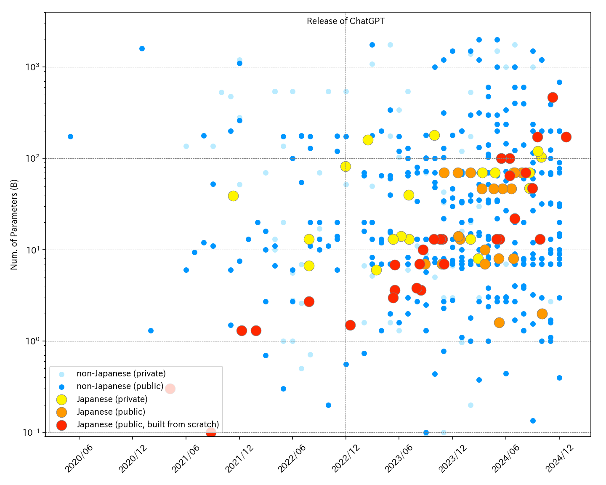

# Aperçu des grands modèles de langage (LLM) en japonais
[ [**English**](../en/) | Français | [**日本語**](../) ]

<div class="github-only">

> **📖 Veuillez consulter la version Web plus lisible**
> 
> Le contenu de ce README est disponible dans un format plus lisible sur **[llm-jp.github.io/awesome-japanese-llm](https://llm-jp.github.io/awesome-japanese-llm)**. Nous recommandons de consulter la version Web pour éviter les problèmes d'affichage des tableaux et de mise en page.

</div>

<p align="center">
  
</p>
<figcaption style="font-style: italic; font-size: 0.9em; color: #6b7280; text-align: center;">Evolution du nombre de paramètres des LLMs en japonais et en non-japonais. Pour des informations sur le modèle japonais, nous nous référons à cet article, et pour le modèle non-japonais, nous nous référons au <a href="https://lifearchitect.ai/models-table/" target="_blank" rel="noreferrer">tableau des modèles</a> sur LifeArchitect.ai (notez cependant que certains modèles ont été omis en raison de l'espace limité sur le graphique. De plus, le nombre de paramètres pour le modèle non-japonais inclut des valeurs estimées). Veuillez nous informer de toute correction ou ajout nécessaire.</figcaption>

::: tip Avis de mise à jour de la figure
La figure ci-dessus est basée sur des données jusqu'à la fin de 2024 et n'a pas été mise à jour depuis 2025. Ceci est dû au fait que le développement récent des LLM s'est déplacé de l'augmentation du nombre de paramètres vers la concurrence par l'amélioration des méthodes d'entraînement et des jeux de données. Veuillez vous référer aux tableaux ci-dessous pour les informations les plus récentes sur les modèles.
:::

<br>

Voici une liste des LLMs disponibles au grand public, axés sur l'apprentissage du japonais, ainsi que leurs critères d'évaluation. Cette liste est maintenue par des bénévoles qui collectent des informations à partir de diverses sources telles que des articles académiques et d'autres ressources publiques.

::: warning Attention
1. Nous ne pouvons garantir l’exactitude ou l’exhaustivité des informations présentées ici.
2. Certaines informations sont basées sur des conjectures et peuvent ne pas refléter votre cas d'utilisation spécifique.
3. Bien que de nombreux modèles soient publiés sous des licences permissives telles que MIT ou Apache 2.0, **certains modèles sont soumis à des conditions plus restrictives, notamment des clauses d'utilisation non commerciale  (exemple CC BY-NC-SA 4.0) ou d'autres modalités légales et contractuelles**
:::


N'hésitez pas à signaler les erreurs sur la page [issues](https://github.com/llm-jp/awesome-japanese-llm/issues). N'hésitez pas également à contribuer directement avec une pull request.

::: details Table des matières
[[toc]]
:::

<a id="generative"></a>
## Modèles IA génératives

*Pour les modèles multimodal, voir [ci-dessous.](#multimodal-text-generation)*

<a id="full-scratch-models"></a>
### Modèles développés à partir de zéro

<a id="generative-scratch-general"></a>
#### D'usage général

|    | Année de sortie |  Architecture  | Longueur Maximale du Contexte | Données d'entraînement  |  Développeur  | Licence / Conditions d'utilisation |
|:---|:---:|:---:|:---:|:---:|:---:|:---:|
| [Sarashina2-8x70B](https://www.sbintuitions.co.jp/news/press/20241108_01/) | 2024 | MoE<br>([8x70b (**465b**)](https://huggingface.co/sbintuitions/sarashina2-8x70b)) | 8,192 | Sparse Upcycling on Sarashina2 (70B) | SB Intuitions | Sarashina Model NonCommercial License |
| [LLM-jp-3 172B](https://www.nii.ac.jp/news/release/2024/1224.html) | 2024 | Llama<br>([**172b**](https://huggingface.co/llm-jp/llm-jp-3-172b), [**172b**-instruct2](https://huggingface.co/llm-jp/llm-jp-3-172b-instruct2), [**172b**-instruct3](https://huggingface.co/llm-jp/llm-jp-3-172b-instruct3)) | 4,096 | Pre-training: [llm-jp-corpus-v3](https://gitlab.llm-jp.nii.ac.jp/datasets/llm-jp-corpus-v3)<br>(**2.1T** tokens)<br>Instruction Tuning: [ichikara-instruction](https://liat-aip.sakura.ne.jp/wp/llm%E3%81%AE%E3%81%9F%E3%82%81%E3%81%AE%E6%97%A5%E6%9C%AC%E8%AA%9E%E3%82%A4%E3%83%B3%E3%82%B9%E3%83%88%E3%83%A9%E3%82%AF%E3%82%B7%E3%83%A7%E3%83%B3%E3%83%87%E3%83%BC%E3%82%BF%E4%BD%9C%E6%88%90/), [AnswerCarefully Dataset](https://llmc.nii.ac.jp/answercarefully-dataset/), [magpie-sft-v1.0](https://huggingface.co/datasets/llm-jp/magpie-sft-v1.0), Daring-Anteater, FLAN, ichikara-instruction-format, AutoMultiTurnByCalm3-22B, ramdom-to-fixed-multiturn-Calm3, wizardlm8x22b-logical-math-coding-sft-ja, wizardlm8x22b-logical-math-coding-sft_additional-ja, Synthetic-JP-EN-Coding-Dataset-567k<br>DPO (instruct3 only): [aya-ja-evol-inst](https://huggingface.co/datasets/llm-jp/aya-ja-evol-inst), [ac-self-inst](https://huggingface.co/datasets/llm-jp/ac-self-inst) |  Research and Development Center for Large Language Models | Pre-trained model: LLM-jp-3 172B Terms of Use<br>Post-trained model: llm-jp-3-172b-instruct3 Terms of Use |
| [LLM-jp-3 172B beta2](https://llmc.nii.ac.jp/en/topics/llm-jp-3-172b-beta2/) | 2024 | Llama<br>([**172b**-beta2](https://huggingface.co/llm-jp/llm-jp-3-172b-beta2), [**172b**-beta2-instruct2](https://huggingface.co/llm-jp/llm-jp-3-172b-beta2-instruct2)) | 4,096 | Pre-training: part of [llm-jp-corpus-v3](https://gitlab.llm-jp.nii.ac.jp/datasets/llm-jp-corpus-v3)<br>(**1.4T** tokens)<br>Instruction Tuning: [ichikara-instruction](https://liat-aip.sakura.ne.jp/wp/llm%E3%81%AE%E3%81%9F%E3%82%81%E3%81%AE%E6%97%A5%E6%9C%AC%E8%AA%9E%E3%82%A4%E3%83%B3%E3%82%B9%E3%83%88%E3%83%A9%E3%82%AF%E3%82%B7%E3%83%A7%E3%83%B3%E3%83%87%E3%83%BC%E3%82%BF%E4%BD%9C%E6%88%90/), [AnswerCarefully Dataset](https://llmc.nii.ac.jp/en/answercarefully-dataset/), [magpie-sft-v1.0](https://huggingface.co/datasets/llm-jp/magpie-sft-v1.0), Daring-Anteater, FLAN, ichikara-instruction-format, AutoMultiTurnByCalm3-22B, ramdom-to-fixed-multiturn-Calm3, wizardlm8x22b-logical-math-coding-sft-ja, wizardlm8x22b-logical-math-coding-sft_additional-ja, Synthetic-JP-EN-Coding-Dataset-567k | Research and Development Center for Large Language Models | LLM-jp-3 172B beta2 Terms of Use |
| [LLM-jp-3 172B beta1](https://www.nii.ac.jp/en/news/release/2024/0917.html) | 2024 | Llama<br>([**172b**-beta1](https://huggingface.co/llm-jp/llm-jp-3-172b-beta1), [**172b**-beta1-instruct](https://huggingface.co/llm-jp/llm-jp-3-172b-beta1-instruct)) | 4,096 | Pre-training: part of [llm-jp-corpus-v3](https://gitlab.llm-jp.nii.ac.jp/datasets/llm-jp-corpus-v3)<br>(**0.7T** tokens)<br>Instruction Tuning: [ichikara-instruction](https://liat-aip.sakura.ne.jp/wp/llm%E3%81%AE%E3%81%9F%E3%82%81%E3%81%AE%E6%97%A5%E6%9C%AC%E8%AA%9E%E3%82%A4%E3%83%B3%E3%82%B9%E3%83%88%E3%83%A9%E3%82%AF%E3%82%B7%E3%83%A7%E3%83%B3%E3%83%87%E3%83%BC%E3%82%BF%E4%BD%9C%E6%88%90/), [AnswerCarefully Dataset](https://llmc.nii.ac.jp/en/answercarefully-dataset/), Dolly Dataset, OASST1, OASST2, Aya Dataset, 	ichikara-instruction-format, Daring-Anteater, FLAN | Research and Development Center for Large Language Models | LLM-jp-3 172B beta1 Terms of Use |
| [LLM-jp-3 172B alpha](https://llmc.nii.ac.jp/en/topics/llm-jp-3-172b-alpha1-alpha2/) | 2024 | Llama<br>([**172b**-alpha1](https://huggingface.co/llm-jp/llm-jp-3-172b-alpha1), [**172b**-alpha1-instruct](https://huggingface.co/llm-jp/llm-jp-3-172b-alpha1-instruct), [**172b**-alpha2](https://huggingface.co/llm-jp/llm-jp-3-172b-alpha2), [**172b**-alpha2-instruct](https://huggingface.co/llm-jp/llm-jp-3-172b-alpha2-instruct)) | 4,096 | Pre-training: part of [llm-jp-corpus-v3](https://gitlab.llm-jp.nii.ac.jp/datasets/llm-jp-corpus-v3)<br>(alpha1: **0.7T** tokens, alpha2: **1.4T** tokens)<br>Instruction Tuning: [ichikara-instruction](https://liat-aip.sakura.ne.jp/wp/llm%E3%81%AE%E3%81%9F%E3%82%81%E3%81%AE%E6%97%A5%E6%9C%AC%E8%AA%9E%E3%82%A4%E3%83%B3%E3%82%B9%E3%83%88%E3%83%A9%E3%82%AF%E3%82%B7%E3%83%A7%E3%83%B3%E3%83%87%E3%83%BC%E3%82%BF%E4%BD%9C%E6%88%90/), [AnswerCarefully Dataset](https://llmc.nii.ac.jp/en/answercarefully-dataset/), Dolly Dataset, OASST1, OASST2, Aya Dataset, 	ichikara-instruction-format, Daring-Anteater, FLAN | Research and Development Center for Large Language Models | Apache 2.0 |
| [Stockmark-2-100B-Instruct-beta](https://stockmark.co.jp/news/20250318) | **2025** | Llama<br>([**100B**-Instruct-beta](https://huggingface.co/stockmark/Stockmark-2-100B-Instruct-beta), [**100B**-Instruct-beta-AWQ](https://huggingface.co/stockmark/Stockmark-2-100B-Instruct-beta-AWQ)) | 4,096 | Pre-training: **1.5T** tokens<br>Instruction Tuning<br>DPO | Stockmark | MIT |
| [Stockmark-100b](https://huggingface.co/stockmark/stockmark-100b) | 2024 | Llama<br>([**100b**](https://huggingface.co/stockmark/stockmark-100b), [**100b**-instruct-v0.1](https://huggingface.co/stockmark/stockmark-100b-instruct-v0.1)) | 4,096 | Pre-training: RedPajama, Wikipedia en japonais, Japanese mC4, Japanese CommonCrawl, Japanese Patent, Stockmark Web Corpus<br>(**910B** tokens)<br>Instruction Tuning (LoRA): [ichikara-instruction](https://liat-aip.sakura.ne.jp/wp/llm%E3%81%AE%E3%81%9F%E3%82%81%E3%81%AE%E6%97%A5%E6%9C%AC%E8%AA%9E%E3%82%A4%E3%83%B3%E3%82%B9%E3%83%88%E3%83%A9%E3%82%AF%E3%82%B7%E3%83%A7%E3%83%B3%E3%83%87%E3%83%BC%E3%82%BF%E4%BD%9C%E6%88%90/) | Stockmark | MIT |
| [PLaMo-100B-Pretrained](https://www.preferred.jp/ja/news/pr20241015/) | 2024 | Llama[^22]<br>([**100b**](https://huggingface.co/pfnet/plamo-100b)) | 4,096 | Pre-training: Japanese CommonCrawl, RefinedWeb, undisclosed<br>(**2.0T** tokens) | Preferred Elements (Preferred Networks) | PLaMo Non-Commercial License |
| [LLM-jp-3.1](https://llm-jp.nii.ac.jp/ja/blog/blog-887/) | **2025** | Llama/MoE<br>([**8x13b**-instruct4](https://huggingface.co/llm-jp/llm-jp-3.1-8x13b-instruct4), [**13b**-instruct4](https://huggingface.co/llm-jp/llm-jp-3.1-13b-instruct4), [**1.8b**-instruct4](https://huggingface.co/llm-jp/llm-jp-3.1-1.8b-instruct4)) | 4,096 | Pré-entraînement: [llm-jp-corpus-v3](https://gitlab.llm-jp.nii.ac.jp/datasets/llm-jp-corpus-v3)<br>(**2.5T** jetons)<br>Pré-entraînement continu: paires instruction-réponse<br>(**90B** jetons)<br>SFT + DPO | Research and Development Center for Large Language Models | Apache 2.0 |
| [LLM-jp-3 MoE](https://llm-jp.nii.ac.jp/ja/blog/blog-603/) | **2025** | MoE<br>([8x1.8b (**9.3b**)](https://huggingface.co/llm-jp/llm-jp-3-8x1.8b), [8x1.8b (**9.3b**)-instruct2](https://huggingface.co/llm-jp/llm-jp-3-8x1.8b-instruct2), [8x1.8b (**9.3b**)-instruct3](https://huggingface.co/llm-jp/llm-jp-3-8x1.8b-instruct3), [8x13b (**73b**)](https://huggingface.co/llm-jp/llm-jp-3-8x13b), [8x13b (**73b**)-instruct2](https://huggingface.co/llm-jp/llm-jp-3-8x13b-instruct2), [8x13b (**73b**)-instruct3](https://huggingface.co/llm-jp/llm-jp-3-8x13b-instruct3)) | 4,096 | Drop-Upcycling on LLM-jp-3 (1.8b, 13b) | Research and Development Center for Large Language Models | Apache 2.0 |
| [Sarashina2](https://www.sbintuitions.co.jp/news/press/20240614_01/) | 2024 | Llama<br>([**7b**](https://huggingface.co/sbintuitions/sarashina2-7b), [**13b**](https://huggingface.co/sbintuitions/sarashina2-13b), [**70b**](https://huggingface.co/sbintuitions/sarashina2-70b)) | 7b, 13b: 4,096<br>70b: 8,192 | Pre-training: Japanese Common Crawl, SlimPajama, StarCoder<br>(**2.1T** tokens) | SB Intuitions | MIT |
| [Sarashina1](https://www.sbintuitions.co.jp/news/press/20240614_01/) | 2024 | GPT-NeoX<br>([**7b**](https://huggingface.co/sbintuitions/sarashina1-7b), [**13b**](https://huggingface.co/sbintuitions/sarashina1-13b), [**65b**](https://huggingface.co/sbintuitions/sarashina1-65b)) | 2,048 | Pre-training: Japanese Common Crawl<br>(**1T** tokens) | SB Intuitions | MIT |
| [Tanuki-8×8B](https://weblab.t.u-tokyo.ac.jp/2024-08-30/) | 2024 | MoE (**47b**)<br>([v1.0](https://huggingface.co/weblab-GENIAC/Tanuki-8x8B-dpo-v1.0), [v1.0-AWQ](https://huggingface.co/team-hatakeyama-phase2/Tanuki-8x8B-dpo-v1.0-AWQ), [v1.0-GPTQ-4bit](https://huggingface.co/team-hatakeyama-phase2/Tanuki-8x8B-dpo-v1.0-GPTQ-4bit), [v1.0-GPTQ-8bit](https://huggingface.co/team-hatakeyama-phase2/Tanuki-8x8B-dpo-v1.0-GPTQ-8bit), [v1.0-GGUF](https://huggingface.co/team-hatakeyama-phase2/Tanuki-8x8B-dpo-v1.0-GGUF)) | 4,096 | Pre-training: various Web & synthetic datasets（**1.7T** tokens）<br>SFT, DPO: various synthetic datasets [^19] | Matsuo Lab LLM Development Project | Apache 2.0 |
| [CyberAgentLM3 (CALM3)](https://huggingface.co/cyberagent/calm3-22b-chat) | 2024 | Llama<br>([**22b**-chat](https://huggingface.co/cyberagent/calm3-22b-chat), [**22b**-chat-selfimprove-experimental](https://huggingface.co/cyberagent/calm3-22b-chat-selfimprove-experimental)) | **16,384** | undisclosed<br>(**2.0T** tokens) | CyberAgent | Apache 2.0 |
| [LLM-jp-3 13B instruct3](https://llm-jp.nii.ac.jp/blog/2025/02/05/instruct3.html) | **2025** | Llama<br>([150m](https://huggingface.co/llm-jp/llm-jp-3-150m), [150m-instruct2](https://huggingface.co/llm-jp/llm-jp-3-150m-instruct2), [150m-instruct3](https://huggingface.co/llm-jp/llm-jp-3-150m-instruct3), [440m](https://huggingface.co/llm-jp/llm-jp-3-440m), [440m-instruct2](https://huggingface.co/llm-jp/llm-jp-3-440m-instruct2), [440m-instruct3](https://huggingface.co/llm-jp/llm-jp-3-440m-instruct3), [980m](https://huggingface.co/llm-jp/llm-jp-3-980m), [980m-instruct2](https://huggingface.co/llm-jp/llm-jp-3-980m-instruct2), [980m-instruct3](https://huggingface.co/llm-jp/llm-jp-3-980m-instruct3), [**1.8b**-instrcut2](https://huggingface.co/llm-jp/llm-jp-3-1.8b-instruct2), [**1.8b**-instruct3](https://huggingface.co/llm-jp/llm-jp-3-1.8b-instruct3), [**3.7b**-instruct2](https://huggingface.co/llm-jp/llm-jp-3-3.7b-instruct2), [**3.7b**-instruct3](https://huggingface.co/llm-jp/llm-jp-3-3.7b-instruct3), [**7.2b**-instruct2](https://huggingface.co/llm-jp/llm-jp-3-7.2b-instruct2), [**7.2b**-instruct3](https://huggingface.co/llm-jp/llm-jp-3-7.2b-instruct3), [**13b**-instruct2](https://huggingface.co/llm-jp/llm-jp-3-13b-instruct2), [**13b**-instruct3](https://huggingface.co/llm-jp/llm-jp-3-13b-instruct3)) | 4,096 | Pre-training: [llm-jp-corpus-v3](https://gitlab.llm-jp.nii.ac.jp/datasets/llm-jp-corpus-v3)<br>(**2.1T** tokens)<br>Instruction Tuning: [ichikara-instruction](https://liat-aip.sakura.ne.jp/wp/llm%E3%81%AE%E3%81%9F%E3%82%81%E3%81%AE%E6%97%A5%E6%9C%AC%E8%AA%9E%E3%82%A4%E3%83%B3%E3%82%B9%E3%83%88%E3%83%A9%E3%82%AF%E3%82%B7%E3%83%A7%E3%83%B3%E3%83%87%E3%83%BC%E3%82%BF%E4%BD%9C%E6%88%90/), [AnswerCarefully Dataset](https://llmc.nii.ac.jp/answercarefully-dataset/), [magpie-sft-v1.0](https://huggingface.co/datasets/llm-jp/magpie-sft-v1.0), Daring-Anteater, FLAN, ichikara-instruction-format, AutoMultiTurnByCalm3-22B, ramdom-to-fixed-multiturn-Calm3, wizardlm8x22b-logical-math-coding-sft-ja, Synthetic-JP-EN-Coding-Dataset-567k<br>DPO (instruct3 only): [aya-ja-evol-inst](https://huggingface.co/datasets/llm-jp/aya-ja-evol-inst), [ac-self-inst](https://huggingface.co/datasets/llm-jp/ac-self-inst) | Research and Development Center for Large Language Models | Apache 2.0 |
| [LLM-jp-3 13B](https://llmc.nii.ac.jp/topics/post-707/) | 2024 | Llama<br>([**1.8b**](https://huggingface.co/llm-jp/llm-jp-3-1.8b), [**1.8b**-instruct](https://huggingface.co/llm-jp/llm-jp-3-1.8b-instruct), [**3.7b**](https://huggingface.co/llm-jp/llm-jp-3-3.7b), [**3.7b**-instruct](https://huggingface.co/llm-jp/llm-jp-3-3.7b-instruct), [**7.2b**](https://huggingface.co/llm-jp/llm-jp-3-7.2b), [**7.2b**-instruct](https://huggingface.co/llm-jp/llm-jp-3-7.2b-instruct), [**13b**](https://huggingface.co/llm-jp/llm-jp-3-13b), [**13b**-instruct](https://huggingface.co/llm-jp/llm-jp-3-13b-instruct)) | 4,096 | Pre-training: [llm-jp-corpus-v3](https://gitlab.llm-jp.nii.ac.jp/datasets/llm-jp-corpus-v3)<br>(**2.1T** tokens)<br>Instruction Tuning: [ichikara-instruction](https://liat-aip.sakura.ne.jp/wp/llm%E3%81%AE%E3%81%9F%E3%82%81%E3%81%AE%E6%97%A5%E6%9C%AC%E8%AA%9E%E3%82%A4%E3%83%B3%E3%82%B9%E3%83%88%E3%83%A9%E3%82%AF%E3%82%B7%E3%83%A7%E3%83%B3%E3%83%87%E3%83%BC%E3%82%BF%E4%BD%9C%E6%88%90/), [AnswerCarefully Dataset](https://llmc.nii.ac.jp/en/answercarefully-dataset/), FLAN, 	ichikara-instruction-format, AutoMultiTurnByCalm3-22B, ramdom-to-fixed-multiturn-Calm3, wizardlm8x22b-logical-math-coding-sft_additional-ja, Synthetic-JP-EN-Coding-Dataset-567k | Research and Development Center for Large Language Models | Apache 2.0 |
| [llm-jp-3-3.7b-instruct-EZO](https://huggingface.co/AXCXEPT/llm-jp-3-3.7b-instruct-EZO-Common) | 2024 | Llama<br>([**3.7b**-instruct-EZO-Common](https://huggingface.co/AXCXEPT/llm-jp-3-3.7b-instruct-EZO-Common), [**3.7b**-instruct-EZO-Humanities](https://huggingface.co/AXCXEPT/llm-jp-3-3.7b-instruct-EZO-Humanities)) | 4,096 | additionally trained on LLM-jp-3 (3.7B) | Axcxept | Apache 2.0 |
| [LLM-jp-13B v2.0](https://huggingface.co/llm-jp/llm-jp-13b-v2.0) | 2024 | Llama<br>([**13b**-v2.0](https://huggingface.co/llm-jp/llm-jp-13b-v2.0), [**13b**-instruct-full-dolly-ichikara_004_001_single-oasst-oasst2-v2.0](https://huggingface.co/llm-jp/llm-jp-13b-instruct-full-dolly-ichikara_004_001_single-oasst-oasst2-v2.0), [**13b**-instruct-full-ac_001-dolly-ichikara_004_001_single-oasst-oasst2-v2.0](https://huggingface.co/llm-jp/llm-jp-13b-instruct-full-ac_001-dolly-ichikara_004_001_single-oasst-oasst2-v2.0), [**13b**-instruct-full-ac_001_16x-dolly-ichikara_004_001_single-oasst-oasst2-v2.0](https://huggingface.co/llm-jp/llm-jp-13b-instruct-full-ac_001_16x-dolly-ichikara_004_001_single-oasst-oasst2-v2.0)) | 4,096 | Pre-training: [llm-jp-corpus-v2](https://gitlab.llm-jp.nii.ac.jp/datasets/llm-jp-corpus-v2)<br>(**260B** tokens)<br>Instruction Tuning: [ichikara-instruction](https://liat-aip.sakura.ne.jp/wp/llm%E3%81%AE%E3%81%9F%E3%82%81%E3%81%AE%E6%97%A5%E6%9C%AC%E8%AA%9E%E3%82%A4%E3%83%B3%E3%82%B9%E3%83%88%E3%83%A9%E3%82%AF%E3%82%B7%E3%83%A7%E3%83%B3%E3%83%87%E3%83%BC%E3%82%BF%E4%BD%9C%E6%88%90/), [AnswerCarefully Dataset](https://llmc.nii.ac.jp/en/answercarefully-dataset/), Dolly Dataset, OASST1, OASST2 | LLM-jp | Apache 2.0 |
| [Fugaku-LLM](https://www.fujitsu.com/global/about/resources/news/press-releases/2024/0510-01.html) | 2024 | GPT<br>([**13B**](https://huggingface.co/Fugaku-LLM/Fugaku-LLM-13B), [**13B**-instruct](https://huggingface.co/Fugaku-LLM/Fugaku-LLM-13B-instruct), [**13B**-instruct-gguf](https://huggingface.co/Fugaku-LLM/Fugaku-LLM-13B-instruct-gguf)) | 2,048 | Pre-training: undisclosed dataset<br>Instruction Tuning: OASST1, Dolly Dataset, GSM8K | Titech, Tohoku Univ., Fujitsu, RIKEN, Nagoya Univ., CyberAgent, Kotoba Technologies | Fugaku-LLM Terms of Use |
| [LLM-jp-13B v1.1](https://llm-jp.nii.ac.jp/blog/2024/02/09/v1.1-tuning.html) | 2024 | GPT<br>([**13b**-instruct-lora-dolly_en-dolly_ja-ichikara_003_001-oasst_en-oasst_ja-v1.1](https://huggingface.co/llm-jp/llm-jp-13b-instruct-lora-dolly_en-dolly_ja-ichikara_003_001-oasst_en-oasst_ja-v1.1), [**13b**-instruct-full-dolly_en-dolly_ja-ichikara_003_001-oasst_en-oasst_ja-v1.1](https://huggingface.co/llm-jp/llm-jp-13b-instruct-full-dolly_en-dolly_ja-ichikara_003_001-oasst_en-oasst_ja-v1.1), [**13b**-dpo-lora-hh_rlhf_ja-v1.1](https://huggingface.co/llm-jp/llm-jp-13b-dpo-lora-hh_rlhf_ja-v1.1)) | 2,048 | Instruction Tuning (LoRA or Full-parameter FT): Dolly Dataset, OASST1, [ichikara-instruction](https://liat-aip.sakura.ne.jp/wp/llm%E3%81%AE%E3%81%9F%E3%82%81%E3%81%AE%E6%97%A5%E6%9C%AC%E8%AA%9E%E3%82%A4%E3%83%B3%E3%82%B9%E3%83%88%E3%83%A9%E3%82%AF%E3%82%B7%E3%83%A7%E3%83%B3%E3%83%87%E3%83%BC%E3%82%BF%E4%BD%9C%E6%88%90/)<br>DPO (LoRA): HH RLHF | LLM-jp | Apache 2.0 |
| [LLM-jp-13B](https://www.nii.ac.jp/en/news/release/2023/1020.html) | 2023 | GPT<br>([1.3b-v1.0](https://huggingface.co/llm-jp/llm-jp-1.3b-v1.0), [**13b**-v1.0](https://huggingface.co/llm-jp/llm-jp-13b-v1.0), [**13b**-instruct-full-jaster-v1.0](https://huggingface.co/llm-jp/llm-jp-13b-instruct-full-jaster-v1.0), [**13b**-instruct-full-jaster-dolly-oasst-v1.0](https://huggingface.co/llm-jp/llm-jp-13b-instruct-full-jaster-dolly-oasst-v1.0), [**13b**-instruct-full-dolly-oasst-v1.0](https://huggingface.co/llm-jp/llm-jp-13b-instruct-full-dolly-oasst-v1.0), [**13b**-instruct-lora-jaster-v1.0](https://huggingface.co/llm-jp/llm-jp-13b-instruct-lora-jaster-v1.0), [**13b**-instruct-lora-jaster-dolly-oasst-v1.0](https://huggingface.co/llm-jp/llm-jp-13b-instruct-lora-jaster-dolly-oasst-v1.0), [**13b**-instruct-lora-dolly-oasst-v1.0](https://huggingface.co/llm-jp/llm-jp-13b-instruct-lora-dolly-oasst-v1.0)) | 2,048 | Pré-entraînement: [llm-jp-corpus](https://github.com/llm-jp/llm-jp-corpus) (Wikipedia, Japanese mC4, The Pile, Stack) (**300B** tokens)<br>Instruction Tuning (Full-parameter FT or LoRA): jaster, Dolly Dataset, OASST1 | LLM-jp | Apache 2.0 |
| [PLaMo-13B](https://www.preferred.jp/en/news/pr20230928/) | 2023 | Llama[^1]<br>([**13b**](https://huggingface.co/pfnet/plamo-13b), [**13b**-instruct](https://huggingface.co/pfnet/plamo-13b-instruct), [**13b**-instruct-nc](https://huggingface.co/pfnet/plamo-13b-instruct-nc)) |base: 4,096<br>instruct, instruct-nc: 8,192 | Pré-entraînement: C4, Project Gutenberg, RedPajama, Japanese Wikipedia, Japanese mC4<br>(**1.5T** tokens)<br>Instruction Tuning: Dolly, HH RLHF, OASST1, wikinews (+Alpaca in NC model)  | Preferred Networks | Apache 2.0<br>(CC BY-NC 4.0 as for NC model) |
| [Stockmark-13b](https://stockmark.co.jp/news/20231027) | 2023 | Llama<br>([**13b**](https://huggingface.co/stockmark/stockmark-13b), [**13b**-instruct](https://huggingface.co/stockmark/stockmark-13b-instruct)) | 2,048 | Wikipedia en japonais, Japanese CC-100, Japanese mC4, Japanese CommonCrawl, Japanese Patent, Stockmark Web Corpus<br>(**220B** tokens)<br>Instruction Tuning (LoRA): [ichikara-instruction](https://liat-aip.sakura.ne.jp/wp/llm%E3%81%AE%E3%81%9F%E3%82%81%E3%81%AE%E6%97%A5%E6%9C%AC%E8%AA%9E%E3%82%A4%E3%83%B3%E3%82%B9%E3%83%88%E3%83%A9%E3%82%AF%E3%82%B7%E3%83%A7%E3%83%B3%E3%83%87%E3%83%BC%E3%82%BF%E4%BD%9C%E6%88%90/) | Stockmark | base: MIT<br>instruct: CC BY-NC-SA 4.0 |
| [Weblab-10B](https://www.t.u-tokyo.ac.jp/press/pr2023-08-18-001) | 2023 | GPT-NeoX <br> ([**10b**](https://huggingface.co/matsuo-lab/weblab-10b), [**10b**-instruction-sft](https://huggingface.co/matsuo-lab/weblab-10b-instruction-sft)) | 2,048 | Japanese mC4, The Pile <br> (**600B** tokens) <br>Instruction Tuning: Alpaca, FLAN | Université de Tokyo Matsuo Lab | CC BY&#x2011;NC 4.0 |
| [PLaMo 2.1 8B](https://tech.preferred.jp/ja/blog/plamo-2-1-8b/) | **2025** | hybrid architecture like Samba<br>([**8b**-cpt](https://huggingface.co/pfnet/plamo-2.1-8b-cpt)) | **32,768** | Détails d'entraînement non divulgués | Preferred Networks | PLaMo community license |
| [PLaMo 2 8B](https://tech.preferred.jp/ja/blog/plamo-2-8b/) | **2025** | hybrid architecture like Samba<br>([**8b**](https://huggingface.co/pfnet/plamo-2-8b)) | | mainly Japanese and English data<br>(**6T** tokens) | Preferred Networks | PLaMo community license |
| [Tanuki-8B](https://weblab.t.u-tokyo.ac.jp/2024-08-30/) | 2024 | Tanuki (**8b**)<br>([v1.0](https://huggingface.co/weblab-GENIAC/Tanuki-8B-dpo-v1.0), [v1.0-AWQ](https://huggingface.co/team-hatakeyama-phase2/Tanuki-8B-dpo-v1.0-AWQ), [v1.0-GPTQ-4bit](https://huggingface.co/team-hatakeyama-phase2/Tanuki-8B-dpo-v1.0-GPTQ-4bit), [v1.0-GPTQ-8bit](https://huggingface.co/team-hatakeyama-phase2/Tanuki-8B-dpo-v1.0-GPTQ-8bit), [v1.0-GGUF](https://huggingface.co/team-hatakeyama-phase2/Tanuki-8B-dpo-v1.0-GGUF)) | 4,096 | Pre-training: various Web & synthetic datasets（**1.3T** tokens）<br>SFT, DPO: various synthetic datasets [^19] | Matsuo Lab LLM Development Project | Apache 2.0 |
| [Japanese StableLM Alpha](https://stability.ai/blog/stability-ai-new-jplm-japanese-language-model-stablelm) | 2023 | GPT-NeoX <br> ([base-alpha-**7b**](https://huggingface.co/stabilityai/japanese-stablelm-base-alpha-7b), [instruct-alpha-**7b**](https://huggingface.co/stabilityai/japanese-stablelm-instruct-alpha-7b), [instruct-alpha-**7b**-v2](https://huggingface.co/stabilityai/japanese-stablelm-instruct-alpha-7b-v2)) | 2,048 | Wikipédia, Japanese CC&#x2011;100, Japanese mC4, Japanese OSCAR, RedPajama, ensembles de données privés[^2]<br>(**750B** tokens)<br>Instruction Tuning: Dolly, HH&#x2011;RLHF, wikinews,  Alpaca (discarded in v2) | Stability AI | base: Apache 2.0<br>instruct (v1): [Research license](https://huggingface.co/stabilityai/japanese-stablelm-instruct-alpha-7b/tree/main)<br>instruct (v2): Apache 2.0 |
| [CyberAgentLM2 (CALM2)](https://www.cyberagent.co.jp/news/detail/id=29479) | 2023 | Llama<br>([**7b**](https://huggingface.co/cyberagent/calm2-7b), [**7b**-chat](https://huggingface.co/cyberagent/calm2-7b-chat), [**7b**-chat-dpo-experimental](https://huggingface.co/cyberagent/calm2-7b-chat-dpo-experimental)) | base: 4,096<br>chat: **32,768** | Ensembles de données japonais et anglais accessibles au public (détails inconnus)<br>(**1.3T** tokens)<br>DPO: Chatbot Arena Conversations JA (calm2) Dataset  | CyberAgent | Apache 2.0<br>(CC BY 4.0 as for DPO model) |
| [OpenCALM](https://www.cyberagent.co.jp/news/detail/id=28817) | 2023 | GPT-NeoX <br> ([small](https://huggingface.co/cyberagent/open-calm-small), [medium](https://huggingface.co/cyberagent/open-calm-medium), [large](https://huggingface.co/cyberagent/open-calm-large), [**1b(1.4b)**](https://huggingface.co/cyberagent/open-calm-1b), [**3b(2.7b)**](https://huggingface.co/cyberagent/open-calm-3b), [**7b(6.8b)**](https://huggingface.co/cyberagent/open-calm-7b)) | 2,048 | Wikipedia en japonais, Japanese mC4, Japanese CC&#x2011;100 | CyberAgent | CC BY&#x2011;SA 4.0 |
| [Stormy](https://jxiv.jst.go.jp/index.php/jxiv/preprint/view/422/1350) | 2023 | GPT-NeoX <br>([**7b(6.8b)**](https://huggingface.co/izumi-lab/stormy-7b-10ep)) | 2,048 | OpenCALM fine-tuned sur <br>llm-japanese-dataset v0 sans âches de traduction | Université de Tokyo Izumi Lab | CC BY&#x2011;SA 4.0 |
| [rinna GPT <br> (En-Ja Bilingual)](https://rinna.co.jp/news/2023/07/20230731.html) | 2023 | GPT-NeoX <br>([**4b(3.8b)**](https://huggingface.co/rinna/bilingual-gpt-neox-4b), [**4b(3.8b)**-8k](https://huggingface.co/rinna/bilingual-gpt-neox-4b-8k), [**4b(3.8b)**-instruction-sft](https://huggingface.co/rinna/bilingual-gpt-neox-4b-instruction-sft), [**4b(3.8b)**-instruction-ppo](https://huggingface.co/rinna/bilingual-gpt-neox-4b-instruction-ppo)) | 8k model: 8,192<br>others: 2,048 |  Wikipedia, Japanese CC&#x2011;100, Japanese C4, RedPajama, The Pile<br>(**524B** tokens)<br>Instruction Tuning: HH&#x2011;RLHF, FLAN<br>PPO: HH&#x2011;RLHF par apprentissage par renforcement  <br>8k: entrainé sur du long texte | rinna | MIT |
| [japanese-large-lm](https://engineering.linecorp.com/ja/blog/3.6b-japanese-language-model-with-improved-dialog-performance-by-instruction-tuning) | 2023 | GPT-NeoX <br>([**1.7b**](https://huggingface.co/line-corporation/japanese-large-lm-1.7b), [**3.6b**](https://huggingface.co/line-corporation/japanese-large-lm-3.6b), [**1.7b**-instruction-sft](https://huggingface.co/line-corporation/japanese-large-lm-1.7b-instruction-sft), [**3.6b**-instruction-sft](https://huggingface.co/line-corporation/japanese-large-lm-3.6b-instruction-sft)) | 2,048 | Wikipedia en japonais, Japanese CC&#x2011;100, Japanese C4, Japanese OSCAR et ensembles de données privés<br>(**650GB**)<br>Instruction Tuning: OASST1 | LINE | Apache 2.0 |
| [rinna GPT <br> (Japanese only)](https://rinna.co.jp/news/2023/05/20220531.html) | 2023 | GPT / GPT-NeoX <br>([xsmall](https://huggingface.co/rinna/japanese-gpt2-xsmall), [small](https://huggingface.co/rinna/japanese-gpt2-small), [medium](https://huggingface.co/rinna/japanese-gpt2-medium), [**1b**](https://huggingface.co/rinna/japanese-gpt-1b), [neox-small](https://huggingface.co/rinna/japanese-gpt-neox-small), [neox-**3.6b**](https://huggingface.co/rinna/japanese-gpt-neox-3.6b), [neox-**3.6b**-instruction-sft](https://huggingface.co/rinna/japanese-gpt-neox-3.6b-instruction-sft), [neox-**3.6b**-instruction-sft-v2](https://huggingface.co/rinna/japanese-gpt-neox-3.6b-instruction-sft-v2), [neox-**3.6b**-instruction-ppo](https://huggingface.co/rinna/japanese-gpt-neox-3.6b-instruction-ppo)) | ≤ 2,048 | Wikipédia en japonais, Japanese CC&#x2011;100 <br> (1b et plus modèles à ajouter <br>Japanese mC4)<br>Instruction Tuning: HH&#x2011;RLHF, FLAN, SHP <br>PPO: HH&#x2011;RLHF par apprentissage par renforcement | rinna | MIT |
| [Sarashina2.2](https://www.sbintuitions.co.jp/blog/entry/2025/03/07/093143) | **2025** | Llama<br>([0.5b](https://huggingface.co/sbintuitions/sarashina2.2-0.5b), [0.5b-instruct-v0.1](https://huggingface.co/sbintuitions/sarashina2.2-0.5b-instruct-v0.1), [**1b**](https://huggingface.co/sbintuitions/sarashina2.2-1b), [**1b**-instruct-v0.1](https://huggingface.co/sbintuitions/sarashina2.2-1b-instruct-v0.1), [**3b**](https://huggingface.co/sbintuitions/sarashina2.2-3b), [**3b**-instruct-v0.1](https://huggingface.co/sbintuitions/sarashina2.2-3b-instruct-v0.1)) | 8,192 || SB Intuitions | MIT |
| [RetrievaT5](https://note.com/retrieva/n/n7b4186dc5ada) | 2023 | T5 <br>([small (short)](https://huggingface.co/retrieva-jp/t5-small-short), [small (medium)](https://huggingface.co/retrieva-jp/t5-small-medium), [small (long)](https://huggingface.co/retrieva-jp/t5-small-long), [base (short)](https://huggingface.co/retrieva-jp/t5-base-short), [base (medium)](https://huggingface.co/retrieva-jp/t5-base-medium), [base (long)](https://huggingface.co/retrieva-jp/t5-base-long), [large (short)](https://huggingface.co/retrieva-jp/t5-large-short), [large (medium)](https://huggingface.co/retrieva-jp/t5-large-medium), [large (long)](https://huggingface.co/retrieva-jp/t5-large-long), [**xl(3b)**](https://huggingface.co/retrieva-jp/t5-xl)) |  | Wikipédia en japonais, Japanese mC4 | Retrieva | CC BY&#x2011;SA 4.0 |
| [Spiral-RetNet-3b-base](https://prtimes.jp/main/html/rd/p/000000014.000120221.html) | 2024 | RetNet<br>([**3b**](https://huggingface.co/Spiral-AI/Spiral-RetNet-3b-base)) | 2,048 |  Wikipedia, Japanese CC-100, CulturaX | Spiral.AI | MIT |
| [kotomamba-2.8B](https://huggingface.co/kotoba-tech/kotomamba-2.8B-v1.0) | 2024 | Mamba<br>([**2.8B**-v1.0](https://huggingface.co/kotoba-tech/kotomamba-2.8B-v1.0)) | 2,048 | Wikipedia en japonais, Swallow Corpus, SlimPajama | Kotoba Technologies | Apache 2.0 |
| [ABEJA GPT](https://tech-blog.abeja.asia/entry/abeja-gpt-project-202207) | 2022 | GPT / GPT-NeoX <br>([large](https://huggingface.co/abeja/gpt2-large-japanese), [neox-**2.7b**](https://huggingface.co/abeja/gpt-neox-japanese-2.7b)) |  | Japanese Wikipedia, Japanese CC&#x2011;100, Japanese OSCAR | ABEJA | MIT |
| [PLaMo 2.1 2B](https://tech.preferred.jp/ja/blog/plamo-2-1-8b/) | **2025** | Causal decoder-only transformer<br>([**2b**-cpt](https://huggingface.co/pfnet/plamo-2.1-2b-cpt)) | **32,768** | Détails d'entraînement non divulgués | Preferred Networks | PLaMo community license |
| [Rakuten AI 2.0 mini](https://corp.rakuten.co.jp/news/press/2025/0212_02.html) | **2025** | Mistral<br>([mini(**1.5b**)](https://huggingface.co/Rakuten/RakutenAI-2.0-mini), [mini(**1.5b**)-instruct](https://huggingface.co/Rakuten/RakutenAI-2.0-mini-instruct)) | **131,072** ||Rakuten|Apache 2.0|
| [WasedaGPT](https://huggingface.co/nlp-waseda/gpt2-xl-japanese) | 2022 | GPT <br> ([small](https://huggingface.co/nlp-waseda/gpt2-small-japanese), [**xl(1.5b)**](https://huggingface.co/nlp-waseda/gpt2-xl-japanese)) |  | Wikipédia en japonais, Japanese CC&#x2011;100 | Université de Waseda Kawahara Lab | CC BY&#x2011;SA 4.0 |
| [StockmarkGPT](https://stockmark.co.jp/news/20230808) | 2023 | GPT-NeoX <br>([**1.4b**](https://huggingface.co/stockmark/gpt-neox-japanese-1.4b)) |  | Wikipédia en japonais (0.88B tokens), Japanese CC&#x2011;100 (10.5B tokens), ensembles de données privés (8.6B tokens) | Stockmark | MIT |
| [YellowbackGPT](https://tech.yellowback.net/posts/gpt-neo-japanese) | 2021 | GPT-NeoX <br>([**1.3b**](https://huggingface.co/yellowback/gpt-neo-japanese-1.3B)) |  | Wikipédia en japonais, Japanese CC&#x2011;100, Japanese OSCAR | Yellowback | Apache 2.0 |
| [PLaMo 2 1B](https://tech.preferred.jp/ja/blog/plamo-2/) | **2025** | hybrid architecture like Samba<br>([**1b**](https://huggingface.co/pfnet/plamo-2-1b)) | | mainly Japanese and English data<br>(**4T** tokens) | Preferred Elements (Preferred Networks) | Apache 2.0 |
| [Sarashina2.1-1B](https://huggingface.co/sbintuitions/sarashina2.1-1b) | 2024 | Llama<br>([**1b**](https://huggingface.co/sbintuitions/sarashina2.1-1b)) | 8,192 | Japanese and English data on the web (**10T** tokens) | SB Intuitions | Sarashina Model NonCommercial License |
| [colorfulscoop GPT](https://huggingface.co/colorfulscoop/gpt2-small-ja) | 2021 | GPT <br>([small](https://huggingface.co/colorfulscoop/gpt2-small-ja)) |  | Wikipédia en japonais | Colorful Scoop | CC BY&#x2011;SA 3.0 |
| [TitechGPT](https://www.anlp.jp/proceedings/annual_meeting/2023/pdf_dir/H9-1.pdf) | 2023 | GPT <br>([medium](https://huggingface.co/okazaki-lab/japanese-gpt2-medium-unidic), [medium-reversed](https://huggingface.co/okazaki-lab/japanese-reversed-gpt2-medium-unidic)) [^3] |  | Wikipédia en japonais, Japanese CC&#x2011;100 | Titech Okazaki Lab | CC BY&#x2011;SA 4.0 |
| [KyotoUniversityGPT](https://huggingface.co/ku-nlp/gpt2-medium-japanese-char) | 2022 | GPT <br>([small](https://huggingface.co/ku-nlp/gpt2-small-japanese-char), [medium](https://huggingface.co/ku-nlp/gpt2-medium-japanese-char), [large](https://huggingface.co/ku-nlp/gpt2-large-japanese-char)) |  | Wikipédia en japonais (3.2GB), Japanese CC&#x2011;100 (85GB), Japanese OSCAR (54GB) | Université de Kyoto Laboratoire de traitement des langues et des médias | CC BY&#x2011;SA 4.0 |
| [JapaneseBART](https://huggingface.co/ku-nlp/bart-base-japanese) | 2023 | BART <br>([base](https://huggingface.co/ku-nlp/bart-base-japanese), [large](https://huggingface.co/ku-nlp/bart-large-japanese)) |  | Wikipédia en japonais (18M sentences) | Université de Kyoto Laboratoire de traitement des langues et des médias | CC BY&#x2011;SA 4.0 |
| [Megagon Labs T5](https://github.com/megagonlabs/t5-japanese) | 2021 | T5 <br>([base](https://huggingface.co/megagonlabs/t5-base-japanese-web)) |  | Japanese mC4 (782 GB), Wikipédia en japonais 40b (2 GB) | Megagon Labs <br> (Recruit Co.,Ltd.) | Apache 2.0 |

<a id="generative-scratch-domain-specific"></a>
#### Spécifique à un domaine

|    | Domaine | Architecture  |  Données d'entraînement  |  Développeur  | Licence |
|:---|:---:|:---:|:---:|:---:|:---:|
| [SIP-med-LLM/SIP-jmed-llm-2-8x13b-OP-instruct](https://huggingface.co/SIP-med-LLM/SIP-jmed-llm-2-8x13b-OP-instruct) | Médical | MoE | Pré-entraîné sur un corpus médical (**44,2 milliards** de tokens) ajouté à LLM-jp-3 MoE (8x13b), suivi d'un ajustement fin par instructions | Groupe de recherche du Programme stratégique d'innovation (SIP), Projet de phase 3 « Utilisation de l'IA générative dans la construction de systèmes de santé intégrés », Thème 1 « Développement et implémentation sociale d'un LLM médical ouvert, sûr et fiable » | Apache 2.0 |
| [Japanese Dialog Transformer](https://github.com/nttcslab/japanese-dialog-transformers) | Dialogue | Transformer | Pairs de réponses venant de Twitter | NTT | [Licence en évaluation](https://github.com/nttcslab/japanese-dialog-transformers/blob/main/LICENSE.md) |
| [Japanese News BART](https://tech.stockmark.co.jp/blog/bart-japanese-base-news/) | Affaires |  BART ([base](https://huggingface.co/stockmark/bart-base-japanese-news)) | Articles de l'actualité économique en japonais (21M articles) | Stockmark | MIT |
| [AcademicBART](https://github.com/EhimeNLP/AcademicBART) | Science | BART ([base](https://huggingface.co/EhimeNLP/AcademicBART)) | Articles japonais de CiNii | Laboratoire d'IA de l'Université d'Ehime | Apache 2.0 |

<a id="english-based-models"></a>
### Modèles développés à partir d'LLM non-japonais (avec un apprentissage en continue en japonais)

<a id="generative-continual-general"></a>
#### D'usage général

|    | Année de publication | Base du Model  |  Données d'entraînement  |  Développeur  |  Licence / Conditions d'utilisation  |
|:---|:---:|:---:|:---:|:---:|:---:|
| [Llama 3.3 Swallow 70B](https://swallow-llm.github.io/llama3.3-swallow.en.html)<br>([70B-v0.4](https://huggingface.co/tokyotech-llm/Llama-3.3-Swallow-70B-v0.4), [70B-Instruct-v0.4](https://huggingface.co/tokyotech-llm/Llama-3.3-Swallow-70B-Instruct-v0.4)) | **2025** | Llama 3.3 (**70b**) | Pre-training: Wikipedia, DCLM-baseline-1.0, Swallow Corpus Version 2, Cosmopedia, Laboro ParaCorpus, FineMath-4+, Swallow Code Version 0.3<br>Instruction Tuning: Gemma-2-LMSYS-Chat-1M-Synth, Swallow-Magpie-Ultra-v0.1, Swallow-Gemma-Magpie-v0.1, Swallow-Code-v0.3-Instruct-style | Swallow Project | Llama 3.3 Community License & Gemma Terms of Use |
| [Llama 3.1 Swallow 70B](https://swallow-llm.github.io/llama3.1-swallow.en.html)<br>([70B-v0.1](https://huggingface.co/tokyotech-llm/Llama-3.1-Swallow-70B-v0.1), [70B-Instruct-v0.1](https://huggingface.co/tokyotech-llm/Llama-3.1-Swallow-70B-Instruct-v0.1), [70B-Instruct-v0.3](https://huggingface.co/tokyotech-llm/Llama-3.1-Swallow-70B-Instruct-v0.3)) | 2024 | Llama 3.1 (**70b**) | Pre-training: The Stack v2, Wikipedia, DCLM-baseline-1.0, Swallow Corpus Version 2, Cosmopedia, Laboro ParaCorpus<br>Instruction Tuning: lmsys-chat-1m-synth-ja-wo-pii-and-template-instructions, lmsys-chat-1m-synth-en-wo-pii-and-template-instructions, filtered-magpie-ultra-ja, filtered-magpie-ultra-en, gemma-magpie | Swallow Project | Llama 3.1 Community License<br>(Gemma Terms of Use is also applied to the Instruct model) |
| [cyberagent/Llama-3.1-70B-Japanese-Instruct-2407](https://huggingface.co/cyberagent/Llama-3.1-70B-Japanese-Instruct-2407) | 2024 | Llama 3.1 (**70b**) | undisclosed | CyberAgent | Llama 3.1 Community License |
| [Llama 3 Swallow 70B](https://swallow-llm.github.io/llama3-swallow.en.html)<br>([70B-v0.1](https://huggingface.co/tokyotech-llm/Llama-3-Swallow-70B-v0.1), [70B-Instruct-v0.1](https://huggingface.co/tokyotech-llm/Llama-3-Swallow-70B-Instruct-v0.1)) | 2024 | Llama 3 (**70b**) | Pre-training: Algebraic Stack, Wikipedia, RefinedWeb, Swallow Corpus, Cosmopedia, Laboro ParaCorpus, OpenWebMath<br>Instruction Tuning: OASST1 [^17] | Swallow Project | Llama 3 Community License |
| [turing-motors/Llama-3-heron-brain-70B-v0.3](https://huggingface.co/turing-motors/Llama-3-heron-brain-70B-v0.3) | 2024 | Llama 3 (**70b**) | additionally trained on Llama 3 Swallow 70B (details undisclosed) | Turing | Llama 3 Community License |
| [Llama 3 Youko 70B](https://rinna.co.jp/news/2024/07/20240725.html)<br>([70b](https://huggingface.co/rinna/llama-3-youko-70b), [70b-instruct](https://huggingface.co/rinna/llama-3-youko-70b-instruct), [70b-gptq](https://huggingface.co/rinna/llama-3-youko-70b-gptq), [70b-instruct-gptq](https://huggingface.co/rinna/llama-3-youko-70b-instruct-gptq)) | 2024 | Llama 3 (**70b**) | Pre-training: Wikipedia, Japanese C4, Japanese CC-100, Japanese OSCAR, The Pile, undisclosed dataset<br>(**5B** tokens)<br>Instruction Tuning: undisclosed datasetト[^11] | rinna | Llama 3 Community License |
| [Swallow 70B](https://swallow-llm.github.io/swallow-llama.en.html)<br>([70b-hf](https://huggingface.co/tokyotech-llm/Swallow-70b-hf), [70b-instruct-hf](https://huggingface.co/tokyotech-llm/Swallow-70b-instruct-hf), [70b-instruct-v0.1](https://huggingface.co/tokyotech-llm/Swallow-70b-instruct-v0.1), [70b-NVE-hf](https://huggingface.co/tokyotech-llm/Swallow-70b-NVE-hf), [70b-NVE-instruct-hf](https://huggingface.co/tokyotech-llm/Swallow-70b-NVE-instruct-hf)) | 2023 | Llama 2 (**70b**) | Pre-training: Japanese Wikipedia, RefinedWeb, Swallow Corpus, The Pile<br>Instruction Tuning: Dolly Dataset, HH RLHF, OASST1<br>*v0.1: OASST1, OASST2 | Swallow Project | Llama 2 Community License |
| [KARAKURI LM](https://medium.com/karakuri/introducing-karakuri-lm-34c79a3bf341)<br>([70b-v0.1](https://huggingface.co/karakuri-ai/karakuri-lm-70b-v0.1), [70b-chat-v0.1](https://huggingface.co/karakuri-ai/karakuri-lm-70b-chat-v0.1)) | 2024 | Llama 2 (**70b**) | Pre-training: mC4, CC100, OSCAR, RedPajama, undisclosed dataset<br>(**16B** tokens)<br>SteerLM: OASST2, undisclosed dataset | KARAKURI | Llama 2 Community License[^13] |
| [Japanese Stable LM Beta 70B](https://huggingface.co/stabilityai/japanese-stablelm-base-beta-70b)<br>([base-beta-70b](https://huggingface.co/stabilityai/japanese-stablelm-base-beta-70b), [instruct-beta-70b](https://huggingface.co/stabilityai/japanese-stablelm-instruct-beta-70b)) | 2023 | Llama 2 (**70b**) | Pre-training: Wikipedia, Japanese mC4, Japanese CC-100, Japanese OSCAR, SlimPajama(excluding Books3)<br>(**100B** tokens)<br>Instruction Tuning: Dolly Dataset, HH RLHF, OASST1 | Stability AI | Llama 2 Community License |
| [Fujitsu-LLM-KG](https://blog.fltech.dev/entry/2024/10/15/Fujitsu-LLM-KG-ja)<br>([8x7B_cpt](https://huggingface.co/Fujitsu-LLM-KG/Fujitsu-LLM-KG-8x7B_cpt), [8x7B_inst-infer_v1](https://huggingface.co/Fujitsu-LLM-KG/Fujitsu-LLM-KG-8x7B_inst-infer_v1), [8x7B_inst-infer_v2](https://huggingface.co/Fujitsu-LLM-KG/Fujitsu-LLM-KG-8x7B_inst-infer_v2), [8x7B_inst-gen_ja](https://huggingface.co/Fujitsu-LLM-KG/Fujitsu-LLM-KG-8x7B_inst-gen_ja), [8x7B_inst-gen_en](https://huggingface.co/Fujitsu-LLM-KG/Fujitsu-LLM-KG-8x7B_inst-gen_en)) | 2024 | Mixtral-8x7B-Instruct-v0.1 (**46.7b**) | Pre-training: Corpus parallèle de graphes de connaissances (synthétisé à partir de SHINRA2020, Wikipedia, etc.) **2.1B** tokens, total ~**300B** tokens<br>Instruction Tuning: Jeux de données de tâches de raisonnement et génération de graphes de connaissances | Fujitsu | Apache 2.0 |
| [Swallow-MX 8x7B](https://swallow-llm.github.io/swallow-mistral.ja.html)<br>([8x7b-NVE-v0.1](https://huggingface.co/tokyotech-llm/Swallow-MX-8x7b-NVE-v0.1)) | 2024 | Mixtral-8x7B-Instruct-v0.1 (**46.7b**) | Pre-training: Algebraic Stack, Japanese Wikipedia, RefinedWeb, Swallow Corpus, The Pile, The Vault | Swallow Project | Apache 2.0 |
| [KARAKURI LM 8x7B Instruct v0.1](https://huggingface.co/karakuri-ai/karakuri-lm-8x7b-instruct-v0.1)<br>([8x7b-instruct-v0.1](https://huggingface.co/karakuri-ai/karakuri-lm-8x7b-instruct-v0.1)) | 2024 | Mixtral-8x7B-Instruct-v0.1 (**46.7b**) | trained Swallow-MX 8x7B on the following datasets: Dolly Dataset, OASST2, HelpSteer, glaive-code-assistant-v3, glaive-function-calling-v2, synthetic_text_to_sql, MetaMathQA, orca-math-word-problems-200k, rag-dataset-12000, rag-hallucination-dataset-1000, undisclosed dataset | KARAKURI | Apache 2.0 (?)[^12] |
| [KARAKURI LM 8x7B Chat v0.1](https://huggingface.co/karakuri-ai/karakuri-lm-8x7b-chat-v0.1)<br>([8x7b-chat-v0.1](https://huggingface.co/karakuri-ai/karakuri-lm-8x7b-chat-v0.1)) | 2024 | Mixtral-8x7B-Instruct-v0.1 (**46.7b**) | trained Swallow-MX 8x7B on OASST2, HelpSteer, and undisclosed datasets using SteerLM | KARAKURI | Apache 2.0 |
| [ABEJA-Mixtral-8x7B-japanese](https://huggingface.co/abeja/Mixtral-8x7B-Instruct-v0.1-japanese)<br>([8x7B-v0.1-japanese](https://huggingface.co/abeja/Mixtral-8x7B-v0.1-japanese), [8x7B-Instruct-v0.1-japanese](https://huggingface.co/abeja/Mixtral-8x7B-Instruct-v0.1-japanese), [8x7B-Instruct-v0.1-japanese-alpha](https://huggingface.co/abeja/Mixtral-8x7B-Instruct-v0.1-japanese-alpha), [8x7B-Instruct-v0.1-japanese-alpha-merged](https://huggingface.co/abeja/Mixtral-8x7B-Instruct-v0.1-japanese-alpha-merged)) | 2024 | Mixtral-8x7B-Instruct-v0.1 (**46.7b**)<br>\*Le modèle sans "Instruct" dans son nom est basé sur Mixtral-8x7B-v0.1 | Pre-training: Japanese CC,	Redpajama, undisclosed dataset<br>（**450B** tokens） | ABEJA | Apache 2.0 |
| [ELYZA-Thinking-1.0-Qwen-32B](https://zenn.dev/elyza/articles/bc68f53fc0a83b)<br>([32B](https://huggingface.co/elyza/ELYZA-Thinking-1.0-Qwen-32B)) | **2025** | Qwen 2.5 (**32b**) | Pre-training + SFT (Reasoning) | ELYZA | Apache 2.0 |
| [ELYZA-Shortcut-1.0-Qwen-32B](https://zenn.dev/elyza/articles/bc68f53fc0a83b)<br>([32B](https://huggingface.co/elyza/ELYZA-Shortcut-1.0-Qwen-32B)) | **2025** | Qwen 2.5 (**32b**) | Pre-training + SFT | ELYZA | Apache 2.0 |
| [ABEJA-Qwen2.5-32b-Japanese-v1.0](https://tech-blog.abeja.asia/entry/geniac2-qwen25-32b-v1.0)<br>([v1.0](https://huggingface.co/abeja/ABEJA-Qwen2.5-32b-Japanese-v1.0)) | **2025** | Qwen2.5-32B-Instruct (**32b**) | Pré-entraînement continu + SFT + DPO : ~20 000 jeux de données synthétiques et annotés humainement (spécialisés pour l'extraction et le raisonnement) | ABEJA | Apache 2.0 |
| [Qwen2.5 Bakeneko 32B](https://rinna.co.jp/news/2025/02/20250213.html)<br>([qwen2.5-bakeneko-32b](https://huggingface.co/rinna/qwen2.5-bakeneko-32b), [qwen2.5-bakeneko-32b-instruct](https://huggingface.co/rinna/qwen2.5-bakeneko-32b-instruct), [deepseek-r1-distill-qwen2.5-bakeneko-32b](https://huggingface.co/rinna/deepseek-r1-distill-qwen2.5-bakeneko-32b), [qwq-bakeneko-32b](https://huggingface.co/rinna/qwq-bakeneko-32b), [qwen2.5-bakeneko-32b-instruct-v2](https://huggingface.co/rinna/qwen2.5-bakeneko-32b-instruct-v2)) | **2025** | Qwen 2.5 (**32b**) || rinna | Apache 2.0 |
| [ABEJA-QwQ32b-Reasoning-Japanese-v1.0](https://tech-blog.abeja.asia/entry/geniac2-qwen25-32b-reasoning-v1.0)<br>([v1.0](https://huggingface.co/abeja/ABEJA-QwQ32b-Reasoning-Japanese-v1.0)) | **2025** | Qwen 2.5 (**32b**) | ABEJA-Qwen2.5-32b-Japanese-v0.1 + Chat Vector (from QwQ 32b) + continual pre-training | ABEJA | Apache 2.0 |
| [ABEJA-Qwen2.5-32b-Japanese-v0.1](https://tech-blog.abeja.asia/entry/geniac2-qwen25-32b-v0.1)<br>([32b-Japanese-v0.1](https://huggingface.co/abeja/ABEJA-Qwen2.5-32b-Japanese-v0.1)) | **2025** | Qwen 2.5 (**32b**) | Pre-training: Common Crawl, Cosmopedia, undisclosed dataset<br>（**100B** tokens）<br>+ Chat Vector | ABEJA | Apache 2.0 |
| [neoAI-JP-QwQ-32B](https://zenn.dev/neoai/articles/1670bd029093b0)<br>([32B](https://huggingface.co/neoai-inc/neoAI-JP-QwQ-32B)) | **2025** | Qwen 2.5 (**32b**) | Pré-entraînement continu : ~**4B** tokens de [llm-jp-corpus v3](https://gitlab.llm-jp.nii.ac.jp/datasets/llm-jp-corpus-v3)<br>+ Chat Vector (de QwQ-32B) | neoAI | Apache 2.0 |
| [neoAI-JP-DeepSeek-Qwen-32B](https://zenn.dev/neoai/articles/1670bd029093b0)<br>([32B](https://huggingface.co/neoai-inc/neoAI-JP-DeepSeek-Qwen-32B)) | **2025** | Qwen 2.5 (**32b**) | Pré-entraînement continu : ~**4B** tokens de [llm-jp-corpus v3](https://gitlab.llm-jp.nii.ac.jp/datasets/llm-jp-corpus-v3)<br>+ Chat Vector (de DeepSeek-R1-Distill-Qwen-32B) | neoAI | Apache 2.0 |
| [Gemma-2-Llama Swallow 27B](https://swallow-llm.github.io/gemma2-llama-swallow.en.html)<br>([27b-pt-v0.1](https://huggingface.co/tokyotech-llm/Gemma-2-Llama-Swallow-27b-pt-v0.1), [27b-it-v0.1](https://huggingface.co/tokyotech-llm/Gemma-2-Llama-Swallow-27b-it-v0.1)) | **2025** | Gemma 2 (**27b**) | Pre-training: Wikipedia, DCLM-baseline-1.0, Swallow Corpus Version 2, Cosmopedia, Laboro ParaCorpus, FineMath-4+, Swallow Code Version 0.3<br>Instruction Tuning: Gemma-2-LMSYS-Chat-1M-Synth, Swallow-Magpie-Ultra-v0.1, Swallow-Gemma-Magpie-v0.1 | Swallow Project | Llama 3.3 Community License & Gemma Terms of Use |
| [Nekomata 14B](https://rinna.co.jp/news/2023/12/20231221.html)<br>([14b](https://huggingface.co/rinna/nekomata-14b), [14b-instruction](https://huggingface.co/rinna/nekomata-14b-instruction), [14b-gguf](https://huggingface.co/rinna/nekomata-14b-gguf), [14b-instruction-gguf](https://huggingface.co/rinna/nekomata-14b-instruction-gguf)) | 2023 | Qwen (**14b**) | Pre-training: Wikipedia, Japanese C4, Japanese CC-100, Japanese OSCAR, The Pile, undisclosed dataset<br>(**66B** tokens)<br>Instruction Tuning: Dolly Dataset, FLAN, subsets of llm-japanese-dataset | rinna | Tongyi Qianwen LICENSE |
| [Swallow 13B](https://swallow-llm.github.io/swallow-llama.en.html)<br>([13b-hf](https://huggingface.co/tokyotech-llm/Swallow-13b-hf), [13b-instruct-hf](https://huggingface.co/tokyotech-llm/Swallow-13b-instruct-hf), [13b-instruct-v0.1](https://huggingface.co/tokyotech-llm/Swallow-13b-instruct-v0.1), [13b-NVE-hf](https://huggingface.co/tokyotech-llm/Swallow-13b-NVE-hf)) | 2023 | Llama 2 (**13b**) | Pre-training: Japanese Wikipedia, RefinedWeb, Swallow Corpus, The Pile<br>Instruction Tuning: Dolly Dataset, HH RLHF, OASST1<br>*v0.1: OASST1, OASST2 | Swallow Project | Llama 2 Community License |
| [LEIA-Swallow-13B](https://arxiv.org/pdf/2402.11485)<br>([13b](https://huggingface.co/leia-llm/Leia-Swallow-13b)) | 2024 | Llama 2 (**13b**) | additionally trained Swallow 13B using LEIA | Individual ([Ikuya Yamada](https://scholar.google.com/citations?user=M7YivToAAAAJ), [Ryokan Ri](https://scholar.google.co.jp/citations?user=z9is5FAAAAAJ)) | Llama 2 Community License |
| [ELYZA-japanese-Llama-2-13b](https://note.com/elyza/n/n5d42686b60b7)<br>([13b](https://huggingface.co/elyza/ELYZA-japanese-Llama-2-13b), [13b-instruct](https://huggingface.co/elyza/ELYZA-japanese-Llama-2-13b-instruct), [13b-fast](https://huggingface.co/elyza/ELYZA-japanese-Llama-2-13b-fast), [13b-fast-instruct](https://huggingface.co/elyza/ELYZA-japanese-Llama-2-13b-fast-instruct)) | 2023 | Llama 2 (**13b**) | Pre-training: Japanese Wikipedia, Japanese OSCAR, and other crawled data<br>(**18B** tokens)<br>Instruction Tuning: undisclosed dataset |ELYZA | Llama 2 Community License |
| [cyberagent/Mistral-Nemo-Japanese-Instruct-2408](https://huggingface.co/cyberagent/Mistral-Nemo-Japanese-Instruct-2408) | 2024 | Mistral NeMo (**12b**) |undisclosed | CyberAgent | Apache 2.0 |
| [Gemma-2-Llama Swallow 9B](https://swallow-llm.github.io/gemma2-llama-swallow.en.html)<br>([9b-pt-v0.1](https://huggingface.co/tokyotech-llm/Gemma-2-Llama-Swallow-9b-pt-v0.1), [9b-it-v0.1](https://huggingface.co/tokyotech-llm/Gemma-2-Llama-Swallow-9b-it-v0.1)) | **2025** | Gemma 2 (**9b**) | Pre-training: Wikipedia, DCLM-baseline-1.0, Swallow Corpus Version 2, Cosmopedia, Laboro ParaCorpus, FineMath-4+, Swallow Code Version 0.3<br>Instruction Tuning: Gemma-2-LMSYS-Chat-1M-Synth, Swallow-Magpie-Ultra-v0.1, Swallow-Gemma-Magpie-v0.1 | Swallow Project | Llama 3.3 Community License & Gemma Terms of Use |
| [Llama 3.1 Swallow 8B](https://swallow-llm.github.io/llama3.1-swallow.en.html)<br>([8B-v0.1](https://huggingface.co/tokyotech-llm/Llama-3.1-Swallow-8B-v0.1), [8B-Instruct-v0.1](https://huggingface.co/tokyotech-llm/Llama-3.1-Swallow-8B-Instruct-v0.1), [8B-v0.2](https://huggingface.co/tokyotech-llm/Llama-3.1-Swallow-8B-v0.2), [8B-Instruct-v0.2](https://huggingface.co/tokyotech-llm/Llama-3.1-Swallow-8B-Instruct-v0.2), [8B-Instruct-v0.3](https://huggingface.co/tokyotech-llm/Llama-3.1-Swallow-8B-Instruct-v0.3), [8B-Instruct-v0.5](https://huggingface.co/tokyotech-llm/Llama-3.1-Swallow-8B-Instruct-v0.5)) | **2025** | Llama 3.1 (**8b**) | Pre-training: The Stack v2, Wikipedia, DCLM-baseline-1.0, Swallow Corpus Version 2, Cosmopedia, Laboro ParaCorpus<br>Instruction Tuning: lmsys-chat-1m-synth-ja-wo-pii-and-template-instructions, lmsys-chat-1m-synth-en-wo-pii-and-template-instructions, filtered-magpie-ultra-ja, filtered-magpie-ultra-en, gemma-magpie, Gemma-3-LMSYS-Chat-1M-Synth | Swallow Project | Llama 3.1 Community License<br>(Gemma Terms of Use is also applied to the Instruct model) |
| [Llama 3 Swallow 8B](https://swallow-llm.github.io/llama3-swallow.en.html)<br>([8B-v0.1](https://huggingface.co/tokyotech-llm/Llama-3-Swallow-8B-v0.1), [8B-Instruct-v0.1](https://huggingface.co/tokyotech-llm/Llama-3-Swallow-8B-Instruct-v0.1)) | 2023 | Llama 3 (**8b**) | Pre-training: Algebraic Stack, Wikipedia, RefinedWeb, Swallow Corpus, Cosmopedia, Laboro ParaCorpus, OpenWebMath<br>Instruction Tuning: OASST1 [^17] | Swallow Project | Llama 3 Community License |
| [turing-motors/Llama-3-heron-brain-8B-v0.3](https://huggingface.co/turing-motors/Llama-3-heron-brain-8B-v0.3) | 2024 | Llama 3 (**8b**) | additionally trained on Llama 3 Swallow 8B (details undisclosed) | Turing | Llama 3 Community License |
| [Llama 3 Youko 8B](https://rinna.co.jp/news/2024/07/20240725.html)<br>([8b](https://huggingface.co/rinna/llama-3-youko-8b), [8b-instruct](https://huggingface.co/rinna/llama-3-youko-8b-instruct), [8b-gptq](https://huggingface.co/rinna/llama-3-youko-8b-gptq), [8b-instruct-gptq](https://huggingface.co/rinna/llama-3-youko-8b-instruct-gptq)) | 2024 | Llama 3 (**8b**) | Pre-training: Wikipedia, Japanese C4, Japanese CC-100, Japanese OSCAR, The Pile, undisclosed dataset<br>(**22B** tokens)<br>Instruction Tuning[^11]: Aya Dataset (Japanese subset), FLAN, Dolly Dataset, HH RLHF, OASST1, OASST2, MetaMathQA, CodeAlpaca Dataset, undisclosed dataset<br>DPO: HelpSteer, HelpSteer2, undisclosed dataset | rinna | Llama 3 Community License |
| [Llama 3 ELYZA JP 8B](https://huggingface.co/elyza/Llama-3-ELYZA-JP-8B)<br>([8B](https://huggingface.co/elyza/Llama-3-ELYZA-JP-8B), [8B-GGUF](https://huggingface.co/elyza/Llama-3-ELYZA-JP-8B-GGUF), [8B-AWQ](https://huggingface.co/elyza/Llama-3-ELYZA-JP-8B-AWQ)) | 2024 | Llama 3 (**8b**) | undisclosed | ELYZA | Llama 3 Community License |
| [Llama 3 neoAI 8B Chat v0.1](https://prtimes.jp/main/html/rd/p/000000017.000109048.html)<br>([8B-Chat-v0.1](https://huggingface.co/neoai-inc/Llama-3-neoAI-8B-Chat-v0.1)) | 2024 | Llama 3 (**8b**) | undisclosed | neoAI | Llama 3 Community License |
| [Llama 3 tedllm](https://www.teldevice.co.jp/pro_info/2024/press_241023.php)<br>([v0](https://huggingface.co/tokyo-electron-device-ai/llama3-tedllm-8b-v0)) | 2024 | Llama 3 (**8b**) | Pre-training: Japanese generic corpus | Tokyo Electron Device | Llama 3 Community License |
| [ELYZA-Shortcut-1.0-Qwen-7B](https://zenn.dev/elyza/articles/bc68f53fc0a83b)<br>([7B](https://huggingface.co/elyza/ELYZA-Shortcut-1.0-Qwen-7B)) | **2025** | Qwen 2.5 (**7b**) | Pre-training + SFT | ELYZA | Apache 2.0 |
| [Swallow 7B](https://swallow-llm.github.io/swallow-llama.en.html)<br>([7b-hf](https://huggingface.co/tokyotech-llm/Swallow-7b-hf), [7b-instruct-hf](https://huggingface.co/tokyotech-llm/Swallow-7b-instruct-hf), [7b-instruct-v0.1](https://huggingface.co/tokyotech-llm/Swallow-7b-instruct-v0.1), [7b-NVE-hf](https://huggingface.co/tokyotech-llm/Swallow-7b-NVE-hf), [7b-NVE-instruct-hf](https://huggingface.co/tokyotech-llm/Swallow-7b-NVE-instruct-hf), [7b-plus-hf](https://huggingface.co/tokyotech-llm/Swallow-7b-plus-hf)) | 2023 | Llama 2 (**7b**) | Pre-training: Japanese Wikipedia, RefinedWeb, Swallow Corpus, The Pile<br>Instruction Tuning: Dolly Dataset, HH RLHF, OASST1<br>*v0.1: OASST1, OASST2 | Swallow Project | Llama 2 Community License |
| [LEIA-Swallow-7B](https://arxiv.org/pdf/2402.11485)<br>([7b](https://huggingface.co/leia-llm/Leia-Swallow-7b)) | 2024 | Llama 2 (**7b**) | additionally trained Swallow 7B using LEIA | Individual ([Ikuya Yamada](https://scholar.google.com/citations?user=M7YivToAAAAJ), [Ryokan Ri](https://scholar.google.co.jp/citations?user=z9is5FAAAAAJ)) | Llama 2 Community License |
| [ELYZA-japanese-Llama-2-7b](https://note.com/elyza/n/na405acaca130)<br> ([7b](https://huggingface.co/elyza/ELYZA-japanese-Llama-2-7b), [7b-instruct](https://huggingface.co/elyza/ELYZA-japanese-Llama-2-7b-instruct), [7b-fast](https://huggingface.co/elyza/ELYZA-japanese-Llama-2-7b-fast), [7b-fast-instruct](https://huggingface.co/elyza/ELYZA-japanese-Llama-2-7b-fast-instruct)) | 2023 | Llama 2 (**7b**) | Pre-training: Japanese Wikipedia, Japanese OSCAR, and other crawled data<br>(**18B** tokens)<br>Instruction Tuning: undisclosed dataset |ELYZA | Llama 2 Community License |
| [Youri 7B](https://rinna.co.jp/news/2023/10/20231031.html)<br>([7b](https://huggingface.co/rinna/youri-7b), [7b-instruction](https://huggingface.co/rinna/youri-7b-instruction), [7b-chat](https://huggingface.co/rinna/youri-7b-chat), [7b-gptq](https://huggingface.co/rinna/youri-7b-gptq), [7b-instruction-gptq](https://huggingface.co/rinna/youri-7b-instruction-gptq), [7b-chat-gptq](https://huggingface.co/rinna/youri-7b-chat-gptq)) | 2023 | Llama 2 (**7b**) |Pre-training: Wikipedia, Japanese C4, Japanese CC-100, Japanese OSCAR, The Pile, undisclosed dataset<br>(**40B** tokens)<br>Instruction Tuning: Dolly Dataset, FLAN, subsets of llm-japanese-dataset| rinna | Llama 2 Community License |
| [houou-7b](https://corp.moneyforward.com/news/release/corp/20231206-mf-press-1/)<br>([instruction-7b-v1](https://huggingface.co/moneyforward/houou-instruction-7b-v1), [instruction-7b-v2](https://huggingface.co/moneyforward/houou-instruction-7b-v2), [instruction-7b-v3](https://huggingface.co/moneyforward/houou-instruction-7b-v3)) | 2023 | Llama 2 (**7b**) | Instruction-tuned Youri 7B (base) on [ichikara-instruction](https://liat-aip.sakura.ne.jp/wp/llm%E3%81%AE%E3%81%9F%E3%82%81%E3%81%AE%E6%97%A5%E6%9C%AC%E8%AA%9E%E3%82%A4%E3%83%B3%E3%82%B9%E3%83%88%E3%83%A9%E3%82%AF%E3%82%B7%E3%83%A7%E3%83%B3%E3%83%87%E3%83%BC%E3%82%BF%E4%BD%9C%E6%88%90/) | MoneyForward | Llama 2 Community License |
| [Japanese Stable LM Beta 7B](https://huggingface.co/stabilityai/japanese-stablelm-base-beta-70b)<br>([base-beta-7b](https://huggingface.co/stabilityai/japanese-stablelm-base-beta-7b), [base-ja_vocab-beta-7b](https://huggingface.co/stabilityai/japanese-stablelm-base-ja_vocab-beta-7b), [instruct-beta-7b](https://huggingface.co/stabilityai/japanese-stablelm-instruct-beta-7b), [instruct-ja_vocab-beta-7b](https://huggingface.co/stabilityai/japanese-stablelm-instruct-ja_vocab-beta-7b)) | 2023 |  Llama 2 (**7b**) | Pre-training: Wikipedia, Japanese mC4, Japanese CC-100, Japanese OSCAR, SlimPajama(excluding Books3)<br>(**100B** tokens)<br>Instruction Tuning: Dolly Dataset, HH RLHF, OASST1 | Stability AI | Llama 2 Community License |
| [SambaLingo-Japanese](https://sambanova.ai/blog/sambalingo-open-source-language-experts)<br>([Base](https://huggingface.co/sambanovasystems/SambaLingo-Japanese-Base), [Chat](https://huggingface.co/sambanovasystems/SambaLingo-Japanese-Chat)) | 2024 | Llama 2 (**7b**) | Pre-training: CulturaX<br>Instruction Tuning: ultrachat_200k<br>DPO: ultrafeedback, cai-conversation-harmless | SambaNova Systems | Llama 2 Community License (?)[^12] |
| [blue-lizard](https://prtimes.jp/main/html/rd/p/000000010.000125694.html)<br>([blue-lizard](https://huggingface.co/Deepreneur/blue-lizard)) | 2024 | Llama 2 (**7b**) | undisclosed | Deepreneur | Llama 2 Community License |
| [Swallow-MS 7B](https://swallow-llm.github.io/swallow-mistral.ja.html)<br>([7b-v0.1](https://huggingface.co/tokyotech-llm/Swallow-MS-7b-v0.1), [7b-instruct-v0.1](https://huggingface.co/tokyotech-llm/Swallow-MS-7b-instruct-v0.1)) | 2024 | Mistral-7B-v0.1 (**7b**) | Pre-training: Algebraic Stack, Japanese Wikipedia, RefinedWeb, Swallow Corpus, The Pile<br>Instruction Tuning: Dolly Dataset, OASST1 | Swallow Project | Apache 2.0 |
| [Rakuten AI 2.0](https://corp.rakuten.co.jp/news/press/2025/0212_02.html)<br>([8x7B](https://huggingface.co/Rakuten/RakutenAI-2.0-8x7B), [8x7B-instruct](https://huggingface.co/Rakuten/RakutenAI-2.0-8x7B-instruct)) | **2025** | Mistral-7B-v0.1 (**7b**) | | Rakuten | Apache 2.0 |
| [RakutenAI-7B](https://global.rakuten.com/corp/news/press/2024/0321_01.html?year=2024&month=3&category=corp)<br>([7B](https://huggingface.co/Rakuten/RakutenAI-7B), [7B-instruct](https://huggingface.co/Rakuten/RakutenAI-7B-instruct), [7B-chat](https://huggingface.co/Rakuten/RakutenAI-7B-chat)) | 2024 | Mistral-7B-v0.1 (**7b**) | Pre-training: undisclosed<br>Instruction Tuning: Dolly Dataset, OASST1, datasets converted from the train split of NLU datasets (like jaster), undisclosed dataset | Rakuten | Apache 2.0 |
| [Japanese Stable LM Gamma 7B](https://huggingface.co/stabilityai/japanese-stablelm-base-gamma-7b)<br>([base-gamma-7b](https://huggingface.co/stabilityai/japanese-stablelm-base-gamma-7b), [instruct-gamma-7b](https://huggingface.co/stabilityai/japanese-stablelm-instruct-gamma-7b)) | 2023 | Mistral-7B-v0.1 (**7b**) | Pre-training: Wikipedia, Japanese mC4, Japanese CC-100, Japanese OSCAR, SlimPajama(excluding Books3)<br>(**100B** tokens)<br>Instruction Tuning: Dolly Dataset, HH RLHF, wikinews subset of llm-japanese-dataset | Stability AI |  Apache 2.0  |
| [ChatNTQ JA 7B](https://huggingface.co/NTQAI/chatntq-ja-7b-v1.0)<br>([7b-v1.0](https://huggingface.co/NTQAI/chatntq-ja-7b-v1.0)) | 2024 | Mistral-7B-v0.1 (**7b**) | Instruction-tuned Japanese Stable LM Gamma 7B (base) on their own datasets | NTQ Solution | Apache 2.0  |
| [Shisa Gamma 7B](https://huggingface.co/augmxnt/shisa-gamma-7b-v1)<br>([7b-v1](https://huggingface.co/augmxnt/shisa-gamma-7b-v1)) | 2023 | Mistral-7B-v0.1 (**7b**) | Instruction-tuned Japanese Stable LM Gamma 7B (base) on ultra-orca-boros-en-ja | AUGMXNT | Apache 2.0 (?)[^12]  |
| [Shisa 7B](https://github.com/AUGMXNT/shisa/wiki)<br>([base-7b-v1](https://huggingface.co/augmxnt/shisa-base-7b-v1), [7b-v1](https://huggingface.co/augmxnt/shisa-7b-v1)) | 2023 | Mistral-7B-v0.1 (**7b**) | Pre-training: shisa-pretrain-en-ja-v1 (**8B** tokens)<br>Instruction Tuning & DPO: ultra-orca-boros-en-ja, shisa-en-ja-dpo-v1  | AUGMXNT |  Apache 2.0  |
| [Karasu](https://note.com/peter_lightblue/n/ne08a7c8cc47a)<br>([7B](https://huggingface.co/lightblue/karasu-7B), [7B-chat](https://huggingface.co/lightblue/karasu-7B-chat), [7B-chat-plus](https://huggingface.co/lightblue/karasu-7B-chat-plus), [7B-chat-plus-unleashed](https://huggingface.co/lightblue/karasu-7B-chat-plus-unleashed)) | 2024 | Mistral-7B-v0.1 (**7b**) | Additionally trained Shisa 7B (base) on Aozora Bunko, Japanese Law Precedent Dataset, Japanese Wikipedia, Japanese domain webscrapes from the Japanese subset of CulturaX, UltraChat 200k<br>(**7B** tokens)<br>Instruction Tuning: ultra-orca-boros-en-ja-v1, OASST1, ShareGPT, undisclosed dataset | Lightblue |  Apache 2.0 (?)[^12]  |
| [Nekomata 7B](https://rinna.co.jp/news/2023/12/20231221.html)<br>([7b](https://huggingface.co/rinna/nekomata-7b), [7b-instruction](https://huggingface.co/rinna/nekomata-7b-instruction), [7b-gguf](https://huggingface.co/rinna/nekomata-7b-gguf), [7b-instruction-gguf](https://huggingface.co/rinna/nekomata-7b-instruction-gguf)) | 2023 | Qwen (**7b**) | Pre-training: Wikipedia, Japanese C4, Japanese CC-100, Japanese OSCAR, The Pile, undisclosed dataset<br>(**66B** tokens)<br>Instruction Tuning: Dolly Dataset, FLAN, subsets of llm-japanese-dataset | rinna | Tongyi Qianwen LICENSE |
| [lightblue/japanese-mpt-7b](https://huggingface.co/lightblue/japanese-mpt-7b) | 2023 | MPT (**7b**) | Japanese mC4 | Lightblue | Apache 2.0 (?)[^12] |
| [Japanese Stable LM 3B-4E1T](https://huggingface.co/stabilityai/japanese-stablelm-base-gamma-7b)<br>([3b-4e1t-base](https://huggingface.co/stabilityai/japanese-stablelm-3b-4e1t-base), [3b-4e1t-instruct](https://huggingface.co/stabilityai/japanese-stablelm-3b-4e1t-instruct)) | 2024 | StableLM-3B-4E1T (**3b**) |Pre-training: Wikipedia, Japanese mC4, Japanese CC-100, Japanese OSCAR, SlimPajama(excluding Books3)<br>(**100B** tokens)<br>Instruction Tuning: Dolly Dataset, HH RLHF, wikinews subset of llm-japanese-dataset | Stability AI |  Apache 2.0  |
| [kotomamba-2.8B-CL](https://huggingface.co/kotoba-tech/kotomamba-2.8B-CL-v1.0) | 2024 | mamba-2.8b-slimpj<br>(**2.8b**) | Japanese Wikipedia, Swallow Corpus, SlimPajama | Kotoba Technologies | Apache 2.0 |
| [Gemma-2-Llama Swallow 2B](https://swallow-llm.github.io/gemma2-llama-swallow.en.html)<br>([2b-pt-v0.1](https://huggingface.co/tokyotech-llm/Gemma-2-Llama-Swallow-2b-pt-v0.1), [2b-it-v0.1](https://huggingface.co/tokyotech-llm/Gemma-2-Llama-Swallow-2b-it-v0.1)) | **2025** | Gemma 2 (**2b**) | Pre-training: Wikipedia, DCLM-baseline-1.0, Swallow Corpus Version 2, Cosmopedia, Laboro ParaCorpus, FineMath-4+, Swallow Code Version 0.3<br>Instruction Tuning: Gemma-2-LMSYS-Chat-1M-Synth, Swallow-Magpie-Ultra-v0.1, Swallow-Gemma-Magpie-v0.1 | Swallow Project | Llama 3.3 Community License & Gemma Terms of Use |
| [Gemma 2 Baku 2B](https://rinna.co.jp/news/2024/10/20241003.html)<br>([2b](https://huggingface.co/rinna/gemma-2-baku-2b), [2b-it](https://huggingface.co/rinna/gemma-2-baku-2b-it)) | 2024 | Gemma 2 (**2b**) | Pre-training: Wikipedia, Japanese C4, Japanese CC-100, Japanese OSCAR, The Pile, undisclosed dataset<br>(**80B** tokens)<br>OPRO: undisclosed dataset [^20] | rinna | Gemma Terms of Use |
| [Japanese Stable LM 2 1.6B](https://huggingface.co/stabilityai/japanese-stablelm-2-base-1_6b)<br>([base](https://huggingface.co/stabilityai/japanese-stablelm-2-base-1_6b), [instruct](https://huggingface.co/stabilityai/japanese-stablelm-2-instruct-1_6b)) | 2024 | Stable LM 2 1.6B (**1.6b**) | Pre-training: Wikipedia, CulturaX<br>Instruction Tuning: jaster, [ichikara-instruction](https://liat-aip.sakura.ne.jp/wp/llm%E3%81%AE%E3%81%9F%E3%82%81%E3%81%AE%E6%97%A5%E6%9C%AC%E8%AA%9E%E3%82%A4%E3%83%B3%E3%82%B9%E3%83%88%E3%83%A9%E3%82%AF%E3%82%B7%E3%83%A7%E3%83%B3%E3%83%87%E3%83%BC%E3%82%BF%E4%BD%9C%E6%88%90/), alpaca-gpt4-japanese, ultra-orca-boros-en-ja-v1 | Stability AI | STABILITY AI NON-COMMERCIAL RESEARCH COMMUNITY LICENSE |
| [TinySwallow-1.5B](https://sakana.ai/taid/)<br>([1.5B](https://huggingface.co/SakanaAI/TinySwallow-1.5B), [1.5B-Instruct](https://huggingface.co/SakanaAI/TinySwallow-1.5B-Instruct), [1.5B-Instruct-q4f32_1-MLC](https://huggingface.co/SakanaAI/TinySwallow-1.5B-Instruct-q4f32_1-MLC), [1.5B-Insturct-GGUF](https://huggingface.co/SakanaAI/TinySwallow-1.5B-Instruct-GGUF)) | **2025** | Qwen2.5 (**1.5b**) | Pre-training: trained using the TAID method (with Qwen2.5 (32b) as the teacher model)<br>Instruction Tuning: Gemma-2-LMSYS-Chat-1M-Synth, swallow-magpie-ultra-v0.1, swallow-gemma-magpie-v0.1 | Sakana AI, Swallow Project | Apache 2.0 |
| [karasu-1.1B](https://huggingface.co/lightblue/karasu-1.1B) | 2023 | TinyLlama (**1.1b**) | Pre-training: Japanese OSCAR, Japanese mC4<br>(**3B** tokens) | Lightblue | Apache 2.0 |

<a id="generative-continual-domain-specific"></a>
#### Spécifique à un domaine

|    | Domaine | Base du Model  |  Développeur  |  Licence  |
|:---|:---:|:---:|:---:|:---:|
| [pfnet/Preferred-MedLLM-Qwen-72B](https://huggingface.co/pfnet/Preferred-MedLLM-Qwen-72B) | Médecine | Qwen2.5 (**72b**) | Preferred Networks | Qwen LICENSE |
| [Llama3-Preferred-MedSwallow-70B](https://tech.preferred.jp/ja/blog/llama3-preferred-medswallow-70b/)<br>([70B](https://huggingface.co/pfnet/Llama3-Preferred-MedSwallow-70B)) | Médecine | Llama 3 (**70b**) | Preferred Networks | Llama 3 Community License |
| [AIgroup-CVM-utokyohospital/MedSwallow-70b](https://huggingface.co/AIgroup-CVM-utokyohospital/MedSwallow-70b) | Médecine | Llama 2 (**70b**) | Université de Tokyo - AI Group du Département hospitalier de médecine cardiovasculaire | CC BY-NC-SA 4.0 |
| [nekomata-14b-pfn-qfin](https://arxiv.org/pdf/2404.10555)<br>([qfin](https://huggingface.co/pfnet/nekomata-14b-pfn-qfin), [qfin-inst-merge](https://huggingface.co/pfnet/nekomata-14b-pfn-qfin-inst-merge)) | Finance | Qwen (**14b**) | Preferred Networks | Tongyi Qianwen LICENSE |
| [Watashiha-Llama-2-13B-Ogiri-sft](https://huggingface.co/watashiha/Watashiha-Llama-2-13B-Ogiri-sft/blob/main/README_en.md)<br>([sft](https://huggingface.co/watashiha/Watashiha-Llama-2-13B-Ogiri-sft), [sft-neuron](https://huggingface.co/watashiha/Watashiha-Llama-2-13B-Ogiri-sft-neuron)) | [Oogiri](https://en.wikipedia.org/wiki/Glossary_of_owarai_terms#oogiri)| Llama 2 (**13b**) | Watashiha | Llama 2 Community License |
| [Karamaru](https://sakana.ai/karamaru/)<br>([Karamaru-v1](https://huggingface.co/SakanaAI/Llama-3-Karamaru-v1)) | Edo-period Japanese | Llama 3 (**8b**) | Sakana AI | Llama 3 Community License |
| [Llama 3.1 Future Code Ja 8B](https://huggingface.co/future-architect/Llama-3.1-Future-Code-Ja-8B) | Codage | Llama 3.1 (**8b**) | Future Corp. | Llama 3.1 Community License |
| [JPharmatron](https://huggingface.co/collections/EQUES/pharmatron-680a330b4dfce3ac43009984)<br>([7B-base](https://huggingface.co/EQUES/JPharmatron-7B-base), [7B](https://huggingface.co/EQUES/JPharmatron-7B)) | Pharmaceutique | Qwen2.5 (**7b**) | EQUES Inc. | CC BY-SA 4.0 |
| [ELYZA-japanese-CodeLlama-7b](https://note.com/elyza/n/n5bce23d7c9c8)<br>([7b](https://huggingface.co/elyza/ELYZA-japanese-CodeLlama-7b), [7b-instruct](https://huggingface.co/elyza/ELYZA-japanese-CodeLlama-7b-instruct)) | Codage | Code Llama<br>(**7b**) | ELYZA | Llama 2 Community License |
| [AIBunCho/japanese-novel-gpt-j-6b](https://huggingface.co/AIBunCho/japanese-novel-gpt-j-6b) | Génération de récits | GPT-J (**6b**) | Individuel ([Hiroyuki Osone](https://scholar.google.co.jp/citations?user=6ID5K3oAAAAJ)) | CreativeML OpenRAIL-M License |
| [NovelAI/genji-jp](https://huggingface.co/NovelAI/genji-jp) | Génération de récits | GPT-J (**6b**) | NovelAI |  ？  |

<a id="instruction-only-models"></a>
### Modèles développés à partir d'LLM non-japonais (avec un post-entraînement en japonais)

<a id="generative-instruction-only-general"></a>
#### D'usage général

|    | Base du Model  |  Données d'entraînement  |  Développeur  |  Licence / Conditions d'utilisation  |
|:---|:---:|:---:|:---:|:---:|
| [Llama 3.1 Shisa V2 405B](https://shisa.ai/posts/shisa-v2-405b-ja-pr/)<br>([**405b**](https://huggingface.co/shisa-ai/shisa-v2-llama3.1-405b)) | Llama 3.1 (**405b**) | Jeux de données japonais de haute qualité avec SFT/DPO | Shisa.AI | Llama 3.1 Community License |
| [AXCXEPT/EZO-Qwen2.5-72B-Instruct](https://huggingface.co/AXCXEPT/EZO-Qwen2.5-72B-Instruct)<br>[AXCXEPT/EZO-AutoCoTRAG-Qwen2.5-72B-Instruct_q4](https://huggingface.co/AXCXEPT/EZO-AutoCoTRAG-Qwen2.5-72B-Instruct_q4) | Qwen2.5 (**72b**) || Axcxept | Qwen License |
| [ao-Karasu](https://note.com/peter_lightblue/n/n483d194d3614)<br>([72B](https://huggingface.co/lightblue/ao-karasu-72B)) | Qwen1.5 (**72b**) | ultra-orca-boros-en-ja-v1, OASST1, ShareGPT, Japanese technical blogs, News stories, QA site answers, undisclosed dataset | Lightblue |  Tongyi Qianwen LICENSE (?)[^12] |
| [shisa-ai/shisa-v2-llama3.3-70b](https://huggingface.co/shisa-ai/shisa-v2-llama3.3-70b) | Llama 3.3 (**70b**) || Shisa.AI | Llama 3.3 Community License |
| [AXCXEPT/Llama-3.1-70B-EZO-1.1-it](https://huggingface.co/AXCXEPT/Llama-3.1-70B-EZO-1.1-it) | Llama 3.1 (**70b**) || Axcxept | Llama 3.1 Community License |
| [Llama 3 shisa-v1-llama3-70b](https://huggingface.co/shisa-ai/shisa-v1-llama3-70b)<br>([70b](https://huggingface.co/shisa-ai/shisa-v1-llama3-70b)) | Llama 3 (**70b**) | ultra-orca-boros-en-ja-v1 | Shisa.AI | Llama 3 Community License (?)[^12] |
| [AIgroup-CVM-utokyohospital/Llama-2-70b-chat-4bit-japanese](https://huggingface.co/AIgroup-CVM-utokyohospital/Llama-2-70b-chat-4bit-japanese) | Llama 2 (**70b**) || Université de Tokyo - AI Group du Département hospitalier de médecine cardiovasculaire |  Llama 2 Community License |
| [doshisha-mil/llama-2-70b-chat-4bit-japanese-v1](https://huggingface.co/doshisha-mil/llama-2-70b-chat-4bit-japanese-v1) | Llama 2 (**70b**) || Université de Doshisha Media Informatics Lab | ？ |
| [cyberagent/DeepSeek-R1-Distill-Qwen-32B-Japanese](https://huggingface.co/cyberagent/DeepSeek-R1-Distill-Qwen-32B-Japanese) | DeepSeek-R1-Distill-Qwen (**32b**) || CyberAgent | MIT |
| [karakuri-ai/karakuri-lm-32b-thinking-2501-exp](https://huggingface.co/karakuri-ai/karakuri-lm-32b-thinking-2501-exp) | QwQ (**32b**) || KARAKURI | Apache 2.0 |
| [shisa-ai/shisa-v2-qwen2.5-32b](https://huggingface.co/shisa-ai/shisa-v2-qwen2.5-32b) | Qwen2.5 (**32b**) || Shisa.AI | Apache 2.0 |
| [AXCXEPT/EZO-Qwen2.5-32B-Instruct](https://huggingface.co/AXCXEPT/EZO-Qwen2.5-32B-Instruct)<br>[AXCXEPT/EZO-AutoCoTRAG-Qwen2.5-32B-Instruct](https://huggingface.co/AXCXEPT/EZO-AutoCoTRAG-Qwen2.5-32B-Instruct) | Qwen2.5 (**32b**) || Axcxept | Apache 2.0 |
| [cyberagent/DeepSeek-R1-Distill-Qwen-14B-Japanese](https://huggingface.co/cyberagent/DeepSeek-R1-Distill-Qwen-14B-Japanese) | DeepSeek-R1-Distill-Qwen (**14b**) || CyberAgent | MIT |
| [shisa-ai/shisa-v2-unphi4-14b](https://huggingface.co/shisa-ai/shisa-v2-unphi4-14b) | Phi-4 (**14b**) || Shisa.AI | MIT |
| [EZO-Phi-4](https://huggingface.co/collections/AXCXEPT/ezo-phi-4-678a461c325df99089b387f3)<br>([phi-4-open-R1-Distill-EZOv1](https://huggingface.co/AXCXEPT/phi-4-open-R1-Distill-EZOv1), [phi-4-deepseek-R1K-RL-EZO](https://huggingface.co/AXCXEPT/phi-4-deepseek-R1K-RL-EZO)) | Phi-4 (**14b**) || Axcxept | MIT |
| [Qarasu](https://note.com/peter_lightblue/n/ne08a7c8cc47a)<br>([14B-chat-plus-unleashed](https://huggingface.co/lightblue/qarasu-14B-chat-plus-unleashed)) | Qwen (**14b**) | ultra-orca-boros-en-ja-v1, OASST1, ShareGPT, undisclosed dataset | Lightblue | Tongyi Qianwen LICENSE (?)[^12] |
| [Sparticle/llama-2-13b-chat-japanese-lora](https://huggingface.co/Sparticle/llama-2-13b-chat-japanese-lora) | Llama 2 (**13b**) || Sparticle | ？ |
| [izumi-lab/llama-13b-japanese-lora-v0-1ep](https://huggingface.co/izumi-lab/llama-13b-japanese-lora-v0-1ep) | Llama (**13b**) || Université de Tokyo Izumi Lab |  ？ |
| [shisa-ai/shisa-v2-mistral-nemo-12b](https://huggingface.co/shisa-ai/shisa-v2-mistral-nemo-12b) | Mistral NeMo (**12b**) || Shisa.AI | Apache 2.0 |
| [AXCXEPT/EZO-Common-9B-gemma-2-it](https://huggingface.co/AXCXEPT/EZO-Common-9B-gemma-2-it) | Gemma 2 (**9b**) || Axcxept | Gemma Terms of Use |
| [AXCXEPT/EZO-Humanities-9B-gemma-2-it](https://huggingface.co/AXCXEPT/EZO-Humanities-9B-gemma-2-it) |Gemma 2 (**9b**) || Axcxept | Gemma Terms of Use |
| [AXCXEPT/Qwen3-EZO-8B-beta](https://huggingface.co/AXCXEPT/Qwen3-EZO-8B-beta) | Qwen3 (**8b**) | Raisonnement haute performance avec la technique Deep-Think | Axcxept | Apache 2.0 |
| [shisa-ai/shisa-v2-llama3.1-8b](https://huggingface.co/shisa-ai/shisa-v2-llama3.1-8b) | Llama 3.1 (**8b**) || Shisa.AI | Llama 3.1 Community License |
| [AXCXEPT/Llama-3.1-8B-EZO-1.1-it](https://huggingface.co/AXCXEPT/Llama-3.1-8B-EZO-1.1-it) |Llama 3.1 (**8b**) || Axcxept | Llama 3.1 Community License |
| [Llama 3 Suzume 8B](https://huggingface.co/lightblue/suzume-llama-3-8B-japanese)<br>([8B-japanese](https://huggingface.co/lightblue/suzume-llama-3-8B-japanese), [8B-japanese-gguf](https://huggingface.co/lightblue/suzume-llama-3-8B-japanese-gguf)) | Llama 3 (**8b**) | megagonlabs/instruction_ja, ShareGPT, undisclosed dataset | Lightblue | Llama 3 Community License (?)[^12] |
| [Llama 3 shisa-v1-llama3-8b](https://huggingface.co/shisa-ai/shisa-v1-llama3-8b)<br>([8b](https://huggingface.co/shisa-ai/shisa-v1-llama3-8b)) | Llama 3 (**8b**) | ultra-orca-boros-en-ja-v1 | Shisa.AI | Llama 3 Community License (?)[^12] |
| [AXCXEPT/Llama-3-EZO-8b-Common-it](https://huggingface.co/AXCXEPT/Llama-3-EZO-8b-Common-it) |Llama 3 (**8b**) || Axcxept | Llama 3 Community License |
| [lightblue/DeepSeek-R1-Distill-Qwen-7B-Japanese](https://huggingface.co/lightblue/DeepSeek-R1-Distill-Qwen-7B-Japanese) | DeepSeek-R1-Distill-Qwen (**7b**) || Lightblue | Apache 2.0 |
| [ABEJA-Qwen2.5-7b-Japanese-v0.1](https://tech-blog.abeja.asia/entry/geniac2-qwen25-7b-v0.1)<br>([v0.1](https://huggingface.co/abeja/ABEJA-Qwen2.5-7b-Japanese-v0.1)) | Qwen 2.5 (**7b**) || ABEJA | Apache 2.0 |
| [shisa-ai/shisa-v2-qwen2.5-7b](https://huggingface.co/shisa-ai/shisa-v2-qwen2.5-7b) | Qwen 2.5 (**7b**) || Shisa.AI | Apache 2.0 |
| [Karasu DPO](https://note.com/lightblue_tech/n/n6967ff462f4a)<br>([7B](https://huggingface.co/lightblue/Karasu-DPO-7B)) | Qwen 2.5 (**7b**) || Lightblue | Apache 2.0 |
| [ganchengguang/Yoko-7B-Japanese-v1](https://huggingface.co/ganchengguang/Yoko-7B-Japanese-v1) | Llama 2 (**7b**) || Université nationale de Yokohama Mori Lab |  ？  |
| [Sparticle/llama-2-7b-chat-japanese-lora](https://huggingface.co/Sparticle/llama-2-7b-chat-japanese-lora) | Llama 2 (**7b**) || Sparticle |  ？  |
| [izumi-lab/llama-7b-japanese-lora-v0-5ep](https://huggingface.co/izumi-lab/llama-7b-japanese-lora-v0-5ep) | Llama (**7b**) || Université de Tokyo Izumi Lab |  ？  |
| [lightblue/jod](https://huggingface.co/lightblue/jod) | Mistral-7B-SlimOrca (**7b**) || Lightblue | Apache 2.0 |
| [NTQAI/chatntq-7b-jpntuned](https://huggingface.co/NTQAI/chatntq-7b-jpntuned) | RWKV-4 World (**7b**)|| NTQ Solution |  ？  |
| [Borea](https://prtimes.jp/main/html/rd/p/000000008.000129878.html)<br>([Jp](https://huggingface.co/AXCXEPT/Borea-Phi-3.5-mini-Instruct-Jp), [Common](https://huggingface.co/AXCXEPT/Borea-Phi-3.5-mini-Instruct-Common), [Coding](https://huggingface.co/AXCXEPT/Borea-Phi-3.5-mini-Instruct-Coding)) | Phi-3.5 (**3.8b**) | | Axcxept | MIT |
| [AXCXEPT/EZO-Llama-3.2-3B-Instruct-dpoE](https://huggingface.co/AXCXEPT/EZO-Llama-3.2-3B-Instruct-dpoE) | Llama 3.2 (**3b**) || Axcxept | Llama 3.2 Community License |
| [Gemma-2-JPN](https://developers-jp.googleblog.com/2024/10/gemma-2-for-japan.html)<br>([2b-jpn-it](https://huggingface.co/google/gemma-2-2b-jpn-it)) | Gemma 2 (**2b**) || Google | Gemma Terms of Use |
| [AXCXEPT/EZO-gemma-2-2b-jpn-it](https://huggingface.co/AXCXEPT/EZO-gemma-2-2b-jpn-it) | Gemma 2 (**2b**) || Axcxept | Gemma Terms of Use |
| [AXCXEPT/EZO-Common-T2-2B-gemma-2-it](https://huggingface.co/AXCXEPT/EZO-Common-T2-2B-gemma-2-it) | Gemma 2 (**2b**) || Axcxept | Gemma Terms of Use |

<a id="generative-instruction-only-domain-specific"></a>
#### Spécifique à un domaine

|    | Domaine | Base du Model  |  Développeur  |  Licence  |
|:---|:---:|:---:|:---:|:---:|
| [JMedLoRA](https://arxiv.org/pdf/2310.10083.pdf)<br>([llama2-jmedlora-6.89ep](https://huggingface.co/AIgroup-CVM-utokyohospital/llama2-jmedlora-6.89ep)) | Médecine | Llama 2 (**70b**) | Université de Tokyo - AI Group du Département hospitalier de médecine cardiovasculaire | CC BY-NC 4.0 |
| [pfnet/Qwen3-1.7B-pfn-qfin](https://huggingface.co/pfnet/Qwen3-1.7B-pfn-qfin) | Finance | Qwen3 (**1.72b**) | Preferred Networks | PLaMo Community License |
| [pfnet/Qwen2.5-1.5B-pfn-qfin](https://huggingface.co/pfnet/Qwen2.5-1.5B-pfn-qfin) | Finance | Qwen2.5 (**1.54b**) | Preferred Networks | PLaMo Community License |

<a id="merged-models"></a>
### Modèles fusionnés

|    |  Modèles originaux (LLMs japonais en gras)  | Développeur  | Licence |
|:---|:---:|:---:|:---:|
 [EQUES/MedLLama3-JP-v2](https://huggingface.co/EQUES/MedLLama3-JP-v2) | **Llama 3 Swallow 8B (Instruct)**, OpenBioLLM-8B, MMed-Llama 3 8B, **Llama 3 ELYZA JP 8B** | EQUES | Llama 3 Community License |
| [EvoLLM-JP-A](https://sakana.ai/evolutionary-model-merge/)<br>([v1-7B](https://huggingface.co/SakanaAI/EvoLLM-JP-A-v1-7B)) | **Shisa Gamma 7B (v1)**, Arithmo2 Mistral 7B, Abel 7B 002 | Sakana AI | Apache 2.0 |
| [EvoLLM-JP](https://sakana.ai/evolutionary-model-merge/)<br>([v1-7B](https://huggingface.co/SakanaAI/EvoLLM-JP-v1-7B), [v1-10B](https://huggingface.co/SakanaAI/EvoLLM-JP-v1-10B)) | **Shisa Gamma 7B (v1)**, WizardMath-7B-V1.1, Abel 7B 002 | Sakana AI | MICROSOFT RESEARCH LICENSE |

<a id="api-based-models"></a>
### Modèles basés sur des API

|    |  Longueur Maximale du Contexte | Développeur  | Plateforme |
|:---|:---:|:---:|:---:|
| [PLaMo API](https://plamo.preferredai.jp/api) | 32,768 | Preferred Networks | self-owned |
| [Solar mini chat ja](https://www.upstage.ai/blog/en/solar-mini-chat-ja)<br>([solar-mini-ja-250123](https://console.upstage.ai/docs/models#solar-mini-ja-250123), [solar-mini-ja-240612](https://console.upstage.ai/docs/models#solar-mini-ja-240612)) | 32,768 | Upstage | self-owned |
| [AI Novelist](https://ai-novel.com/account_api.php) | 2,400 ~ 8,192 | Bit192 | self-owned |
| [LHTM-OPT](https://aws.amazon.com/marketplace/pp/prodview-nw62wpreit442) | | alt Inc. | AWS Marketplace |
| [tsuzumi](https://www.nttdata.com/global/ja/news/topics/2024/112000/)<br>([tsuzumi-7b](https://ai.azure.com/catalog/models/tsuzumi-7b)) | | NTT | Azure AI Foundry |

<a id="autoencoding"></a>
## Modèles encodeur

<a id="autoencoding-general"></a>
### D'usage général

|    |  Architecture  |  Longueur d'entrée maximale  |  Données d'entraînement  |  Développeur  | Licence | HuggingFace? [^4] |
|:---|:---:|:---:|:---:|:---:|:---:|:---:|
| [ModernBERT-Ja](https://huggingface.co/sbintuitions/modernbert-ja-310m) | ModernBERT | **8,192** | Japanese and English corpora | SB Intuitions | MIT | ◯ ([30m](https://huggingface.co/sbintuitions/modernbert-ja-30m), [70m](https://huggingface.co/sbintuitions/modernbert-ja-70m), [130m](https://huggingface.co/sbintuitions/modernbert-ja-130m), [310m](https://huggingface.co/sbintuitions/modernbert-ja-310m)) |
| [llm-jp-modernbert](https://llm-jp.nii.ac.jp/news/post-765/) | ModernBERT | **8,192** | Japanese subset of llm-jp-corpus-v4 (**0.69T** tokens) | Research and Development Center for Large Language Models | Apache 2.0 | [◯](https://huggingface.co/llm-jp/llm-jp-modernbert-base) |
|  [KyotoUniBERT](https://nlp.ist.i.kyoto-u.ac.jp/?ku_bert_japanese)  |  BERT (base, large)  | 512 |  Wikipédia en japonais (18M articles)  |  Université de Kyoto Laboratoire de traitement des langues et des médias | Apache 2.0 | △ |
|  [TohokuUniversityBERT](https://github.com/cl-tohoku/bert-japanese)  |  BERT (base, large)  | 512 |  base (v1):<br>Wikipédia en japonais (17M articles / 2.6GB)<br>base (v2) & large:<br>Wikipédia en japonais 4.0GB<br>base (v3) & large (v2):<br>Wikipédia en japonais (4.9GB), Japanese CC&#x2011;100 (74.3GB)   |  Université de Tohoku - Groupe TAL | base (v1, v2) & large: CC BY&#x2011;SA 3.0<br>base (v3) & large (v2): Apache 2.0 |◯<br>([base (v1)](https://huggingface.co/tohoku-nlp/bert-base-japanese-whole-word-masking), [base (v1, char-level)](https://huggingface.co/tohoku-nlp/bert-base-japanese-char-whole-word-masking), [base (v2)](https://huggingface.co/tohoku-nlp/bert-base-japanese-v2), [base (v2, char-level)](https://huggingface.co/tohoku-nlp/bert-base-japanese-char-v2), [large](https://huggingface.co/tohoku-nlp/bert-large-japanese), [large (char-level)](https://huggingface.co/tohoku-nlp/bert-large-japanese-char), [base (v3)](https://huggingface.co/tohoku-nlp/bert-base-japanese-v3), [base (v3, char-level)](https://huggingface.co/tohoku-nlp/bert-base-japanese-char-v3), [large (v2)](https://huggingface.co/tohoku-nlp/bert-large-japanese-v2), [large (v2, char-level)](https://huggingface.co/tohoku-nlp/bert-large-japanese-char-v2)) |
| [TohokuNLP BERT-alpha 500M](https://huggingface.co/tohoku-nlp/tohokunlp-bert-500m-sq8192-alpha)  | Llama-based encoder[^23] | **4,096**<br>or<br>**8,192** | Japanese subset of [llm-jp-corpus-v3](https://gitlab.llm-jp.nii.ac.jp/datasets/llm-jp-corpus-v3) | Tohoku University NLP Group | Apache 2.0 | ◯ ([sq4096-alpha](https://huggingface.co/tohoku-nlp/tohokunlp-bert-500m-sq4096-alpha), [sq8192-alpha](https://huggingface.co/tohoku-nlp/tohokunlp-bert-500m-sq8192-alpha)) |
| [NICT BERT](https://alaginrc.nict.go.jp/nict-bert/index.html)   |  BERT (base)  | 512 |  Wikipédia en japonais  |  NICT  | CC BY 4.0 | △ |
| [Laboro BERT](https://github.com/laboroai/Laboro-BERT-Japanese) | BERT (base, large) | 512 | Corpus web en japonais <br> (Actualités, blogs, etc) (12GB) | Laboro.AI | CC BY&#x2011;NC 4.0 | ✕ |
| [colorfulscoop BERT](https://huggingface.co/colorfulscoop/bert-base-ja) | BERT (base) | 512 | Wikipédia en japonais | Colorful Scoop | CC BY&#x2011;SA 3.0 | [◯](https://huggingface.co/colorfulscoop/bert-base-ja) |
| [UniversityOfTokyoBERT](https://sites.google.com/socsim.org/izumi-lab/tools/language-model) | BERT (small) | 512 | Wikipédia en japonais (2.9GB) | Université de Tokyo Izumi Lab | CC BY&#x2011;SA 4.0 | [◯](https://huggingface.co/izumi-lab/bert-small-japanese) |
| [chiTra (Sudachi Transformers)](https://www.worksap.co.jp/news/2022/0225/) | BERT (base) | 512 | NINJAL Web Japanese Corpus (148GB) | NINJAL, WAP Tokushima - Laboratoire IA et TAL | Apache 2.0 | △ |
| [ACCMS BERT](https://huggingface.co/ku-accms/bert-base-japanese-ssuw) | BERT (base) | 512 | Wikipédia en japonais (3.3GB) | Université de Kyoto ACCMS | CC BY&#x2011;SA 4.0 | [◯](https://huggingface.co/ku-accms/bert-base-japanese-ssuw) |
| [HitachiBERT](https://aclanthology.org/2023.acl-srw.5.pdf) | BERT (base) | 512 | Wikipédia en japonais, Japanese CC&#x2011;100 | Hitachi | CC BY&#x2011;NC&#x2011;SA 4.0 | [◯](https://huggingface.co/hitachi-nlp/bert-base-japanese_jumanpp-bpe)[^6] |
| [RetrievaBERT](https://note.com/retrieva/n/n715bea2c2cd1) | BERT [^5] | **2,048** | Japanese CommonCrawl, RefinedWeb, Chinese Wikipedia, Korean Wikipedia, The Stack | Retrieva | Apache 2.0 | [◯](https://huggingface.co/retrieva-jp/bert-1.3b) |
| [Bandai Namco DistilBERT](https://github.com/BandaiNamcoResearchInc/DistilBERT-base-jp) | DistilBERT | 512 |  (Distillation de BERT (base) de l'Université du Tohoku)  | Bandai Namco Research | MIT | [◯](https://huggingface.co/bandainamco-mirai/distilbert-base-japanese) |
| [Laboro DistilBERT](https://github.com/laboroai/Laboro-DistilBERT-Japanese) | DistilBERT | 512 |  (Distillation of Laboro BERT(base)) | Laboro.AI | CC BY&#x2011;NC 4.0 | [◯](https://huggingface.co/laboro-ai/distilbert-base-japanese) |
| [LINE DistilBERT](https://engineering.linecorp.com/ja/blog/line-distilbert-high-performance-fast-lightweight-japanese-language-model) | DistilBERT | 512 | (Distillation de LINE en interne BERT model)| LINE | Apache 2.0 | [◯](https://huggingface.co/line-corporation/line-distilbert-base-japanese) |
| [rinna RoBERTa](https://rinna.co.jp/news/2021/08/20210825.html) | RoBERTa (base) | 512 |  Wikipédia en japonais, Japanese CC&#x2011;100 | rinna | MIT | [◯](https://huggingface.co/rinna/japanese-roberta-base) |
| [WasedaRoBERTa](https://huggingface.co/nlp-waseda/roberta-base-japanese-with-auto-jumanpp) | RoBERTa (base, large) | 512 | Wikipédia en japonais, Japanese CC&#x2011;100 | Waseda Kawahara Lab | CC BY&#x2011;SA 4.0 | ◯<br>([base](https://huggingface.co/nlp-waseda/roberta-base-japanese-with-auto-jumanpp), [large](https://huggingface.co/nlp-waseda/roberta-large-japanese-with-auto-jumanpp), [large (seq512)](https://huggingface.co/nlp-waseda/roberta-large-japanese-seq512-with-auto-jumanpp))[^7] |
| [InformatixRoBERTa](https://github.com/informatix-inc/bert) | RoBERTa (base) | 512 | Wikipédia en japonais, Web Articles <br> (25GB) | Informatix | Apache 2.0 | △ |
| [KyotoUniversityRoBERTa](https://huggingface.co/ku-nlp/roberta-base-japanese-char-wwm) | RoBERTa (base, large) | 512 | Wikipédia en japonais, Japanese CC&#x2011;100 | Université de Kyoto Laboratoire de traitement des langues et des médias | CC BY&#x2011;SA 4.0 | ◯<br>([base (char-level)](https://huggingface.co/ku-nlp/roberta-base-japanese-char-wwm), [large (char-level)](https://huggingface.co/ku-nlp/roberta-large-japanese-char-wwm)) |
| [YokohamaNationalRoBERTa](https://huggingface.co/ganchengguang/RoBERTa-base-janpanese) | RoBERTa (base) | 512 | Wikipédia en japonais (3.45GB) | Université nationale de Yokohama - Mori Lab | Apache 2.0 | [◯](https://huggingface.co/ganchengguang/RoBERTa-base-janpanese) |
| [Megagon Labs RoBERTa](https://huggingface.co/megagonlabs/roberta-long-japanese) | RoBERTa (base)[^8] | **1,282** | Japanese mC4 (200M sentences) | Megagon Labs <br> (Recruit Co.,Ltd.) | MIT | [◯](https://huggingface.co/megagonlabs/roberta-long-japanese)  |
| [ACCMS RoBERTa](https://huggingface.co/ku-accms/roberta-base-japanese-ssuw) | RoBERTa (base) | 512 | Wikipédia en japonais (3.3GB) + Japanese CC&#x2011;100 (70GB) | Université de Kyoto ACCMS | CC BY&#x2011;SA 4.0 | [◯](https://huggingface.co/ku-accms/roberta-base-japanese-ssuw) |
| [CinnamonELECTRA](https://cinnamon.ai/ideas/20200619_research_001/) | ELECTRA (small) | 512 |  Wikipédia en japonais | Cinnamon | Apache 2.0 | [◯](https://huggingface.co/Cinnamon/electra-small-japanese-discriminator)  |
| [Megagon Labs ELECTRA](https://www.recruit.co.jp/newsroom/pressrelease/2021/0826_9293.html) | ELECTRA (base) | 512 |  Japanese mC4 (200M sentences) | Megagon Labs <br> (Recruit Co.,Ltd.) | MIT | [◯](https://huggingface.co/megagonlabs/electra-base-japanese-discriminator)  |
| [UniversityOfTokyoELECTRA](https://sites.google.com/socsim.org/izumi-lab/tools/language-model) | ELECTRA (small, base) | 512 |  Wikipédia en japonais (2.9GB) | Université de Tokyo Izumi Lab | CC BY&#x2011;SA 4.0 | ◯<br>([small](https://huggingface.co/izumi-lab/electra-small-japanese-discriminator), [base](https://huggingface.co/izumi-lab/electra-base-japanese-discriminator))  |
| [JapaneseRoFormer](https://huggingface.co/ganchengguang/Roformer-base-japanese) | RoFormer (base) | 512 |  Wikipédia en japonais (3.45GB) | Université nationale de Yokohama - Mori Lab | Apache 2.0 | [◯](https://huggingface.co/ganchengguang/Roformer-base-japanese) |
| [JapaneseLUKE](https://www.ousia.jp/news/luke-japanese) | LUKE (base, large) | 512 |  Wikipédia en japonais | Studio Ousia | Apache 2.0 | ◯<br>([base](https://huggingface.co/studio-ousia/luke-japanese-base-lite), [large](https://huggingface.co/studio-ousia/luke-japanese-large-lite)) |
| [KyotoUniversityDeBERTaV2](https://huggingface.co/ku-nlp/deberta-v2-base-japanese) | DeBERTaV2 (tiny, base, large) | 512 |  Wikipédia en japonais, Japanese CC&#x2011;100, Japanese OSCAR<br> (171GB)  | Université de Kyoto - Laboratoire du traitement des langues et médias | CC BY&#x2011;SA 4.0 | ◯<br>([tiny](https://huggingface.co/ku-nlp/deberta-v2-tiny-japanese), [tiny (char-level)](https://huggingface.co/ku-nlp/deberta-v2-tiny-japanese-char-wwm), [base](https://huggingface.co/ku-nlp/deberta-v2-base-japanese), [large](https://huggingface.co/ku-nlp/deberta-v2-large-japanese)) |
| [KyotoUniversityDeBERTaV3](https://huggingface.co/ku-nlp/deberta-v3-base-japanese) | DeBERTaV3 (base) | 512 |  [llm-jp-corpus](https://github.com/llm-jp/llm-jp-corpus) | Kyoto University Language Media Processing Lab | Apache 2.0 | [◯](https://huggingface.co/ku-nlp/deberta-v3-base-japanese) |
| [UniversityOfTokyoDeBERTaV2](https://sites.google.com/socsim.org/izumi-lab/tools/language-model) | DeBERTaV2 (small, base) | 512 |  Wikipédia en japonais, Japanese Wikinews, Japanese CC-100, Japanese mC4, Japanese OSCAR | University of Tokyo Izumi Lab | CC BY-SA 4.0 | ◯ ([small](https://huggingface.co/izumi-lab/deberta-v2-small-japanese), [base](https://huggingface.co/izumi-lab/deberta-v2-base-japanese)) |
| [GLOBIS DeBERTaV3](https://qiita.com/akeyhero/items/d7c215ceac37b7d3290a) | DeBERTaV3 (xsmall, base, large) | 512 |  Wikipedia, WikiBooks, Aozora Bunko, Japanese CC-100, Japanese mC4, Japanese OSCAR | GLOBIS | CC BY-SA 4.0 | ◯ ([xsmall](https://huggingface.co/globis-university/deberta-v3-japanese-xsmall), [base](https://huggingface.co/globis-university/deberta-v3-japanese-base), [large](https://huggingface.co/globis-university/deberta-v3-japanese-large)) |
| [JapaneseBigBird](https://huggingface.co/nlp-waseda/bigbird-base-japanese) | BigBird (base) | **4,096** | Wikipédia en japonais, Japanese CC&#x2011;100, Japanese OSCAR | Waseda Kawahara Lab | CC BY&#x2011;SA 4.0 | [◯](https://huggingface.co/nlp-waseda/bigbird-base-japanese) |
| [JapaneseLayoutLM](https://huggingface.co/jri-advtechlab/layoutlm-wikipedia-ja) | LayoutLM (base) | 512 | Pre-trained on Japanese Wikipedia, initialized with TohokuUniversityBERT | The Japan Research Institute, Limited | CC BY-SA 3.0 | [◯](https://huggingface.co/jri-advtechlab/layoutlm-wikipedia-ja) |

<a id="autoencoding-domain-specific"></a>
### Spécifique à un domaine

|    |  Domaine | Architecture  |  Données d'entraînement  |  Développeur  | Licence | HuggingFace? |
|:---|:---:|:---:|:---:|:---:|:---:|:---:|
| [JapaneseBlogELECTRA](https://www.anlp.jp/proceedings/annual_meeting/2022/pdf_dir/E2-5.pdf) | Langue familière | ELECTRA (small) | Corpus de blogs en japonais (354M sentences)  | Université de technologie de Kitami - Laboratoire de Masui-Ptaszynski | CC BY&#x2011;SA 4.0 | [◯](https://huggingface.co/ptaszynski/yacis-electra-small-japanese)  |
| [JapaneseSpokenLanguageBERT](https://huggingface.co/retrieva-jp/japanese-spoken-language-bert) | Langue parlée | BERT (base) | Formation supplémentaire pour TohokuUniversityBERT en utilisant le Corpus of Spontaneous Japanese (CSJ)<br> (Dans le modèle DAPT, le compte rendu de la diète est également utilisé) | Retrieva | Apache 2.0 | [◯](https://huggingface.co/retrieva-jp/japanese-spoken-language-bert) |
| [AcademicRoBERTa](https://github.com/EhimeNLP/AcademicRoBERTa) | Science | RoBERTa (base) | CiNii Japanese Papers (6.3M sentences) | Université d'Ehime Laboratoire IA | Apache 2.0 | [◯](https://huggingface.co/EhimeNLP/AcademicRoBERTa) |
| [local-politics-BERT](http://local-politics.jp/%e5%85%ac%e9%96%8b%e7%89%a9/local-politics-bert/) | Politique | BERT (base) | Procès-verbaux de la Diète nationale, Procès-verbaux de l'Assemblée locale | Projet de Corpus des Procès-Verbaux des Assemblées Locales Japonaises | CC BY-SA 4.0 | ◯ ([SC-min](https://huggingface.co/local-politics-jp/bert-base-japanese-minutes-scratch), [SC-minwiki](https://huggingface.co/local-politics-jp/bert-base-japanese-minutes-wikipedia-scratch), [SC-2M-wiki](https://huggingface.co/local-politics-jp/bert-base-japanese-wikipedia-scratch-2m), [SC-2M-min](https://huggingface.co/local-politics-jp/bert-base-japanese-minutes-scratch-2m), [SC-2M-minwiki](https://huggingface.co/local-politics-jp/bert-base-japanese-minutes-wikipedia-scratch-2m), [FP-min](https://huggingface.co/local-politics-jp/bert-base-japanese-minutes-further), [FP-minwiki](https://huggingface.co/local-politics-jp/bert-base-japanese-minutes-wikipedia-further)) [^18] |
| [UBKE-LUKE](https://tech.uzabase.com/entry/2024/12/24/173942) | Économie | LUKE (base) | Wikipédia en japonais, Rapports financiers, Articles de nouvelles économiques | Uzabase | CC BY-NC | [◯](https://huggingface.co/uzabase/UBKE-LUKE) |
| [JapaneseFinancialBERT](https://sites.google.com/socsim.org/izumi-lab/tools/language-model) | Finance |BERT (small, base)[^9] | Wikipédia en japonais, Japanese Financial Corpus (27M sentences/5.2GB) | Université de Tokyo Izumi Lab | CC BY&#x2011;SA 4.0 |◯<br>([small](https://huggingface.co/izumi-lab/bert-small-japanese-fin), [base](https://huggingface.co/izumi-lab/bert-base-japanese-fin-additional)) |
| [JapaneseFinancialELECTRA](https://sites.google.com/socsim.org/izumi-lab/tools/language-model) | Finance | ELECTRA (small) | Wikipédia en japonais (20M sentences/2.9GB), Japanese Financial Corpus (27M sentences/5.2GB) | Université de Tokyo Izumi Lab | CC BY&#x2011;SA 4.0 |  [◯](https://huggingface.co/izumi-lab/electra-small-japanese-fin-discriminator) |
| [JapaneseNewsBERT](https://qiita.com/mkt3/items/3c1278339ff1bcc0187f) | Affaires | BERT (base) | Articles sur l'économie en japonais(3M articles) | Stockmark | CC BY 4.0 | △ |
| [JapaneseNewsXLNet](https://qiita.com/mkt3/items/4d0ae36f3f212aee8002) | Affaires | XLNet (base) | Articles sur l'économie en japonais (3M articles) | Stockmark | ？ | [◯](https://huggingface.co/hajime9652/xlnet-japanese) <br> ※ Version non officielle |
| [JapaneseNewsALBERT](https://qiita.com/mkt3/items/b41dcf0185e5873f5f75) | Affaires | ALBERT (base) | Articles sur l'économie en japonais (3M articles) | Stockmark | ？ | △ |
| [MinpakuBERT](https://proceedings-of-deim.github.io/DEIM2022/papers/F43-4.pdf) | Patrimoine culturel | BERT (base) | Formation supplémentaire avec les données du patrimoine culturel du Musée national d'ethnologie sur Tohoku University BERT | Université de Hyogo Ohshima Lab | MIT | ◯ ([minpaku-v1](https://huggingface.co/ohshimalab/bert-base-minpaku-v1), [minpaku-v3](https://huggingface.co/ohshimalab/bert-base-minpaku-v3), [minpaku-v3-no-additional-token](https://huggingface.co/ohshimalab/bert-base-minpaku-v3-no-additional-token)) |
| [JPharmaBERT](https://huggingface.co/EQUES/jpharma-bert-base) | Pharmacie | BERT (base, large) | Documents pharmaceutiques en japonais (2B tokens)<br>+ Résumés PubMed en anglais (8B tokens)<br>+ Données pharmaceutiques multilingues (1.2B tokens) | EQUES | Inconnue | ◯ ([base](https://huggingface.co/EQUES/jpharma-bert-base), [large](https://huggingface.co/EQUES/jpharma-bert-large)) |
| [UTH-BERT](https://ai-health.m.u-tokyo.ac.jp/home/research/uth-bert) | Médecine | BERT (base) | Dossiers médicaux en japonais (120M lignes) | Université de Tokyo Hôpital <br>Cours de développement en IA pour la médecine | CC BY&#x2011;NC&#x2011;SA 4.0 | △ |
| [medBERTjp](https://github.com/ou-medinfo/medbertjp) | Médecine | BERT (base) | Wikipédia en japonais, Corpus médical en japonais ("今日の診療プレミアム/Today's Care Premium" Web Version) | Université d'Osaka Hôpital <br> Laboratoire d'information médicale | CC BY&#x2011;NC&#x2011;SA 4.0 | △ |
| [JMedRoBERTa](https://www.anlp.jp/proceedings/annual_meeting/2023/pdf_dir/P3-1.pdf) | Médecine | RoBERTa (base) | Japanese Medical Papers (11M sentences/1.8GB) | NII Aizawa Lab | CC BY&#x2011;NC&#x2011;SA 4.0 | ◯<br>([ManbyoWordPiece](https://huggingface.co/alabnii/jmedroberta-base-manbyo-wordpiece), [SentencePiece](https://huggingface.co/alabnii/jmedroberta-base-sentencepiece))[^10] |

<a id="embeddings"></a>
## Plongement lexical par mots et par documents [^21]

### Bi-Encoders

#### Single-representation bi-encoders

|    | Longueur Maximale du Contexte | Développeur  |  Licence |
|:---|:---:|:---:|:---:|
| [Ruri-v3](https://huggingface.co/collections/cl-nagoya/ruri-v3-67f382536e80902074ec6252)<br>([v3-30m](https://huggingface.co/cl-nagoya/ruri-v3-30m), [v3-70m](https://huggingface.co/cl-nagoya/ruri-v3-70m), [v3-130m](https://huggingface.co/cl-nagoya/ruri-v3-130m), [v3-310m](https://huggingface.co/cl-nagoya/ruri-v3-310m)) | 8,192 | Nagoya University Sasano Group | Apache 2.0 |
| [PLaMo-Embedding-1B](https://tech.preferred.jp/ja/blog/plamo-embedding-1b/)<br>([1b](https://huggingface.co/pfnet/plamo-embedding-1b)) | 4,096 | Preferred Networks | Apache 2.0 |
| [sbintuitions/sarashina-embedding-v1-1b](https://huggingface.co/sbintuitions/sarashina-embedding-v1-1b) | 8,192 | SB Intuitions | Sarashina Model NonCommercial License |
| [AMBER](https://retrieva.jp/news/ENCTPk6I)<br>([base](https://huggingface.co/retrieva-jp/amber-base), [large](https://huggingface.co/retrieva-jp/amber-large)) | 512 | Retrieva | Apache 2.0 |
| [RoSEtta](https://prtimes.jp/main/html/rd/p/000000169.000022705.html)<br>([base-ja](https://huggingface.co/pkshatech/RoSEtta-base-ja)) | 1,024 | PKSHA Technology | Apache 2.0 |
| [GLuCoSE v2](https://prtimes.jp/main/html/rd/p/000000169.000022705.html)<br>([base-ja-v2](https://huggingface.co/pkshatech/GLuCoSE-base-ja-v2)) | 512 | PKSHA Technology | Apache 2.0 |
| [Ruri](https://arxiv.org/abs/2409.07737)<br>([small](https://huggingface.co/cl-nagoya/ruri-small), [base](https://huggingface.co/cl-nagoya/ruri-base), [large](https://huggingface.co/cl-nagoya/ruri-large), [small-v2](https://huggingface.co/cl-nagoya/ruri-small-v2), [base-v2](https://huggingface.co/cl-nagoya/ruri-base-v2), [large-v2](https://huggingface.co/cl-nagoya/ruri-large-v2)) | 512 | Nagoya University Sasano Group | Apache 2.0 |
| [Japanese SimCSE](https://github.com/hppRC/simple-simcse-ja)<br>([unsup-simcse-ja-base](https://huggingface.co/cl-nagoya/unsup-simcse-ja-base), [unsup-simcse-ja-large](https://huggingface.co/cl-nagoya/unsup-simcse-ja-large), [sup-simcse-ja-base](https://huggingface.co/cl-nagoya/sup-simcse-ja-base), [sup-simcse-ja-large](https://huggingface.co/cl-nagoya/sup-simcse-ja-large)) | 512 | Nagoya University Sasano Group | CC BY-SA 4.0 |
| [GLuCoSE](https://prtimes.jp/main/html/rd/p/000000123.000022705.html)<br>([base-ja](https://huggingface.co/pkshatech/GLuCoSE-base-ja)) | 512 | PKSHA Technology | Apache 2.0 |
| [colorfulscoop/sbert-base-ja](https://huggingface.co/colorfulscoop/sbert-base-ja) || Colorful Scoop | CC BY&#x2011;SA 4.0 |
| [MU-Kindai/SBERT-JSNLI-base](https://huggingface.co/MU-Kindai/SBERT-JSNLI-base)<br>[MU-Kindai/SBERT-JSNLI-large](https://huggingface.co/MU-Kindai/SBERT-JSNLI-large) || Université de Kindai | ？ |
| [MU-Kindai/Japanese-SimCSE-BERT-base-unsup](https://huggingface.co/MU-Kindai/Japanese-SimCSE-BERT-base-unsup)<br>[MU-Kindai/Japanese-SimCSE-BERT-large-unsup](https://huggingface.co/MU-Kindai/Japanese-SimCSE-BERT-large-unsup)<br>[MU-Kindai/Japanese-SimCSE-RoBERTa-base-unsup](https://huggingface.co/MU-Kindai/Japanese-SimCSE-RoBERTa-base-unsup)<br>[MU-Kindai/Japanese-SimCSE-BERT-base-sup](https://huggingface.co/MU-Kindai/Japanese-SimCSE-BERT-base-sup)<br>[MU-Kindai/Japanese-SimCSE-BERT-large-sup](https://huggingface.co/MU-Kindai/Japanese-SimCSE-BERT-large-sup) || Université de Kindai | MIT |
| [pkshatech/simcse-ja-bert-base-clcmlp](https://huggingface.co/pkshatech/simcse-ja-bert-base-clcmlp) || PKSHA Technology | CC BY&#x2011;SA 4.0 |
| [MU-Kindai/Japanese-MixCSE-BERT-base](https://huggingface.co/MU-Kindai/Japanese-MixCSE-BERT-base)<br>[MU-Kindai/Japanese-MixCSE-BERT-large](https://huggingface.co/MU-Kindai/Japanese-MixCSE-BERT-large) || Université de Kindai | MIT |
| [MU-Kindai/Japanese-DiffCSE-BERT-base](https://huggingface.co/MU-Kindai/Japanese-DiffCSE-BERT-base) || Université de Kindai | MIT |
| [bclavie/fio-base-japanese-v0.1](https://huggingface.co/bclavie/fio-base-japanese-v0.1) || Individuel ([Benjamin Clavié](https://scholar.google.com/citations?user=vuMln98AAAAJ)) | |
| [cl-nagoya/shioriha-large-pt](https://huggingface.co/cl-nagoya/shioriha-large-pt) || Université de Nagoya - Sasano Group | |

#### Multi-representation bi-encoders

|    |  Développeur  |  Licence |
|:---|:---:|:---:|
| [JaColBERTv2.5](https://www.answer.ai/posts/2024-08-02-jacolbert-v25.html)<br>([JaColBERTv2.4](https://huggingface.co/answerdotai/JaColBERTv2.4), [JaColBERTv2.5](https://huggingface.co/answerdotai/JaColBERTv2.5)) | Answer.AI | MIT |
| [JaColBERTv2](https://huggingface.co/bclavie/JaColBERTv2)<br>([JaColBERTv2](https://huggingface.co/bclavie/JaColBERTv2)) | Individuel ([Benjamin Clavié](https://scholar.google.com/citations?user=vuMln98AAAAJ)) | MIT |
| [JaColBERT](https://arxiv.org/pdf/2312.16144.pdf)<br>([JaColBERT](https://huggingface.co/bclavie/JaColBERT)) |  Individuel ([Benjamin Clavié](https://scholar.google.com/citations?user=vuMln98AAAAJ)) | MIT |

### Cross-Encoders

|    |  Développeur  |  Licence |
|:---|:---:|:---:|
| [Ruri-v3 Reranker](https://huggingface.co/cl-nagoya/ruri-v3-reranker-310m)<br>([310m](https://huggingface.co/cl-nagoya/ruri-v3-reranker-310m)) | Nagoya University Sasano Group | Apache 2.0 |
| [Ruri-Reranker](https://arxiv.org/abs/2409.07737)<br>([stage1-small](https://huggingface.co/cl-nagoya/ruri-reranker-stage1-small), [stage1-base](https://huggingface.co/cl-nagoya/ruri-reranker-stage1-base), [stage1-large](https://huggingface.co/cl-nagoya/ruri-reranker-stage1-large), [small](https://huggingface.co/cl-nagoya/ruri-reranker-small), [base](https://huggingface.co/cl-nagoya/ruri-reranker-base), [large](https://huggingface.co/cl-nagoya/ruri-reranker-large)) | Nagoya University Sasano Group | Apache 2.0 |
| [hotchpotch/japanese-reranker-cross-encoder-xsmall-v1](https://huggingface.co/hotchpotch/japanese-reranker-cross-encoder-xsmall-v1)<br>[hotchpotch/japanese-reranker-cross-encoder-small-v1](https://huggingface.co/hotchpotch/japanese-reranker-cross-encoder-small-v1)<br>[hotchpotch/japanese-reranker-cross-encoder-base-v1](https://huggingface.co/hotchpotch/japanese-reranker-cross-encoder-base-v1)<br>[hotchpotch/japanese-reranker-cross-encoder-large-v1](https://huggingface.co/hotchpotch/japanese-reranker-cross-encoder-large-v1)<br>[hotchpotch/japanese-bge-reranker-v2-m3-v1](https://huggingface.co/hotchpotch/japanese-bge-reranker-v2-m3-v1) | Individuel (Yuichi Tateno) | MIT |

<a id="multimodal"></a>
## Modèles Vision-Language

<a id="multimodal-text-generation"></a>
### Text+Image vers Text

#### Modèles développés à partir de zéro

**D'usage général**

|    | Année |  Architecture |  Données d'entraînement  |  Développeur  | License / Terms of Use |
|:---|:---:|:---:|:---:|:---:|:---:|
| [Stockmark-2-VL-100B-beta](https://stockmark-tech.hatenablog.com/entry/2025/06/03/101007)<br>([**100B**-beta](https://huggingface.co/stockmark/Stockmark-2-VL-100B-beta)) | **2025** | LLaVA-OneVision | Entraînement en 3 étapes: pré-entraînement d'alignement, expansion des légendes, affinement d'instruction et de raisonnement<br>Données synthétiques: Générées à partir de Qwen2.5-VL-72B | Stockmark | Qwen License |
| [Llama-3.1-70B-Instruct-multimodal-JP-Graph](https://jp.ricoh.com/release/2025/0610_1)<br>([v0.1](https://huggingface.co/r-g2-2024/Llama-3.1-70B-Instruct-multimodal-JP-Graph-v0.1)) | **2025** | LLaVA (Llama-3.1-Swallow-70B-Instruct-v0.3 + Qwen2-VL-7B-Instruct) | Plus de 6 millions de données visuelles synthétiques spécialisées pour la compréhension de graphiques et diagrammes (texte, diagrammes circulaires, graphiques à barres, organigrammes, etc.), données réelles (avec collaboration FastLabel) | Ricoh | Llama 3.1 Community License & Gemma Terms of Use & Qwen License & MIT & Apache 2.0 |
| [KARAKURI VL](https://karakuri.ai/news/GENIAC)<br>([**32b**-instruct-2507](https://huggingface.co/karakuri-ai/karakuri-vl-32b-instruct-2507), [**32b**-thinking-2507-exp](https://huggingface.co/karakuri-ai/karakuri-vl-32b-thinking-2507-exp)) | **2025** | Vision-Langage (basé sur Qwen2.5-VL-32B) | Jeu de données personnalisé spécialisé pour l'utilisation d'ordinateurs japonais: enregistrements d'opérations informatiques japonaises, Q&A d'images de documents japonais, interprétation d'informations visuelles, OCR japonais, compréhension d'organigrammes<br>Entraînement en 3 étapes: Supervised Fine-Tuning (SFT) + fusion de modèles + apprentissage par renforcement<br>*le modèle thinking montre explicitement le processus de raisonnement en utilisant l'approche Chain of Thought (CoT) | KARAKURI | Apache 2.0 |
| [Heron-NVILA](https://tur.ing/posts/pQLCubIm)<br>([1B](https://huggingface.co/turing-motors/Heron-NVILA-Lite-1B), [2B](https://huggingface.co/turing-motors/Heron-NVILA-Lite-2B), [15B](https://huggingface.co/turing-motors/Heron-NVILA-Lite-15B), [33B](https://huggingface.co/turing-motors/Heron-NVILA-Lite-33B)) | **2025** | NVILA | Entraînement en 3 étapes: Alignement (558k paires image-texte japonaises + 595k LLaVA-Pretrain), Pré-entraînement (MOMIJI 13M, paires image-texte japonaises 6M, données entrelacées japonaises 2M, coyo-700m 6M, mmc4-core 4M, Wikipedia-ja, LLaVA-Pretrain-JA, STAIR captions), Affinement supervisé (LLaVA-instruct-v1.5-en, LLaVA-instruct-ja, conversation photos japonaises, conversation JA-VG-VQA, SynthDog-ja, AI2D, SynthDog-en, Sherlock) | Turing | Apache 2.0 & OpenAI Terms of Use |
| [NABLA-VL](https://note.com/nablas/n/n86298d28cdea)<br>([15B](https://huggingface.co/nablasinc/NABLA-VL)) | **2025** | microsoft/phi-4 + HuggingFaceM4/siglip-so400m-14-980-flash-attn2-navit | Prend en charge les entrées d'images simples, d'images multiples et de vidéos. Détails d'entraînement non divulgués | NABLAS | Apache 2.0 |
| [Sarashina2-Vision](https://www.sbintuitions.co.jp/blog/entry/2025/03/17/111659)<br>([8b](https://huggingface.co/sbintuitions/sarashina2-vision-8b), [14b](https://huggingface.co/sbintuitions/sarashina2-vision-14b)) | **2025** | Sarashina2 + Qwen2-VL + 2-layer MLP | Entraînement en 3 étapes: Échauffement du projecteur (LLaVA-Pretrain 78M tokens anglais), Pré-entraînement de l'encodeur de vision (CC3M, CC12M, llm-jp-japanese-image-text-pairs, jeu de données OCR interne, jeu de données synthétiques de légendes de graphiques internes 3.8B japonais + 7.7B tokens anglais), Ajustement d'instructions visuelles (Japanese Visual Genome VQA, OCR-VQA, TextVQA, PlotQA, CLEVR traduit, DOCCI traduit, jeux de données internes 2.5B japonais + 1.0B tokens anglais) | SB Intuitions | MIT |
| [Asagi](https://uehara-mech.github.io/asagi-vlm?v=1)<br>([2B](https://huggingface.co/MIL-UT/Asagi-2B), [4B](https://huggingface.co/MIL-UT/Asagi-4B), [8B](https://huggingface.co/MIL-UT/Asagi-8B), [14B](https://huggingface.co/MIL-UT/Asagi-14B)) | **2025** | LLaVA | Images de sites web japonais nouvellement explorées, jeux de données japonais existants, traductions japonaises de jeux de données anglais ~20M échantillons (synthèse de données utilisant le VLM anglais Phi-3.5-vision-instruct et le LLM japonais CALM3-22B-Chat) | University of Tokyo Machine Intelligence Lab. | Apache 2.0 |
| [llava-calm2-siglip](https://www.cyberagent.co.jp/news/detail/id=30344)<br>([llava-calm2-siglip](https://huggingface.co/cyberagent/llava-calm2-siglip)) | 2024 | LLaVA | coversational data generated from MS-COCO and VisualGenome | CyberAgent | Apache 2.0 |
| [LLM-jp-3 VILA 14B](https://llmc.nii.ac.jp/en/topics/llm-jp-3-vila-14b/)<br>([14b](https://huggingface.co/llm-jp/llm-jp-3-vila-14b)) | 2024 | LLaVA | [Japanese image text pairs](https://gitlab.llm-jp.nii.ac.jp/datasets/llm-jp-japanese-image-text-pairs), LLaVA-Pretrain, [Japanese interleaved data](https://gitlab.llm-jp.nii.ac.jp/datasets/llm-jp-japanese-interleaved-data), coyo (subset), mmc4-core (subset), [llava-instruct-ja](https://huggingface.co/datasets/llm-jp/llava-instruct-ja), [japanese-photos-conv](https://huggingface.co/datasets/llm-jp/japanese-photos-conversation), ja-vg-vqa, synthdog-ja, LLaVA-1.5 instruction data (subset) | Research and Development Center for Large Language Models | Apache 2.0 & OpenAI Terms of Use |
| [Heron](https://github.com/turingmotors/heron)<br>([blip-ja-stablelm-base-7b-v0](https://huggingface.co/turing-motors/heron-chat-blip-ja-stablelm-base-7b-v0), [blip-ja-stablelm-base-7b-v1](https://huggingface.co/turing-motors/heron-chat-blip-ja-stablelm-base-7b-v1), [blip-ja-stablelm-base-7b-v1-llava-620k](https://huggingface.co/turing-motors/heron-chat-blip-ja-stablelm-base-7b-v1-llava-620k), [git-ja-stablelm-base-7b-v0](https://huggingface.co/turing-motors/heron-chat-git-ja-stablelm-base-7b-v0), [git-ELYZA-fast-7b-v0](https://huggingface.co/turing-motors/heron-chat-git-ELYZA-fast-7b-v0), [git-ja-stablelm-base-7b-v1](https://huggingface.co/turing-motors/heron-chat-git-ja-stablelm-base-7b-v1)) | 2023 | BLIP-2 / GIT | v1: LLaVA-Instruct-150K-JA or LLaVA-Instruct-620K-JA<br>v0: LLaVA-Instruct-150K-JA, Japanese STAIR Captions, Japanese Visual Genome VQA dataset | Turing | CC BY-NC 4.0 |
| [Japanese Stable VLM](https://huggingface.co/stabilityai/japanese-stable-vlm)<br>([japanese-stable-vlm](https://huggingface.co/stabilityai/japanese-stable-vlm)) | 2023 | LLaVA | Japanese CC12M, STAIR Captions, jeu de données Japanese Visual Genome VQA | Stability AI | STABILITY AI JAPANESE STABLE VLM COMMUNITY LICENSE |
| [Japanese InstructBLIP Alpha](https://huggingface.co/stabilityai/japanese-instructblip-alpha)<br>([japanese-instructblip-alpha](https://huggingface.co/stabilityai/japanese-instructblip-alpha)) | 2023 | InstructBLIP | Japanese CC12M, STAIR Captions, jeu de données Japanese Visual Genome VQA | Stability AI | JAPANESE STABLELM RESEARCH LICENSE |
| [rinna MiniGPT-4](https://rinna.co.jp/news/2023/07/20230731.html)<br>([bilingual-gpt-neox-4b-minigpt4](https://huggingface.co/rinna/bilingual-gpt-neox-4b-minigpt4)) | 2023 | MiniGPT-4 | CC12M, COCO 2014, Visual Genome, STAIR Captions, Japanese Visual Genome VQA dataset | rinna | MIT |

**Spécifique à un domaine**

|    | Architecture | Domaine |  Développeur  |  Licence  |
|:---|:---:|:---:|:---:|:---:|
| [watashiha/Watashiha-Llama-2-13B-Ogiri-sft-vlm](https://huggingface.co/watashiha/Watashiha-Llama-2-13B-Ogiri-sft-vlm) | LLaVA | [Oogiri](https://en.wikipedia.org/wiki/Glossary_of_owarai_terms#oogiri) | Watashiha | Llama 2 Community License |

#### Modèles développés à partir d'VLM non-japonais

|    | Base du Model |  Données d'entraînement  |  Développeur  | Licence |
|:---|:---:|:---:|:---:|:---:|
| [AXCXEPT/EZO-InternVL2-26B](https://huggingface.co/AXCXEPT/EZO-InternVL2-26B) | InternVL2 | - | 　Axcxept | MIT |

#### Modèles fusionnés

|    |  Modèles originaux (LLMs japonais en gras)  | Développeur  | Licence |
|:---|:---:|:---:|:---:|
| [Llama-3-EvoVLM-JP-v2](https://sakana.ai/evovlm-jp/)<br>([v2](https://huggingface.co/SakanaAI/Llama-3-EvoVLM-JP-v2)) | Mantis-8B-SigLIP-Llama-3, **Llama-3-ELYZA-JP-8B**, Bunny-v1.1-Llama-3-8B-V | Sakana AI | Llama 3 Community License |
| [AXCXEPT/Llama-3-EZO-VLM-1](https://huggingface.co/AXCXEPT/Llama-3-EZO-VLM-1) | (trained from Llama-3-EvoVLM-JP-v2) | Axcxept | Llama 3 Community License |
| [EvoVLM-JP](https://sakana.ai/evolutionary-model-merge)<br>([v1-7B](https://huggingface.co/SakanaAI/EvoVLM-JP-v1-7B)) | **Shisa Gamma 7B (v1)**, LLaVA-1.6-Mistral-7B | Sakana AI | Apache 2.0 |

<a id="multimodal-text-to-image"></a>
### Text vers Image

<a id="multimodal-text-to-image-general"></a>
#### D'usage général

|    |  Architecture  |  Training Data  |  Développeur  | License |
|:---|:---:|:---:|:---:|:---:|
| [CommonArt β](https://note.com/aipicasso/n/nf17f876839b2)<br>([commonart-beta](https://huggingface.co/aipicasso/commonart-beta)) | PixArt-Σ | CommonCatalog-cc-by, Megalith-10M, Smithonian Open Access, ArtBench (CC-0 only) | AI Picasso | Apache 2.0 |
| [EvoSDXL-JP](https://huggingface.co/SakanaAI/EvoSDXL-JP-v1)<br>([v1](https://huggingface.co/SakanaAI/EvoSDXL-JP-v1)) | Stable Diffusion | - (merged from several diffusion models, including Japanese Stable Diffusion XL) | Sakana AI | Apache 2.0[^14] |
| [Japanese Stable Diffusion XL](https://huggingface.co/stabilityai/japanese-stable-diffusion-xl)<br>([japanese-stable-diffusion-xl](https://huggingface.co/stabilityai/japanese-stable-diffusion-xl)) | Stable Diffusion | Inconnu | Stability AI | STABILITY AI JAPANESE STABLE DIFFUSION XL COMMUNITY LICENSE |
| [TohokuUniversity Stable Diffusion](https://huggingface.co/tohoku-nlp/stable-diffusion-xl-jp-base-1.0)<br>([base](https://huggingface.co/tohoku-nlp/stable-diffusion-xl-jp-base-1.0), [refiner](https://huggingface.co/tohoku-nlp/stable-diffusion-xl-jp-refiner-1.0)) | Stable Diffusion | Corpus parallèle anglais-japonais de la tâche partagée WMT2023, environ 13 millions de légendes de laion2B-multi | Université de Tohoku - Groupe TAL | CreativeML OpenRAIL-M License |
| [rinna Stable Diffusion](https://rinna.co.jp/news/2022/09/20220909.html)<br>([japanese-stable-diffusion](https://huggingface.co/rinna/japanese-stable-diffusion)) | Stable Diffusion | LAION-5B Japanese Subset (100M images) | rinna | CreativeML OpenRAIL-M License |

<a id="multimodal-text-to-image-domain-specific"></a>
#### Spécifique à un domaine

|    | Architecture | Domaine |  Développeur  |  Licence  |
|:---|:---:|:---:|:---:|:---:|
| [Evo-Nishikie](https://sakana.ai/evo-ukiyoe/)<br>([v1](https://huggingface.co/SakanaAI/Evo-Nishikie-v1)) | Stable Diffusion (ControlNet) | Ukiyo-e | Sakana AI | Apache 2.0[^14] |
| [Evo-Ukiyoe](https://sakana.ai/evo-ukiyoe/)<br>([v1](https://huggingface.co/SakanaAI/Evo-Ukiyoe-v1)) | Stable Diffusion | Ukiyo-e | Sakana AI | Apache 2.0[^14] |

### Text vers Vidéo

|    |  Architecture  |  Training Data  |  Développeur  | License |
|:---|:---:|:---:|:---:|:---:|
| [AIdeaLab VideoJP](https://aidealab.com/news/QSvdcQfA)<br>([AIdeaLab-VideoJP](https://huggingface.co/aidealab/AIdeaLab-VideoJP)) | CogVideoX | Pixabay, FineVideo | AIdeaLab | Apache 2.0 |

<a id="multimodal-others"></a>
### Autres

|    |  Architecture  |  Données d'entraînement  |  Développeur  | Licence |
|:---|:---:|:---:|:---:|:---:|
| [llm-jp-clip](https://huggingface.co/llm-jp/llm-jp-clip-vit-base-patch16)<br>([llm-jp-clip-vit-base-patch16](https://huggingface.co/llm-jp/llm-jp-clip-vit-base-patch16), [llm-jp-clip-vit-large-patch14](https://huggingface.co/llm-jp/llm-jp-clip-vit-large-patch14)) | CLIP | Traduction d'environ 1,5 milliard de sous-titres à partir du sous-ensemble anglais de ReLAION-5B | Research and Development Center for Large Language Models | Apache 2.0
| [LY CLIP](https://techblog.lycorp.co.jp/ja/20240514b)<br>([clip-japanese-base](https://huggingface.co/line-corporation/clip-japanese-base)) | CLIP | CommonCrawl, CC12M, YFCC100M | LY Corp. | Apache 2.0 |
| [Recruit CLIP](https://blog.recruit.co.jp/data/articles/japanese-clip/)<br>([japanese-clip-vit-b-32-roberta-base](https://huggingface.co/recruit-jp/japanese-clip-vit-b-32-roberta-base)) | CLIP | environ 120 millions de légendes de laion2B-multi | Recruit Co.,Ltd. | CC BY-4.0 |
| [Japanese Stable CLIP](https://huggingface.co/stabilityai/japanese-stable-clip-vit-l-16)<br>([japanese-stable-clip-vit-l-16](https://huggingface.co/stabilityai/japanese-stable-clip-vit-l-16)) | SigLIP | CC12M traduit en japonais, STAIR Captions | Stability AI | STABILITY AI JAPANESE STABLE CLIP COMMUNITY LICENSE |
| [rinna CLIP](https://rinna.co.jp/news/2022/05/20220512.html)<br>([japanese-clip-vit-b-16](https://huggingface.co/rinna/japanese-clip-vit-b-16)) | CLIP | CC12M traduit en japonais | rinna | Apache 2.0 |
| [rinna CLOOB](https://rinna.co.jp/news/2022/05/20220512.html)<br>([japanese-cloob-vit-b-16](https://huggingface.co/rinna/japanese-cloob-vit-b-16)) | CLOOB | CC12M traduit en japonais | rinna | Apache 2.0 |
| [HAKUHODO Technologies CLIP](https://huggingface.co/hakuhodo-tech/japanese-clip-vit-h-14-bert-base)<br>([base](https://huggingface.co/hakuhodo-tech/japanese-clip-vit-h-14-bert-base), [deeper](https://huggingface.co/hakuhodo-tech/japanese-clip-vit-h-14-bert-deeper), [wider](https://huggingface.co/hakuhodo-tech/japanese-clip-vit-h-14-bert-wider)) | CLIP | about 120 million captions from laion2B-multi | HAKUHODO Technologies | CC BY-NC-SA 4.0 |

<a id="speech"></a>
## Modèles Speech-Language

<a id="speech-asr"></a>
### Reconnaissance automatique de la parole

|    |  Architecture  |  Données d'entraînement  |  Développeur  | Licence |
|:---|:---:|:---:|:---:|:---:|
| [Kotoba-Whisper](https://huggingface.co/kotoba-tech/kotoba-whisper-v1.0)<br>([v1.0](https://huggingface.co/kotoba-tech/kotoba-whisper-v1.0), [v1.0-ggml](https://huggingface.co/kotoba-tech/kotoba-whisper-v1.0-ggml), [v1.0-faster](https://huggingface.co/kotoba-tech/kotoba-whisper-v1.0-faster), [v1.1](https://huggingface.co/kotoba-tech/kotoba-whisper-v1.1), [bilingual-v1.0](https://huggingface.co/kotoba-tech/kotoba-whisper-bilingual-v1.0), [bilingual-v1.0-ggml](https://huggingface.co/kotoba-tech/kotoba-whisper-bilingual-v1.0-ggml), [bilingual-v1.0-faster](https://huggingface.co/kotoba-tech/kotoba-whisper-bilingual-v1.0-faster), [v2.0](https://huggingface.co/kotoba-tech/kotoba-whisper-v2.0), [v2.0-ggml](https://huggingface.co/kotoba-tech/kotoba-whisper-v2.0-ggml), [v2.0-faster](https://huggingface.co/kotoba-tech/kotoba-whisper-v2.0-faster), [v2.1](https://huggingface.co/kotoba-tech/kotoba-whisper-v2.1), [v2.2](https://huggingface.co/kotoba-tech/kotoba-whisper-v2.2)) | Distil-Whisper | ReazonSpeech | Kotoba Technologies | Apache 2.0 |
| [Nue ASR](https://rinna.co.jp/news/2023/12/20231207.html)<br>([nue-asr](https://huggingface.co/rinna/nue-asr)) | Nue ASR<br>(HuBERT + LLM) | ReazonSpeech | rinna | Apache 2.0 |
| [ReazonSpeech](https://research.reazon.jp/projects/ReazonSpeech/)<br>([espnet-v1](https://huggingface.co/reazon-research/reazonspeech-espnet-v1), [espnet-next](https://huggingface.co/reazon-research/reazonspeech-espnet-next), [espnet-v2](https://huggingface.co/reazon-research/reazonspeech-espnet-v2), [nemo-v2](https://huggingface.co/reazon-research/reazonspeech-nemo-v2)) | ESPnet (Conformer-Transducer) / NeMo (FastConformer-RNNT) | ReazonSpeech | Reazon Holdings | Apache 2.0 |

<a id="speech-others"></a>
### Autres

|    |  Architecture  |  Données d'entraînement  |  Développeur  | Licence |
|:---|:---:|:---:|:---:|:---:|
| [J-Moshi](https://github.com/nu-dialogue/j-moshi)<br>([j-moshi](https://huggingface.co/nu-dialogue/j-moshi), [j-moshi-ext](https://huggingface.co/nu-dialogue/j-moshi-ext)) | Modèle de base de texte et de parole basé sur Transformer (Moshi) | Corpus de dialogues de parole (J-CHAT, Japanese Callhome, CSJ, corpus de dialogues d'agence de voyages, corpus de dialogues de chat propriétaire, corpus de dialogues de consultation propriétaire), corpus de dialogues textuels (Japanese PersonaChat, Japanese EmpatheticDialogues, corpus de dialogues quotidiens japonais, RealPersonaChat) | Nagoya University Higashinaka Lab | CC BY-NC 4.0 |
| [Kotoba-Speech](https://huggingface.co/kotoba-tech/kotoba-speech-v0.1)<br>([v0.1](https://huggingface.co/kotoba-tech/kotoba-speech-v0.1)) | Transformer | undisclosed | Kotoba Technologies | Apache 2.0 |
| [Kushinada](https://www.aist.go.jp/aist_j/press_release/pr2025/pr20250310/pr20250310.html)<br>([base](https://huggingface.co/imprt/kushinada-hubert-base), [large](https://huggingface.co/imprt/kushinada-hubert-large)) | HuBERT | 60k hours of audio extracted from large-scale Japanese TV broadcast audio data |  Intelligent Media Processing Research Team, AIST | Apache 2.0 |
| [UniversityOfTokyoHuBERT](https://huggingface.co/sarulab-speech/hubert-base-jtube)<br>([base-jtube](https://huggingface.co/sarulab-speech/hubert-base-jtube)) | HuBERT | JTubeSpeech | University of Tokyo<br>Saruwatari & Takamichi Lab | MIT |
| [rinna HuBERT](https://rinna.co.jp/news/2023/04/20230428.html)<br>([base](https://huggingface.co/rinna/japanese-hubert-base), [large](https://huggingface.co/rinna/japanese-hubert-large)) | HuBERT | ReazonSpeech | rinna | Apache 2.0 |
| [Izanami](https://www.aist.go.jp/aist_j/press_release/pr2025/pr20250310/pr20250310.html)<br>([base](https://huggingface.co/imprt/izanami-wav2vec2-base), [large](https://huggingface.co/imprt/izanami-wav2vec2-large)) | wav2vec 2.0 | 60k hours of audio extracted from large-scale Japanese TV broadcast audio data | Intelligent Media Processing Research Team, AIST | Apache 2.0 |
| [Reazon wav2vec 2.0](https://research.reazon.jp/blog/2024-10-21-Wav2Vec2-base-release.html)<br>([base](https://huggingface.co/reazon-research/japanese-wav2vec2-base), [large](https://huggingface.co/reazon-research/japanese-wav2vec2-large)) | wav2vec 2.0 | ReazonSpeech | Reazon Holdings | Apache 2.0 |
| [rinna wav2vec 2.0](https://rinna.co.jp/news/2024/03/20240307.html)<br>([base](https://huggingface.co/rinna/japanese-wav2vec2-base)) | wav2vec 2.0 | ReazonSpeech | rinna | Apache 2.0 |

<a id="music"></a>
## Modèles Musique-Langage

<a id="music-text-conversion"></a>
### Conversion Musique-Texte

|    |  Architecture  |  Données d'entraînement  |  Développeur  | Licence |
|:---|:---:|:---:|:---:|:---:|
| [Japanese MULAN](https://huggingface.co/line-corporation/japanese-mulan-base)<br>([japanese-mulan-base](https://huggingface.co/line-corporation/japanese-mulan-base)) | MULAN (AST + GLuCoSE) | ~20k paires musique-texte internes | LY Corporation | Apache 2.0 |

<a id="benchmark-suites"></a>
## Standard d'évaluation pour les LLM en japonais

<a id="hybrid-benchmark-suites"></a>
### Benchmarks hybrides

|   | Description | Développeur |
|:---|:---|:---:|
| [Nejumi LLM Leaderboard4](https://wandb.ai/llm-leaderboard/nejumi-leaderboard4/reports/Nejumi-LLM-4--VmlldzoxMzc1OTk1MA) | Évalue de manière globale les capacités linguistiques japonaises des LLM à travers le développement d'applications (codage, appel de fonctions), les capacités de raisonnement (raisonnement mathématique, logique, abstrait), la connaissance spécialisée, et l'évaluation de sécurité (suivi d'instructions, suppression d'hallucinations). L'introduction de benchmarks de haute difficulté clarifie les différences de performance entre les modèles de pointe. Pour plus de détails, voir [cet article](https://note.com/wandb_jp/n/ncfd9d23221b3). | Weights & Biases |
| [Swallow LLM Leaderboard v2](https://swallow-llm.github.io/leaderboard/index-post.en.html) | Réalise une évaluation complète de divers LLM basés sur trois types de tâches : compréhension et génération du japonais, dialogues japonais multi-tours, et compréhension et génération en anglais. La v2 prend en charge les modèles axés sur le raisonnement en adoptant l'inférence zéro-shot et l'incitation par chaîne de pensée, évaluant sur des benchmarks plus difficiles (12 tâches au total : 6 japonaises, 6 anglaises). Publie également [swallow-evaluation](https://github.com/swallow-llm/swallow-evaluation), un script d'évaluation qui intègre et améliore les outils existants d'évaluation des LLM, ainsi que le nouveau [swallow-evaluation-instruct](https://github.com/swallow-llm/swallow-evaluation-instruct) pour les modèles de type raisonnement. | Swallow Project |

<a id="basic-benchmark-suites"></a>
### Référence traditionnelle basé sur des tâches de Compréhension du langage naturel (NLU)

|   | Description | Développeur |
|:---|:---|:---:|
| [Open Japanese LLM Leaderboard](https://huggingface.co/spaces/llm-jp/open-japanese-llm-leaderboard) | Évalue les modèles de langage japonais dans 16 tâches différentes en utilisant [llm-jp-eval](#llm-jp-eval). | LLM-jp, Hugging Face |
| <a id="llm-jp-eval"></a> [llm-jp-eval](https://github.com/llm-jp/llm-jp-eval) | Un outil qui évalue automatiquement les LLM japonais à travers plusieurs jeux de données. <br>La liste complète des jeux de données pris en charge peut être trouvée [ici](https://github.com/llm-jp/llm-jp-eval/tree/main/src/llm_jp_eval/jaster) (qui comprend également des tâches telles que JNLI et JCommonsenseQA de JGLUE). | LLM-jp |
| [JP Language Model Evaluation Harness](https://github.com/Stability-AI/lm-evaluation-harness/tree/jp-stable) | Un fork par Stability AI de [EleutherAI/lm-evaluation-harness](https://github.com/EleutherAI/lm-evaluation-harness). Il s'agit d'un outil pour évaluer automatiquement les LLM japonais à travers plusieurs jeux de données. <br>La liste complète des jeux de données pris en charge peut être trouvée [ici](https://github.com/Stability-AI/lm-evaluation-harness/tree/jp-stable/lm_eval/tasks/ja) (qui comprend également des tâches telles que JNLI et JCommonsenseQA de JGLUE). <br>Il y a un résumé détaillé des résultats de l'évaluation par rinna : [[rinna] Benchmark de Stability-AI/lm-evaluation-harness](https://rinnakk.github.io/research/benchmarks/lm/) | Stability AI |
| [JGLUE](https://github.com/yahoojapan/JGLUE) | Version japonais de [GLUE](https://gluebenchmark.com/) référence suite, avec les tâches MARC-ja, JCoLA, JSTS, JNLI, JSQuAD, et JCommonsenseQA. [JCoLA](https://github.com/osekilab/JCoLA) vient du laboratoire d'Oseki de l'université de Tokyo. Voir [ici](https://aclanthology.org/2022.lrec-1.317.pdf) and [here (ja only)](https://techblog.yahoo.co.jp/entry/2022122030379907/) pour plus d'informations sur chaque tâches. | Université de Waseda Laboratoire Kawahara et Yahoo |
| <a id="jmmlu"></a> [JMMLU](https://github.com/nlp-waseda/JMMLU) | Un benchmark construit comme une version japonaise du [MMLU Benchmark](https://github.com/hendrycks/test), consistant en des questions à choix multiples de divers domaines académiques, y compris les sciences naturelles, les humanités et les sciences sociales. En plus de la traduction du MMLU original, il contient de nouveaux problèmes basés sur le contexte culturel unique du Japon (problèmes spécifiques au Japon). | Université de Waseda Laboratoire Kawahara |
<!-- | [Japanese Open LLM Leaderboard](http://wandb.me/llm-jp-openllmleaderboard) | Semblable à [Open LLM Leaderboard](https://huggingface.co/spaces/HuggingFaceH4/open_llm_leaderboard) de Huggingface, ce classement fournit une vérification sur les LLM japonais. Vous pouvez vérifier la performance des LLM japonais dans des tâches en anglais. | LLM-jp | -->

<a id="open-ended-benchmark-suites"></a>
### Standard des tâches génératives ouvertes

|   | Description | Développeur |
|:---|:---|:---:|
| <a id="jp-mt-bench"></a> [Japanese MT-bench](https://github.com/Stability-AI/FastChat/tree/jp-stable/fastchat/llm_judge) | Version japonaise du [MT-bench](https://github.com/lm-sys/FastChat/tree/main/fastchat/llm_judge) qui interroge sur la capacité à converser en plusieurs tournures. Il inclut 80 questions, 10 de chacune des 8 catégories : écriture, jeu de rôle, raisonnement, maths, codage, extraction, STEM, sciences humaines. Certaines questions ont été modifiées pour s'adapter à la culture japonaise lors de la création de la version japonaise. Il comprend également un script qui réalise une évaluation absolue en 10 niveaux par GPT-4. | Stability AI |
| <a id="elyza-tasks"></a> [ELYZA-tasks-100](https://huggingface.co/datasets/elyza/ELYZA-tasks-100) | Classement basé sur les réponses des modèles avec [100 tâches complexes et diverses](https://huggingface.co/datasets/elyza/ELYZA-tasks-100), y compris les tâches testant la synthèse, la correction, l'abstraction, l'induction et d'autres compétences. Utilise des humains pour noter les réponses du modèle, puis classe les modèles en fonction de leurs scores moyens. | ELYZA |
| [Preferred Generation Benchmark<br>(pfgen-bench)](https://github.com/pfnet-research/pfgen-bench) | Un banc d'essai pour mesurer la capacité des LLMs à générer du texte en japonais basé sur 50 questions de bon sens uniques au contexte japonais. Il évalue selon trois axes : fluidité, véracité et utilité. L'évaluation est réalisée sans utiliser LLM-as-a-Judge en calculant des métriques basées sur des n-grammes ou des règles. | Preferred Elements (Preferred Networks) |
| <a id="rakuda-benchmark"></a> [Rakuda Benchmark](https://github.com/yuzu-ai/japanese-llm-ranking) | Classement basé sur les réponses des modèles avec [40 questions ouvertes](https://huggingface.co/datasets/yuzuai/rakuda-questions) la géographie, l'histoire, la politique, et la société japonaise. Utilise GPT-4 pour évaluer les résultats du modèle par paires, puis classe les modèles en ajustant le maximum de vraisemblance sur le modèle de probabilité d'Elo/Bradley-Terry avec les préférences de GPT-4. | YuzuAI |
| [Japanese Vicuna QA Benchmark](https://github.com/ku-nlp/ja-vicuna-qa-benchmark) | Il s'agit de la version japonaise de [vicuna-blog-eval](https://github.com/lm-sys/vicuna-blog-eval), qui est le précurseur de MT-Bench. Il comprend 80 questions sur la connaissance générale, le jeu de rôle, le bon sens, l'estimation de Fermi, la pensée contrefactuelle, le codage, les mathématiques, et l'écriture. Il comprend également un script pour une évaluation automatique par GPT-4 (calcul du taux de victoire). Le tableau de classement peut être trouvé [ici](http://wandb.me/llm-jp-vicunaleaderboard). | Université de Kyoto Laboratoire de traitement des langues et des médias |
| <a id="tengu-bench"></a> [Tengu-Bench](https://huggingface.co/datasets/lightblue/tengu_bench) | Comprend 120 questions ouvertes de diverses catégories. Catégories de questions : interprétation des tableaux, puzzles logiques, génération d'idées, appel de fonctions, résumé de longs documents (plus de mille jetons), résumé de conversations, questions fermées sur des longs documents (plus de mille jetons), honorifiques, création de projet, mathématiques, traduction, extraction, contrôle éthique, estimation des coûts, Japon, bavardage, calembours, formatage, construction, affaires, jugement juridique, politique, questions hypothétiques. | Lightblue |
| [Shaberi](https://github.com/lightblue-tech/japanese_llm_eval) | Un cadre qui peut évaluer collectivement le [Japanese MT-bench](#jp-mt-bench), le [Rakuda Benchmark](#rakuda-benchmark), le [ELYZA-tasks-100](#elyza-tasks), et le [Tengu-Bench](#tengu-bench). Il existe également un [fork](https://github.com/shisa-ai/shaberi) de Shisa.AI. | Lightblue |

<a id="domain-specific-benchmark-suites"></a>
### Benchmarks pour mesurer la performance dans des domaines spécifiques

|   | Description | Développeur |
|:---|:---|:---:|
| [Japanese Language Model Financial Evaluation Harness](https://github.com/pfnet-research/japanese-lm-fin-harness) | Un benchmark pour les LLM japonais dans le secteur financier. Il comprend des tâches telles que l'analyse des sentiments dans la finance (chabsa), des tâches de connaissances de base en analyse de titres (cma_basics), des tâches relatives aux audits dans les examens de comptable public certifié (cpa_audit), des tâches à questions à choix multiple dans les examens de planificateur financier (fp2), et des tâches d'examen blanc pour les examens de vendeurs de titres (security_sales_1). Pour plus de détails, veuillez consulter [ici](https://www.anlp.jp/proceedings/annual_meeting/2024/pdf_dir/C6-4.pdf). | Preferred Networks |
| [pfmt-bench-fin-ja](https://github.com/pfnet-research/pfmt-bench-fin-ja) | Un benchmark pour mesurer les capacités de génération des LLM japonais dans le domaine financier. | Preferred Networks |
| [Stockmark Business Questions](https://huggingface.co/datasets/stockmark/business-questions) | La collection comprend 50 questions qui approfondissent les connaissances sur des sujets tels que les tendances du marché, l'actualité, les problèmes sociaux et les tendances commerciales. | Stockmark |
| <a id="jmedllm"></a> [JMED-LLM](https://github.com/sociocom/JMED-LLM) | Un ensemble de données pour évaluer les LLM dans le domaine médical japonais. Il compile des tâches de traitement du langage médical japonais développées précédemment pour le benchmarking des LLM. | NAIST Social Computing Lab. |
| [JMedBench](https://huggingface.co/datasets/Coldog2333/JMedBench) | Un benchmark pour les LLM dans le domaine médical japonais. Il comprend 20 ensembles de données dans 5 types de tâches : questions-réponses à choix multiple, traduction automatique, reconnaissance d'entités nommées, classification de documents, et similarité textuelle sémantique (certains ensembles de données sont empruntés à [JMMLU](#jmmlu) et [JMED-LLM](#jmedllm)). Un outil appelé [med-eval](https://github.com/nii-nlp/med-eval) est développé pour faciliter l'évaluation sur JMedBench. | NII Aizawa Lab |
| [Japanese Medical Language Model Evaluation Harness](https://github.com/stardust-coder/japanese-lm-med-harness) | Un benchmark pour évaluer les LLM japonais dans le domaine médical en japonais et en anglais, exécutable par une seule commande. | Individuel ([Issey Sukeda](https://scholar.google.co.jp/citations?user=Dc_v0BsAAAAJ)) |
| [YakugakuQA](https://github.com/EQUES-Inc/pharma-LLM-eval) | Un jeu de données d'évaluation du domaine pharmaceutique japonais basé sur les examens nationaux de licence de pharmacien. Teste les connaissances pharmaceutiques factuelles. | EQUES Inc. |
| [NayoseQA](https://github.com/EQUES-Inc/pharma-LLM-eval) | Un jeu de données d'évaluation du domaine pharmaceutique japonais pour la normalisation terminologique multilingue. Teste la compréhension des synonymes et des termes techniques. | EQUES Inc. |
| [SogoCheck](https://github.com/EQUES-Inc/pharma-LLM-eval) | Une nouvelle tâche conçue pour évaluer le raisonnement de cohérence entre des déclarations appariées. Une tâche de raisonnement difficile où même GPT-4o performe mal. | EQUES Inc. |
| [karakuri-bench](https://huggingface.co/datasets/karakuri-ai/karakuri-bench-v0.1) | Un ensemble de données pour mesurer la performance des LLM japonais dans le support client. | KARAKURI |

<a id="factuality-safety-benchmark-suites"></a>
### Benchmarks pour mesurer la factualité et la sécurité

|   | Description | Développeur |
|:---|:---|:---:|
| [JTruthfulQA](https://github.com/nlp-waseda/JTruthfulQA) | La version japonaise du dataset pour évaluer la factualité des LLM [TruthfulQA](https://github.com/sylinrl/TruthfulQA). Il comprend des questions sur les superstitions et d'autres croyances tenues par certaines personnes qui ne sont pas factuelles, ainsi que des questions sur les connaissances spécifiques au Japon, le tout collecté à partir de zéro. | Waseda University Kawahara Lab |
| [JCommonsenseMorality](https://github.com/Language-Media-Lab/commonsense-moral-ja) | Un dataset sur la moralité de sens commun japonaise. Les phrases décrivant des actions sont étiquetées avec des valeurs binaires indiquant si elles sont moralement répréhensibles ou acceptables. | Hokkaido University Language Media Lab |
| [JBBQ](https://github.com/ynklab/JBBQ_data) | La version japonaise du dataset de questions-réponses sur les biais sociaux [BBQ](https://github.com/nyu-mll/BBQ), développée par la traduction, la révision et l'ajout de questions basées sur la culture et les coutumes japonaises. | University of Tokyo Yanaka Lab |

<a id="logical-reasoning-benchmark-suites"></a>
### Benchmarks pour mesurer les capacités de raisonnement logique

|   | Description | Développeur |
|:---|:---|:---:|
| [JFLD (Japanese Formal Logic Deduction)](https://aclanthology.org/2024.lrec-main.832/) | Un dataset pour évaluer les capacités de raisonnement déductif des LLM japonais (la version japonaise de la [FLD (Formal Logic Deduction)](https://github.com/hitachi-nlp/FLD) proposée par les mêmes auteurs). Il se caractérise par le fait qu'il est composé d'exemples contrefactuels pour évaluer indépendamment des connaissances que possède le LLM. | Hitachi |
| [JHumanEval](https://huggingface.co/datasets/kogi-jwu/jhumaneval) | Une version japonaise du benchmark [HumanEval](https://huggingface.co/datasets/openai/openai_humaneval), qui évalue la capacité à générer du code Python à partir d'instructions en anglais. En créant la version japonaise, le texte a d'abord été traduit automatiquement, puis corrigé manuellement. | Université des Femmes du Japon - Laboratoire Kuramitsu |
| [JMultiPL-E](https://huggingface.co/datasets/tohoku-nlp/JMultiPL-E) | Un dataset pour évaluer les capacités de génération de code dans 17 langages de programmation (C++, C#, Go, Java, JavaScript, PHP, Ruby, Rust, Scala, Swift, TypeScript, etc.) basé sur OpenAI HumanEval. Mesure les performances de compréhension et de génération de code multilingue. | Université de Tohoku - Groupe de Recherche en Traitement du Langage Naturel |

<a id="controllabilitiy-benchmark-suites"></a>
### Benchmarks pour la génération de texte contrôlée

|   | Description | Développeur |
|:---|:---|:---:|
| [LCTG Bench](https://github.com/CyberAgentAILab/LCTG-Bench) | Un benchmark pour la contrôlabilité des LLM japonais. Il évalue si les LLM peuvent adhérer à des contraintes sur quatre aspects : le format de sortie, le nombre de caractères, les mots-clés et les mots interdits. La qualité du texte généré est également évaluée. | CyberAgent |

<a id="embeddings-benchmark-suites"></a>
### Benchmarks pour modèles d'embeddings

|   | Description | Développeur |
|:---|:---|:---:|
| [JMTEB](https://huggingface.co/datasets/sbintuitions/JMTEB) | Un benchmark développé comme la version japonaise de [MTEB](https://github.com/embeddings-benchmark/mteb). Il se compose de tâches telles que le regroupement de documents, la classification de textes, la similarité de phrases, la prédiction d'étiquetage de paires de phrases et l'extraction de texte (une tâche de reclassement a été récemment ajoutée). | SB Intuitions |
| [JQaRA](https://github.com/hotchpotch/JQaRA/) | Un ensemble de données pour évaluer l'extraction de documents japonais et la précision du reclassement. Chacune des 1,667 questions est attribuée à 100 documents candidats, dont au moins un peut répondre à la question. Les questions sont tirées de [JAQKET](https://www.nlp.ecei.tohoku.ac.jp/projects/jaqket/), et les documents candidats proviennent de Wikipédia japonais. | Individuel (Yuichi Tateno) |
| [JaCWIR](https://github.com/hotchpotch/JaCWIR) | Un ensemble de données créé pour évaluer l'extraction de documents et le reclassement dans des domaines autres que Wikipédia. Chacune des 5,000 questions est attribuée à une page Web servant de source pour la question et à 99 pages Web sans rapport. | Individuel (Yuichi Tateno) |

<a id="vl-benchmark-suites"></a>
### Benchmarks pour modèles vision-langage

|   | Description | Développeur |
|:---|:---|:---:|
| [llm-jp-eval-mm](https://github.com/llm-jp/llm-jp-eval-mm) | Un outil pour évaluer la performance des VLMs japonais sur plusieurs tâches de référence | Research and Development Center for Large Language Models |
| [BusinessSlideVQA](https://github.com/stockmarkteam/business-slide-questions) | Un jeu de données de questions-réponses avec 220 questions sur des images complexes de diapositives d'affaires japonaises, conçu pour évaluer les capacités de compréhension de documents. | Stockmark |
| [JMMMU](https://mmmu-japanese-benchmark.github.io/JMMMU/) | Un benchmark construit comme la version japonaise du [MMMU Benchmark](https://mmmu-benchmark.github.io/). Il se compose de 720 problèmes traduits du MMMU et de 600 nouveaux problèmes uniques à la culture japonaise. | University of Tokyo Aizawa Lab |
| [JDocQA](https://github.com/mizuumi/JDocQA) | Un jeu de données de questions-réponses basé sur des documents japonais (brochures, diapositives, rapports, sites web), comprenant un total de 11 600 questions. Il inclut divers formats de questions, y compris des questions non répondables. | NAIST Watanabe Lab |
| [Heron VLM Leaderboard powered by Nejumi/WandB](https://wandb.ai/vision-language-leaderboard/heron-leaderboard/reports/Heron-VLM-Leaderboard-powered-by-Nejumi-WandB--Vmlldzo4MjY3OTc5) | Résume les résultats d'évaluation de [Japanese-Heron-Bench](#japanese-heron-bench) et [LLaVA-Bench-In-the-Wild (Japanese)](#llava-bench-in-the-wild). | Turing, Weights & Biases |
| <a id="japanese-heron-bench"></a> [Japanese-Heron-Bench](https://huggingface.co/datasets/turing-motors/Japanese-Heron-Bench) | 21 images se voient attribuer un total de 102 questions. Il est caractérisé par des paires image-question qui nécessitent une connaissance liée au Japon. | Turing |
| [JA-VLM-Bench-In-the-Wild](https://huggingface.co/datasets/SakanaAI/JA-VLM-Bench-In-the-Wild) | Un jeu de données préparé indépendamment par Sakana AI pour évaluer EvoVLM-JP-v1-7B. Il se compose de 50 questions attribuées à 42 images. Il se caractérise par des images et des questions qui exigent une connaissance du Japon. | Sakana AI |
| [JA-Multi-Image-VQA](https://huggingface.co/datasets/SakanaAI/JA-Multi-Image-VQA) | Un jeu de données pour évaluer la capacité de question-réponse en japonais pour plusieurs images. | Sakana AI |
| <a id="llava-bench-in-the-wild"></a> [LLaVA-Bench-In-the-Wild (Japanese)](https://github.com/turingmotors/heron/tree/main/playground/data/llava-bench-in-the-wild) | Ceci est la version japonaise de [LLaVA-Bench-In-the-Wild](https://huggingface.co/datasets/liuhaotian/llava-bench-in-the-wild), traduite à l'aide de DeepL. Il se compose de 60 questions attribuées à 24 images. | Turing |
| [LLaVA-Bench (COCO) Japonais](https://github.com/turingmotors/heron/tree/main/playground/data/llava-bench-ja) | Il s'agit de la version japonaise, traduite par DeepL, du jeu de données LLaVA-Bench (COCO) utilisé pour évaluer LLaVA. Il se compose de 30 images, chacune avec 3 types de questions qui leur sont attribuées. | Turing |
| [Japanese Visual Genome VQA dataset](https://github.com/yahoojapan/ja-vg-vqa) | Un jeu de données de questions-réponses annotées basé sur des images du [Visual Genome dataset](https://homes.cs.washington.edu/~ranjay/visualgenome/index.html). Un sous-ensemble de ce jeu de données, [JA-VG-VQA-500](https://huggingface.co/datasets/SakanaAI/JA-VG-VQA-500), composé de 500 questions, est parfois utilisé comme benchmark pour évaluer les VLMs. | Yahoo |

<a id="reference"></a>
## Références pour les modèles et les architectures

<!--@include: @/parts/references_model.md-->

<a id="reference-training"></a>
## Références pour les méthodes d'entraînement

<!--@include: @/parts/references_training.md-->

<a id="contributors"></a>
## Nos contributeurs

Nous aimons les contributeurs ! N'hésitez pas à contribuer à ce projet.

<a href="https://github.com/llm-jp/awesome-japanese-llm/graphs/contributors" target="_blank" rel="noreferrer">
  
</a>

<a id="citation"></a>
## Citation

La synthèse de ce répertoire est également publiée sous forme de prépublication:
[Exploring Open Large Language Models for the Japanese Language: A Practical Guide](https://jxiv.jst.go.jp/index.php/jxiv/preprint/view/682/2035)

Lorsque vous référencez ce répertoire, veuillez le citer comme suit:

```
@article{awesomeJapanese2024,
    title={{Exploring Open Large Language Models for the Japanese Language: A Practical Guide}},
    author={Kaito Sugimoto},
    doi={10.51094/jxiv.682},
    journal={Jxiv preprint},
    year={2024}
}
```

[^1]: Certaines améliorations de performances ont été apportées au modèle Llama original. Voir [ici](https://tech.preferred.jp/ja/blog/llm-plamo/) pour plus détails.

[^2]: Les détails n'ont pas été rendus publics, mais l'ensemble de données privé comprend des jeux de données de l'équipe japonaise du projet EleutherAI Polyglot et des membres de Stable Community Japan.

[^3]: Ce projet a mené des recherches d'évaluation sur l'utilisation de la génération de droite à gauche au lieu de la génération habituelle de gauche à droite, en publiant des modèles de gauche à droite et de droite à gauche.

[^4]: ○: Le modèle se trouve sur le Model Hub d'HuggingFace et peut être chargé avec la commande `AutoModel.from_pretrained()` . △: Le modèle ne se trouve pas sur le Model Hub mais peut être chargé manuellement avec la bibliothèque de transformateurs HuggingFace. ✕: Le modèle ne se charge pas avec HuggingFace.

[^5]: Cependant, la longueur de séquence maximale a été étendue à 2048, et diverses modifications architecturales ont été apportées par rapport au BERT d'origine. Voir le README du dépôt HuggingFace pour plus de détails.

[^6]: Ce projet a mené des recherches d'évaluation sur l'analyse morphologique avant la tokenisation et a publié son modèle le plus performant, qui utilisait Juman++ et BPE.

[^7]: nlp-waseda/roberta-base-japanese et nlp-waseda/roberta-large-japanese entrainé avec une longueur de context 128 token, mais nlp-waseda/roberta-large-japanese-seq512 étendu la longueur du contexte à 512.

[^8]: Étendu la longueur du contexte de 128 à 512.

[^9]: Le modèle "Small" s'entraîne sur Wikipédia japonais et le Corpus financier japonais simultanément, tandis que le modèle "Base" prend le TohokuUniversityBERT et dispense un apprentissage supplémentaire sur le Corpus financier japonais.

[^10]: ManbyoWordPiece lance une étape de prétokenization en utilisant MeCab (IPA+Manbyo dictionaries), puis utilise WordPiece pour la tokenization sous-mots, pendant que le modèle SentencePiece segmente le texte directement en utilisant un modèle unigram.

[^11]: Après avoir effectué un ajustement des instructions, un vecteur de chat entre Llama 3 Instruct et Llama 3 Base est ajouté.

[^12]: Dans l'ajustement des instructions, comme il utilise des données générées par les modèles d'OpenAI, tels que GPT-3.5, GPT-4, etc. pour l'entraînement, il se peut qu'il viole les termes d'OpenAI.

[^13]: Cependant, si une utilisation commerciale de KARAKURI LM est souhaitée, un contact direct avec le développeur, KARAKURI Inc., est requis.

[^14]: Cependant, il appelle à la réflexion pour l'utilisation dans la recherche et l'éducation. De plus, soyez conscient que certaines des licences pour les modèles sources ne sont pas Apache 2.0.

[^15]: Les détails sont disponibles publiquement dans la vidéo suivante: [Présentation des résultats de la phase 1 du projet de développement GENIAC LLM 2024.06.01 @ Fukutake Hall, The University of Tokyo @ 58:22](https://youtu.be/Ju_KgrGhANY?si=zUhZ1S6dznGeF0Gi&t=3502)

[^16]: Cependant, par rapport à BERT (base) habituel, le nombre de couches et de têtes d'attention est inférieur.

[^17]: Avant de procéder à l'ajustement des instructions, un vecteur de chat entre Llama 3 Instruct et Llama 3 Base est ajouté.

[^18]: Pour les détails de chaque modèle, veuillez vous référer au Chapitre 4 de l'[article](https://www.jstage.jst.go.jp/article/jnlp/31/2/31_707/_pdf/-char/ja) des auteurs. Notez que le modèle SC-2M-wiki n'est strictement pas un modèle spécifique à un domaine car il est pré-entraîné uniquement sur Wikipédia.

[^19]: Référez-vous aux articles suivants: [大規模言語モデルTanuki-8B, 8x8Bの位置づけや開発指針など](https://zenn.dev/matsuolab/articles/377f7ae8b1169e), [大規模言語モデルを開発するにあたっての事前・事後学習の戦略メモー特に合成データについてー](https://zenn.dev/matsuolab/articles/34036f017fae9e)

[^20]: Avant de procéder à l'ajustement des instructions, un vecteur de chat entre Gemma 2 Instruct et Gemma 2 Base est ajouté.

[^21]: La classification des modèles d'intégration a été référencée à partir de [Dense Text Retrieval based on Pretrained Language Models: A Survey (Zhao+, 2022)](https://arxiv.org/abs/2211.14876). L'architecture Bi-Encoder insère deux entrées distinctes dans le modèle et vectorise chacune d'elles, en utilisant leur produit scalaire ou la similarité cosinus comme mesure de leur proximité. En revanche, l'architecture Cross-Encoder insère les entrées combinées dans le modèle pour calculer directement leur proximité en interne. Bien que les Cross-Encoders entraînent des coûts de calcul plus élevés, ils sont souvent utilisés comme rerankers dans l'extraction d'informations en raison de leur capacité à calculer plus précisément la proximité des entrées. Parmi les Bi-Encoders, il existe des types (par exemple, ColBERT) qui représentent l'entrée en tant que multiples vecteurs (comme un par token) plutôt qu'un seul vecteur, d'où une classification supplémentaire en bi-encodeurs à représentation unique et bi-encodeurs à représentation multiple.

[^22]: Quelques modifications architecturales ont été apportées. Pour plus de détails, référez-vous à : [1,000億パラメータ規模の独自LLM「PLaMo-100B」の事前学習](https://tech.preferred.jp/ja/blog/plamo-100b/)

[^23]: En supprimant l'attention causale de Llama, il est utilisé comme un modèle de type encodeur.
